# Documentacion Tecnica de Boemia Script

## Indice General

Esta documentacion proporciona una guia completa y detallada sobre el compilador de Boemia Script, desde su arquitectura interna hasta el uso practico del lenguaje.

### Estructura de la Documentacion

#### I. Introduccion y Conceptos Generales
- [01 - Vision General del Proyecto](01-OVERVIEW.md)
- [02 - Arquitectura del Compilador](02-ARCHITECTURE.md)
- [03 - Pipeline de Compilacion](03-COMPILATION-PIPELINE.md)

#### II. Componentes del Compilador

##### Frontend
- [04 - Analisis Lexico (Lexer)](04-LEXER.md)
- [05 - Analisis Sintactico (Parser)](05-PARSER.md)
- [06 - Analisis Semantico (Analyzer)](06-ANALYZER.md)

##### Backend
- [07 - Generacion de Codigo](07-CODEGEN.md)
- [08 - Integracion con GCC](08-GCC-INTEGRATION.md)

#### III. El Lenguaje Boemia Script

- [09 - Sistema de Tipos](09-TYPE-SYSTEM.md)
- [10 - Sintaxis del Lenguaje](10-SYNTAX.md)
- [11 - Estructuras de Control](11-CONTROL-STRUCTURES.md)
- [12 - Funciones y Scope](12-FUNCTIONS-SCOPE.md)

#### IV. Implementacion Tecnica

- [13 - Estructura del AST](13-AST-STRUCTURE.md)
- [14 - Manejo de Errores](14-ERROR-HANDLING.md)
- [15 - Gestion de Memoria](15-MEMORY-MANAGEMENT.md)

#### V. Uso y Desarrollo

- [16 - Guia de Uso](16-USER-GUIDE.md)
- [17 - Ejemplos Practicos](17-EXAMPLES.md)
- [18 - Sistema de Build](18-BUILD-SYSTEM.md)
- [19 - Testing](19-TESTING.md)

#### VI. Referencia Tecnica

- [20 - Referencia de Tokens](20-TOKEN-REFERENCE.md)
- [21 - Referencia de Operadores](21-OPERATORS-REFERENCE.md)
- [22 - Palabras Reservadas](22-KEYWORDS-REFERENCE.md)

#### VII. Desarrollo Futuro

- [23 - Roadmap](23-ROADMAP.md)
- [24 - Contribucion](24-CONTRIBUTING.md)

## Diagrama de Navegacion

```mermaid
graph TB
    START[00-INDEX] --> INTRO[Introduccion]
    START --> COMPILER[Componentes]
    START --> LANGUAGE[Lenguaje]
    START --> IMPL[Implementacion]
    START --> USAGE[Uso]
    START --> REF[Referencia]
    START --> DEV[Desarrollo]

    INTRO --> A[01-OVERVIEW]
    INTRO --> B[02-ARCHITECTURE]
    INTRO --> C[03-PIPELINE]

    COMPILER --> D[04-LEXER]
    COMPILER --> E[05-PARSER]
    COMPILER --> F[06-ANALYZER]
    COMPILER --> G[07-CODEGEN]
    COMPILER --> H[08-GCC]

    LANGUAGE --> I[09-TYPES]
    LANGUAGE --> J[10-SYNTAX]
    LANGUAGE --> K[11-CONTROL]
    LANGUAGE --> L[12-FUNCTIONS]

    IMPL --> M[13-AST]
    IMPL --> N[14-ERRORS]
    IMPL --> O[15-MEMORY]

    USAGE --> P[16-GUIDE]
    USAGE --> Q[17-EXAMPLES]
    USAGE --> R[18-BUILD]
    USAGE --> S[19-TESTING]

    REF --> T[20-TOKENS]
    REF --> U[21-OPERATORS]
    REF --> V[22-KEYWORDS]

    DEV --> W[23-ROADMAP]
    DEV --> X[24-CONTRIBUTING]

    style START fill:#4a90e2
    style INTRO fill:#7ed321
    style COMPILER fill:#f5a623
    style LANGUAGE fill:#bd10e0
    style IMPL fill:#50e3c2
    style USAGE fill:#f8e71c
    style REF fill:#d0021b
    style DEV fill:#417505
```



## Como Usar Esta Documentacion

### Para Principiantes

Si eres nuevo en compiladores o en Boemia Script, te recomendamos seguir este orden:

1. Comienza con [01-OVERVIEW](01-OVERVIEW.md) para entender el proposito del proyecto
2. Lee [16-USER-GUIDE](16-USER-GUIDE.md) para aprender a usar el compilador
3. Revisa [10-SYNTAX](10-SYNTAX.md) para conocer la sintaxis del lenguaje
4. Practica con [17-EXAMPLES](17-EXAMPLES.md)

### Para Desarrolladores

Si quieres entender como funciona internamente el compilador:

1. Lee [02-ARCHITECTURE](02-ARCHITECTURE.md) para la vision general
2. Estudia [03-PIPELINE](03-COMPILATION-PIPELINE.md) para el flujo completo
3. Profundiza en cada componente: [04-LEXER](04-LEXER.md), [05-PARSER](05-PARSER.md), [06-ANALYZER](06-ANALYZER.md), [07-CODEGEN](07-CODEGEN.md)
4. Revisa [13-AST-STRUCTURE](13-AST-STRUCTURE.md) para la representacion interna
5. Consulta [15-MEMORY-MANAGEMENT](15-MEMORY-MANAGEMENT.md) para detalles de implementacion

### Para Contribuidores

Si deseas contribuir al proyecto:

1. Lee [24-CONTRIBUTING](24-CONTRIBUTING.md) para las guias de contribucion
2. Revisa [23-ROADMAP](23-ROADMAP.md) para ver las funcionalidades planeadas
3. Consulta [19-TESTING](19-TESTING.md) para el sistema de pruebas
4. Estudia [18-BUILD-SYSTEM](18-BUILD-SYSTEM.md) para el proceso de compilacion

## Convenciones de la Documentacion

### Formato de Codigo

Los ejemplos de codigo Boemia Script se presentan asi:

```boemia
let x: int = 42;
print(x);
```

Los ejemplos de codigo C generado se presentan asi:

```c
long long x = 42;
printf("%lld\n", (long long)x);
```

Los ejemplos de codigo Zig se presentan asi:

```zig
pub fn init() Self {
    return Self{};
}
```

### Diagramas

Esta documentacion utiliza Mermaid para diagramas visuales. Los diagramas son interactivos y se pueden visualizar en cualquier visor de Markdown compatible con Mermaid.

### Notas Especiales

**NOTA:** Informacion adicional relevante

**IMPORTANTE:** Informacion critica que debe ser considerada

**ADVERTENCIA:** Informacion sobre posibles problemas o limitaciones

**TIP:** Sugerencias y mejores practicas

## Version de la Documentacion

- Version del Proyecto: 1.0
- Fecha de Actualizacion: 2025-12-10
- Estado: Funcional y Operativo

## Licencia

Esta documentacion, al igual que el proyecto Boemia Script, esta bajo licencia MIT.
