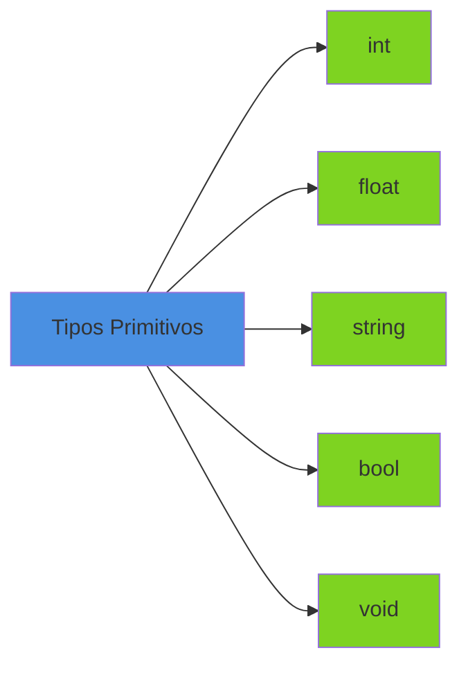
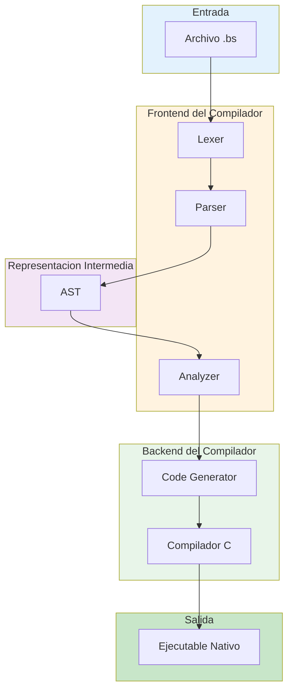
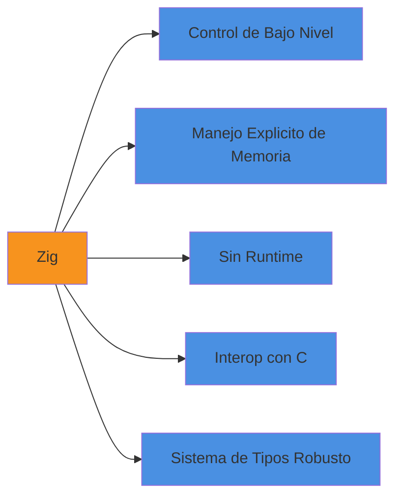
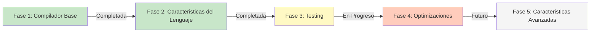
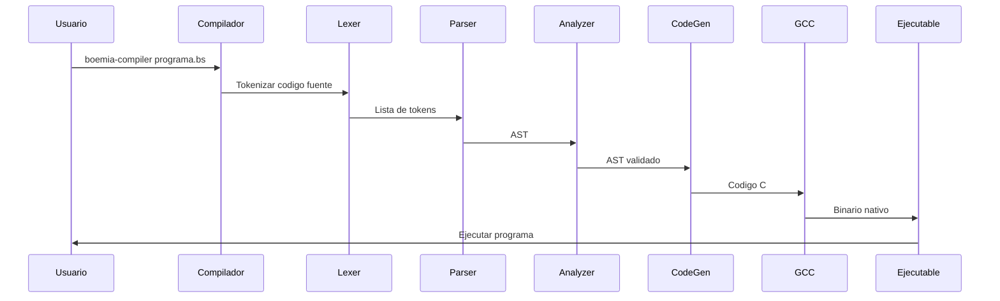

# Vision General del Proyecto Boemia Script

## Introduccion

Boemia Script es un lenguaje de programacion compilado con tipos estaticos, disenado desde cero con fines educativos para comprender el funcionamiento interno de los compiladores e interpretes.

## Motivacion

El desarrollo de Boemia Script surge de la necesidad de **desmitificar el proceso de compilacion** y proporcionar una herramienta practica para aprender:

- Como se transforma el codigo fuente en instrucciones ejecutables
- Como funcionan los sistemas de tipos estaticos
- Como se implementan estructuras de control de flujo
- Como se gestiona el scope y las variables
- Como se genera codigo maquina desde un AST (Abstract Syntax Tree)

## Filosofia del Proyecto

### Educacion Primero

Boemia Script no pretende competir con lenguajes de produccion. Su objetivo principal es ser una **plataforma de aprendizaje** donde cada componente del compilador es comprensible y esta completamente documentado.

### Simplicidad y Claridad

Cada decision de diseno prioriza la claridad sobre la optimizacion. El codigo del compilador esta extensamente comentado para facilitar su comprension.

### Funcionalidad Completa

A pesar de su naturaleza educativa, Boemia Script es un compilador funcional que genera ejecutables nativos reales.

## Caracteristicas Principales

### Sistema de Tipos Estaticos



Boemia Script implementa verificacion de tipos en tiempo de compilacion, detectando errores antes de la ejecucion.

### Variables Mutables e Inmutables

El lenguaje distingue entre:

- **make**: Variables mutables que pueden cambiar su valor
- **seal**: Constantes inmutables que no pueden ser reasignadas

```boemia
let contador: int = 0;      // Mutable
const PI: float = 3.14159;    // Inmutable
```

### Estructuras de Control Completas

Implementa las estructuras clasicas de control de flujo:

- Condicionales: `if`, `else if`, `else`
- Bucles: `while`, `for`
- Funciones con soporte para recursion

### Generacion de Codigo Nativo

Boemia Script utiliza un enfoque de transpilacion a C, aprovechando:

- Portabilidad multiplataforma
- Optimizaciones de compiladores maduros (GCC/Clang)
- Codigo intermedio legible y debuggeable

## Arquitectura del Compilador



### Fases del Compilador

1. **Analisis Lexico**: Conversion de texto a tokens
2. **Analisis Sintactico**: Construccion del AST
3. **Analisis Semantico**: Verificacion de tipos y reglas
4. **Generacion de Codigo**: Produccion de codigo C
5. **Compilacion Final**: GCC genera el binario

## Stack Tecnologico

### Zig como Lenguaje de Implementacion



#### Ventajas de Zig

**Control de Bajo Nivel**: Perfecto para implementar compiladores donde el rendimiento importa.

**Manejo Explicito de Memoria**: Permite aprender sobre gestion de memoria mediante allocators.

**Sin Runtime**: Los binarios del compilador son pequenos y eficientes.

**Interoperabilidad con C**: Facilita la generacion de codigo C sin overhead.

**Seguridad**: El sistema de tipos de Zig previene errores comunes.

### C como Target de Compilacion

La decision de transpilar a C en lugar de generar codigo maquina directo se basa en:

1. **Simplicidad Pedagogica**: Es mas facil entender la generacion de codigo C que ensamblador
2. **Portabilidad**: El codigo C se compila en cualquier plataforma
3. **Optimizacion**: Aprovechamos decadas de optimizaciones de GCC/Clang
4. **Debugging**: El codigo generado es legible por humanos

## Estado Actual del Proyecto

### Version 1.0 - Funcional

El compilador esta completamente operativo y puede compilar programas Boemia Script a ejecutables nativos.



### Implementado

- Analisis lexico completo
- Parser con construccion de AST
- Verificacion de tipos
- Generacion de codigo C
- Compilacion a binarios nativos
- CLI funcional
- Variables y constantes
- Tipos primitivos (int, float, string, bool)
- Operadores aritmeticos y de comparacion
- Estructuras de control (if/else, while, for)
- Funciones con recursion
- Sistema de print con deteccion de tipos

### En Desarrollo

- Suite de tests completa
- Ejemplos adicionales
- Benchmarks de rendimiento

### Planeado (v2.0)

- Arrays y colecciones
- Structs/Tipos personalizados
- Sistema de modulos
- Inferencia de tipos
- Manejo de errores (try/catch)
- Genericos
- Garbage Collection

## Caso de Uso

### Ejemplo Simple

**Codigo Boemia Script:**

```boemia
let x: int = 42;
const mensaje: string = "Hola Mundo";

if x > 40 {
    print(mensaje);
    print(x);
}
```

**Compilacion:**

```bash
boemia-compiler programa.bs -o programa
./build/programa
```

**Salida:**

```
Hola Mundo
42
```

### Flujo de Trabajo



## Proposito Educativo

Boemia Script es ideal para:

### Estudiantes de Compiladores

Proporciona un ejemplo completo y funcional de todas las fases de compilacion.

### Desarrolladores Curiosos

Permite entender como los lenguajes que usamos diariamente funcionan internamente.

### Instructores

Puede ser usado como material de ensenanza con codigo completamente documentado.

## Comparacion con Otros Proyectos

| Caracteristica | Boemia Script | Lenguajes de Produccion | Otros Proyectos Educativos |
|----------------|---------------|------------------------|----------------------------|
| Objetivo | Educacion | Produccion | Educacion |
| Documentacion | Extensiva | Variable | Limitada |
| Funcional | Si | Si | Parcial |
| Complejidad | Moderada | Alta | Baja |
| Codigo Fuente | Zig | C/C++/Rust | Python/JavaScript |
| Target | C → Nativo | Nativo/VM | Interprete |

## Recursos de Aprendizaje

Si estas interesado en profundizar en compiladores, estos recursos complementan Boemia Script:

- **Crafting Interpreters** por Bob Nystrom
- **Writing An Interpreter In Go** por Thorsten Ball
- **Engineering a Compiler** por Cooper y Torczon
- **Zig Language Reference** - Documentacion oficial

## Proximos Pasos

Para comenzar a explorar Boemia Script:

1. Lee la [Arquitectura del Compilador](02-ARCHITECTURE.md) para entender la estructura general
2. Estudia el [Pipeline de Compilacion](03-COMPILATION-PIPELINE.md) para ver el flujo completo
3. Profundiza en cada componente comenzando por el [Lexer](04-LEXER.md)
4. Practica con la [Guia de Uso](16-USER-GUIDE.md) y los [Ejemplos](17-EXAMPLES.md)

## Licencia y Contribuciones

Boemia Script es software libre bajo licencia MIT. Las contribuciones son bienvenidas siguiendo las guias de [Contribucion](24-CONTRIBUTING.md).
