# Arquitectura del Compilador Boemia Script

## Introduccion

El compilador de Boemia Script sigue una arquitectura clasica de compilador en multiples fases, separando claramente las responsabilidades entre el frontend (analisis) y el backend (generacion de codigo).

## Vision General de la Arquitectura

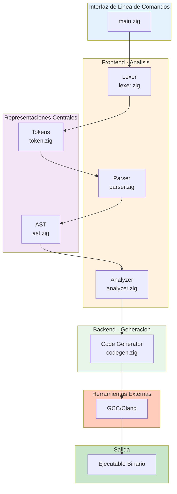

## Componentes Principales

### 1. CLI - Interfaz de Usuario (main.zig)

Responsabilidades:
- Procesamiento de argumentos de linea de comandos
- Lectura de archivos fuente
- Coordinacion de las fases de compilacion
- Manejo de errores globales
- Presentacion de resultados al usuario

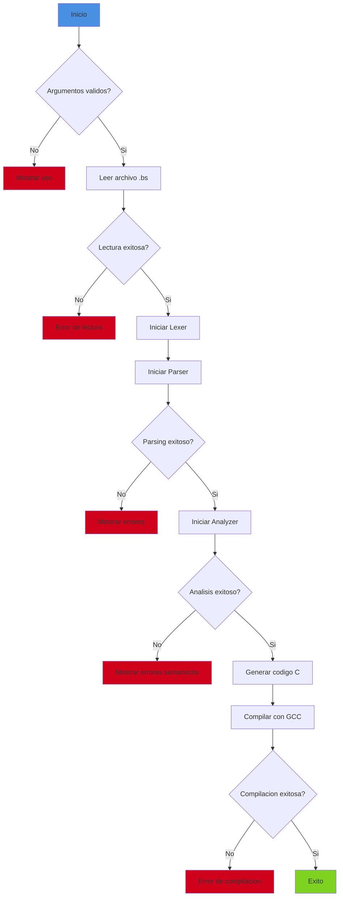

### 2. Representaciones Centrales

#### Tokens (token.zig)

Define todos los tipos de tokens que el lenguaje reconoce.

```mermaid
graph TB
    A[TokenType] --> B[Literales]
    A --> C[Identificadores]
    A --> D[Palabras Reservadas]
    A --> E[Operadores]
    A --> F[Delimitadores]
    A --> G[Especiales]

    B --> B1[INTEGER]
    B --> B2[FLOAT]
    B --> B3[STRING]
    B --> B4[TRUE/FALSE]

    C --> C1[IDENTIFIER]

    D --> D1[MAKE/SEAL]
    D --> D2[FN/RETURN]
    D --> D3[IF/ELSE]
    D --> D4[WHILE/FOR]

    E --> E1[PLUS/MINUS]
    E --> E2[STAR/SLASH]
    E --> E3[EQ/NEQ]
    E --> E4[LT/GT/LTE/GTE]

    F --> F1[LPAREN/RPAREN]
    F --> F2[LBRACE/RBRACE]
    F --> F3[SEMICOLON/COLON]

    G --> G1[EOF]
    G --> G2[ILLEGAL]

    style A fill:#4a90e2
    style B fill:#7ed321
    style C fill:#f5a623
    style D fill:#bd10e0
    style E fill:#50e3c2
    style F fill:#f8e71c
    style G fill:#d0021b
```

#### AST (ast.zig)

Define la estructura del arbol de sintaxis abstracta.

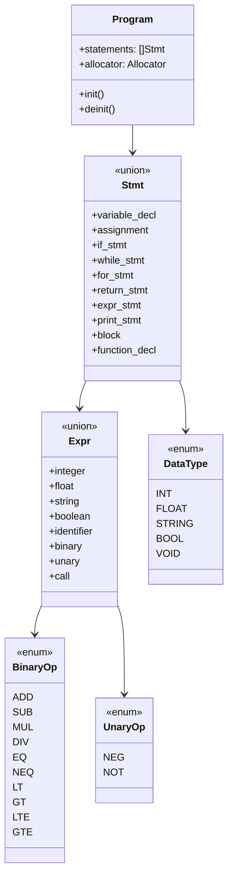

### 3. Frontend - Fases de Analisis

#### Lexer (lexer.zig)

**Responsabilidad**: Convertir el codigo fuente en una secuencia de tokens.

**Estructura de Datos Principal**:

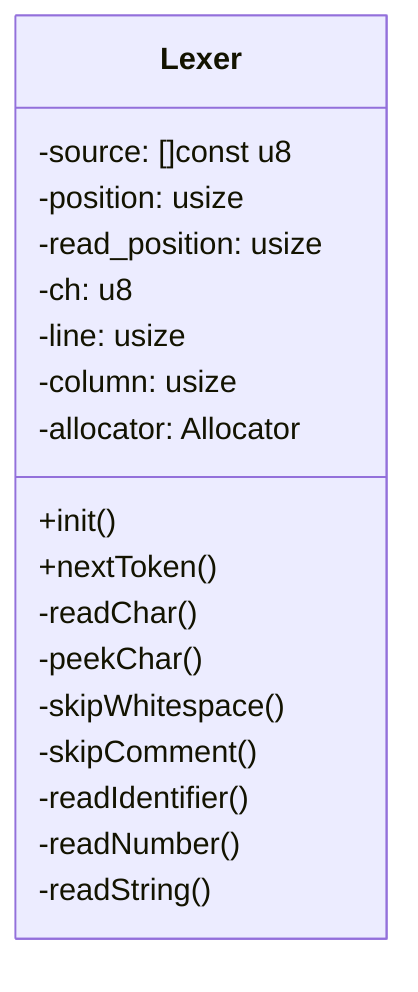

**Algoritmo de Tokenizacion**:

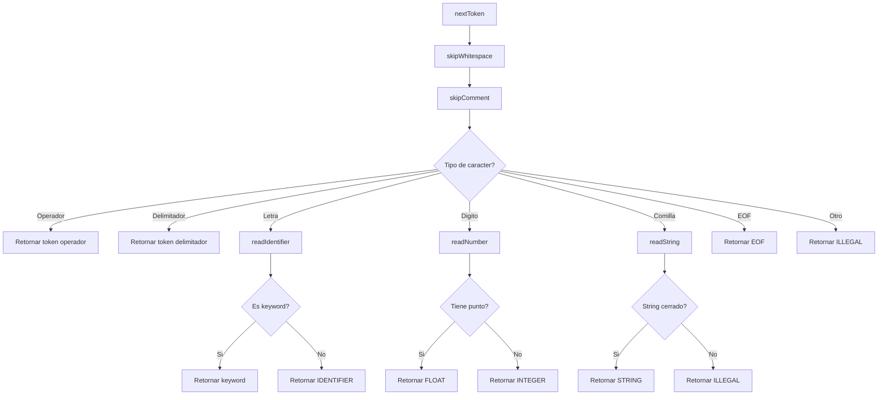

#### Parser (parser.zig)

**Responsabilidad**: Construir el AST a partir de la secuencia de tokens.

**Estructura de Datos Principal**:

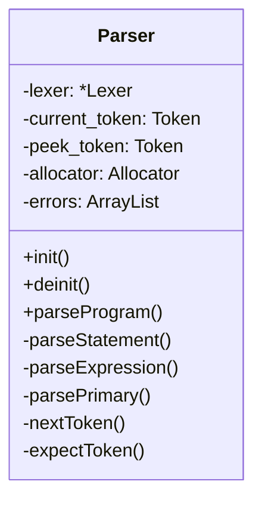

**Estrategia de Parsing**: Descendente Recursivo (Recursive Descent)

**Precedencia de Operadores**:

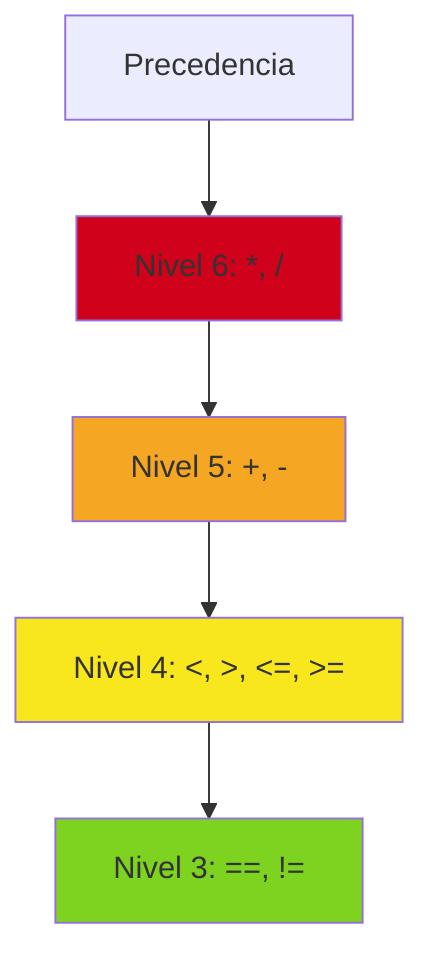

#### Analyzer (analyzer.zig)

**Responsabilidad**: Verificar la correccion semantica del programa.

**Estructura de Datos Principal**:

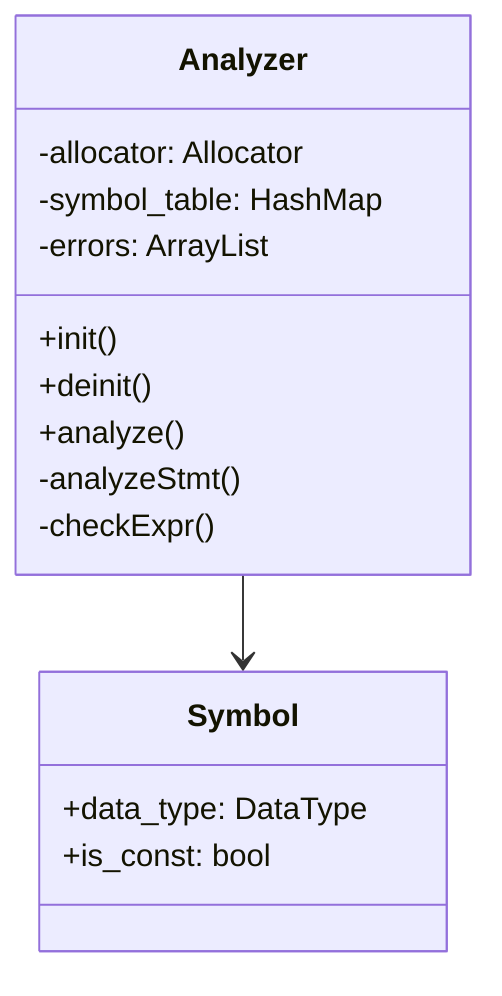

**Verificaciones Realizadas**:

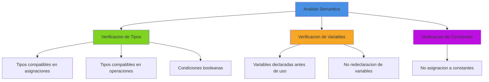

### 4. Backend - Generacion de Codigo

#### Code Generator (codegen.zig)

**Responsabilidad**: Convertir el AST en codigo C valido.

**Estructura de Datos Principal**:

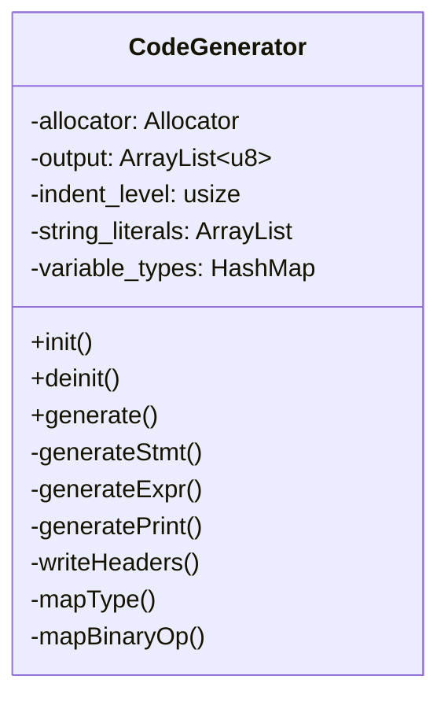

**Proceso de Generacion**:

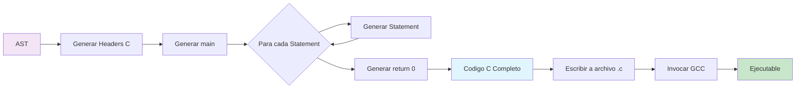

## Flujo de Datos Completo

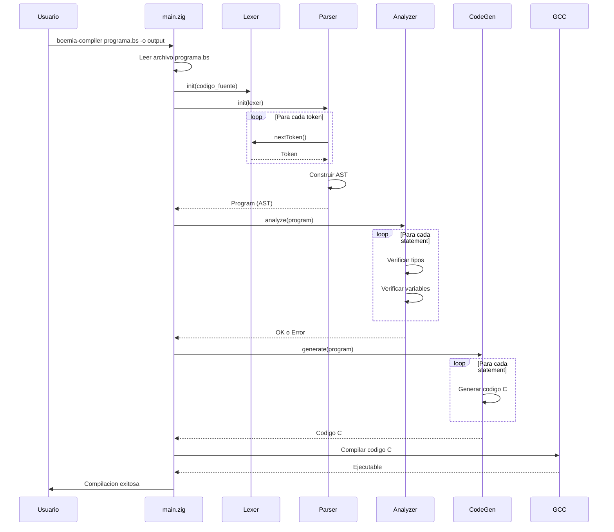

## Manejo de Errores en Capas

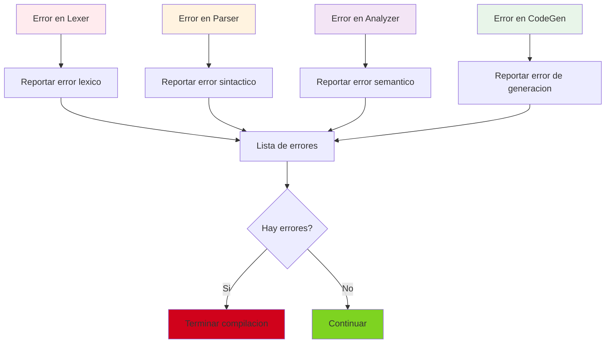

## Patron de Diseno: Visitor

El compilador utiliza un patron similar a Visitor para recorrer el AST:

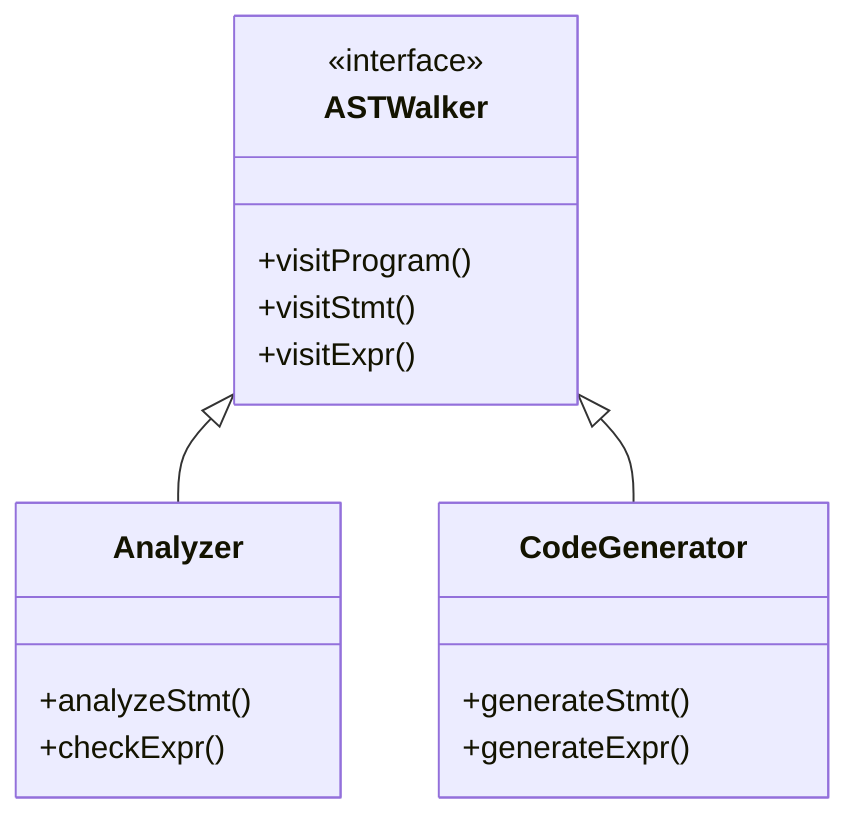

## Gestion de Memoria

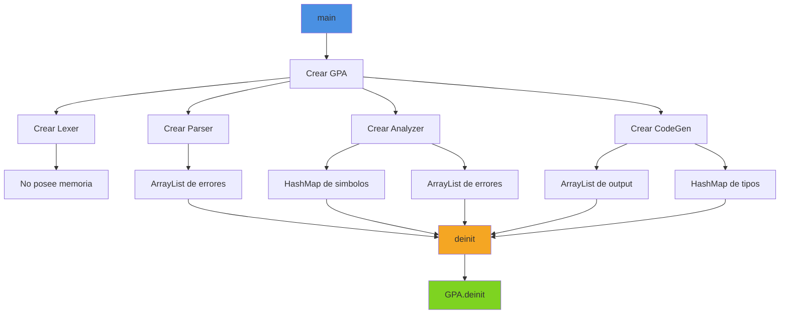

## Decisiones de Arquitectura

### Por que Transpilacion a C?

1. **Simplicidad**: Mas facil de implementar y entender
2. **Portabilidad**: C se compila en cualquier plataforma
3. **Optimizacion**: GCC/Clang tienen optimizaciones maduras
4. **Debugging**: El codigo generado es legible

### Por que Zig para el Compilador?

1. **Control de memoria explicito**: Ideal para aprender
2. **Interop con C**: Sin overhead
3. **Sin runtime**: Binarios pequenos
4. **Seguridad**: Previene errores comunes

### Por que Parsing Descendente Recursivo?

1. **Simplicidad**: Facil de implementar y entender
2. **Legibilidad**: Codigo claro y mantenible
3. **Suficiente**: Adecuado para la gramatica de Boemia Script

## Metricas del Compilador

| Componente | Lineas de Codigo | Complejidad |
|------------|------------------|-------------|
| token.zig | ~180 | Baja |
| lexer.zig | ~430 | Media |
| ast.zig | ~254 | Media |
| parser.zig | ~545 | Alta |
| analyzer.zig | ~333 | Media |
| codegen.zig | ~446 | Media |
| main.zig | ~132 | Baja |
| **Total** | **~2320** | **Media** |

## Proximos Pasos

Para profundizar en cada componente:

1. [Pipeline de Compilacion](03-COMPILATION-PIPELINE.md) - Flujo detallado
2. [Lexer](04-LEXER.md) - Analisis lexico
3. [Parser](05-PARSER.md) - Analisis sintactico
4. [Analyzer](06-ANALYZER.md) - Analisis semantico
5. [CodeGen](07-CODEGEN.md) - Generacion de codigo
