# Pipeline de Compilacion

## Introduccion

El pipeline de compilacion de Boemia Script es el proceso completo que transforma el codigo fuente en un ejecutable nativo. Este documento describe cada fase en detalle, mostrando como los datos fluyen a traves del compilador.

## Vision General del Pipeline

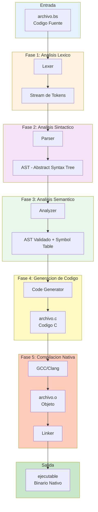

## Fase 1: Analisis Lexico (Lexer)

### Objetivo
Convertir el codigo fuente (secuencia de caracteres) en una secuencia de tokens.

### Entrada
```boemia
let x: int = 42;
```

### Proceso


### Salida
```
Token(MAKE, "make", 1:1)
Token(IDENTIFIER, "x", 1:6)
Token(COLON, ":", 1:7)
Token(TYPE_INT, "int", 1:9)
Token(ASSIGN, "=", 1:13)
Token(INTEGER, "42", 1:15)
Token(SEMICOLON, ";", 1:17)
```

### Transformacion de Datos

| Antes | Despues |
|-------|---------|
| String de caracteres | Lista de tokens |
| No estructurado | Estructurado |
| Sin clasificacion | Clasificado por tipo |

## Fase 2: Analisis Sintactico (Parser)

### Objetivo
Construir el Abstract Syntax Tree (AST) a partir de los tokens.

### Entrada
```
[MAKE] [IDENTIFIER "x"] [COLON] [TYPE_INT] [ASSIGN] [INTEGER "42"] [SEMICOLON]
```

### Proceso
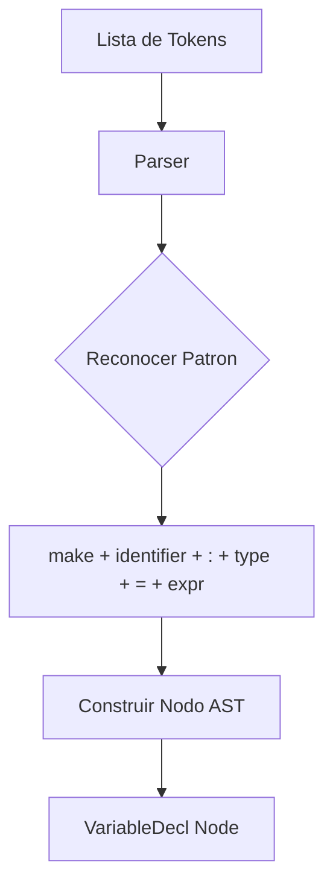

### Salida (AST)
```
Program
└── VariableDecl
    ├── name: "x"
    ├── type: INT
    ├── is_const: false
    └── value: Integer(42)
```

### Arbol Sintactico Visual

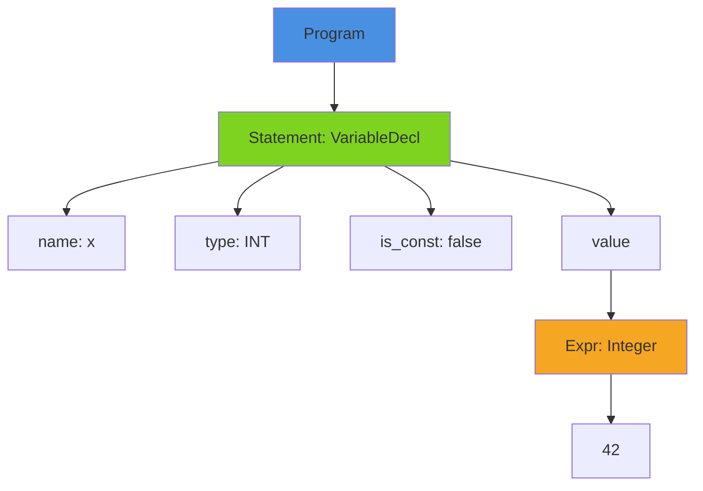

## Fase 3: Analisis Semantico (Analyzer)

### Objetivo
Verificar la correccion semantica del programa (tipos, variables, reglas del lenguaje).

### Entrada
```
AST (sin validar)
```

### Proceso
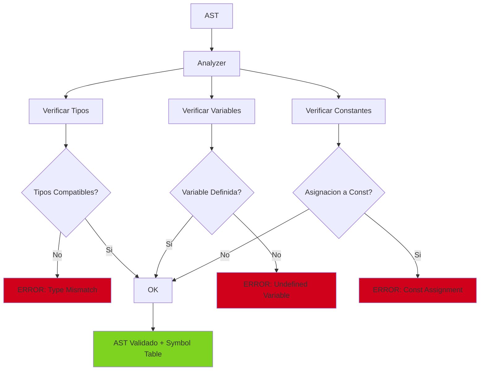

### Salida
```
AST (validado) + Symbol Table:
{
  "x": { type: INT, is_const: false }
}
```

### Verificaciones Realizadas

| Verificacion | Ejemplo | Resultado |
|--------------|---------|-----------|
| Tipo compatible | `let x: int = 42;` | OK |
| Tipo incompatible | `let x: int = "hola";` | ERROR |
| Variable definida | `print(x);` despues de declarar x | OK |
| Variable no definida | `print(y);` sin declarar y | ERROR |
| Asignar a const | `seal PI = 3.14; PI = 2;` | ERROR |

## Fase 4: Generacion de Codigo (Code Generator)

### Objetivo
Convertir el AST validado en codigo C.

### Entrada
```
AST Validado
```

### Proceso
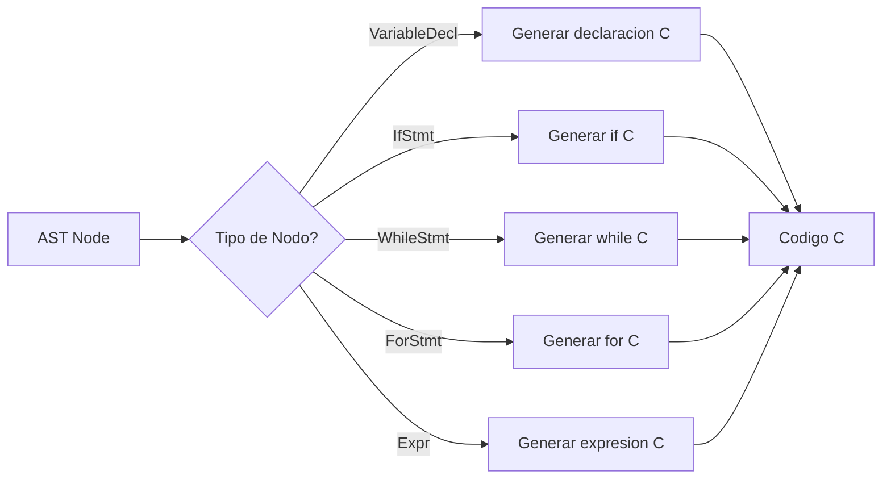

### Salida (Codigo C)
```c
// Generated by Boemia Script Compiler
#include <stdio.h>
#include <stdlib.h>
#include <string.h>
#include <stdbool.h>

int main(void) {
    long long x = 42;
    return 0;
}
```

### Mapeo de Tipos

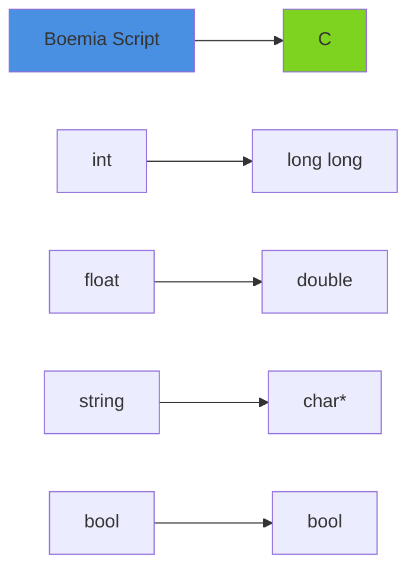

## Fase 5: Compilacion Nativa (GCC)

### Objetivo
Compilar el codigo C a codigo maquina ejecutable.

### Entrada
```c
archivo.c (codigo C generado)
```

### Proceso
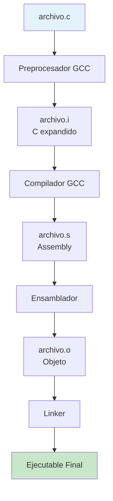

### Comando Ejecutado
```bash
gcc -o build/ejecutable build/ejecutable.c -std=c11 -Wall -Wextra
```

### Salida
```
Ejecutable binario nativo (ELF en Linux, Mach-O en macOS, PE en Windows)
```

## Flujo Completo de Datos

### Ejemplo Completo

**Codigo Fuente (hello.bs)**:
```boemia
let x: int = 10;
if x > 5 {
    print(x);
}
```

**Transformacion Paso a Paso**:

```mermaid
sequenceDiagram
    participant S as Source
    participant L as Lexer
    participant P as Parser
    participant A as Analyzer
    participant C as CodeGen
    participant G as GCC
    participant E as Executable

    S->>L: let x: int = 10; if x > 5 { print(x); }

    L->>L: Tokenizar
    L->>P: [MAKE, IDENTIFIER(x), COLON, TYPE_INT, ...]

    P->>P: Construir AST
    P->>A: Program { VariableDecl, IfStmt }

    A->>A: Verificar tipos y variables
    A->>C: AST Validado + SymbolTable

    C->>C: Generar codigo C
    C->>G: long long x = 10; if (x > 5) { ... }

    G->>G: Compilar a binario
    G->>E: Ejecutable nativo

    E-->>S: Programa listo para ejecutar
```

## Tiempo de Ejecucion de Cada Fase

```mermaid
gantt
    title Pipeline de Compilacion - Tiempo Relativo
    dateFormat X
    axisFormat %s

    section Fases
    Lexer           :0, 1
    Parser          :1, 3
    Analyzer        :3, 5
    Code Generator  :5, 7
    GCC             :7, 20
```

**Nota**: GCC consume la mayor parte del tiempo de compilacion.

## Manejo de Errores en el Pipeline

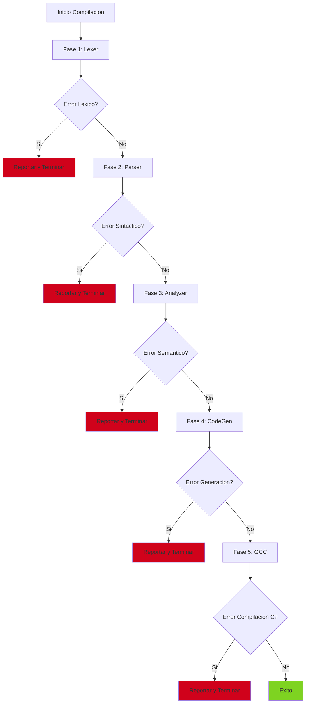

## Optimizaciones del Pipeline

### Single Pass Compilation

Boemia Script usa compilacion de un solo paso:

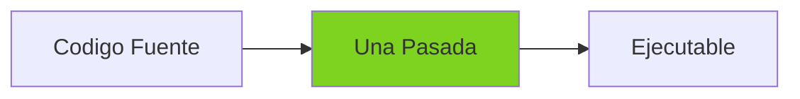

**Ventajas**:
- Compilacion rapida
- Menor uso de memoria
- Codigo mas simple

**Desventajas**:
- Menos optimizaciones posibles
- Declaraciones forward limitadas

### Lazy Evaluation


El Lexer genera tokens bajo demanda, no todos de una vez.

## Representaciones Intermedias

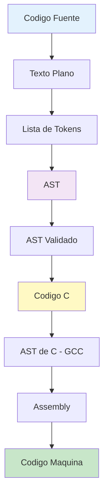

## Metadata Preservada en el Pipeline

| Fase | Metadata |
|------|----------|
| Lexer | Linea, Columna |
| Parser | Tipos de nodos, Estructura |
| Analyzer | Symbol Table, Tipos inferidos |
| CodeGen | Ninguna (se descarta) |

## Paralelizacion (Futuro)

Actualmente el pipeline es secuencial, pero podria paralelizarse:

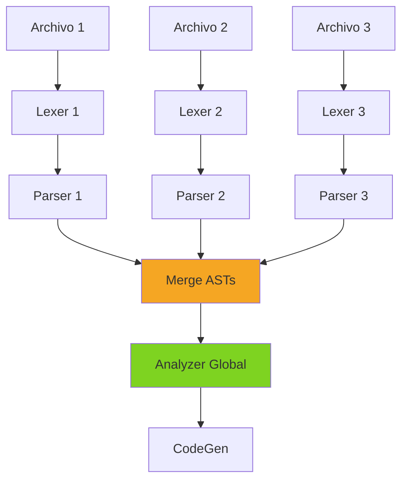

## Proximos Pasos

Para profundizar en cada fase:
- [Lexer](04-LEXER.md)
- [Parser](05-PARSER.md)
- [Analyzer](06-ANALYZER.md)
- [Code Generator](07-CODEGEN.md)
- [GCC Integration](08-GCC-INTEGRATION.md)
