# Analisis Lexico - Lexer

## Introduccion

El Lexer (Analizador Lexico) es la primera fase del compilador. Su responsabilidad es convertir una secuencia de caracteres (el codigo fuente) en una secuencia de tokens que el Parser puede entender.

## Concepto de Token

Un token es la unidad minima de significado en el lenguaje. Cada palabra reservada, operador, literal o identificador es un token.

### Ejemplo de Tokenizacion

**Entrada:**
```boemia
let x: int = 42;
```

**Salida:**
```
[MAKE] [IDENTIFIER "x"] [COLON] [TYPE_INT] [ASSIGN] [INTEGER "42"] [SEMICOLON]
```

## Estructura del Lexer

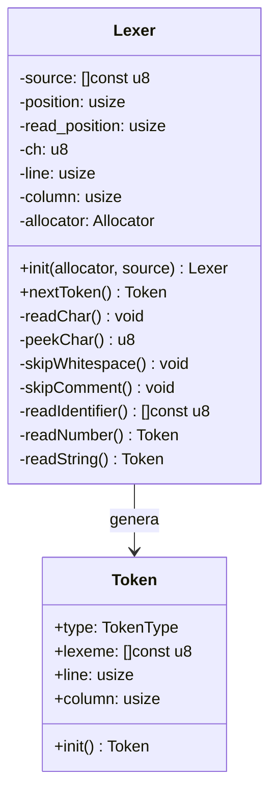

## Algoritmo de Tokenizacion

```mermaid
flowchart TD
    A[Inicio nextToken] --> B[skipWhitespace]
    B --> C[skipComment]
    C --> D[skipWhitespace]
    D --> E{Examinar ch}

    E -->|+,-,*,/| F[Operador Aritmetico]
    E -->|=| G{peekChar == '='?}
    G -->|Si| H[Token EQ '==']
    G -->|No| I[Token ASSIGN '=']

    E -->|!| J{peekChar == '='?}
    J -->|Si| K[Token NEQ '!=']
    J -->|No| L[Token ILLEGAL]

    E -->|<| M{peekChar == '='?}
    M -->|Si| N[Token LTE '<=']
    M -->|No| O[Token LT '<']

    E -->|>| P{peekChar == '='?}
    P -->|Si| Q[Token GTE '>=']
    P -->|No| R[Token GT '>']

    E -->|paréntesis, llaves, etc| S[Delimitador]
    E -->|"| T[readString]
    E -->|letra| U[readIdentifier]
    E -->|digito| V[readNumber]
    E -->|EOF| W[Token EOF]
    E -->|otro| X[Token ILLEGAL]

    U --> Y{Es keyword?}
    Y -->|Si| Z[Token Keyword]
    Y -->|No| AA[Token IDENTIFIER]

    V --> AB{Tiene punto?}
    AB -->|Si| AC[Token FLOAT]
    AB -->|No| AD[Token INTEGER]

    F --> AE[Retornar Token]
    H --> AE
    I --> AE
    K --> AE
    L --> AE
    N --> AE
    O --> AE
    Q --> AE
    R --> AE
    S --> AE
    T --> AE
    Z --> AE
    AA --> AE
    AC --> AE
    AD --> AE
    W --> AE
    X --> AE

    style A fill:#4a90e2
    style AE fill:#7ed321
    style L fill:#d0021b
    style X fill:#d0021b
```

## Tecnica de Dos Punteros

El Lexer utiliza dos punteros para recorrer el codigo fuente:

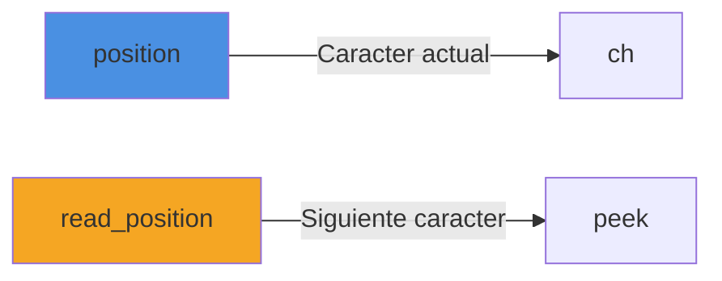

### Ventajas

1. **Lookahead**: Permite ver el siguiente caracter sin avanzar
2. **Tokens multi-caracter**: Facilita reconocer `==`, `!=`, `<=`, `>=`
3. **Simplicidad**: No requiere retroceder en el codigo

### Ejemplo Visual

```
Codigo: make x = 5;
        ^
        position
         ^
         read_position
```

Despues de `readChar()`:
```
Codigo: make x = 5;
         ^
         position
          ^
          read_position
```

## Funciones Principales

### readChar()

Avanza el Lexer un caracter hacia adelante.

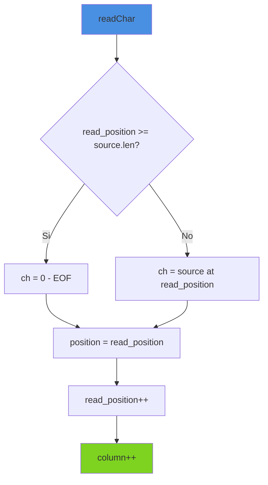

### peekChar()

Retorna el siguiente caracter sin avanzar.

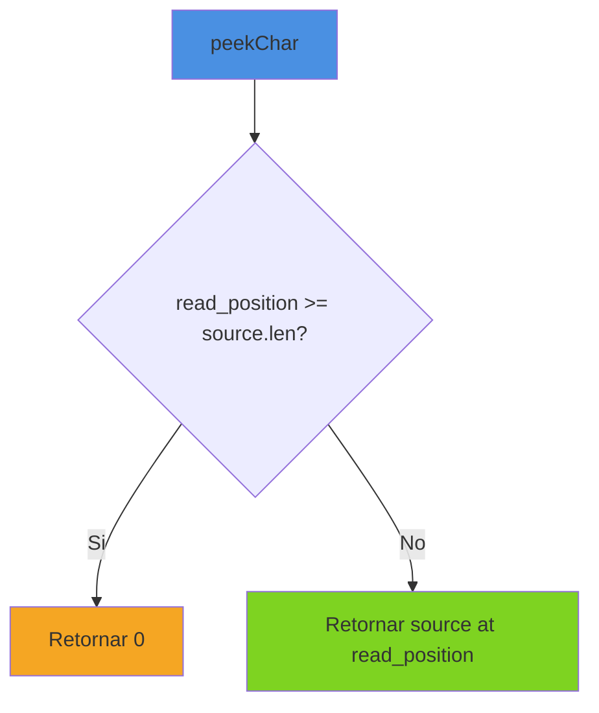

### skipWhitespace()

Salta espacios, tabs, saltos de linea.

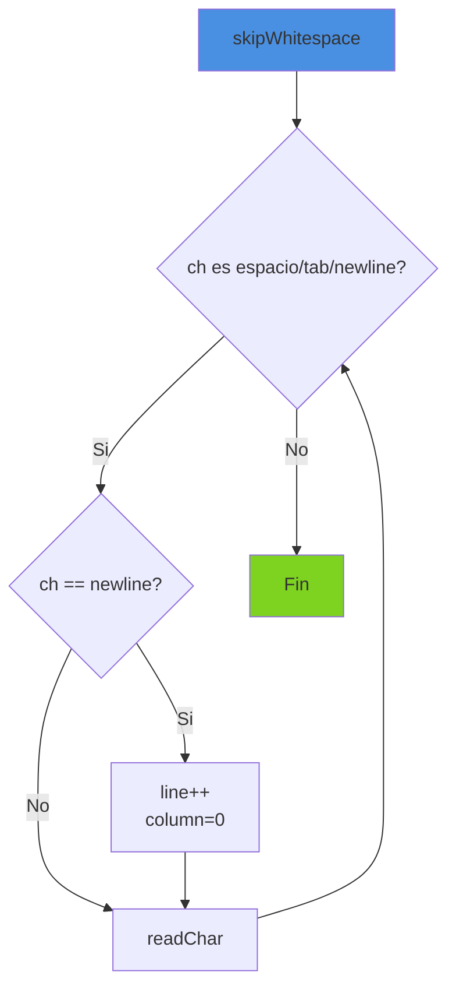

**Importancia**: Mantiene tracking correcto de linea y columna para mensajes de error.

### skipComment()

Ignora comentarios de linea (//):

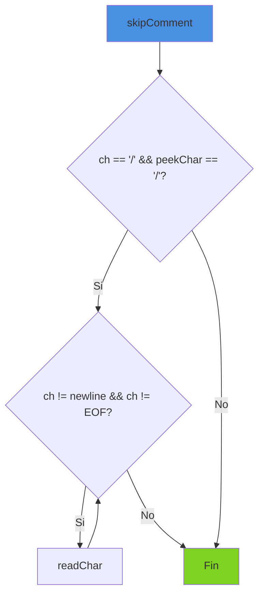

### readIdentifier()

Lee una secuencia de letras, digitos y underscores:

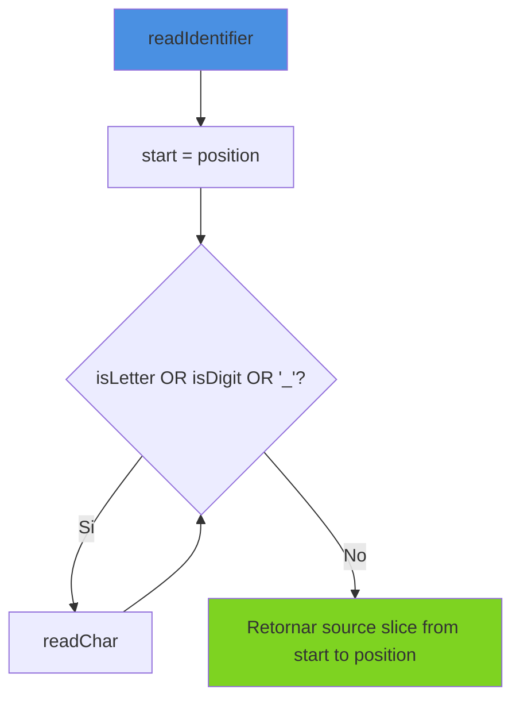

**Reglas de Identificadores**:
- Deben empezar con letra o underscore
- Pueden contener letras, digitos y underscores
- Ejemplos validos: `x`, `contador`, `mi_variable`, `suma2`

### readNumber()

Lee numeros enteros o decimales:

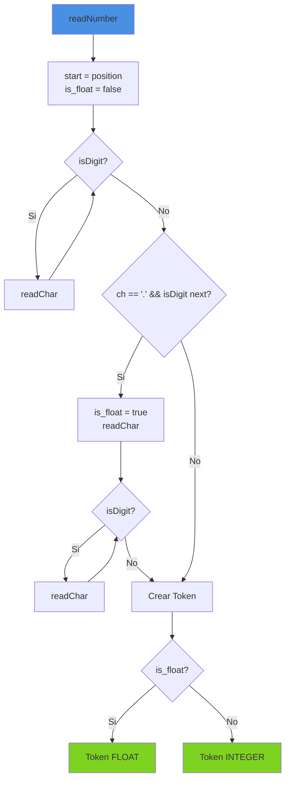

**Importante**: Usa `peekChar()` para asegurar que despues del punto viene un digito, evitando confundir `42.toString()` con un numero decimal.

### readString()

Lee cadenas de texto entre comillas:

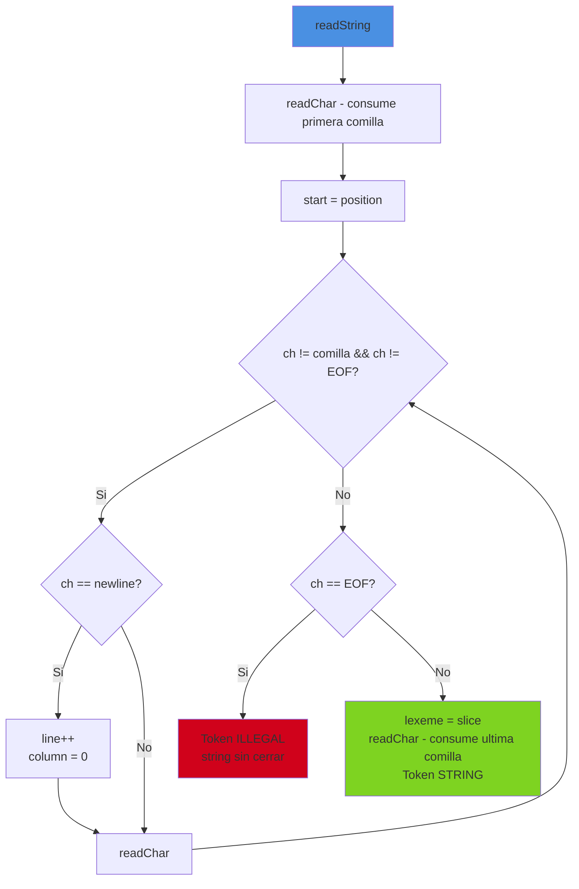

**Caracteristicas**:
- Soporta strings multi-linea
- Detecta strings sin cerrar
- Mantiene tracking de lineas

## Reconocimiento de Palabras Reservadas

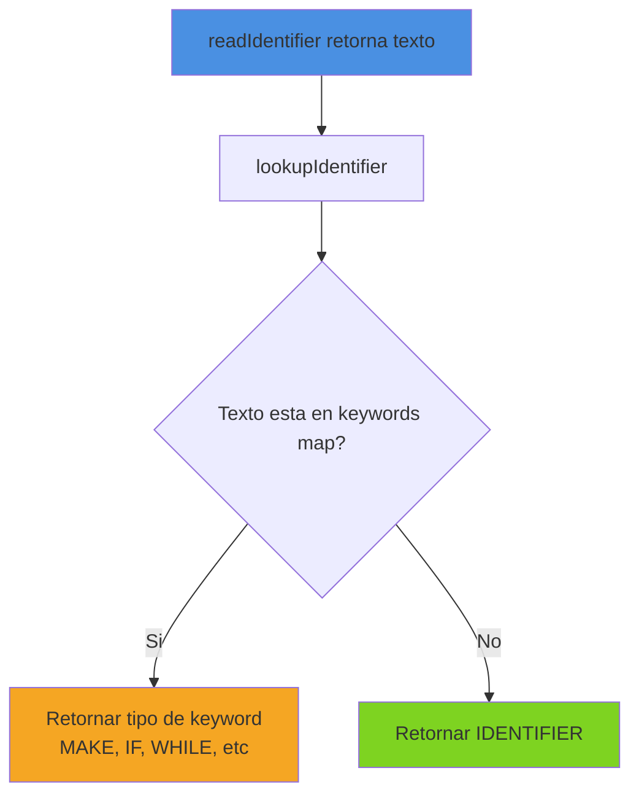

### Mapa de Palabras Reservadas

El mapa se construye en compile-time usando `StaticStringMap`:

```zig
pub const keywords = std.StaticStringMap(TokenType).initComptime(.{
    .{ "make", .MAKE },
    .{ "seal", .SEAL },
    .{ "fn", .FN },
    .{ "return", .RETURN },
    .{ "if", .IF },
    .{ "else", .ELSE },
    .{ "while", .WHILE },
    .{ "for", .FOR },
    .{ "print", .PRINT },
    .{ "true", .TRUE },
    .{ "false", .FALSE },
    .{ "int", .TYPE_INT },
    .{ "float", .TYPE_FLOAT },
    .{ "string", .TYPE_STRING },
    .{ "bool", .TYPE_BOOL },
});
```

**Ventajas de StaticStringMap**:
- Construido en compile-time (costo cero en runtime)
- Perfect hashing (busqueda O(1))
- Inmutable (keywords nunca cambian)

## Tracking de Posicion

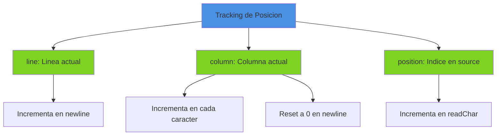

**Proposito**: Permitir mensajes de error precisos indicando donde ocurrio el problema.

**Ejemplo de Error**:
```
Error en linea 5, columna 12: Token ilegal '!'
```

## Casos Especiales

### Operadores de Dos Caracteres

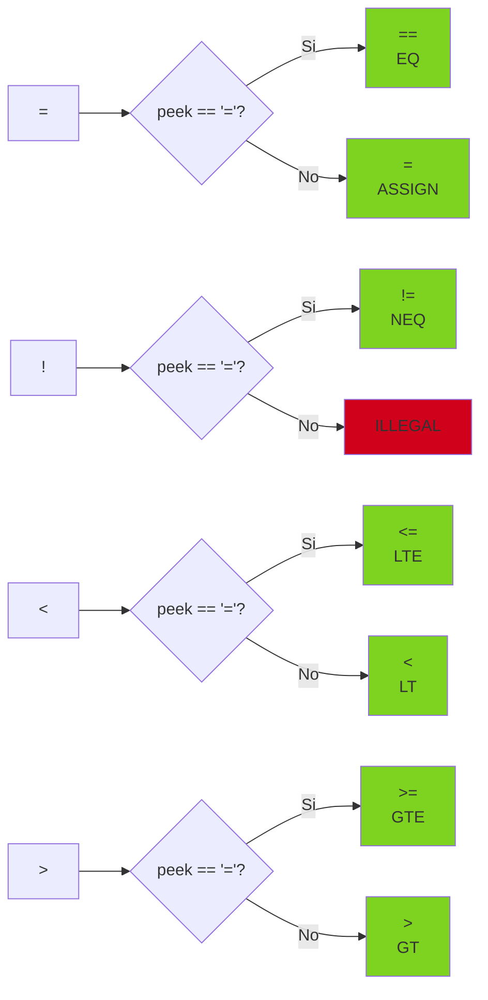

### Comentarios vs Division

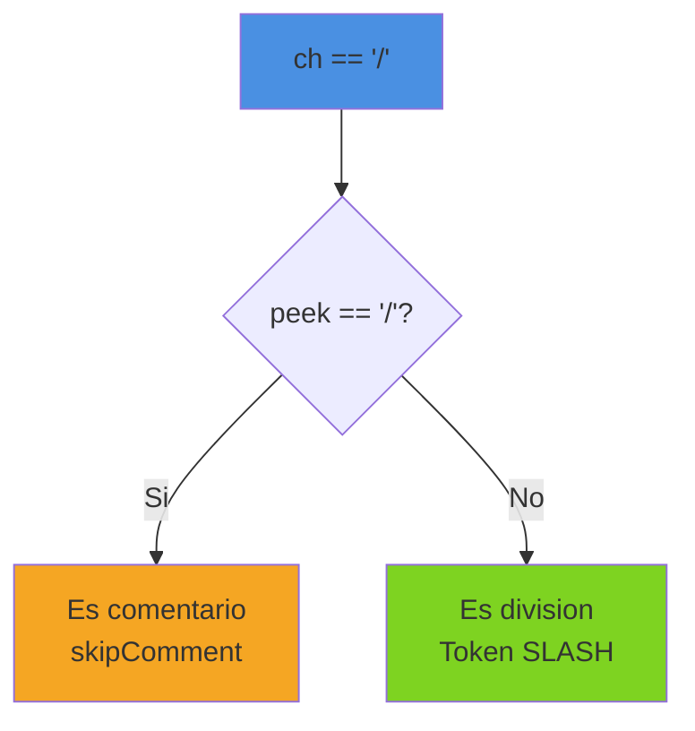

## Ejemplo Completo de Tokenizacion

**Codigo Fuente**:
```boemia
let x: int = 42;
if x > 40 {
    print(x);
}
```

**Proceso de Tokenizacion**:

```mermaid
sequenceDiagram
    participant P as Parser
    participant L as Lexer
    participant S as Source

    P->>L: nextToken()
    L->>S: Leer 'make'
    L->>L: readIdentifier()
    L->>L: lookupIdentifier("make")
    L-->>P: Token(MAKE, "make", 1, 1)

    P->>L: nextToken()
    L->>S: Leer 'x'
    L->>L: readIdentifier()
    L->>L: lookupIdentifier("x")
    L-->>P: Token(IDENTIFIER, "x", 1, 6)

    P->>L: nextToken()
    L->>S: Leer ':'
    L-->>P: Token(COLON, ":", 1, 7)

    P->>L: nextToken()
    L->>S: Leer 'int'
    L->>L: readIdentifier()
    L->>L: lookupIdentifier("int")
    L-->>P: Token(TYPE_INT, "int", 1, 9)

    P->>L: nextToken()
    L->>S: Leer '='
    L-->>P: Token(ASSIGN, "=", 1, 13)

    P->>L: nextToken()
    L->>S: Leer '42'
    L->>L: readNumber()
    L-->>P: Token(INTEGER, "42", 1, 15)

    P->>L: nextToken()
    L->>S: Leer ';'
    L-->>P: Token(SEMICOLON, ";", 1, 17)
```

## Tabla de Tokens

| Categoria | Tokens | Ejemplo |
|-----------|--------|---------|
| Literales | INTEGER, FLOAT, STRING, TRUE, FALSE | `42`, `3.14`, `"hola"`, `true` |
| Identificadores | IDENTIFIER | `x`, `contador`, `miFunc` |
| Palabras Reservadas | MAKE, SEAL, FN, RETURN, IF, ELSE, WHILE, FOR, PRINT | `make`, `if`, `fn` |
| Tipos | TYPE_INT, TYPE_FLOAT, TYPE_STRING, TYPE_BOOL | `int`, `float`, `string`, `bool` |
| Operadores Aritmeticos | PLUS, MINUS, STAR, SLASH | `+`, `-`, `*`, `/` |
| Operadores Asignacion | ASSIGN | `=` |
| Operadores Comparacion | EQ, NEQ, LT, GT, LTE, GTE | `==`, `!=`, `<`, `>`, `<=`, `>=` |
| Delimitadores | LPAREN, RPAREN, LBRACE, RBRACE, SEMICOLON, COLON, COMMA | `(`, `)`, `{`, `}`, `;`, `:`, `,` |
| Especiales | EOF, ILLEGAL | - |

## Optimizaciones

### No Copia de Strings

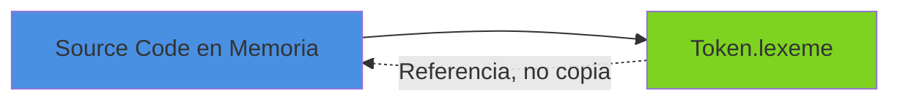

El Lexer no copia los strings, solo guarda referencias al codigo fuente original. Esto es eficiente en memoria.

### StaticStringMap para Keywords

Busqueda O(1) en compile-time, sin overhead en runtime.

## Manejo de Errores

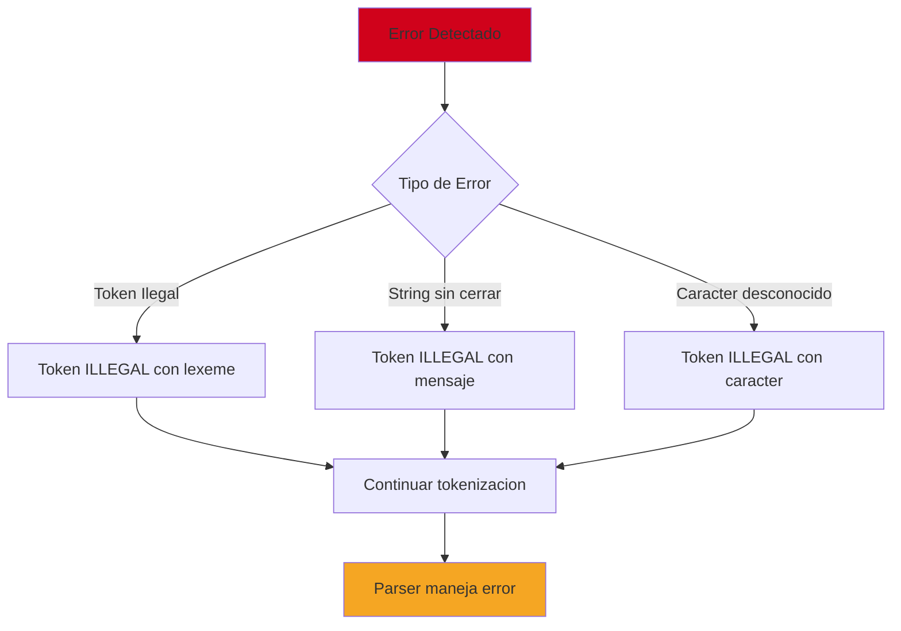

El Lexer NO termina ante errores, genera tokens ILLEGAL y continua. El Parser decide como manejar estos errores.

## Testing del Lexer

Ubicacion: `tests/lexer_test.zig`

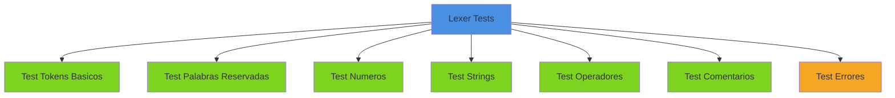

## Performance

| Operacion | Complejidad |
|-----------|-------------|
| nextToken() | O(1) amortizado |
| readChar() | O(1) |
| peekChar() | O(1) |
| skipWhitespace() | O(n) donde n = espacios consecutivos |
| readIdentifier() | O(m) donde m = longitud del identificador |
| readNumber() | O(k) donde k = digitos en el numero |

**Complejidad Total**: O(n) donde n es el tamano del archivo fuente.

## Proximos Pasos

Una vez generados los tokens, el [Parser](05-PARSER.md) los consume para construir el AST.
