# Analisis Sintactico - Parser

## Introduccion

El Parser (Analizador Sintactico) es la segunda fase del compilador. Su responsabilidad es tomar la secuencia de tokens generada por el Lexer y construir un Arbol de Sintaxis Abstracta (AST) que representa la estructura jerarquica del programa.

## Que es un Parser?

Un parser verifica que los tokens sigan las reglas gramaticales del lenguaje y los organiza en una estructura de arbol que facilita el analisis posterior.

### Ejemplo de Parsing

**Entrada (Tokens)**:
```
[MAKE] [IDENTIFIER "x"] [COLON] [TYPE_INT] [ASSIGN] [INTEGER "5"] [SEMICOLON]
```

**Salida (AST)**:
```
VariableDecl {
    name: "x"
    data_type: INT
    value: Expr.integer(5)
    is_const: false
}
```

## Estructura del Parser

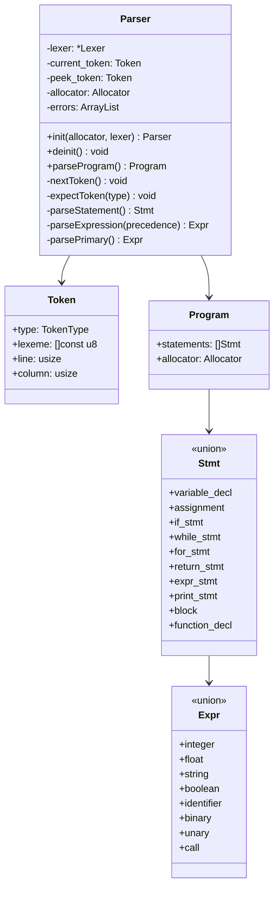

## Estrategia de Parsing: Descendente Recursivo

Boemia Script utiliza un parser descendente recursivo (Recursive Descent Parser), una tecnica donde cada regla gramatical se implementa como una funcion recursiva.

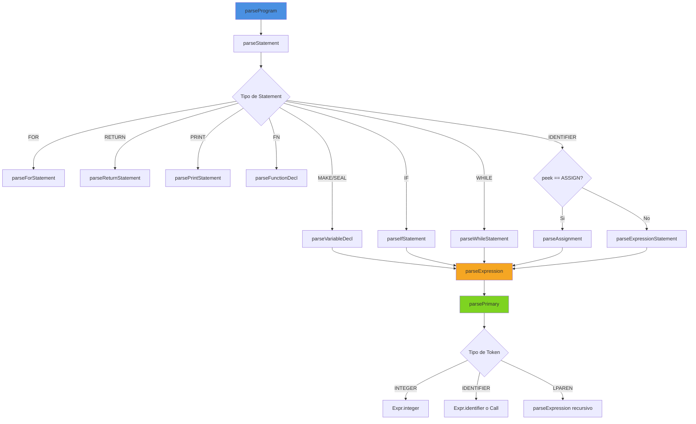

## Tecnica de Dos Tokens: current y peek

El parser mantiene dos tokens simultaneos para poder tomar decisiones basadas en el contexto:

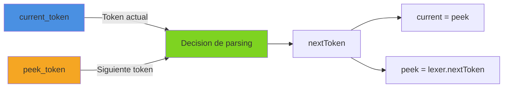

### Ejemplo Visual

```
Tokens: MAKE IDENTIFIER COLON TYPE_INT ASSIGN INTEGER SEMICOLON
        ^    ^
        |    |
     current peek

Despues de nextToken():

Tokens: MAKE IDENTIFIER COLON TYPE_INT ASSIGN INTEGER SEMICOLON
             ^         ^
             |         |
          current     peek
```

## Funciones Principales del Parser

### parseProgram()

Punto de entrada del parser. Construye el programa completo.

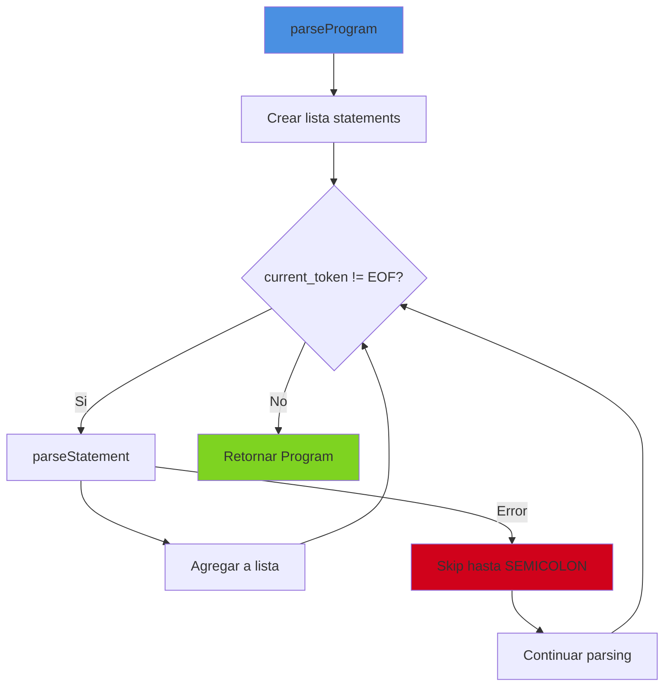

**Manejo de Errores**: Si un statement falla, el parser salta hasta el siguiente punto y coma y continua, permitiendo reportar multiples errores en una sola ejecucion.

### parseStatement()

Determina que tipo de statement parsear basado en el token actual.

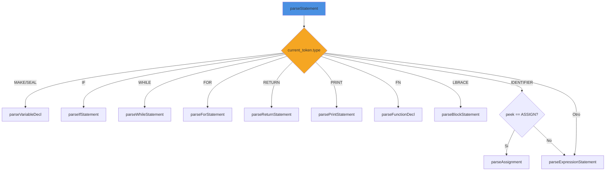

### parseVariableDecl()

Parsea declaraciones de variables (make/seal).

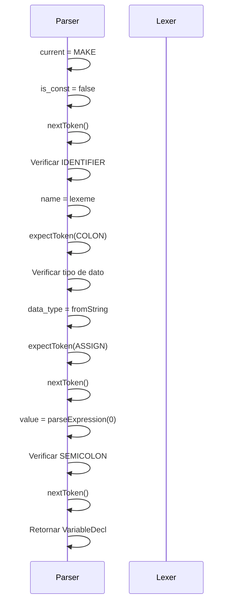

**Gramatica**:
```
variable_decl := ('make' | 'seal') IDENTIFIER ':' TYPE '=' expression ';'
```

### parseExpression() - Pratt Parsing

El parser utiliza el algoritmo de Pratt para parsear expresiones con precedencia de operadores correcta.

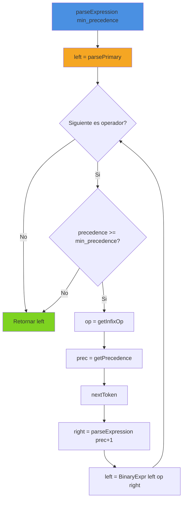

**Tabla de Precedencia**:

| Nivel | Operadores | Descripcion | Asociatividad |
|-------|------------|-------------|---------------|
| 6 | `*`, `/` | Multiplicacion, Division | Izquierda |
| 5 | `+`, `-` | Suma, Resta | Izquierda |
| 4 | `<`, `>`, `<=`, `>=` | Comparacion | Izquierda |
| 3 | `==`, `!=` | Igualdad | Izquierda |

**Ejemplo de Precedencia**:

```
Expresion: 2 + 3 * 4

Tokens: INTEGER(2) PLUS INTEGER(3) STAR INTEGER(4)

Proceso:
1. left = 2
2. op = PLUS (prec 5), right = parseExpression(6)
3. En parseExpression(6):
   - left = 3
   - op = STAR (prec 6 >= 6), right = 4
   - Retorna BinaryExpr(3 * 4)
4. Retorna BinaryExpr(2 + (3 * 4))

AST Resultante:
       +
      / \
     2   *
        / \
       3   4
```

### parsePrimary()

Parsea expresiones primarias (literales, identificadores, parentesis).

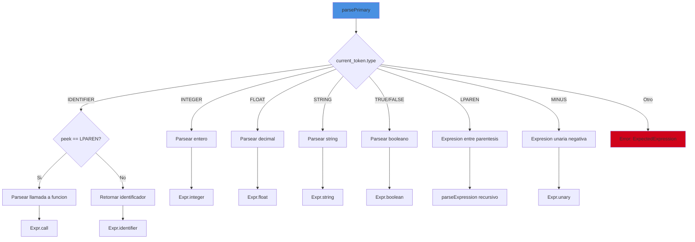

## Parsing de Estructuras de Control

### If Statement

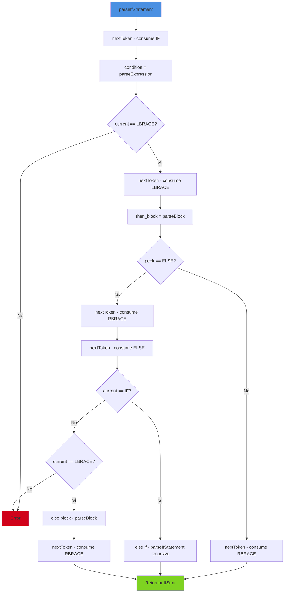

**Gramatica**:
```
if_stmt := 'if' expression '{' block '}' ('else' (if_stmt | '{' block '}'))?
```

**Soporte para else-if**: El parser maneja `else if` recursivamente como un nuevo if statement dentro del else block.

### While Statement

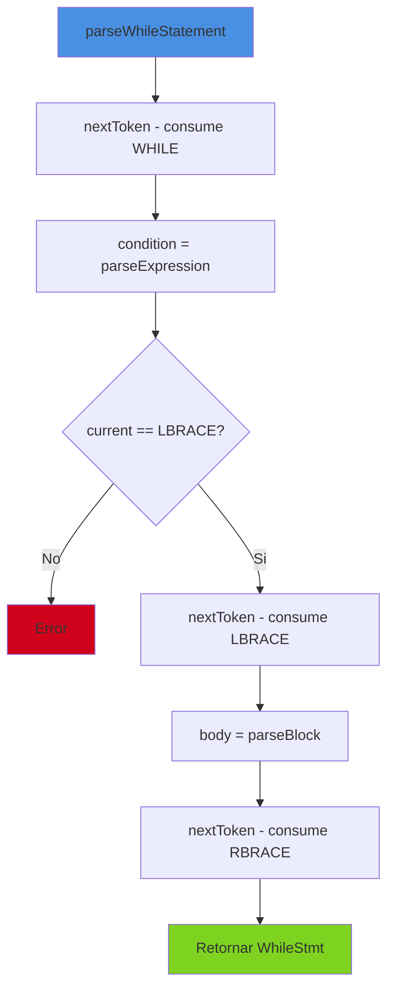

**Gramatica**:
```
while_stmt := 'while' expression '{' block '}'
```

### For Statement

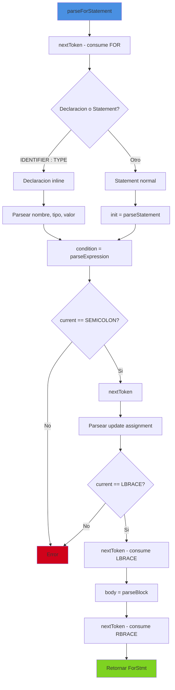

**Gramatica**:
```
for_stmt := 'for' (variable_decl | statement) expression ';' assignment '{' block '}'
```

**Caracteristica especial**: Permite declaracion de variable inline sin `make`:
```boemia
for i: int = 0; i < 10; i = i + 1 {
    print(i);
}
```

## Parsing de Funciones

### Declaracion de Funcion

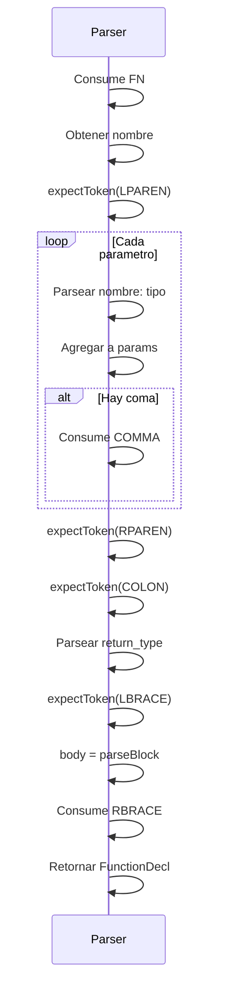

**Gramatica**:
```
function_decl := 'fn' IDENTIFIER '(' params ')' ':' TYPE '{' block '}'
params := (IDENTIFIER ':' TYPE (',' IDENTIFIER ':' TYPE)*)?
```

### Llamada a Funcion

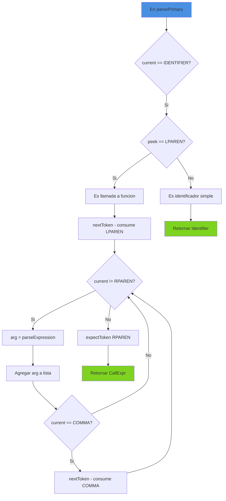

**Gramatica**:
```
call_expr := IDENTIFIER '(' (expression (',' expression)*)? ')'
```

## Manejo de Errores

### Estrategia de Recuperacion

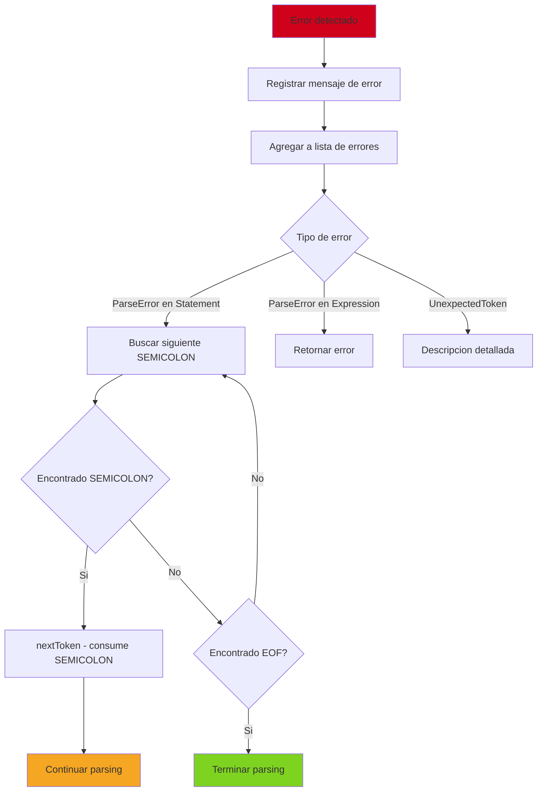

### expectToken()

Funcion auxiliar para verificar y consumir tokens esperados:

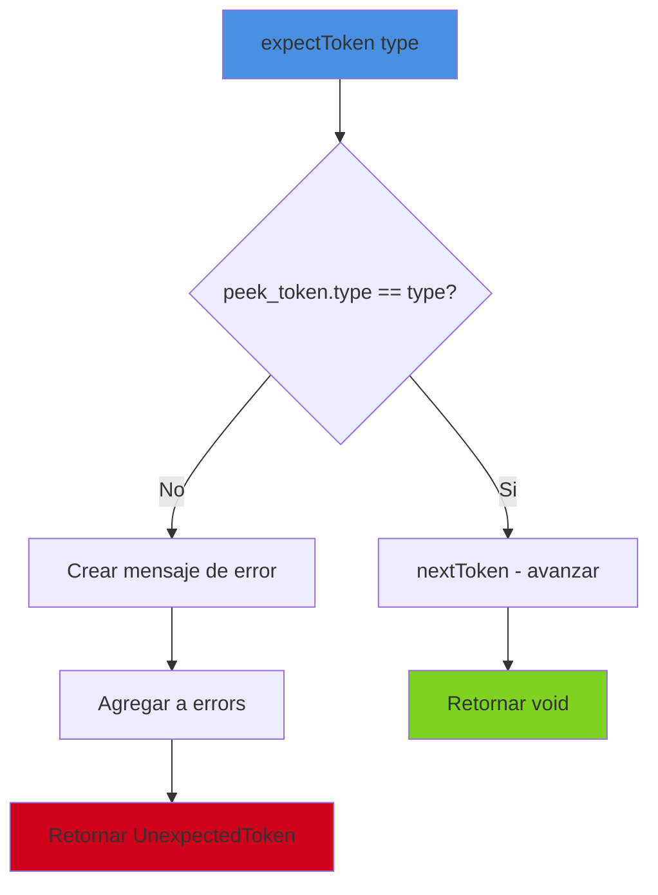

**Ejemplo de Mensaje de Error**:
```
Expected SEMICOLON, got RBRACE at 5:12
```

## Construccion del AST

### Ejemplo Completo

**Codigo Fuente**:
```boemia
let x: int = 10;
if x > 5 {
    print(x);
}
```

**AST Generado**:
```
Program {
    statements: [
        Stmt.variable_decl {
            name: "x"
            data_type: INT
            value: Expr.integer(10)
            is_const: false
        },
        Stmt.if_stmt {
            condition: Expr.binary {
                left: Expr.identifier("x")
                operator: GT
                right: Expr.integer(5)
            }
            then_block: [
                Stmt.print_stmt {
                    expr: Expr.identifier("x")
                }
            ]
            else_block: null
        }
    ]
}
```

**Visualizacion del AST**:
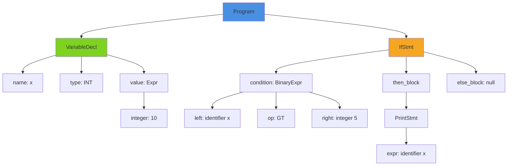

## Optimizaciones del Parser

### Allocacion Eficiente

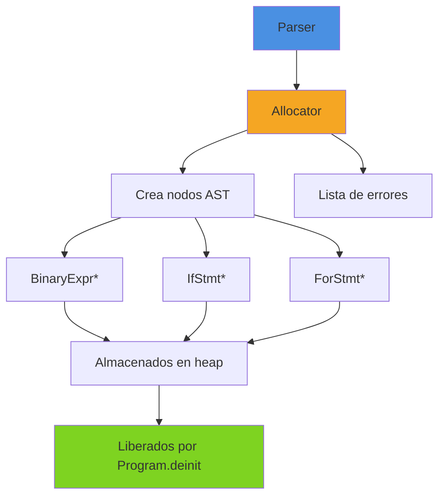

Solo los nodos que contienen otros nodos se almacenan en heap usando punteros. Los nodos simples se almacenan inline en el union.

### Sin Backtracking

El parser nunca retrocede. Toma decisiones basadas en:
- current_token
- peek_token (lookahead de 1)

Esto hace el parsing O(n) donde n es el numero de tokens.

## Tabla de Gramatica Completa

| Regla | Produccion |
|-------|------------|
| program | statement* |
| statement | variable_decl \| assignment \| if_stmt \| while_stmt \| for_stmt \| return_stmt \| print_stmt \| function_decl \| expr_stmt \| block |
| variable_decl | ('make' \| 'seal') IDENTIFIER ':' TYPE '=' expression ';' |
| assignment | IDENTIFIER '=' expression ';' |
| if_stmt | 'if' expression '{' block '}' ('else' (if_stmt \| '{' block '}'))? |
| while_stmt | 'while' expression '{' block '}' |
| for_stmt | 'for' init_stmt expression ';' update_stmt '{' block '}' |
| return_stmt | 'return' expression? ';' |
| print_stmt | 'print' '(' expression ')' ';' |
| function_decl | 'fn' IDENTIFIER '(' params ')' ':' TYPE '{' block '}' |
| block | statement* |
| expr_stmt | expression ';' |
| expression | primary (infix_op expression)* |
| primary | INTEGER \| FLOAT \| STRING \| TRUE \| FALSE \| IDENTIFIER \| call_expr \| '(' expression ')' \| '-' primary |
| call_expr | IDENTIFIER '(' args ')' |

## Testing del Parser

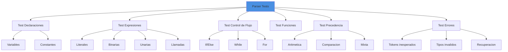

## Performance del Parser

| Operacion | Complejidad |
|-----------|-------------|
| parseProgram() | O(n) |
| parseStatement() | O(1) |
| parseExpression() | O(m) donde m = complejidad expresion |
| parsePrimary() | O(1) |
| expectToken() | O(1) |
| **Total** | **O(n)** lineal en tokens |

## Integracion con Otras Fases

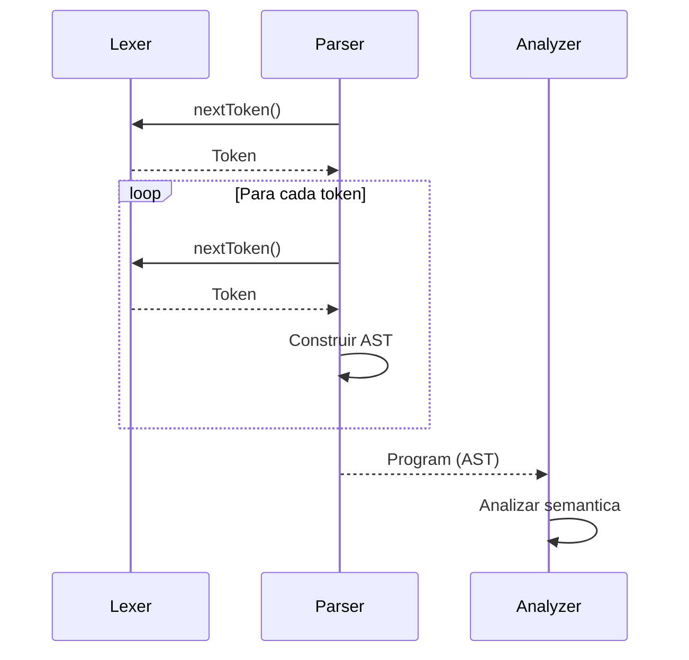

## Proximos Pasos

Una vez construido el AST, el [Analyzer](06-ANALYZER.md) verifica la correccion semantica del programa.

## Referencias

- [AST Structure](13-AST-STRUCTURE.md) - Estructura detallada del AST
- [Error Handling](14-ERROR-HANDLING.md) - Manejo de errores en detalle
- [Type System](09-TYPE-SYSTEM.md) - Sistema de tipos
