# Analisis Semantico - Analyzer

## Introduccion

El Analyzer (Analizador Semantico) es la tercera fase del compilador. Su responsabilidad es verificar que el programa sea semanticamente correcto, es decir, que tenga sentido mas alla de la sintaxis.

## Que es el Analisis Semantico?

Mientras el Parser verifica la sintaxis (estructura), el Analyzer verifica la semantica (significado):

- ¿Las variables estan declaradas antes de usarse?
- ¿Los tipos son compatibles en las operaciones?
- ¿Se asigna a constantes?
- ¿Las condiciones son booleanas?

### Ejemplo

```boemia
make x: int = "texto";  // Error semantico: tipo incompatible
seal PI: float = 3.14;
PI = 3.15;              // Error semantico: asignacion a constante
```

## Estructura del Analyzer

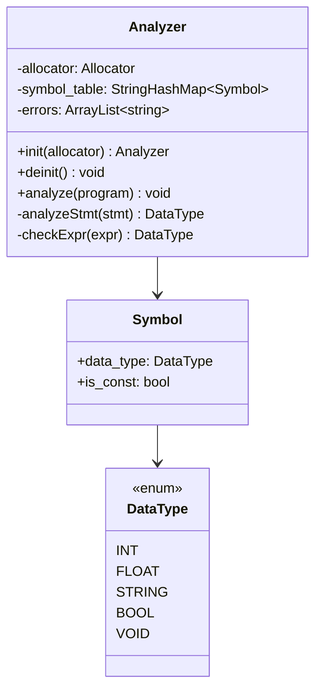

## Tabla de Simbolos

La tabla de simbolos es una estructura de datos que mapea nombres de variables a su informacion de tipo.

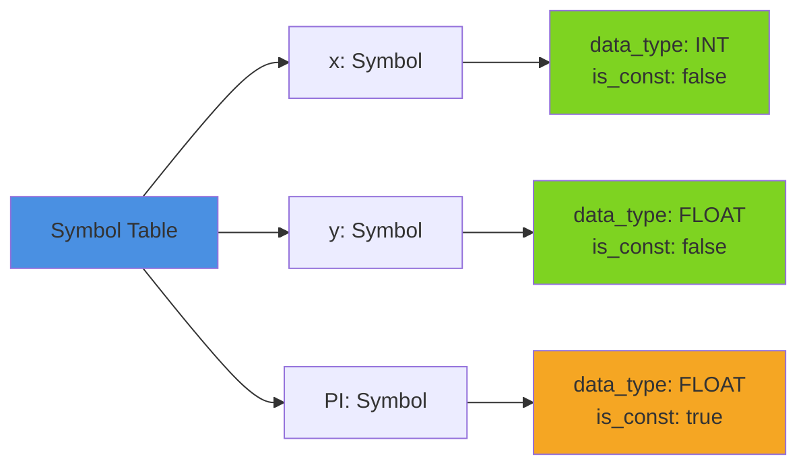

### Operaciones en la Tabla de Simbolos

| Operacion | Metodo | Complejidad |
|-----------|--------|-------------|
| Insertar simbolo | `put(name, symbol)` | O(1) promedio |
| Buscar simbolo | `get(name)` | O(1) promedio |
| Eliminar simbolo | `remove(name)` | O(1) promedio |
| Verificar existencia | `contains(name)` | O(1) promedio |

## Proceso de Analisis

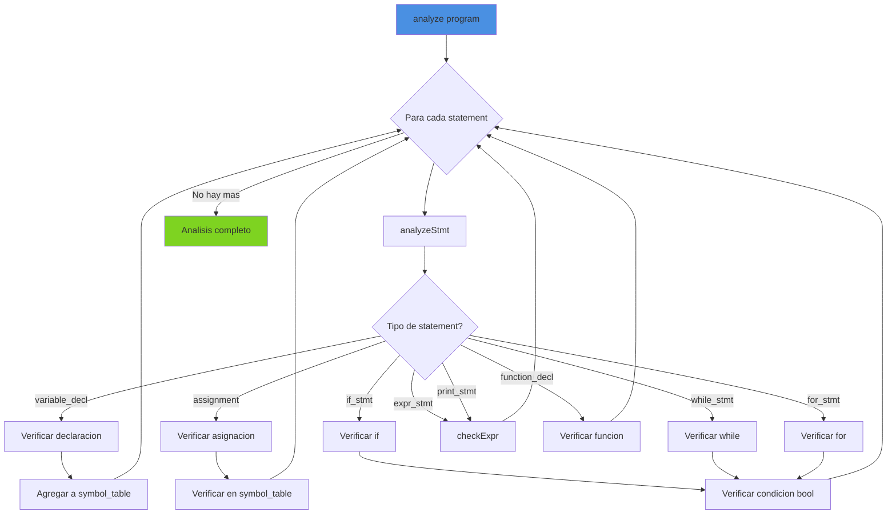

## Verificaciones Principales

### 1. Declaracion de Variables

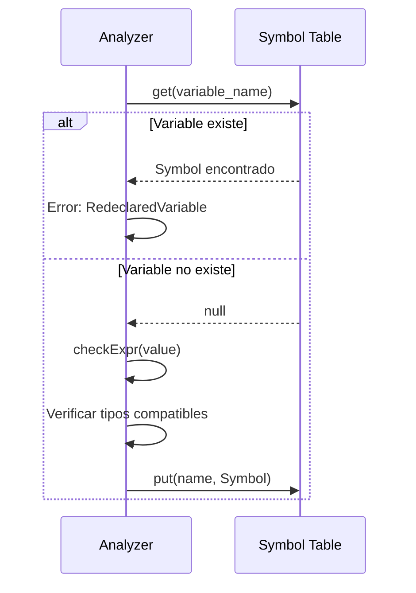

**Codigo**:
```zig
if (self.symbol_table.get(decl.name)) |_| {
    return AnalyzerError.RedeclaredVariable;
}

const expr_type = try self.checkExpr(&decl.value);

if (expr_type != decl.data_type) {
    return AnalyzerError.TypeMismatch;
}

try self.symbol_table.put(decl.name, Symbol{
    .data_type = decl.data_type,
    .is_const = decl.is_const,
});
```

**Errores detectados**:
- Redeclaracion de variable
- Tipo incompatible en inicializacion

### 2. Asignacion a Variables

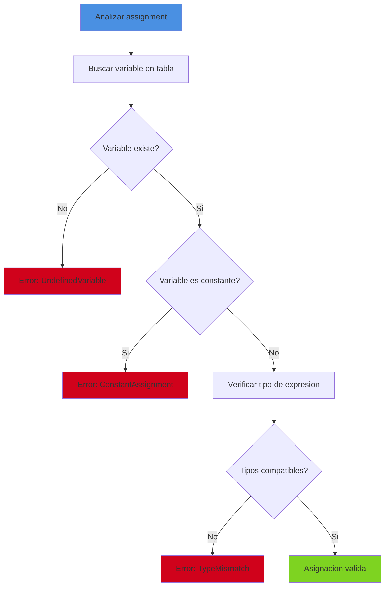

**Codigo**:
```zig
const symbol = self.symbol_table.get(assign.name) orelse {
    return AnalyzerError.UndefinedVariable;
};

if (symbol.is_const) {
    return AnalyzerError.ConstantAssignment;
}

const expr_type = try self.checkExpr(&assign.value);
if (expr_type != symbol.data_type) {
    return AnalyzerError.TypeMismatch;
}
```

**Errores detectados**:
- Variable no declarada
- Asignacion a constante (seal)
- Tipo incompatible

### 3. Verificacion de Tipos en Expresiones

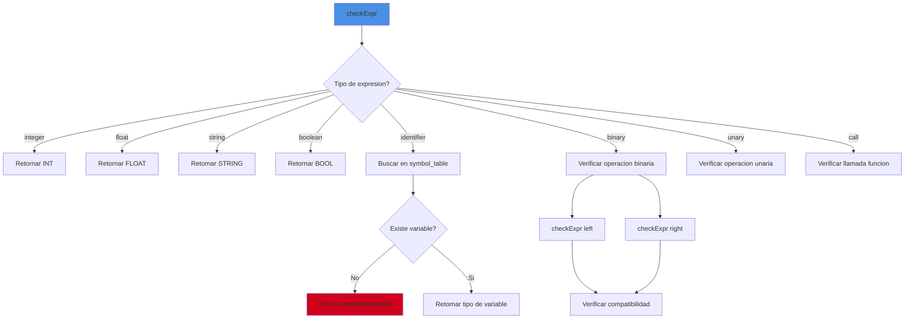

**Ejemplo - Operacion Binaria**:
```zig
const left_type = try self.checkExpr(&bin.left);
const right_type = try self.checkExpr(&bin.right);

switch (bin.operator) {
    .ADD, .SUB, .MUL, .DIV => {
        if (left_type == .INT and right_type == .INT) {
            return .INT;
        } else if (left_type == .FLOAT and right_type == .FLOAT) {
            return .FLOAT;
        } else if ((left_type == .INT or left_type == .FLOAT) and
                   (right_type == .INT or right_type == .FLOAT)) {
            return .FLOAT;  // Promocion a float
        }
        return AnalyzerError.InvalidOperation;
    },
    .EQ, .NEQ, .LT, .GT, .LTE, .GTE => {
        if (left_type != right_type) {
            return AnalyzerError.TypeMismatch;
        }
        return .BOOL;
    },
}
```

### 4. Condiciones Booleanas

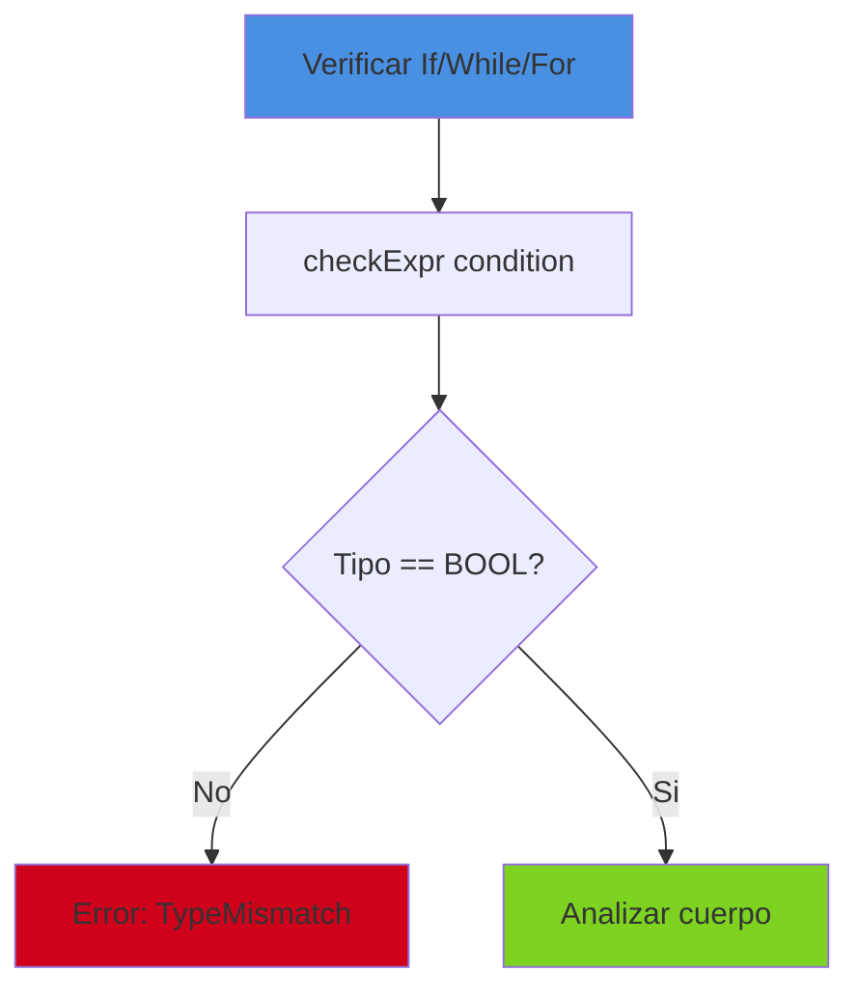

**Codigo**:
```zig
const cond_type = try self.checkExpr(&if_stmt.condition);
if (cond_type != .BOOL) {
    const err = try std.fmt.allocPrint(
        self.allocator,
        "If condition must be bool, got {s}",
        .{cond_type.toString()},
    );
    try self.errors.append(self.allocator, err);
    return AnalyzerError.TypeMismatch;
}
```

## Reglas de Tipos

### Operaciones Aritmeticas (+ - * /)

| Izquierda | Derecha | Resultado | Valido |
|-----------|---------|-----------|--------|
| INT | INT | INT | Si |
| FLOAT | FLOAT | FLOAT | Si |
| INT | FLOAT | FLOAT | Si (promocion) |
| FLOAT | INT | FLOAT | Si (promocion) |
| STRING | STRING | STRING | Solo para + (concatenacion) |
| Otros | Otros | - | No |

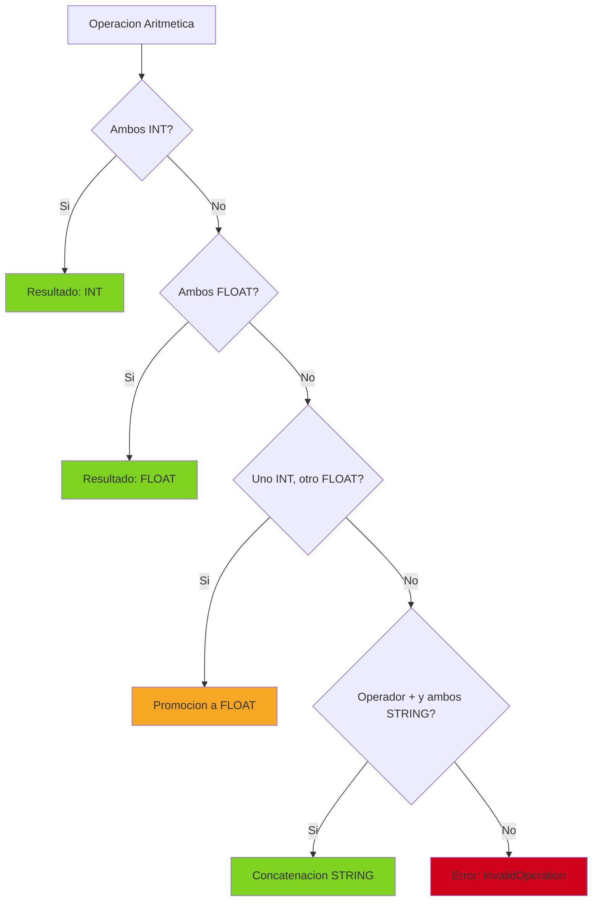

### Operaciones de Comparacion (== != < > <= >=)

| Izquierda | Derecha | Resultado | Valido |
|-----------|---------|-----------|--------|
| INT | INT | BOOL | Si |
| FLOAT | FLOAT | BOOL | Si |
| STRING | STRING | BOOL | Si |
| BOOL | BOOL | BOOL | Si |
| Tipos diferentes | - | - | No |

**Regla importante**: Los tipos deben ser identicos, no hay promocion.

### Operaciones Unarias

| Operador | Tipo Operando | Resultado | Valido |
|----------|---------------|-----------|--------|
| `-` (negacion) | INT | INT | Si |
| `-` (negacion) | FLOAT | FLOAT | Si |
| `-` (negacion) | Otros | - | No |
| `!` (not) | BOOL | BOOL | Si |
| `!` (not) | Otros | - | No |

## Scope y Bloques

El Analyzer maneja scopes para variables declaradas dentro de bloques.

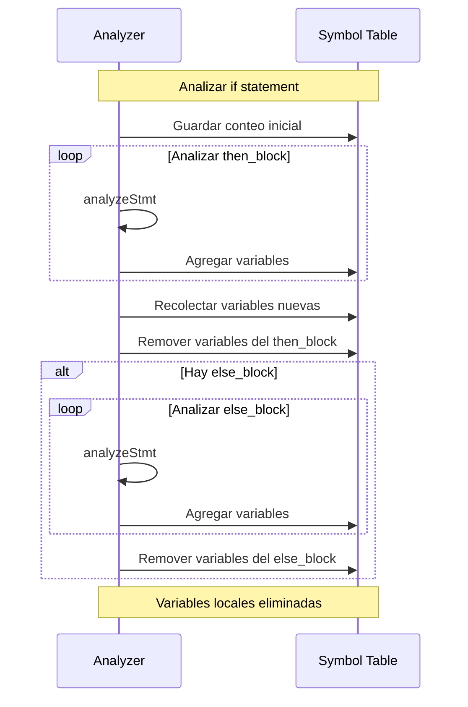

**Problema resuelto**: Variables declaradas en un bloque no escapan su scope.

```boemia
if true {
    make x: int = 5;
}
print(x);  // Error: x no existe fuera del if
```

**Implementacion**:
```zig
// Guardar conteo de simbolos antes del bloque
const then_vars_start_count = self.symbol_table.count();

// Analizar bloque
for (if_stmt.then_block) |*s| {
    try self.analyzeStmt(s);
}

// Recolectar variables agregadas
var then_vars: std.ArrayList([]const u8) = .empty;
var it = self.symbol_table.iterator();
var count: usize = 0;
while (it.next()) |entry| : (count += 1) {
    if (count >= then_vars_start_count) {
        try then_vars.append(self.allocator, entry.key_ptr.*);
    }
}

// Remover variables del bloque
for (then_vars.items) |var_name| {
    _ = self.symbol_table.remove(var_name);
}
```

## Manejo de Funciones

### Declaracion de Funcion

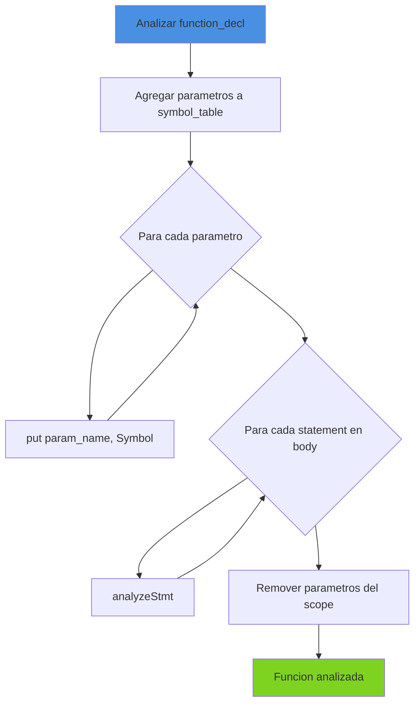

**Codigo**:
```zig
for (func.params) |param| {
    try self.symbol_table.put(param.name, Symbol{
        .data_type = param.data_type,
        .is_const = false,
    });
}

for (func.body) |*s| {
    try self.analyzeStmt(s);
}
```

### Llamada a Funcion

Actualmente simplificado, retorna VOID:
```zig
.call => |call| {
    _ = call;
    // Verificacion completa de tipos pendiente
    break :blk .VOID;
}
```

**Mejora futura**: Tabla de funciones con tipos de parametros y retorno.

## Errores del Analyzer

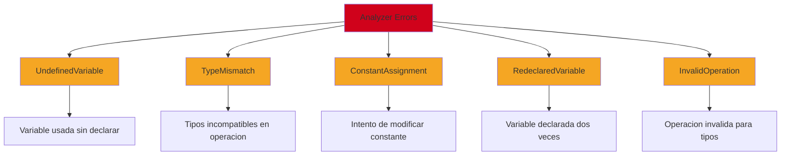

### Ejemplos de Mensajes de Error

```
Error: Variable 'x' is already declared
Error: Type mismatch: cannot assign string to int
Error: Cannot assign to constant 'PI'
Error: Undefined variable 'y'
Error: If condition must be bool, got int
Error: Cannot compare int with string
Error: Invalid operation: string * int
```

## Flujo Completo del Analisis

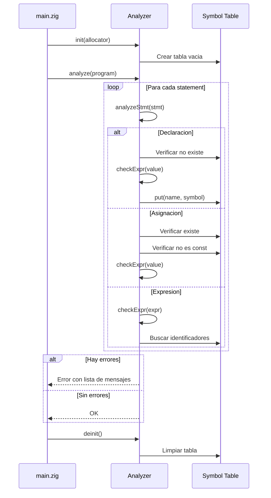

## Tabla de Decisiones de Tipos

### Promocion de Tipos

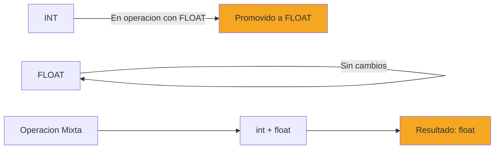

**Regla**: En operaciones aritmeticas mixtas (int y float), el resultado es float.

### Compatibilidad de Tipos

| Operacion | int | float | string | bool | void |
|-----------|-----|-------|--------|------|------|
| Aritmetica (+,-,*,/) | Si | Si | Solo + | No | No |
| Comparacion (==,!=) | Si | Si | Si | Si | No |
| Ordenamiento (<,>,<=,>=) | Si | Si | Si | No | No |
| Negacion (-) | Si | Si | No | No | No |
| Not (!) | No | No | No | Si | No |

## Optimizaciones

### Tabla de Hash Eficiente

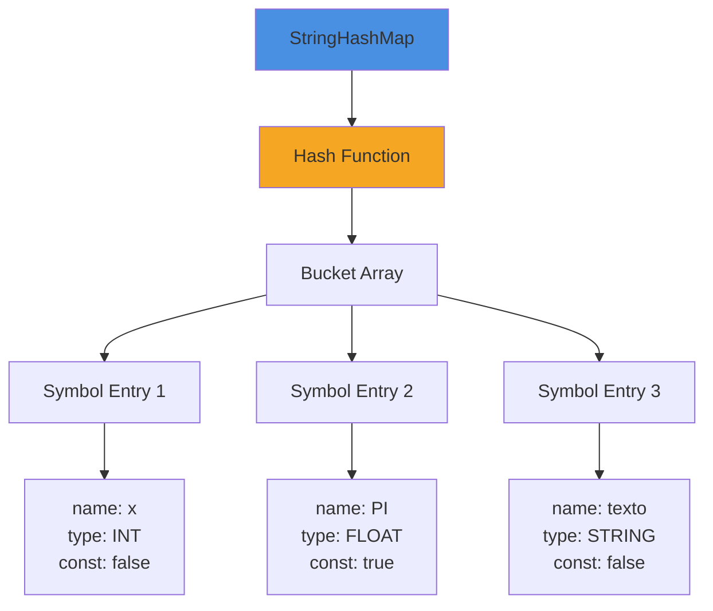

**Ventajas**:
- Busqueda O(1) promedio
- Insercion O(1) promedio
- Eliminacion O(1) promedio

### Un Solo Recorrido

El Analyzer solo recorre el AST una vez, verificando todas las reglas semanticas simultaneamente.

## Testing del Analyzer

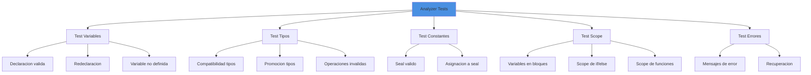

## Performance del Analyzer

| Operacion | Complejidad |
|-----------|-------------|
| analyze(program) | O(n) donde n = nodos del AST |
| analyzeStmt() | O(1) |
| checkExpr() | O(m) donde m = profundidad expresion |
| symbol_table.get() | O(1) promedio |
| symbol_table.put() | O(1) promedio |
| **Total** | **O(n)** lineal en tamano del AST |

## Integracion con Otras Fases

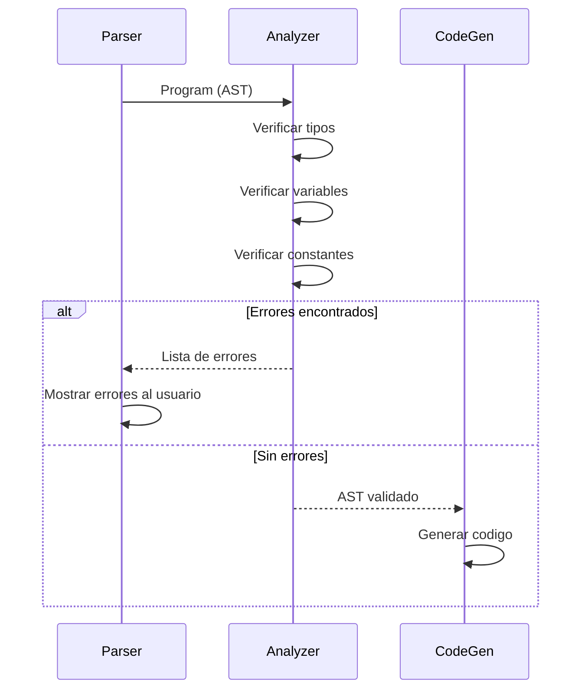

## Limitaciones Actuales

1. **Sin tabla de funciones**: Las funciones no se verifican completamente
2. **Scope global**: Solo hay un scope global (se limpia en bloques)
3. **Sin inferencia de tipos**: Los tipos deben declararse explicitamente
4. **Sin verificacion de return**: No verifica que funciones retornen valores

## Mejoras Futuras

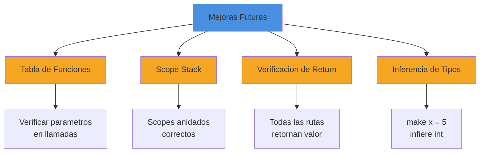

## Proximos Pasos

Una vez que el AST ha sido validado semanticamente, el [Code Generator](07-CODEGEN.md) puede generar codigo C con confianza.

## Referencias

- [Type System](09-TYPE-SYSTEM.md) - Sistema de tipos en detalle
- [Error Handling](14-ERROR-HANDLING.md) - Manejo de errores
- [AST Structure](13-AST-STRUCTURE.md) - Estructura del AST
