# Generacion de Codigo - Code Generator

## Introduccion

El Code Generator (Generador de Codigo) es la cuarta y ultima fase del compilador. Su responsabilidad es transformar el AST validado semanticamente en codigo C que pueda compilarse con GCC/Clang.

## Estrategia: Transpilacion a C

Boemia Script no genera codigo maquina directamente. En su lugar, transpila a C y delega la optimizacion y generacion de binarios a GCC.

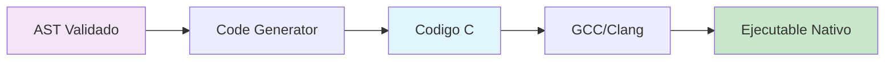

### Ventajas de esta Estrategia

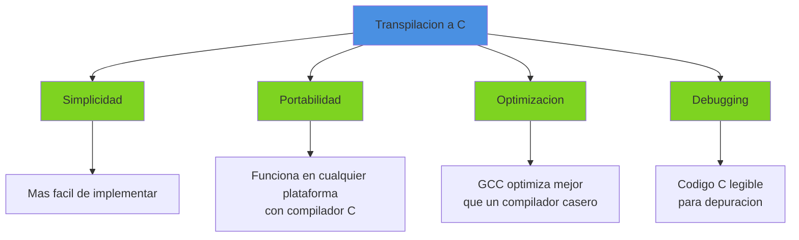

## Estructura del Code Generator

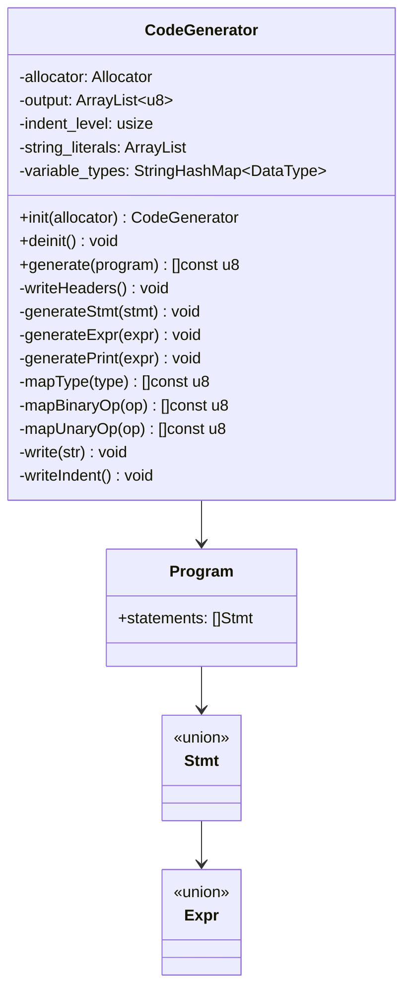

## Proceso de Generacion

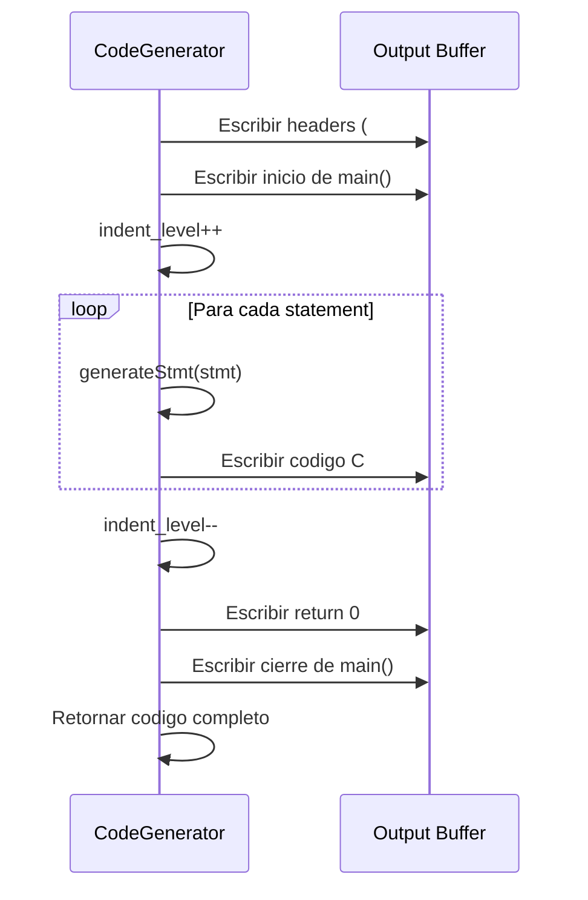

## Generacion de Headers

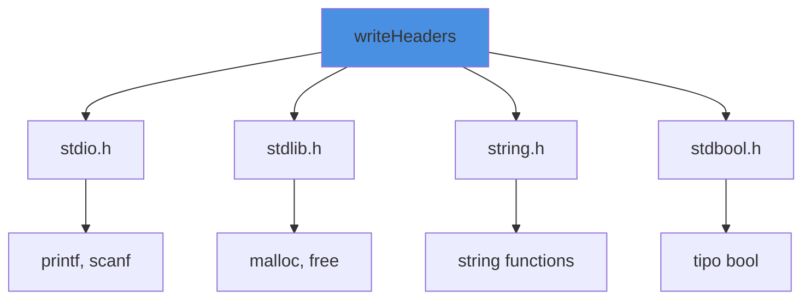

**Codigo Generado**:
```c
// Generated by Boemia Script Compiler
#include <stdio.h>
#include <stdlib.h>
#include <string.h>
#include <stdbool.h>
```

## Mapeo de Tipos

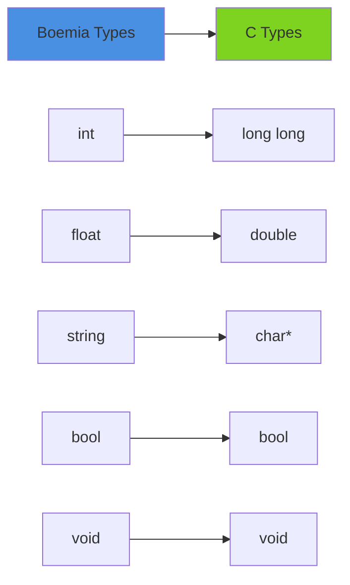

**Implementacion**:
```zig
fn mapType(self: *CodeGenerator, data_type: DataType) []const u8 {
    return switch (data_type) {
        .INT => "long long",
        .FLOAT => "double",
        .STRING => "char*",
        .BOOL => "bool",
        .VOID => "void",
    };
}
```

### ¿Por que long long y no int?

- **Compatibilidad**: Asegura 64 bits en todas las plataformas
- **Precision**: Evita overflow en calculos grandes
- **Consistencia**: Mismo comportamiento en todos los sistemas

## Generacion de Statements

### Variable Declaration

```mermaid
sequenceDiagram
    participant CG as CodeGenerator
    participant VT as variable_types

    CG->>VT: Guardar tipo de variable
    CG->>CG: writeIndent()
    alt Es constante (seal)
        CG->>CG: write("const ")
    end
    CG->>CG: write(mapType(type))
    CG->>CG: write(" ")
    CG->>CG: write(name)
    CG->>CG: write(" = ")
    CG->>CG: generateExpr(value)
    CG->>CG: write(";\n")
```

**Ejemplo**:

Boemia:
```boemia
make x: int = 42;
seal PI: float = 3.14;
```

C Generado:
```c
long long x = 42;
const double PI = 3.14;
```

### Assignment

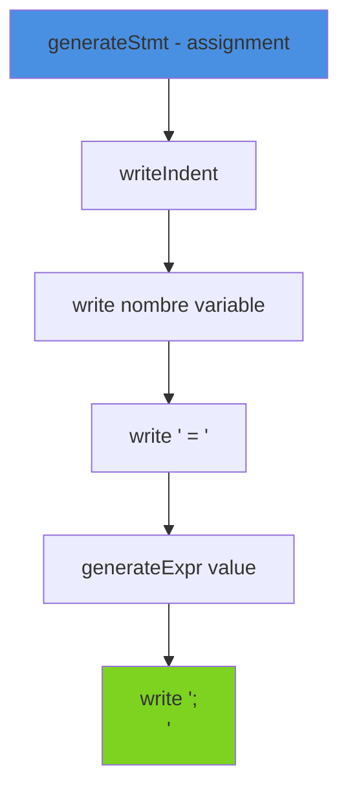

**Ejemplo**:

Boemia:
```boemia
x = x + 1;
```

C Generado:
```c
x = (x + 1);
```

### If Statement

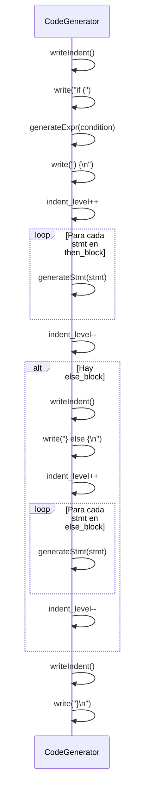

**Ejemplo**:

Boemia:
```boemia
if x > 5 {
    print(x);
} else {
    print(0);
}
```

C Generado:
```c
if ((x > 5)) {
    printf("%lld\n", (long long)x);
} else {
    printf("%lld\n", (long long)0);
}
```

### While Statement

```mermaid
flowchart TD
    A[generateStmt - while] --> B[writeIndent]
    B --> C[write 'while (']
    C --> D[generateExpr condition]
    D --> E[write ') {\n']
    E --> F[indent_level++]
    F --> G{Para cada stmt en body}
    G --> H[generateStmt]
    H --> G
    G --> I[indent_level--]
    I --> J[writeIndent]
    J --> K[write '}\n']

    style A fill:#4a90e2
    style K fill:#7ed321
```

**Ejemplo**:

Boemia:
```boemia
while i < 10 {
    print(i);
    i = i + 1;
}
```

C Generado:
```c
while ((i < 10)) {
    printf("%lld\n", (long long)i);
    i = (i + 1);
}
```

### For Statement

El for loop requiere manejo especial para estructurar correctamente el header.

```mermaid
sequenceDiagram
    participant CG as CodeGenerator

    CG->>CG: writeIndent()
    CG->>CG: write("for (")

    alt init es variable_decl
        CG->>CG: write(tipo nombre = valor)
    end

    CG->>CG: write("; ")
    CG->>CG: generateExpr(condition) sin parentesis
    CG->>CG: write("; ")

    alt update es assignment
        CG->>CG: write(nombre = valor)
    end

    CG->>CG: write(") {\n")
    CG->>CG: Generar body
    CG->>CG: write("}\n")
```

**Ejemplo**:

Boemia:
```boemia
for i: int = 0; i < 10; i = i + 1 {
    print(i);
}
```

C Generado:
```c
for (long long i = 0; i < 10; i = (i + 1)) {
    printf("%lld\n", (long long)i);
}
```

### Print Statement

El print requiere determinar el tipo de la expresion para usar el formato correcto.

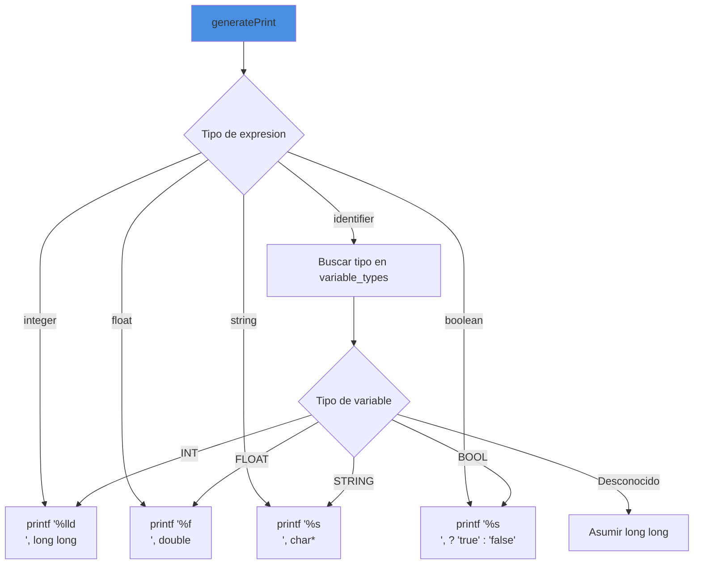

**Ejemplos**:

Boemia:
```boemia
print(42);
print(3.14);
print("Hola");
print(true);
print(x);
```

C Generado:
```c
printf("%lld\n", (long long)42);
printf("%f\n", (double)3.14);
printf("%s\n", "Hola");
printf("%s\n", true ? "true" : "false");
printf("%lld\n", (long long)x);  // Asumiendo x es int
```

## Generacion de Expresiones

### Literales

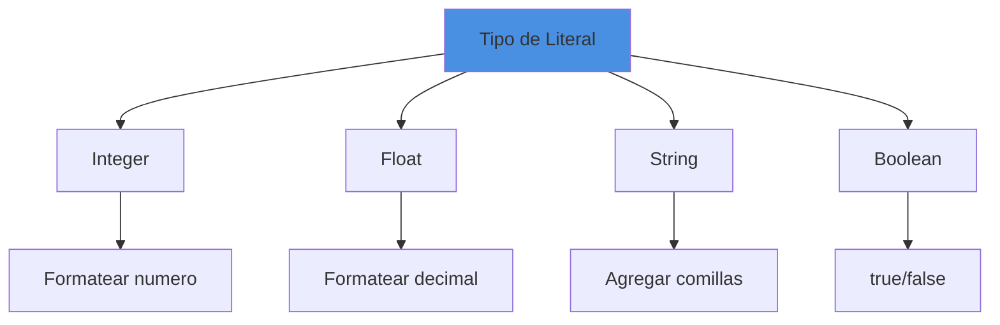

**Implementacion**:
```zig
.integer => |val| {
    const str = std.fmt.allocPrint(self.allocator, "{d}", .{val});
    try self.write(str);
},
.float => |val| {
    const str = std.fmt.allocPrint(self.allocator, "{d}", .{val});
    try self.write(str);
},
.string => |val| {
    try self.write("\"");
    try self.write(val);
    try self.write("\"");
},
.boolean => |val| {
    try self.write(if (val) "true" else "false");
},
```

### Expresiones Binarias

Todas las expresiones binarias se envuelven en parentesis para asegurar precedencia correcta.

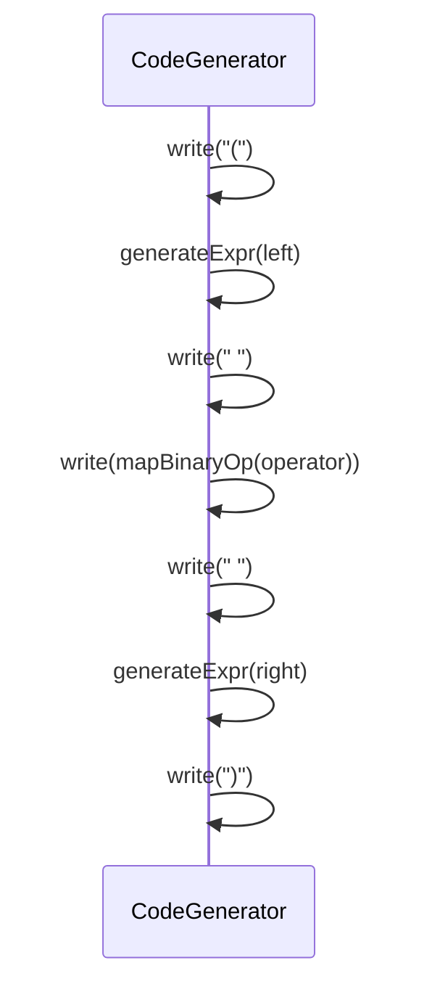

**Mapeo de Operadores**:
```zig
fn mapBinaryOp(self: *CodeGenerator, op: BinaryOp) []const u8 {
    return switch (op) {
        .ADD => "+",
        .SUB => "-",
        .MUL => "*",
        .DIV => "/",
        .EQ => "==",
        .NEQ => "!=",
        .LT => "<",
        .GT => ">",
        .LTE => "<=",
        .GTE => ">=",
    };
}
```

**Ejemplo**:

Boemia:
```boemia
x + y * 2
```

AST:
```
BinaryExpr(
    left: identifier(x)
    op: ADD
    right: BinaryExpr(
        left: identifier(y)
        op: MUL
        right: integer(2)
    )
)
```

C Generado:
```c
(x + (y * 2))
```

### Expresiones Unarias

```mermaid
flowchart TD
    A[generateExpr - unary] --> B[write '(']
    B --> C[write operador]
    C --> D[generateExpr operand]
    D --> E[write ')']

    style A fill:#4a90e2
    style E fill:#7ed321
```

**Mapeo de Operadores Unarios**:
```zig
fn mapUnaryOp(self: *CodeGenerator, op: UnaryOp) []const u8 {
    return switch (op) {
        .NEG => "-",
        .NOT => "!",
    };
}
```

**Ejemplo**:

Boemia:
```boemia
-x
```

C Generado:
```c
(-x)
```

### Llamadas a Funcion

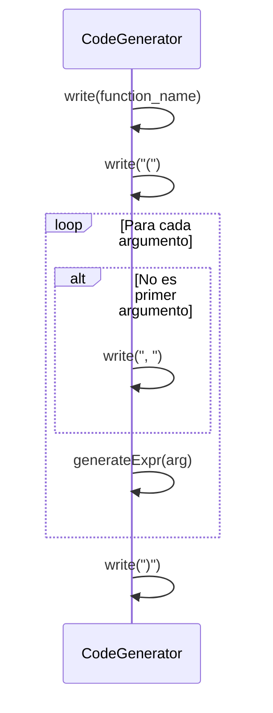

**Ejemplo**:

Boemia:
```boemia
suma(a, b, c)
```

C Generado:
```c
suma(a, b, c)
```

## Indentacion

El generador mantiene un nivel de indentacion para hacer el codigo C legible.

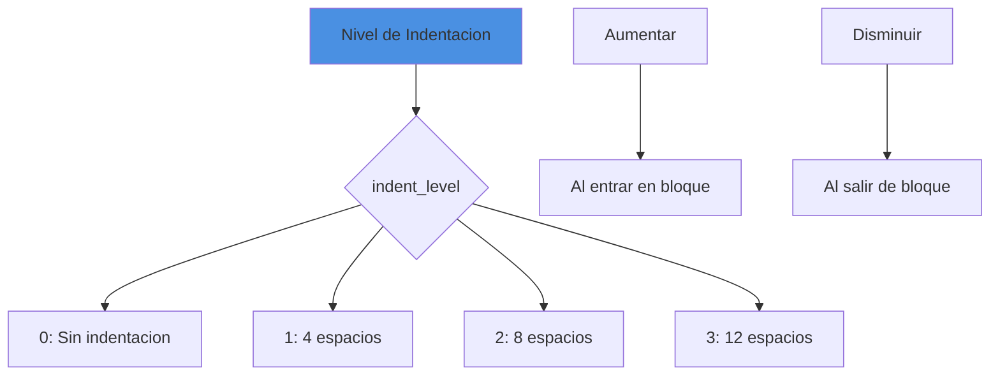

**Implementacion**:
```zig
fn writeIndent(self: *CodeGenerator) CodeGenError!void {
    var i: usize = 0;
    while (i < self.indent_level) : (i += 1) {
        try self.write("    ");  // 4 espacios
    }
}
```

**Ejemplo de Codigo Generado**:
```c
int main(void) {
    long long x = 5;
    if ((x > 0)) {
        printf("%lld\n", (long long)x);
    }
    return 0;
}
```

## Ejemplo Completo de Generacion

### Entrada (Boemia Script)

```boemia
make x: int = 10;
make y: int = 20;

if x < y {
    make suma: int = x + y;
    print(suma);
} else {
    print(x);
}

for i: int = 0; i < 5; i = i + 1 {
    print(i);
}
```

### Salida (Codigo C)

```c
// Generated by Boemia Script Compiler
#include <stdio.h>
#include <stdlib.h>
#include <string.h>
#include <stdbool.h>

int main(void) {
    long long x = 10;
    long long y = 20;
    if ((x < y)) {
        long long suma = (x + y);
        printf("%lld\n", (long long)suma);
    } else {
        printf("%lld\n", (long long)x);
    }
    for (long long i = 0; i < 5; i = (i + 1)) {
        printf("%lld\n", (long long)i);
    }
    return 0;
}
```

### Visualizacion del Proceso

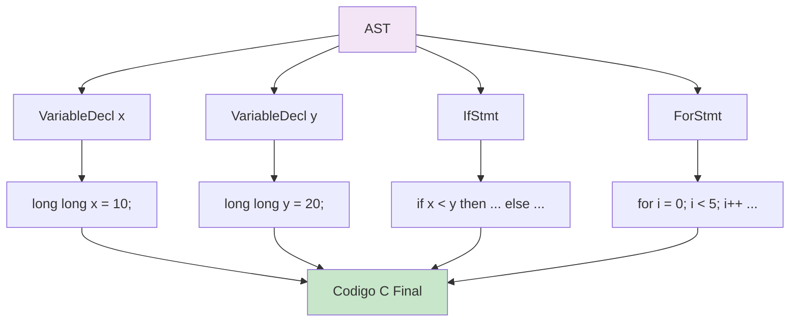

## Compilacion con GCC

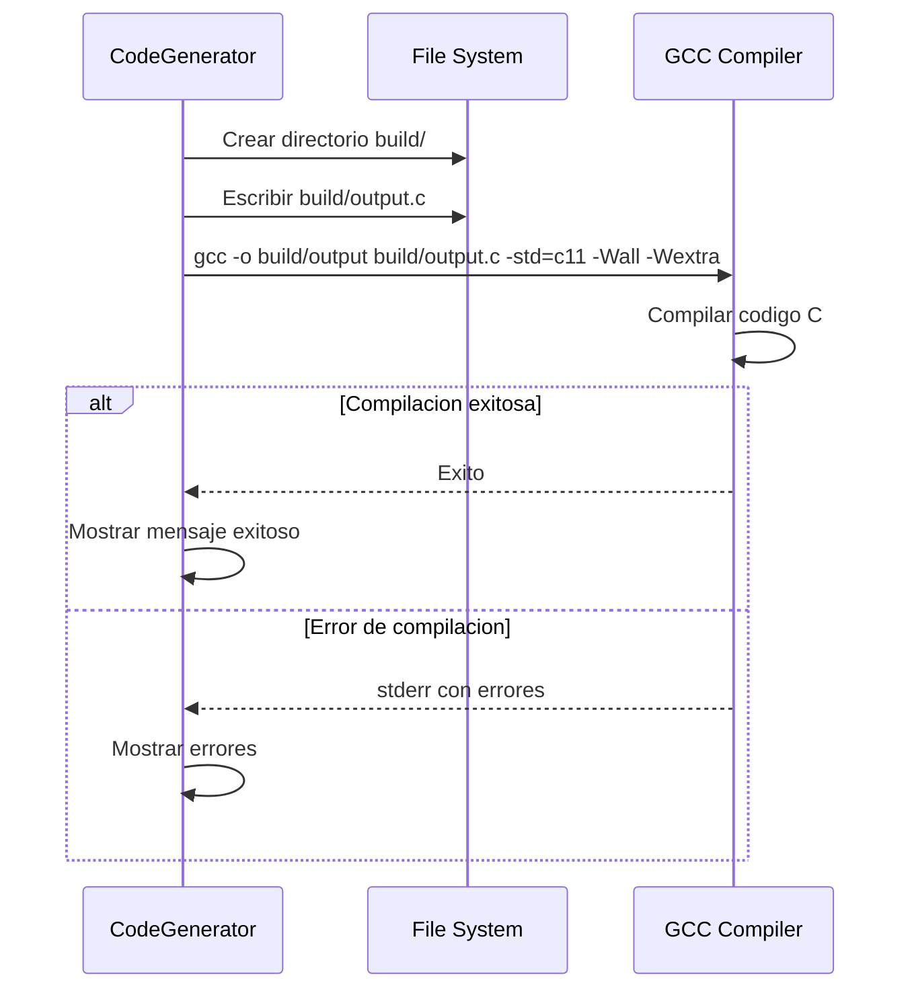

**Flags de GCC**:
- `-o`: Especifica nombre del ejecutable
- `-std=c11`: Usa estandar C11
- `-Wall`: Activa todos los warnings
- `-Wextra`: Activa warnings extras

**Implementacion**:
```zig
const result = try std.process.Child.run(.{
    .allocator = allocator,
    .argv = &[_][]const u8{
        "gcc",
        "-o",
        exec_output_path,
        c_file_path,
        "-std=c11",
        "-Wall",
        "-Wextra",
    },
});

if (result.term.Exited != 0) {
    std.debug.print("GCC compilation failed:\n{s}\n", .{result.stderr});
    return error.CompilationFailed;
}
```

## Optimizaciones del Code Generator

### 1. Buffer de Salida


No se concatenan strings constantemente. Se usa un ArrayList que crece eficientemente.

### 2. Tabla de Tipos de Variables

```mermaid
graph TB
    A[variable_types HashMap] --> B[Guardado en declaracion]
    B --> C[Consultado en print]
    C --> D[Formato correcto para printf]

    style A fill:#4a90e2
    style D fill:#7ed321
```

Permite generar printf con formato correcto sin re-analizar el AST.

### 3. Sin Re-formateo

El codigo C se genera directamente en formato final, sin pasos intermedios de formateo.

## Limitaciones y Mejoras Futuras

### Limitaciones Actuales

```mermaid
graph TB
    A[Limitaciones] --> B[Sin optimizacion de codigo C]
    A --> C[Sin generacion de funciones propias]
    A --> D[Sin manejo avanzado de strings]
    A --> E[Sin stdlib propia]

    style A fill:#d0021b
```

### Mejoras Futuras

```mermaid
graph TB
    A[Mejoras Futuras] --> B[Generacion de Funciones]
    A --> C[String Pool]
    A --> D[Optimizaciones]
    A --> E[Runtime Propio]

    B --> F[Prototipos antes de main]
    C --> G[Literales compartidos]
    D --> H[Eliminacion de parentesis innecesarios]
    E --> I[Funciones incorporadas en C]

    style A fill:#4a90e2
```

## Testing del Code Generator

```mermaid
graph TB
    A[CodeGen Tests] --> B[Test Statements]
    A --> C[Test Expressions]
    A --> D[Test Tipos]
    A --> E[Test Compilacion]

    B --> B1[Variables]
    B --> B2[Control Flow]
    B --> B3[Loops]

    C --> C1[Literales]
    C --> C2[Binarias]
    C --> C3[Unarias]

    D --> D1[Mapeo de tipos]
    D --> D2[Casting]

    E --> E1[GCC exitoso]
    E --> E2[Ejecucion correcta]

    style A fill:#4a90e2
```

## Performance del Code Generator

| Operacion | Complejidad |
|-----------|-------------|
| generate(program) | O(n) donde n = nodos del AST |
| generateStmt() | O(1) |
| generateExpr() | O(m) donde m = profundidad expresion |
| write() | O(k) donde k = longitud string |
| writeIndent() | O(l) donde l = nivel de indentacion |
| **Total** | **O(n)** lineal en tamano del AST |

## Proximos Pasos

El codigo C generado se compila con GCC. Ver [GCC Integration](08-GCC-INTEGRATION.md) para detalles sobre la integracion con el compilador de C.

## Referencias

- [GCC Integration](08-GCC-INTEGRATION.md) - Integracion con GCC
- [Type System](09-TYPE-SYSTEM.md) - Sistema de tipos
- [AST Structure](13-AST-STRUCTURE.md) - Estructura del AST
