# Integracion con GCC

## Introduccion

Boemia Script no genera codigo maquina directamente. En su lugar, transpila a codigo C y utiliza GCC (GNU Compiler Collection) o Clang para la compilacion final. Este documento describe como funciona esta integracion.

## ¿Por que GCC?

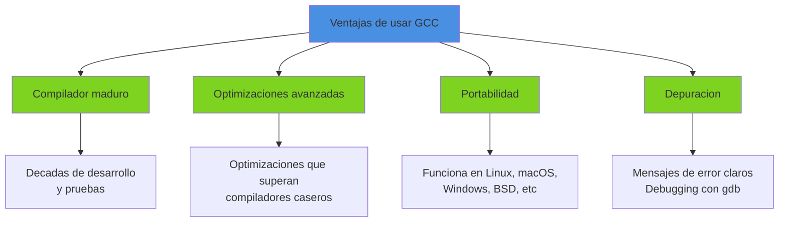

## Pipeline de Compilacion Completo

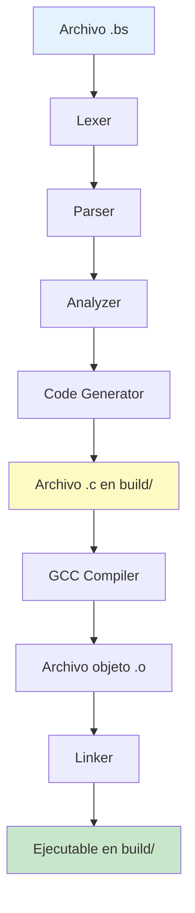

## Organizacion de Archivos

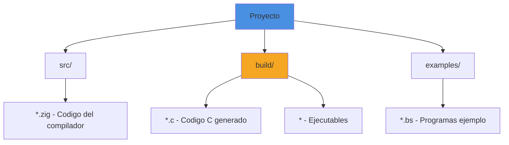

**Estructura de directorios**:
```
boemia-script/
├── src/
│   ├── main.zig
│   ├── lexer.zig
│   ├── parser.zig
│   ├── analyzer.zig
│   └── codegen.zig
├── build/              # Creado automaticamente
│   ├── output.c        # Codigo C generado
│   └── output          # Ejecutable final
├── examples/
│   └── hello.bs
└── build.zig
```

## Proceso de Invocacion de GCC

### Codigo de Integracion

```zig
pub fn compileToExecutable(
    allocator: std.mem.Allocator,
    program: *Program,
    output_path: []const u8,
) !void {
    // 1. Generar codigo C
    var codegen = CodeGenerator.init(allocator);
    defer codegen.deinit();
    const c_code = try codegen.generate(program);
    defer allocator.free(c_code);

    // 2. Crear directorio build/
    std.fs.cwd().makeDir("build") catch |err| {
        if (err != error.PathAlreadyExists) {
            return err;
        }
    };

    // 3. Escribir archivo .c
    const c_file_path = try std.fmt.allocPrint(
        allocator,
        "build/{s}.c",
        .{output_path}
    );
    defer allocator.free(c_file_path);

    const c_file = try std.fs.cwd().createFile(c_file_path, .{});
    defer c_file.close();
    try c_file.writeAll(c_code);

    // 4. Preparar path del ejecutable
    const exec_output_path = try std.fmt.allocPrint(
        allocator,
        "build/{s}",
        .{output_path}
    );
    defer allocator.free(exec_output_path);

    // 5. Invocar GCC
    const result = try std.process.Child.run(.{
        .allocator = allocator,
        .argv = &[_][]const u8{
            "gcc",
            "-o",
            exec_output_path,
            c_file_path,
            "-std=c11",
            "-Wall",
            "-Wextra",
        },
    });
    defer allocator.free(result.stdout);
    defer allocator.free(result.stderr);

    // 6. Verificar resultado
    if (result.term.Exited != 0) {
        std.debug.print("GCC compilation failed:\n{s}\n", .{result.stderr});
        return error.CompilationFailed;
    }

    std.debug.print("Successfully compiled to: {s}\n", .{exec_output_path});
}
```

### Flujo de Ejecucion

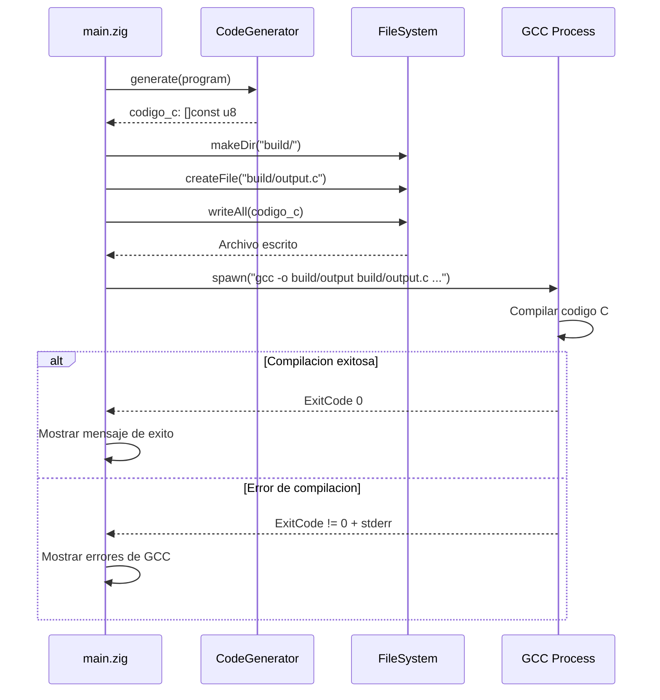

## Flags de GCC Utilizadas

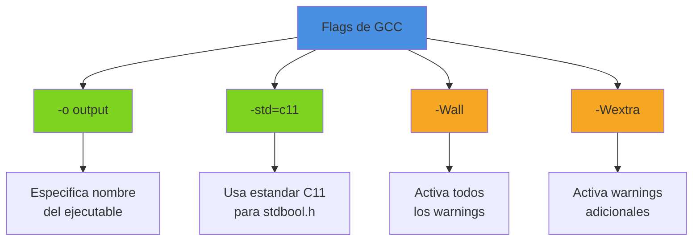

### Descripcion de Flags

| Flag | Proposito | Razon |
|------|-----------|-------|
| `-o <file>` | Especifica output | Nombre del ejecutable final |
| `-std=c11` | Estandar C11 | Necesario para `bool`, `true`, `false` |
| `-Wall` | Todos los warnings | Detectar problemas potenciales |
| `-Wextra` | Warnings extras | Mayor seguridad del codigo |

### ¿Por que C11?

C11 incluye `<stdbool.h>` que define:
- `bool` como tipo
- `true` como 1
- `false` como 0

Sin C11, tendriamos que definir manualmente:
```c
typedef int bool;
#define true 1
#define false 0
```

## Manejo de Errores de GCC

### Tipos de Errores

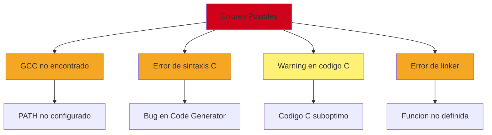

### Captura de Errores

```zig
const result = try std.process.Child.run(.{
    .allocator = allocator,
    .argv = &[_][]const u8{ "gcc", ... },
});
defer allocator.free(result.stdout);
defer allocator.free(result.stderr);

if (result.term.Exited != 0) {
    std.debug.print("GCC compilation failed:\n{s}\n", .{result.stderr});
    return error.CompilationFailed;
}
```

### Ejemplo de Error

**Codigo Boemia con bug**:
```boemia
make x: int = 5;
print(y);  // 'y' no existe - pero paso el analyzer por un bug
```

**Codigo C generado (incorrecto)**:
```c
int main(void) {
    long long x = 5;
    printf("%lld\n", (long long)y);  // y no declarado
    return 0;
}
```

**Salida de GCC**:
```
build/output.c:5:34: error: use of undeclared identifier 'y'
    printf("%lld\n", (long long)y);
                                 ^
1 error generated.
```

## Optimizaciones de GCC

GCC puede aplicar optimizaciones al codigo C generado.

### Niveles de Optimizacion

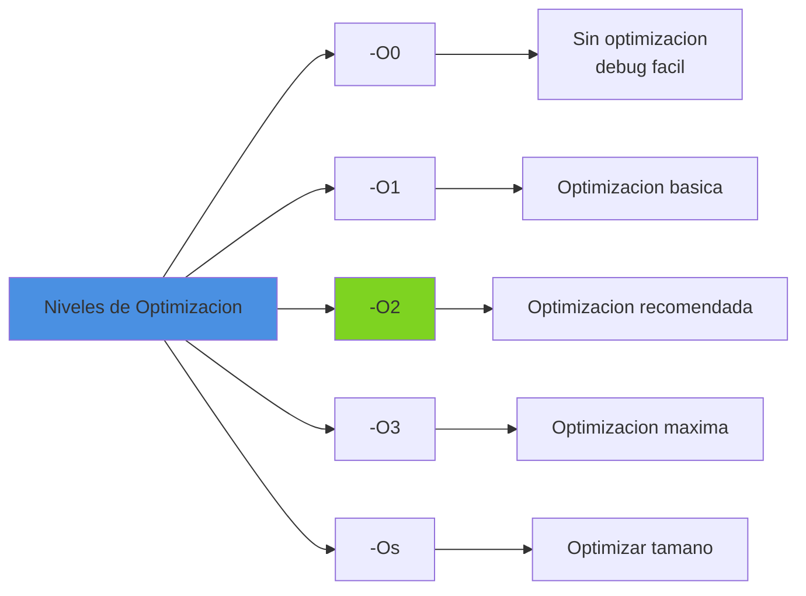

**Actualmente**: Boemia no especifica nivel de optimizacion (default `-O0`)

**Mejora futura**: Agregar flag `-O` al compilador:
```bash
boemia-compiler programa.bs -o output -O2
```

### Ejemplo de Optimizacion

**Codigo C generado**:
```c
int main(void) {
    long long x = 5;
    long long y = (x + (2 * 3));
    printf("%lld\n", (long long)y);
    return 0;
}
```

**Con `-O2`, GCC optimiza a**:
```c
int main(void) {
    printf("%lld\n", 11LL);  // Calculo en compile-time
    return 0;
}
```

## Alternativas a GCC

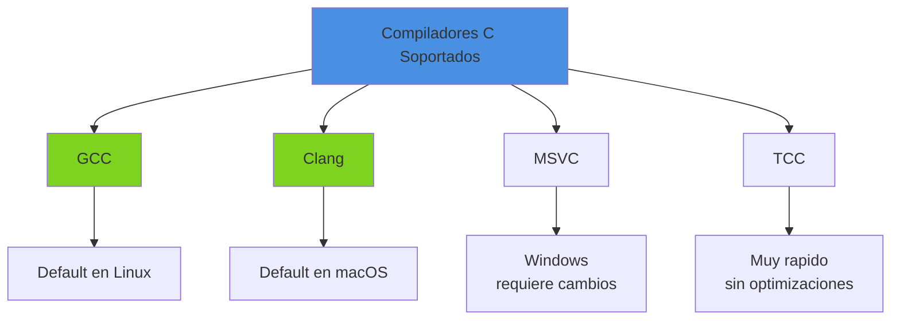

### Soporte de Clang

Clang es compatible con los flags de GCC:
```bash
clang -o build/output build/output.c -std=c11 -Wall -Wextra
```

**Modificacion necesaria**:
```zig
const result = try std.process.Child.run(.{
    .allocator = allocator,
    .argv = &[_][]const u8{
        "clang",  // En lugar de "gcc"
        "-o",
        exec_output_path,
        c_file_path,
        "-std=c11",
        "-Wall",
        "-Wextra",
    },
});
```

### Deteccion Automatica

**Mejora futura**: Detectar compilador disponible:
```zig
const compiler = detectCompiler() orelse return error.NoCompilerFound;

fn detectCompiler() ?[]const u8 {
    if (commandExists("gcc")) return "gcc";
    if (commandExists("clang")) return "clang";
    if (commandExists("cc")) return "cc";
    return null;
}
```

## Compilacion Cruzada

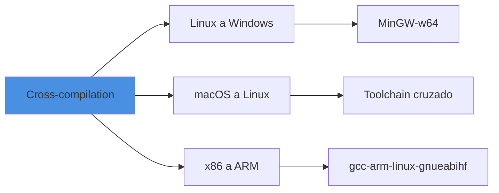

### Ejemplo: Linux a Windows

```bash
x86_64-w64-mingw32-gcc -o output.exe output.c -std=c11
```

**Modificacion en codegen.zig**:
```zig
const target_os = builtin.target.os.tag;
const compiler = switch (target_os) {
    .windows => "x86_64-w64-mingw32-gcc",
    .linux => "gcc",
    .macos => "clang",
    else => "gcc",
};
```

## Debugging del Codigo Generado

### Generacion de Simbolos de Debug

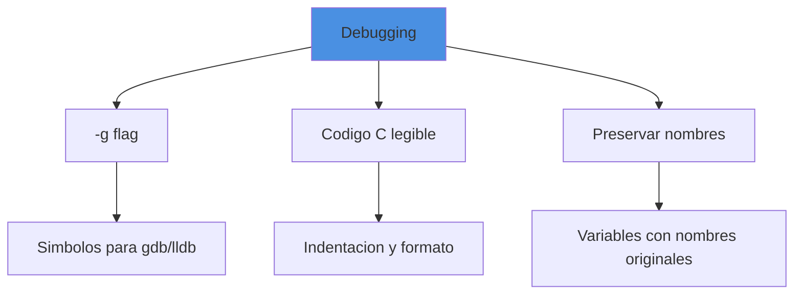

**Agregar flag `-g`**:
```zig
.argv = &[_][]const u8{
    "gcc",
    "-o", exec_output_path,
    c_file_path,
    "-std=c11",
    "-g",      // Simbolos de debug
    "-Wall",
    "-Wextra",
},
```

### Uso de GDB

```bash
# Compilar con -g
boemia-compiler programa.bs -o programa

# Debuggear
gdb build/programa

# Comandos GDB
(gdb) break main
(gdb) run
(gdb) next
(gdb) print x
(gdb) continue
```

## Metricas de Compilacion

### Tiempo de Compilacion

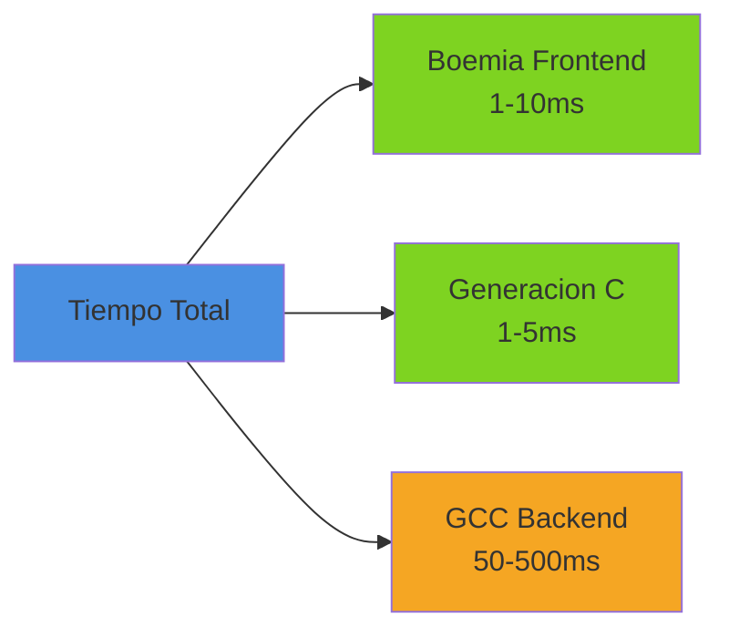

**Conclusion**: GCC es el cuello de botella, pero es aceptable para compilacion ahead-of-time.

### Tamano de Ejecutables

| Programa | Codigo C | Ejecutable sin opt | Ejecutable -O2 | Ejecutable -Os |
|----------|----------|-------------------|----------------|----------------|
| Hello World | 150 bytes | 16 KB | 16 KB | 16 KB |
| Factorial | 300 bytes | 16 KB | 16 KB | 16 KB |
| Fibonacci | 400 bytes | 16 KB | 16 KB | 16 KB |

**Nota**: Tamano minimo debido a overhead de C runtime.

## Integracion con Sistema de Build

### Build.zig

```zig
const compile_example = b.addSystemCommand(&[_][]const u8{
    "./zig-out/bin/boemia-compiler",
    "examples/hello.bs",
    "-o",
    "hello",
});
compile_example.step.dependOn(b.getInstallStep());
example_step.dependOn(&compile_example.step);
```

### Makefile (alternativa)

```makefile
BOEMIA_COMPILER = ./zig-out/bin/boemia-compiler
EXAMPLES = $(wildcard examples/*.bs)
OUTPUTS = $(EXAMPLES:examples/%.bs=build/%)

all: $(OUTPUTS)

build/%: examples/%.bs $(BOEMIA_COMPILER)
	$(BOEMIA_COMPILER) $< -o $*

clean:
	rm -rf build/

.PHONY: all clean
```

## Mejoras Futuras

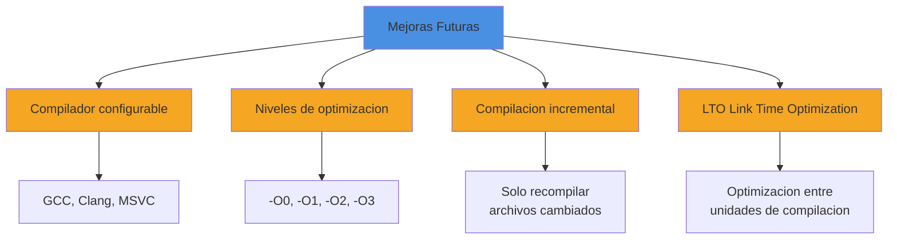

### Compilacion Incremental

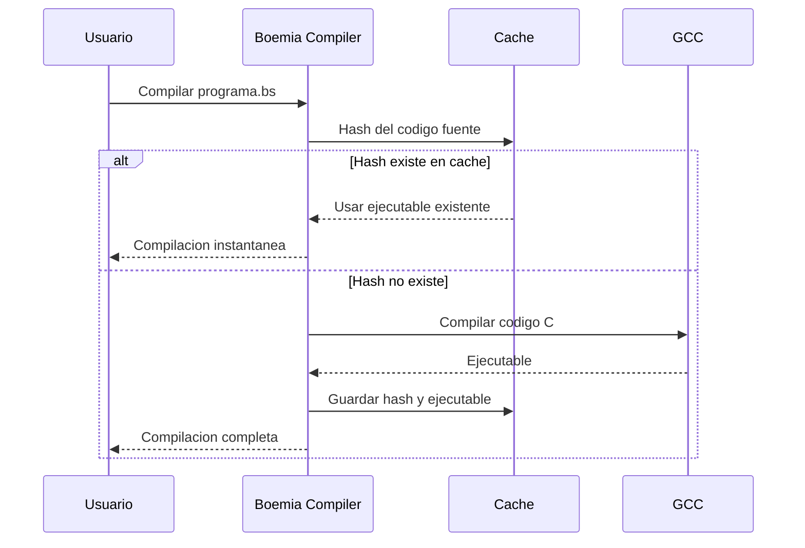

### Soporte para Static/Dynamic Linking

```bash
# Static (ejecutable independiente)
boemia-compiler programa.bs -o output --static

# Dynamic (requiere libc compartido)
boemia-compiler programa.bs -o output --dynamic
```

## Diagnosticos Mejorados

### Mapping de Errores C a Boemia

**Problema actual**: Los errores de GCC muestran lineas del codigo C, no del codigo Boemia.

**Mejora futura**: Mapear errores:

```
GCC: build/output.c:5:34: error: use of undeclared identifier 'y'

Boemia: programa.bs:3:7: error: variable 'y' not declared
  print(y);
        ^
```

**Implementacion**: Generar comentarios en C con lineas originales:
```c
// Line 3 in programa.bs
printf("%lld\n", (long long)y);
```

## Seguridad

### Validacion de Paths

```zig
// Prevenir path traversal
fn sanitizePath(path: []const u8) ![]const u8 {
    if (std.mem.indexOf(u8, path, "..") != null) {
        return error.InvalidPath;
    }
    return path;
}
```

### Sandbox de Compilacion

**Mejora futura**: Compilar en ambiente aislado:
- Limitar uso de memoria de GCC
- Timeout de compilacion
- Restricciones de filesystem

## Referencias

- [Code Generator](07-CODEGEN.md) - Generacion de codigo C
- [Build System](18-BUILD-SYSTEM.md) - Sistema de build completo
- [Testing](19-TESTING.md) - Testing del compilador
