# Sistema de Tipos

## Introduccion

El sistema de tipos de Boemia Script es estatico, fuertemente tipado y explicito. Cada variable debe declararse con un tipo que se verifica en tiempo de compilacion.

## Filosofia del Sistema de Tipos

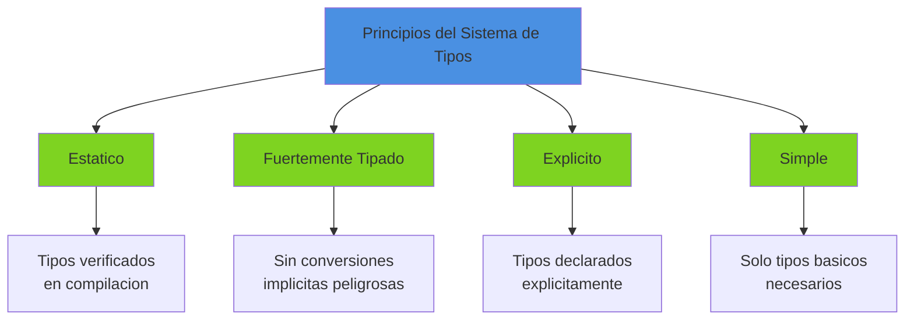

## Tipos de Datos

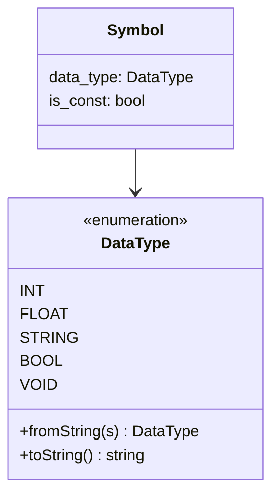

### Tipos Primitivos

| Tipo | Descripcion | Tamano | Valores | Uso |
|------|-------------|--------|---------|-----|
| `int` | Entero con signo | 64 bits | -2^63 a 2^63-1 | Numeros enteros, contadores |
| `float` | Punto flotante | 64 bits | IEEE 754 double | Numeros decimales, cientificos |
| `string` | Cadena de texto | Variable | Secuencia de chars | Texto, mensajes |
| `bool` | Booleano | 1 byte | true, false | Condiciones, flags |
| `void` | Sin valor | 0 | - | Funciones sin retorno |

### Representacion en Memoria

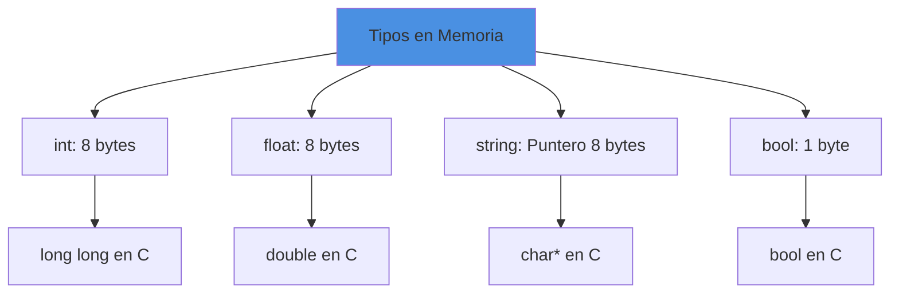

## Declaracion de Tipos

### Sintaxis de Declaracion

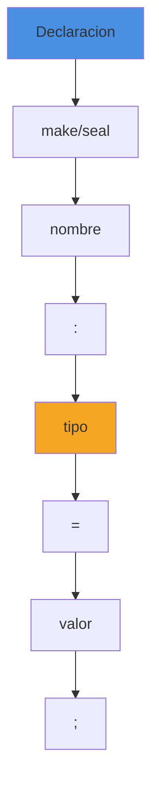

**Ejemplos**:
```boemia
let x: int = 42;
let pi: float = 3.14159;
let nombre: string = "Boemia";
let activo: bool = true;
const CONSTANTE: int = 100;
```

### Tipo Explicito vs Inferido

**Actual (Explicito)**:
```boemia
let x: int = 5;  // Tipo debe declararse
```

**Futuro (Inferencia)**:
```boemia
make x = 5;  // Tipo inferido como int
```

## Verificacion de Tipos

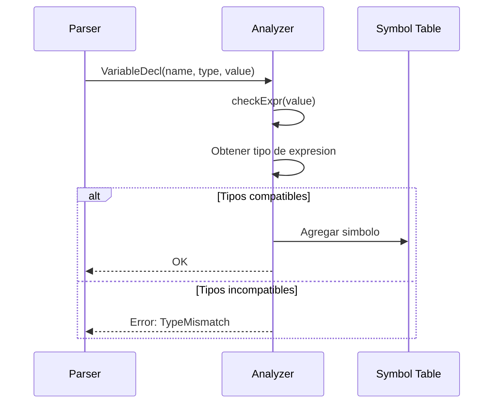

### Reglas de Compatibilidad

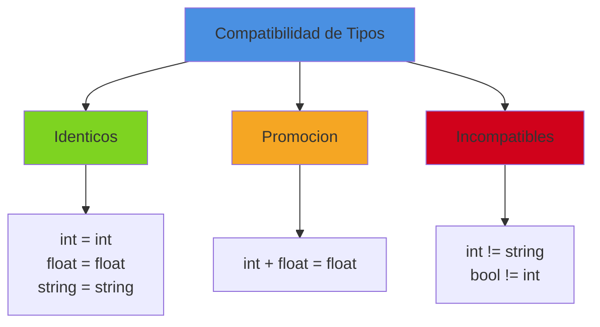

## Operaciones por Tipo

### Operaciones Aritmeticas

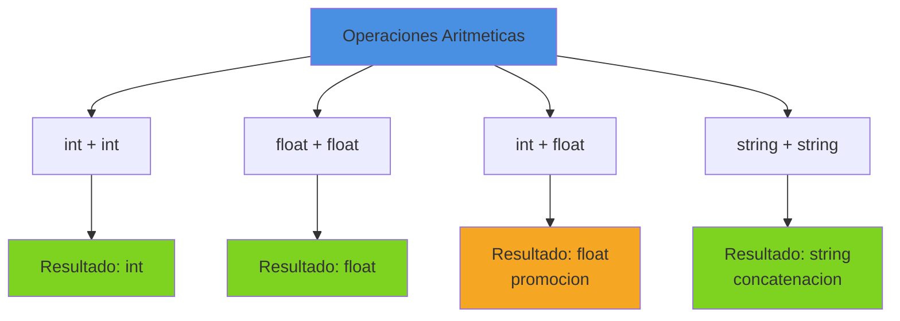

**Tabla de Operaciones**:

| Operador | int | float | string | bool | Resultado |
|----------|-----|-------|--------|------|-----------|
| `+` | Si | Si | Si (concat) | No | Mismo tipo o float |
| `-` | Si | Si | No | No | Mismo tipo o float |
| `*` | Si | Si | No | No | Mismo tipo o float |
| `/` | Si | Si | No | No | Mismo tipo o float |

**Ejemplos**:
```boemia
let a: int = 5 + 3;           // int: 8
let b: float = 2.5 + 1.5;     // float: 4.0
let c: float = 5 + 2.5;       // float: 7.5 (promocion)
let d: string = "Hola" + " Mundo";  // string: "Hola Mundo"
```

### Operaciones de Comparacion

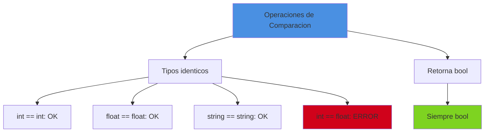

**Tabla de Comparaciones**:

| Operador | Operandos | Resultado | Notas |
|----------|-----------|-----------|-------|
| `==`, `!=` | Mismo tipo | bool | Igualdad/desigualdad |
| `<`, `>`, `<=`, `>=` | Mismo tipo numerico o string | bool | Ordenamiento |

**Ejemplos**:
```boemia
let x: int = 5;
let y: int = 10;
let resultado: bool = x < y;        // true
let igual: bool = x == 5;           // true
let diferente: bool = x != y;       // true

let nombre: string = "Ana";
let otro: string = "Zoe";
let orden: bool = nombre < otro;    // true (orden lexicografico)
```

### Operaciones Logicas

```mermaid
graph TB
    A[Operaciones Logicas] --> B[Solo bool]
    B --> C[Resultado: bool]

    C --> D[true && true: true]
    C --> E[true || false: true]
    C --> F[!true: false]

    style A fill:#4a90e2
    style C fill:#7ed321
```

**Nota actual**: Boemia actualmente no implementa `&&`, `||`, solo `!` (NOT).

**Mejora futura**: Agregar operadores logicos.

## Promocion de Tipos

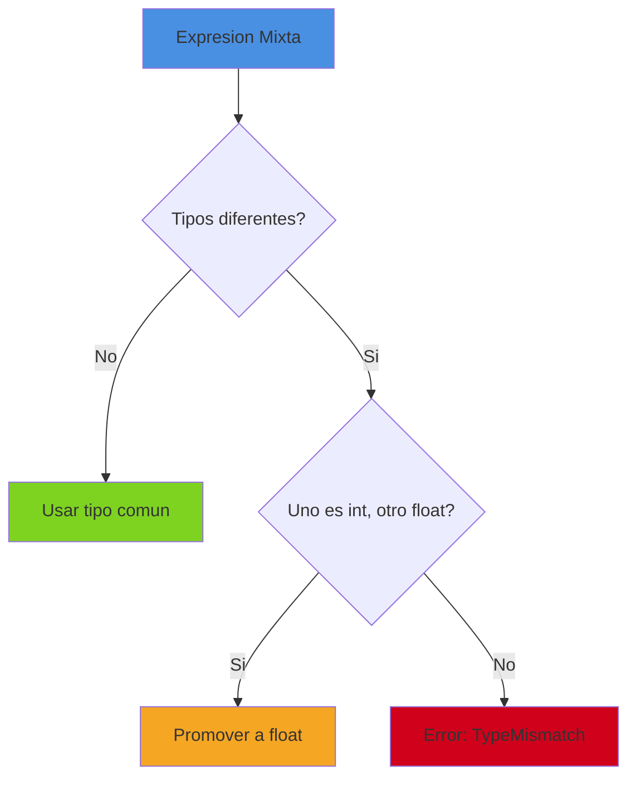

**Regla de Promocion**: En operaciones aritmeticas, si un operando es `int` y el otro es `float`, el `int` se promueve a `float`.

### Ejemplos de Promocion

```boemia
let a: int = 5;
let b: float = 2.5;
let c: float = a + b;  // a promovido a float, resultado: 7.5

let x: int = 10;
let y: float = x / 3.0;  // x promovido a float, resultado: 3.333...
```

**Implementacion en el Analyzer**:
```zig
switch (bin.operator) {
    .ADD, .SUB, .MUL, .DIV => {
        if (left_type == .INT and right_type == .INT) {
            break :blk .INT;
        } else if (left_type == .FLOAT and right_type == .FLOAT) {
            break :blk .FLOAT;
        } else if ((left_type == .INT or left_type == .FLOAT) and
                   (right_type == .INT or right_type == .FLOAT)) {
            break :blk .FLOAT;  // Promocion
        }
        return AnalyzerError.InvalidOperation;
    },
}
```

## Constantes (seal)

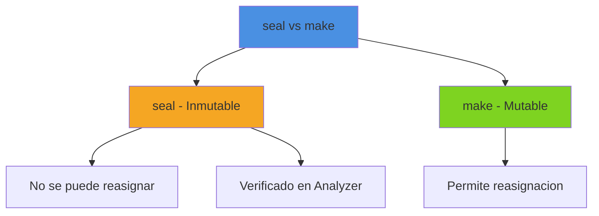

### Declaracion de Constantes

```boemia
const PI: float = 3.14159;
const MAX_SIZE: int = 1000;
const NOMBRE: string = "Boemia Script";
```

### Verificacion de Inmutabilidad

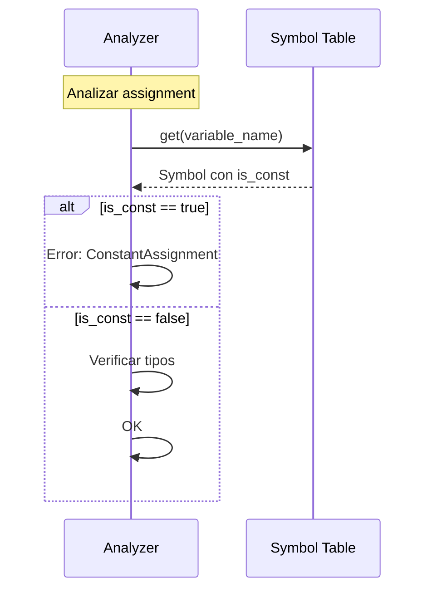

**Codigo de verificacion**:
```zig
const symbol = self.symbol_table.get(assign.name) orelse {
    return AnalyzerError.UndefinedVariable;
};

if (symbol.is_const) {
    const err = try std.fmt.allocPrint(
        self.allocator,
        "Cannot assign to constant '{s}'",
        .{assign.name},
    );
    try self.errors.append(self.allocator, err);
    return AnalyzerError.ConstantAssignment;
}
```

**Ejemplo de error**:
```boemia
const PI: float = 3.14;
PI = 3.15;  // Error: Cannot assign to constant 'PI'
```

## Tipo Void

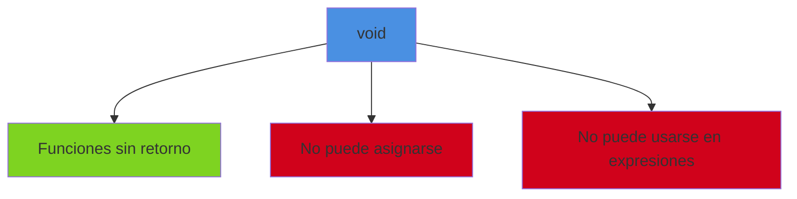

**Uso de void**:
```boemia
fn mostrarMensaje(texto: string): void {
    print(texto);
    // No retorna valor
}
```

**No valido**:
```boemia
make x: void = algo();  // Error: void no puede asignarse
```

## Coercion y Casting

### Estado Actual: Sin Coercion Implicita

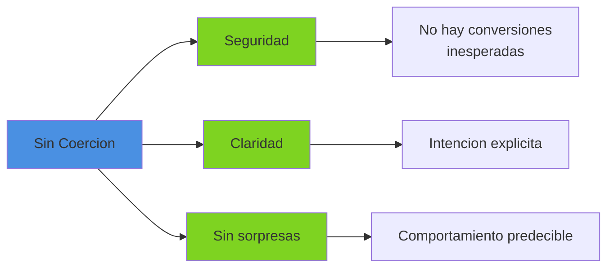

**No permitido**:
```boemia
let x: int = 5;
let y: float = x;  // Error: TypeMismatch
```

### Mejora Futura: Casting Explicito

```boemia
let x: int = 5;
let y: float = float(x);  // Casting explicito

let z: int = int(3.14);   // z = 3
```

**Sintaxis propuesta**:
```
cast_expr := TYPE '(' expression ')'
```

## Tabla de Simbolos y Tipos

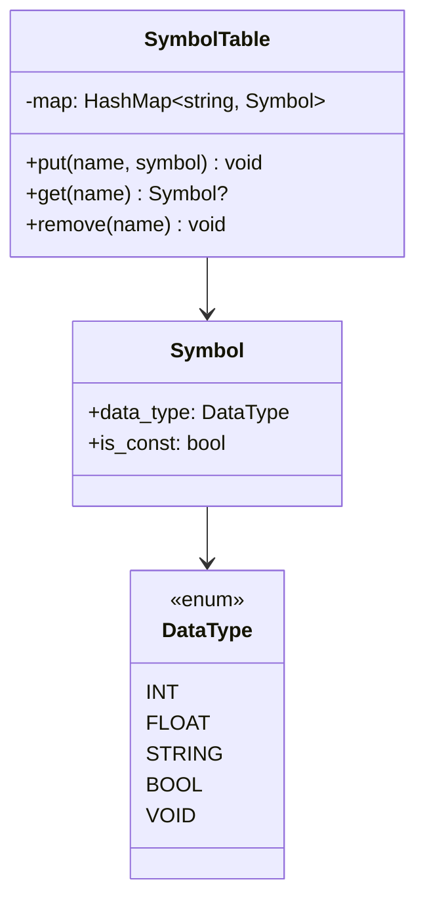

### Ejemplo de Tabla de Simbolos

```boemia
let x: int = 5;
const PI: float = 3.14;
let nombre: string = "Hola";
```

**Tabla interna**:
```
Symbol Table:
  "x"      -> Symbol { data_type: INT,    is_const: false }
  "PI"     -> Symbol { data_type: FLOAT,  is_const: true  }
  "nombre" -> Symbol { data_type: STRING, is_const: false }
```

## Verificacion de Tipos en Expresiones

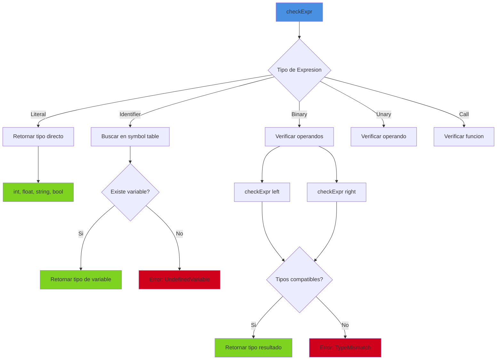

### Inferencia de Tipos en Expresiones

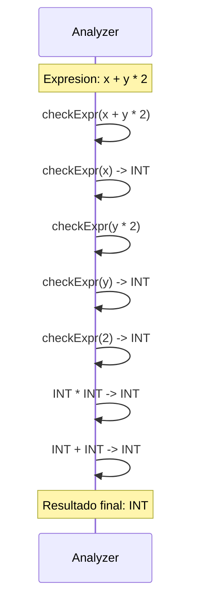

## Errores de Tipos

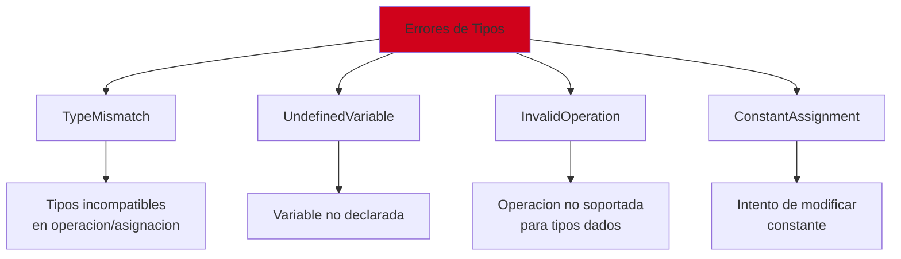

### Ejemplos de Errores

**TypeMismatch**:
```boemia
let x: int = "texto";
// Error: Type mismatch: cannot assign string to int

let a: int = 5;
let b: string = "10";
let c: int = a + b;
// Error: Invalid operation: int ADD string
```

**UndefinedVariable**:
```boemia
print(variable_no_declarada);
// Error: Undefined variable 'variable_no_declarada'
```

**InvalidOperation**:
```boemia
let texto: string = "Hola";
let numero: int = texto * 2;
// Error: Invalid operation: string MUL int
```

**ConstantAssignment**:
```boemia
const MAX: int = 100;
MAX = 200;
// Error: Cannot assign to constant 'MAX'
```

## Mejoras Futuras

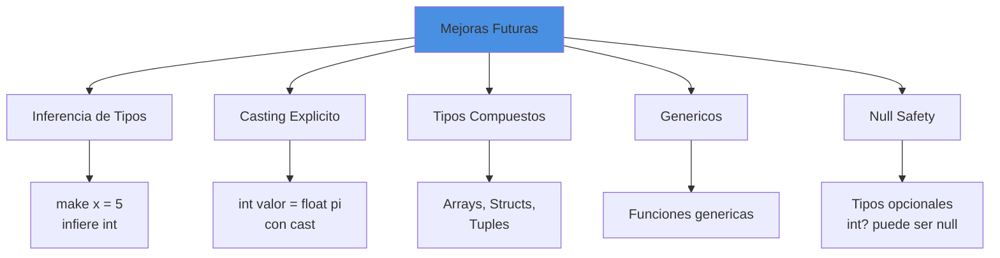

### Inferencia de Tipos

```boemia
// Actual
let x: int = 5;

// Futuro
make x = 5;  // Tipo inferido: int
make y = 3.14;  // Tipo inferido: float
make z = "Hola";  // Tipo inferido: string
```

### Tipos Compuestos

```boemia
// Arrays
make numeros: []int = [1, 2, 3, 4, 5];

// Structs
struct Persona {
    nombre: string,
    edad: int
}

make juan: Persona = Persona{
    nombre: "Juan",
    edad: 30
};

// Tuples
make punto: (int, int) = (10, 20);
```

### Null Safety

```boemia
// Tipos opcionales
let nombre: string? = null;  // Puede ser string o null
let edad: int? = 25;

// Verificacion
if nombre != null {
    print(nombre);
}
```

## Comparacion con Otros Lenguajes

| Caracteristica | Boemia | Python | JavaScript | Rust | C |
|----------------|--------|--------|------------|------|---|
| Tipado | Estatico | Dinamico | Dinamico | Estatico | Estatico |
| Fuerza | Fuerte | Fuerte | Debil | Muy fuerte | Debil |
| Inferencia | No | Si | No | Si | No |
| Null safety | No | No | No | Si | No |
| Generics | No | Si | No | Si | No |

## Performance del Sistema de Tipos

| Operacion | Complejidad | Razon |
|-----------|-------------|-------|
| Buscar tipo de variable | O(1) | HashMap |
| Verificar compatibilidad | O(1) | Comparacion simple |
| Analizar expresion | O(n) | n = profundidad |
| Promocion de tipos | O(1) | Regla fija |

## Referencias

- [Analyzer](06-ANALYZER.md) - Analisis semantico y verificacion de tipos
- [AST Structure](13-AST-STRUCTURE.md) - Estructura del AST
- [Operators Reference](21-OPERATORS-REFERENCE.md) - Referencia de operadores
