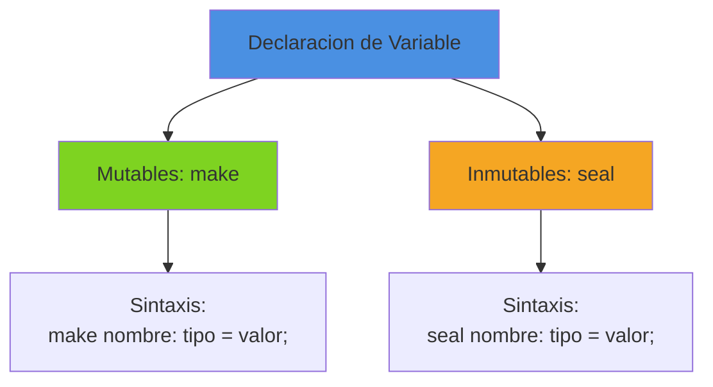
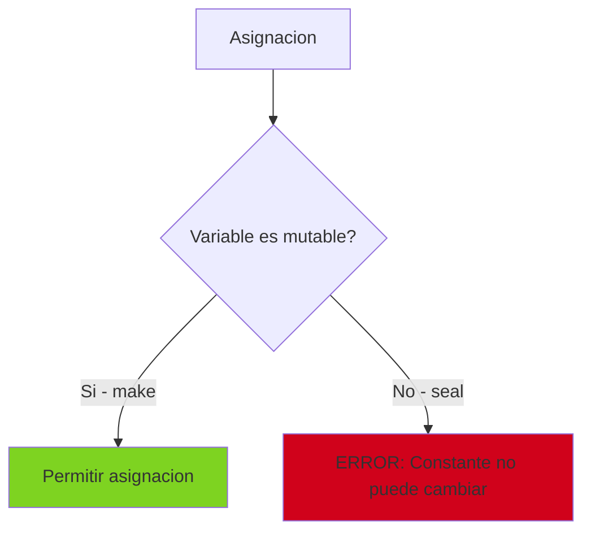
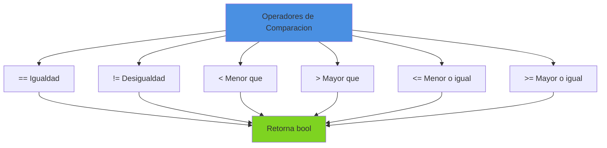
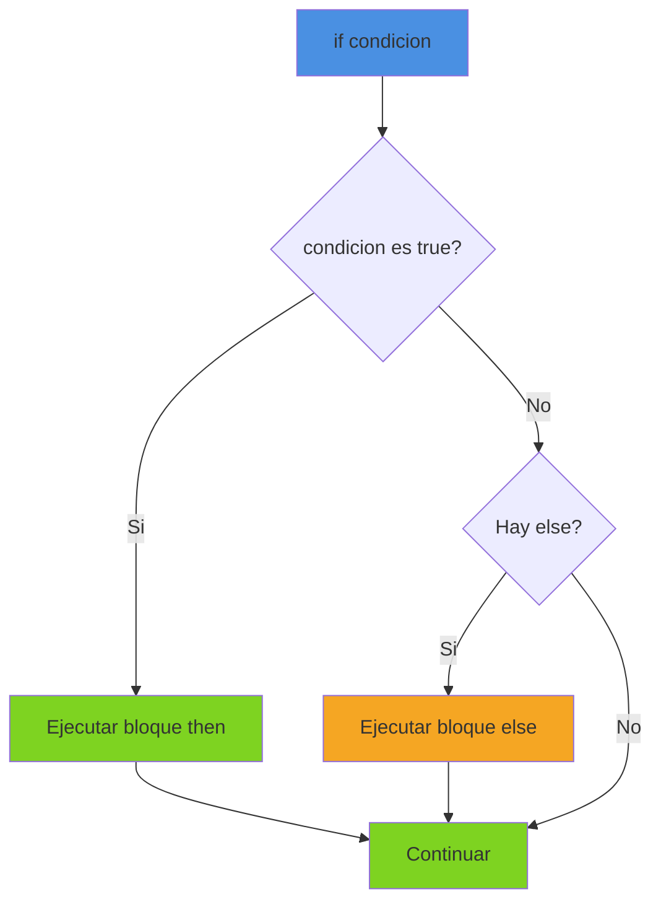
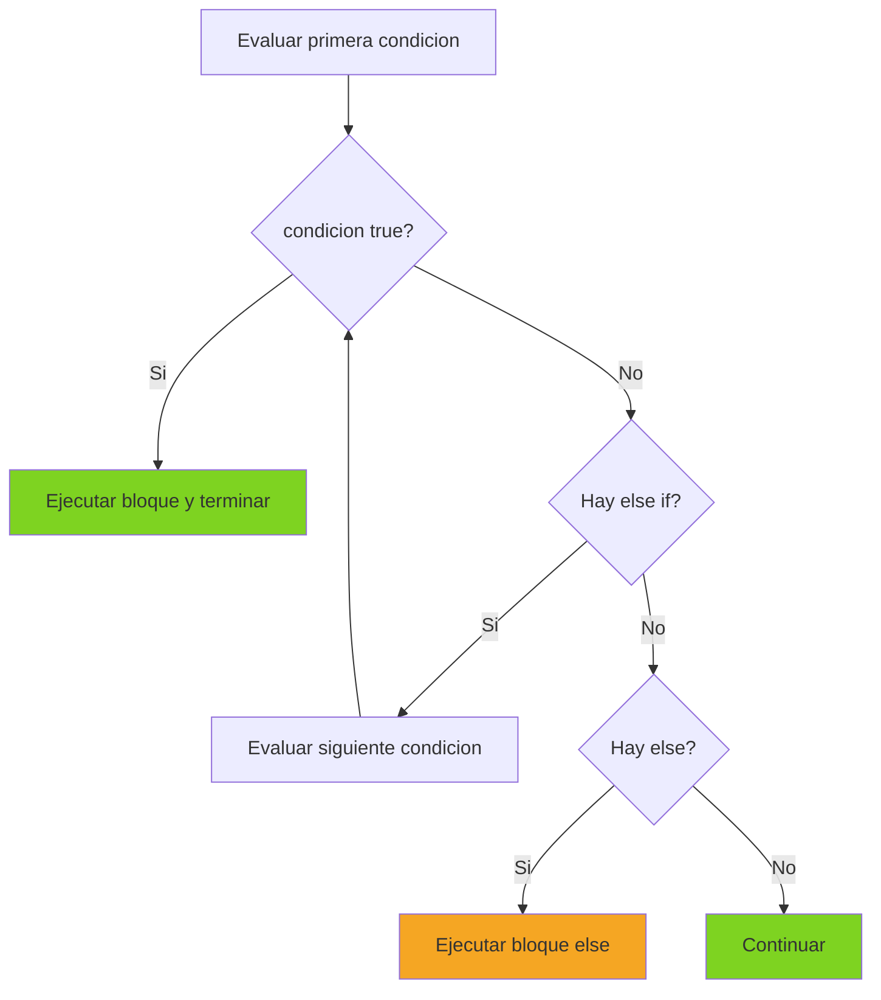
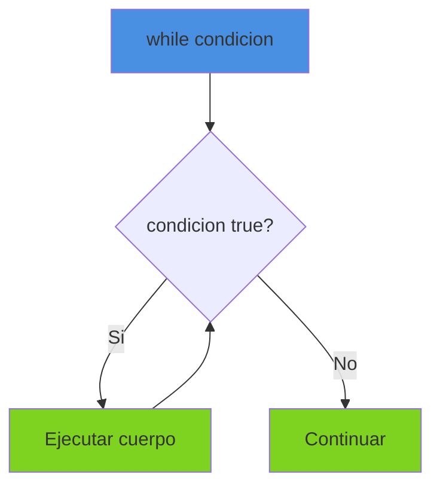
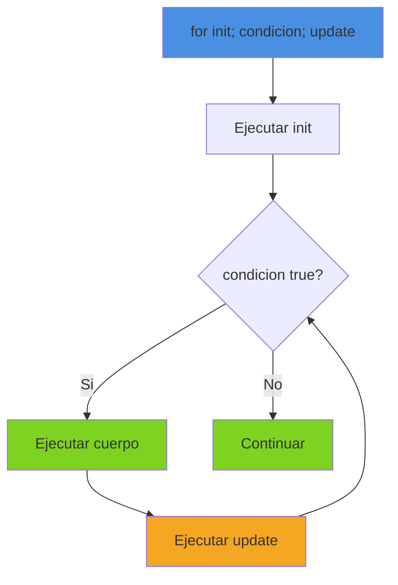
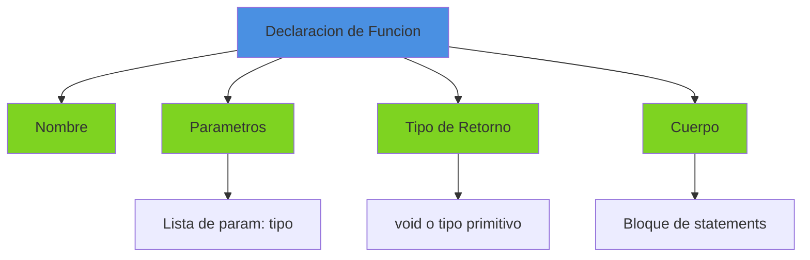
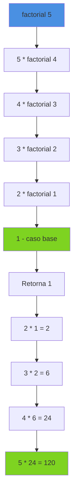
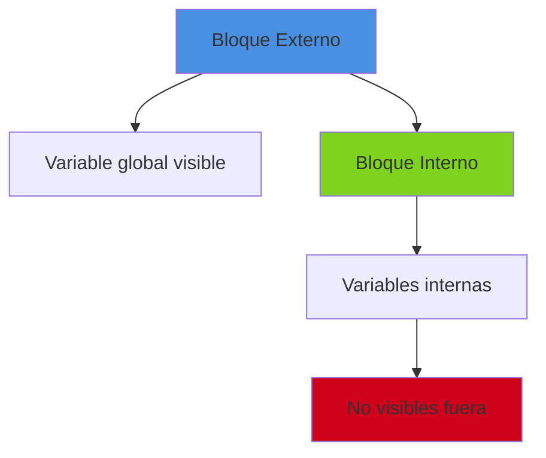

# Sintaxis del Lenguaje Boemia Script

## Introduccion

Este documento describe la sintaxis completa del lenguaje de programacion Boemia Script, incluyendo todas las construcciones sintacticas, reglas gramaticales y ejemplos practicos.

## Gramatica del Lenguaje

### Notacion BNF

```
<program> ::= <statement>*

<statement> ::= <variable_decl>
              | <assignment>
              | <if_statement>
              | <while_statement>
              | <for_statement>
              | <function_decl>
              | <return_statement>
              | <print_statement>
              | <expression_statement>
              | <block>

<variable_decl> ::= ("make" | "seal") <identifier> ":" <type> "=" <expression> ";"

<assignment> ::= <identifier> "=" <expression> ";"

<if_statement> ::= "if" <expression> "{" <statement>* "}"
                   ("else" "if" <expression> "{" <statement>* "}")*
                   ("else" "{" <statement>* "}")?

<while_statement> ::= "while" <expression> "{" <statement>* "}"

<for_statement> ::= "for" <identifier> ":" <type> "=" <expression> ";"
                    <expression> ";" <assignment> "{" <statement>* "}"

<function_decl> ::= "fn" <identifier> "(" <parameters>? ")" ":" <type>
                    "{" <statement>* "}"

<return_statement> ::= "return" <expression>? ";"

<print_statement> ::= "print" "(" <expression> ")" ";"

<expression_statement> ::= <expression> ";"

<block> ::= "{" <statement>* "}"

<expression> ::= <primary>
               | <expression> <binary_op> <expression>
               | <unary_op> <expression>
               | <identifier> "(" <arguments>? ")"

<primary> ::= <integer>
            | <float>
            | <string>
            | <boolean>
            | <identifier>
            | "(" <expression> ")"

<type> ::= "int" | "float" | "string" | "bool" | "void"

<binary_op> ::= "+" | "-" | "*" | "/" | "==" | "!=" | "<" | ">" | "<=" | ">="

<unary_op> ::= "-" | "!"
```

## Declaraciones

### Declaracion de Variables



#### Variables Mutables (make)

Variables que pueden cambiar su valor durante la ejecucion.

```boemia
let x: int = 10;
let nombre: string = "Boemia";
let activo: bool = true;
let pi: float = 3.14159;
```

**Reglas**:
- Declaradas con la palabra clave `make`
- Requieren tipo explicito
- Deben ser inicializadas en la declaracion
- Pueden ser reasignadas posteriormente

#### Constantes Inmutables (seal)

Variables cuyo valor no puede cambiar despues de la inicializacion.

```boemia
const MAX_USERS: int = 100;
const PI: float = 3.14159265;
const APP_NAME: string = "Boemia Script";
```

**Reglas**:
- Declaradas con la palabra clave `seal`
- No pueden ser reasignadas
- El compilador genera error si se intenta modificar

### Asignacion

```boemia
let x: int = 5;
x = 10;              // Valido: x es mutable
x = x + 5;           // Valido

const y: int = 20;
y = 30;              // ERROR: y es inmutable
```



## Tipos de Datos

```mermaid
graph TB
    A[Tipos Primitivos] --> B[int<br/>Enteros de 64 bits]
    A --> C[float<br/>Decimales de 64 bits]
    A --> D[string<br/>Cadenas de texto]
    A --> E[bool<br/>Booleanos]
    A --> F[void<br/>Sin tipo de retorno]

    B --> B1[Ejemplo: 42, -100, 0]
    C --> C1[Ejemplo: 3.14, -2.5, 0.001]
    D --> D1[Ejemplo: "hola", "mundo"]
    E --> E1[Ejemplo: true, false]

    style A fill:#4a90e2
    style B fill:#7ed321
    style C fill:#7ed321
    style D fill:#7ed321
    style E fill:#7ed321
    style F fill:#7ed321
```

### int - Enteros

```boemia
let edad: int = 25;
let temperatura: int = -15;
let contador: int = 0;
```

Rango: -9,223,372,036,854,775,808 a 9,223,372,036,854,775,807 (64 bits)

### float - Decimales

```boemia
let pi: float = 3.14159;
let altura: float = 1.75;
let temperatura: float = -3.5;
```

Precision: Double precision IEEE 754 (64 bits)

### string - Cadenas

```boemia
let mensaje: string = "Hola Mundo";
let nombre: string = "Boemia Script";
let vacio: string = "";
```

**Caracteristicas**:
- Delimitadas por comillas dobles `"`
- Soportan multi-linea
- Inmutables (el contenido no puede cambiar)

### bool - Booleanos

```boemia
let activo: bool = true;
let completado: bool = false;
let encontrado: bool = 10 > 5;
```

Valores: `true` o `false`

## Expresiones

### Expresiones Aritmeticas

```mermaid
graph LR
    A[Operadores Aritmeticos] --> B[+ Suma]
    A --> C[- Resta]
    A --> D[* Multiplicacion]
    A --> E[/ Division]

    style A fill:#4a90e2
    style B fill:#7ed321
    style C fill:#7ed321
    style D fill:#7ed321
    style E fill:#7ed321
```

```boemia
let suma: int = 5 + 3;              // 8
let resta: int = 10 - 4;            // 6
let multiplicacion: int = 6 * 7;    // 42
let division: int = 20 / 4;         // 5

let compleja: int = (5 + 3) * 2;    // 16
let anidada: int = 10 + (5 * (3 - 1));  // 20
```

#### Precedencia de Operadores

| Precedencia | Operadores | Asociatividad |
|-------------|------------|---------------|
| 1 (Mayor) | `*`, `/` | Izquierda |
| 2 | `+`, `-` | Izquierda |
| 3 | `<`, `>`, `<=`, `>=` | Izquierda |
| 4 (Menor) | `==`, `!=` | Izquierda |

```boemia
let resultado: int = 2 + 3 * 4;     // 14, no 20
let resultado2: int = (2 + 3) * 4;  // 20
```

### Expresiones de Comparacion



```boemia
let igual: bool = 5 == 5;           // true
let diferente: bool = 5 != 3;       // true
let menor: bool = 3 < 5;            // true
let mayor: bool = 10 > 5;           // true
let menorIgual: bool = 5 <= 5;      // true
let mayorIgual: bool = 10 >= 5;     // true
```

### Concatenacion de Strings

```boemia
let saludo: string = "Hola" + " " + "Mundo";  // "Hola Mundo"
let nombre: string = "Juan";
let mensaje: string = "Hola " + nombre;       // "Hola Juan"
```

## Estructuras de Control

### Condicionales if/else



#### if Simple

```boemia
let x: int = 10;

if x > 5 {
    print("x es mayor que 5");
}
```

#### if-else

```boemia
let edad: int = 18;

if edad >= 18 {
    print("Es mayor de edad");
} else {
    print("Es menor de edad");
}
```

#### if-else if-else (Cascada)

```boemia
let nota: int = 85;

if nota >= 90 {
    print("A");
} else if nota >= 80 {
    print("B");
} else if nota >= 70 {
    print("C");
} else if nota >= 60 {
    print("D");
} else {
    print("F");
}
```

**Flujo de Ejecucion**:



#### if Anidados

```boemia
let edad: int = 25;
let tieneLicencia: bool = true;

if edad >= 18 {
    if tieneLicencia == true {
        print("Puede conducir");
    } else {
        print("Necesita obtener licencia");
    }
} else {
    print("Muy joven para conducir");
}
```

### Bucle while



```boemia
let contador: int = 0;

while contador < 5 {
    print(contador);
    contador = contador + 1;
}
// Imprime: 0, 1, 2, 3, 4
```

**Importante**: La condicion se evalua ANTES de cada iteracion. Si es falsa desde el inicio, el cuerpo nunca se ejecuta.

### Bucle for



```boemia
for i: int = 0; i < 10; i = i + 1 {
    print(i);
}
// Imprime: 0, 1, 2, 3, 4, 5, 6, 7, 8, 9
```

**Componentes**:
1. **Inicializacion**: `i: int = 0` - Se ejecuta una vez al inicio
2. **Condicion**: `i < 10` - Se evalua antes de cada iteracion
3. **Actualizacion**: `i = i + 1` - Se ejecuta despues de cada iteracion

#### for Anidados

```boemia
for x: int = 1; x <= 3; x = x + 1 {
    for y: int = 1; y <= 3; y = y + 1 {
        let producto: int = x * y;
        print(producto);
    }
}
```

## Funciones



### Sintaxis

```boemia
fn nombreFuncion(param1: tipo1, param2: tipo2): tipoRetorno {
    // cuerpo
    return valor;
}
```

### Funciones sin Parametros

```boemia
fn saludar(): void {
    print("Hola Mundo");
}

saludar();  // Llamada
```

### Funciones con Parametros

```boemia
fn suma(a: int, b: int): int {
    return a + b;
}

let resultado: int = suma(5, 3);  // 8
print(resultado);
```

### Funciones con Multiples Parametros

```boemia
fn calcularPromedio(a: int, b: int, c: int): float {
    let suma: int = a + b + c;
    return suma / 3;
}

let prom: float = calcularPromedio(10, 20, 30);
```

### Recursion

```boemia
fn factorial(n: int): int {
    if n <= 1 {
        return 1;
    }
    return n * factorial(n - 1);
}

let resultado: int = factorial(5);  // 120
print(resultado);
```

**Flujo de Recursion**:



## Sentencia print

```boemia
print(expresion);
```

**Caracteristicas**:
- Detecta automaticamente el tipo de la expresion
- Agrega salto de linea automaticamente
- Soporta cualquier tipo primitivo

```boemia
let x: int = 42;
print(x);                    // 42

let pi: float = 3.14;
print(pi);                   // 3.140000

let mensaje: string = "Hola";
print(mensaje);              // Hola

let activo: bool = true;
print(activo);               // true

print(10 + 5);               // 15
print("Suma: " + "total");   // Suma: total
```

## Comentarios

```boemia
// Esto es un comentario de una linea

let x: int = 42;  // Comentario al final de linea

// Los comentarios son ignorados por el compilador
// Pueden usarse para documentar el codigo
```

**Reglas**:
- Comienzan con `//`
- Se extienden hasta el final de la linea
- No existen comentarios multi-linea (por ahora)

## Bloques de Codigo

```boemia
{
    let x: int = 10;
    print(x);
}
// x no existe fuera del bloque
```



## Ejemplos Completos

### Ejemplo 1: Calculadora Simple

```boemia
let a: int = 10;
let b: int = 5;

let suma: int = a + b;
let resta: int = a - b;
let mult: int = a * b;
let div: int = a / b;

print(suma);   // 15
print(resta);  // 5
print(mult);   // 50
print(div);    // 2
```

### Ejemplo 2: Numeros Pares

```boemia
for i: int = 1; i <= 10; i = i + 1 {
    if i % 2 == 0 {
        print(i);
    }
}
// Imprime: 2, 4, 6, 8, 10
```

### Ejemplo 3: Fibonacci

```boemia
fn fibonacci(n: int): int {
    if n <= 1 {
        return n;
    }
    return fibonacci(n - 1) + fibonacci(n - 2);
}

for i: int = 0; i < 10; i = i + 1 {
    let fib: int = fibonacci(i);
    print(fib);
}
// Imprime: 0, 1, 1, 2, 3, 5, 8, 13, 21, 34
```

## Reglas Lexicas

### Identificadores

**Reglas**:
- Empiezan con letra (a-z, A-Z) o underscore (_)
- Pueden contener letras, digitos (0-9) y underscores
- Case-sensitive: `contador` != `Contador`
- No pueden ser palabras reservadas

**Validos**:
```
x
contador
miVariable
_privado
valor2
suma_total
```

**Invalidos**:
```
2variable   // Empieza con digito
mi-variable // Contiene guion
make        // Palabra reservada
```

### Espacios en Blanco

Espacios, tabs y saltos de linea se ignoran, excepto:
- Dentro de strings
- Para separar tokens

```boemia
let x:int=5;           // Valido
let    x   :   int   =   5   ;    // Valido (equivalente)
```

## Palabras Reservadas

Lista completa de palabras que no pueden usarse como identificadores:

```
make    seal    fn      return
if      else    while   for
print   true    false
int     float   string  bool
```

## Limitaciones Actuales

1. No soporta arrays
2. No soporta structs/objetos
3. No tiene sistema de modulos
4. No tiene manejo de errores (try/catch)
5. Comentarios solo de una linea
6. Strings inmutables

## Proximos Pasos

Ver [Sistema de Tipos](09-TYPE-SYSTEM.md) para detalles sobre verificacion de tipos.
Ver [Ejemplos Practicos](17-EXAMPLES.md) para mas casos de uso.
