# Estructuras de Control

## Introduccion

Las estructuras de control permiten alterar el flujo secuencial de ejecucion de un programa. Boemia Script soporta condicionales (if/else) y bucles (while, for).

## If Statement

### Sintaxis

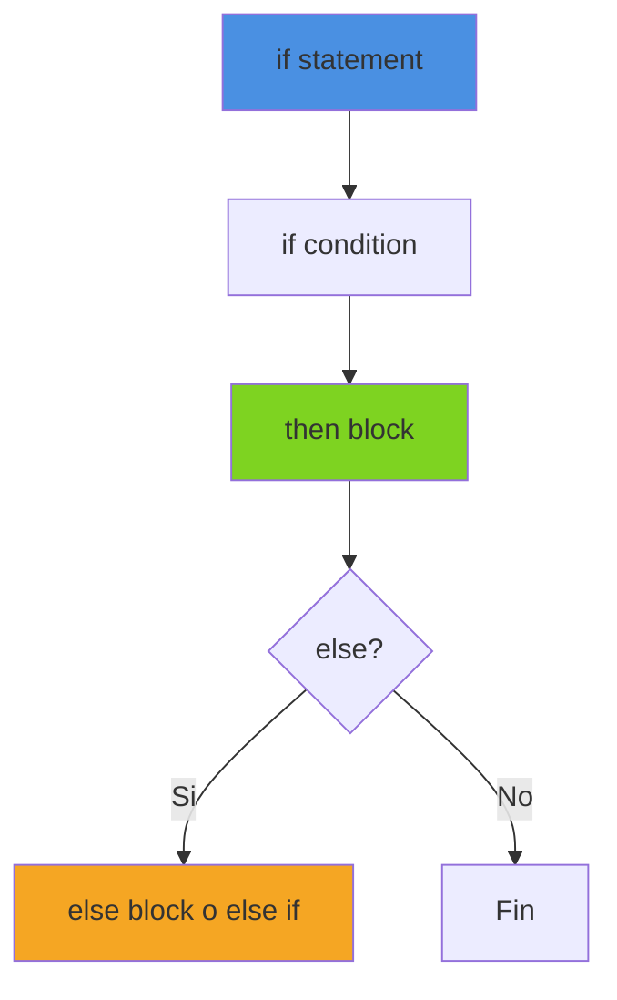

**Gramatica**:
```
if_stmt := 'if' expression '{' block '}' ('else' (if_stmt | '{' block '}'))?
```

**Sintaxis basica**:
```boemia
if condition {
    // codigo si verdadero
}
```

**Con else**:
```boemia
if condition {
    // codigo si verdadero
} else {
    // codigo si falso
}
```

**Else if (encadenado)**:
```boemia
if condition1 {
    // codigo si condition1 es verdadero
} else if condition2 {
    // codigo si condition2 es verdadero
} else {
    // codigo si ambas son falsas
}
```

### Ejemplos

**If simple**:
```boemia
make x: int = 10;

if x > 5 {
    print(x);
}
```

**If-else**:
```boemia
make edad: int = 18;

if edad >= 18 {
    print("Mayor de edad");
} else {
    print("Menor de edad");
}
```

**If-else if-else**:
```boemia
make nota: int = 85;

if nota >= 90 {
    print("A");
} else if nota >= 80 {
    print("B");
} else if nota >= 70 {
    print("C");
} else {
    print("F");
}
```

### Condiciones

Las condiciones deben ser expresiones de tipo `bool`:

```boemia
// Valido: comparaciones
if x > 5 { }
if x == y { }
if nombre != "Juan" { }

// Valido: literales booleanos
if true { }
if false { }

// Valido: variables booleanas
make activo: bool = true;
if activo { }

// Invalido: tipos no booleanos
if 5 { }           // Error: tipo int no es bool
if "texto" { }     // Error: tipo string no es bool
```

### AST del If Statement

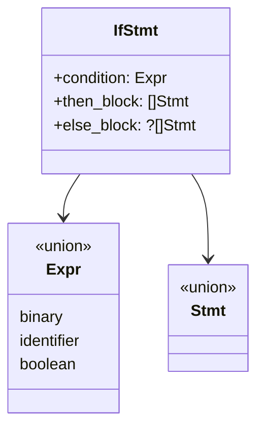

### Parsing del If

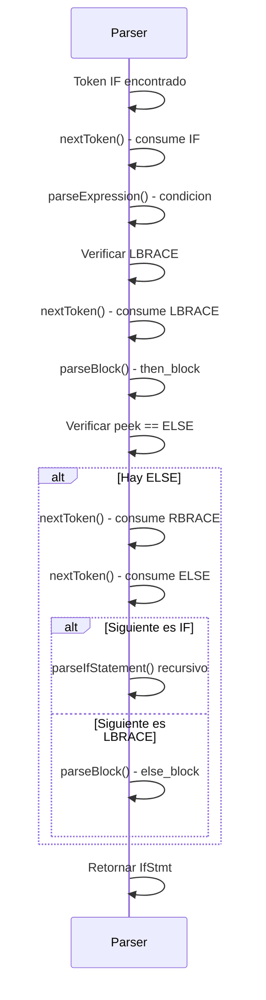

### Generacion de Codigo C

```boemia
if x > 5 {
    print(x);
} else {
    print(0);
}
```

**C generado**:
```c
if ((x > 5)) {
    printf("%lld\n", (long long)x);
} else {
    printf("%lld\n", (long long)0);
}
```

## While Statement

### Sintaxis

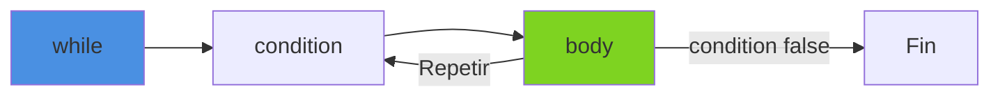

**Gramatica**:
```
while_stmt := 'while' expression '{' block '}'
```

**Sintaxis basica**:
```boemia
while condition {
    // codigo que se repite
}
```

### Ejemplos

**While simple**:
```boemia
make i: int = 0;
while i < 10 {
    print(i);
    i = i + 1;
}
```

**While con condicion compleja**:
```boemia
make x: int = 100;
make y: int = 50;

while x > y {
    x = x - 10;
    print(x);
}
```

**While infinito (hasta break - futuro)**:
```boemia
// Actualmente no soportado - sin break/continue
while true {
    // se ejecuta infinitamente
}
```

### AST del While Statement

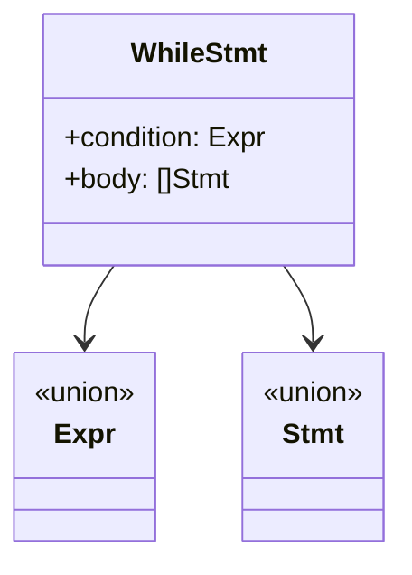

### Generacion de Codigo C

```boemia
make i: int = 0;
while i < 10 {
    print(i);
    i = i + 1;
}
```

**C generado**:
```c
long long i = 0;
while ((i < 10)) {
    printf("%lld\n", (long long)i);
    i = (i + 1);
}
```

## For Statement

### Sintaxis

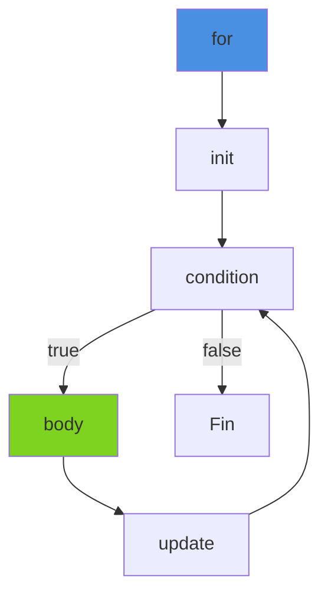

**Gramatica**:
```
for_stmt := 'for' init_stmt expression ';' update_stmt '{' block '}'
init_stmt := IDENTIFIER ':' TYPE '=' expression ';'
update_stmt := IDENTIFIER '=' expression
```

**Sintaxis basica**:
```boemia
for variable: tipo = inicio; condicion; actualizacion {
    // codigo del bucle
}
```

### Caracteristica Especial: Declaracion Inline

El for permite declarar la variable sin usar `make`:

```boemia
for i: int = 0; i < 10; i = i + 1 {
    print(i);
}
// i no existe fuera del bucle
```

### Ejemplos

**For clasico**:
```boemia
for i: int = 0; i < 10; i = i + 1 {
    print(i);
}
```

**For con paso diferente**:
```boemia
for i: int = 0; i < 100; i = i + 10 {
    print(i);  // 0, 10, 20, ..., 90
}
```

**For descendente**:
```boemia
for i: int = 10; i > 0; i = i - 1 {
    print(i);  // 10, 9, 8, ..., 1
}
```

**For con uso de variable declarada antes**:
```boemia
make contador: int = 0;
for i: int = 0; i < 5; i = i + 1 {
    contador = contador + i;
}
print(contador);  // 10 (0+1+2+3+4)
```

### AST del For Statement

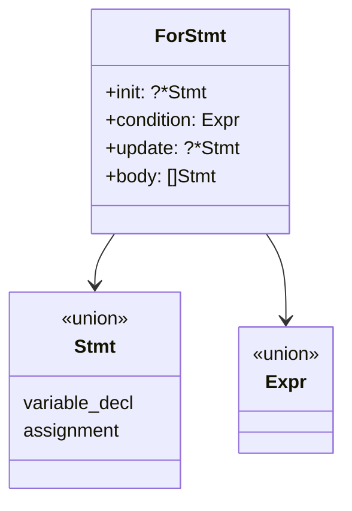

### Parsing del For

El for es mas complejo porque debe parsear:
1. Init: declaracion de variable inline
2. Condition: expresion booleana
3. Update: asignacion sin punto y coma
4. Body: bloque de statements

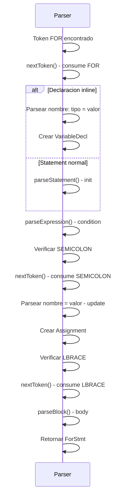

### Generacion de Codigo C

```boemia
for i: int = 0; i < 10; i = i + 1 {
    print(i);
}
```

**C generado**:
```c
for (long long i = 0; i < 10; i = (i + 1)) {
    printf("%lld\n", (long long)i);
}
```

**Nota**: La condicion se genera sin parentesis extra en el for C, pero las expresiones si se envuelven.

## Bloques

### Que es un Bloque?

Un bloque es una secuencia de statements encerrados entre llaves `{}`.

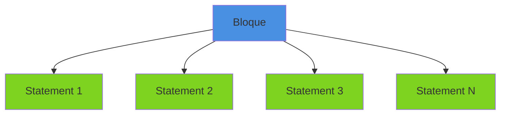

**Sintaxis**:
```boemia
{
    make x: int = 5;
    print(x);
}
```

### Scope de Bloques

Variables declaradas en un bloque solo existen dentro de ese bloque:

```boemia
if true {
    make x: int = 5;
    print(x);  // OK: x existe aqui
}
print(x);  // Error: x no existe fuera del bloque
```

**Implementacion en Analyzer**:

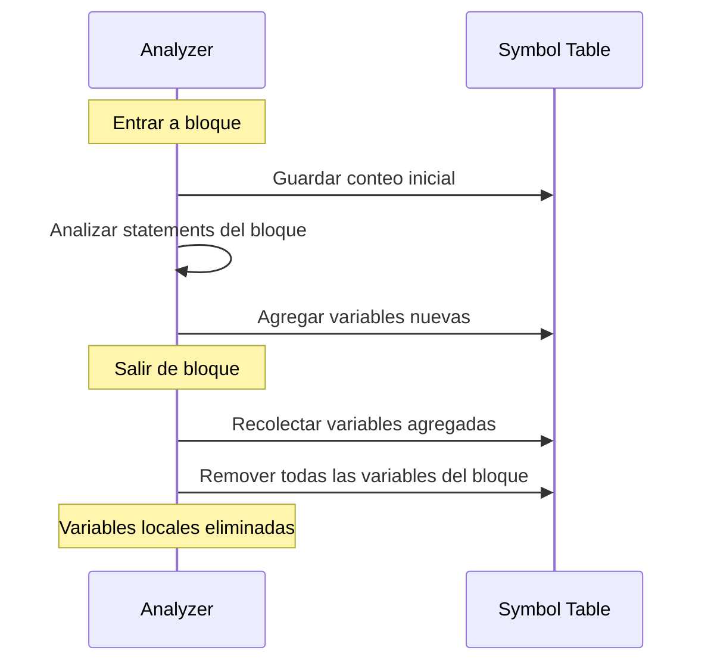

### Bloques Anidados

```boemia
if x > 0 {
    make a: int = 10;
    if y > 0 {
        make b: int = 20;
        print(a);  // OK: a existe en scope padre
        print(b);  // OK: b existe en scope actual
    }
    print(a);  // OK: a existe en este scope
    print(b);  // Error: b solo existia en bloque hijo
}
```

## Comparacion de Estructuras de Control

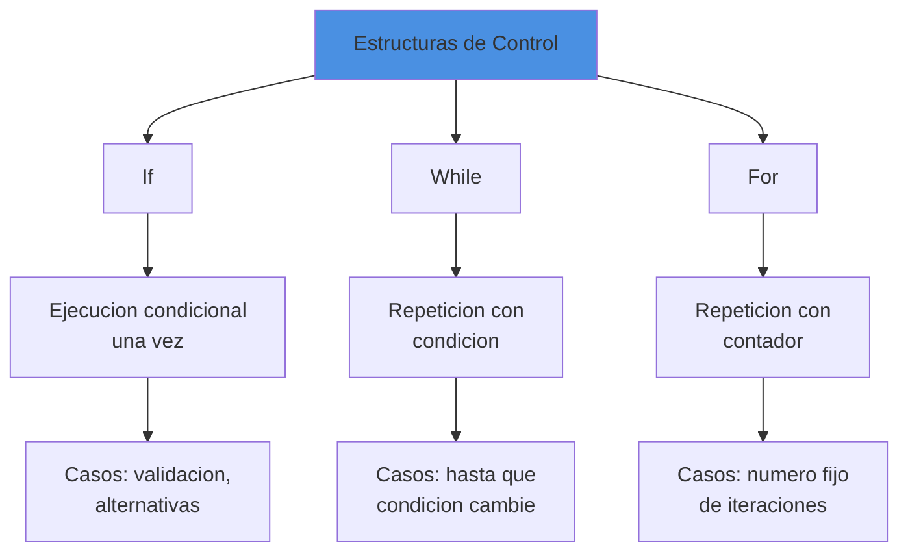

| Estructura | Uso | Ejemplo |
|------------|-----|---------|
| `if` | Decision unica | Verificar edad, validar entrada |
| `while` | Repetir hasta condicion | Leer hasta EOF, esperar input |
| `for` | Repetir N veces | Iterar 0 a N, procesar elementos |

## Ejemplos Complejos

### Factorial con While

```boemia
make n: int = 5;
make factorial: int = 1;
make i: int = 1;

while i <= n {
    factorial = factorial * i;
    i = i + 1;
}
print(factorial);  // 120
```

### Fibonacci con For

```boemia
make n: int = 10;
make a: int = 0;
make b: int = 1;

print(a);
print(b);

for i: int = 2; i < n; i = i + 1 {
    make temp: int = a + b;
    print(temp);
    a = b;
    b = temp;
}
```

### Numero Primo con If y While

```boemia
make numero: int = 17;
make es_primo: bool = true;
make divisor: int = 2;

if numero < 2 {
    es_primo = false;
} else {
    while divisor * divisor <= numero {
        if numero / divisor * divisor == numero {
            es_primo = false;
        }
        divisor = divisor + 1;
    }
}

if es_primo {
    print("Es primo");
} else {
    print("No es primo");
}
```

## Limitaciones Actuales

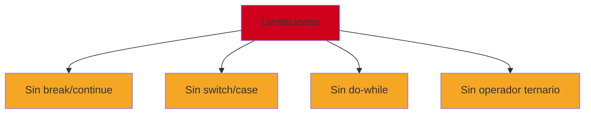

### Break y Continue (Futuro)

```boemia
// Futuro: break
for i: int = 0; i < 100; i = i + 1 {
    if i == 50 {
        break;  // Salir del bucle
    }
    print(i);
}

// Futuro: continue
for i: int = 0; i < 10; i = i + 1 {
    if i == 5 {
        continue;  // Saltar esta iteracion
    }
    print(i);  // No imprime 5
}
```

### Switch/Case (Futuro)

```boemia
// Futuro: switch
make opcion: int = 2;

switch opcion {
    case 1:
        print("Opcion uno");
    case 2:
        print("Opcion dos");
    case 3:
        print("Opcion tres");
    default:
        print("Opcion desconocida");
}
```

### Operador Ternario (Futuro)

```boemia
// Futuro: operador ternario
make resultado: int = x > 5 ? 10 : 20;
```

## Mejores Practicas

### 1. Condiciones Claras

```boemia
// Bueno: condicion clara
if edad >= 18 {
    // ...
}

// Malo: condicion compleja sin explicacion
if x > 5 && y < 10 || z == 20 {
    // difcil de entender
}
```

### 2. Evitar Bucles Infinitos

```boemia
// Bueno: condicion que eventualmente sera falsa
make i: int = 0;
while i < 10 {
    print(i);
    i = i + 1;  // i eventualmente sera >= 10
}

// Malo: sin actualizacion, bucle infinito
make j: int = 0;
while j < 10 {
    print(j);
    // falta: j = j + 1
}
```

### 3. Usar For para Contadores

```boemia
// Bueno: usar for para contadores conocidos
for i: int = 0; i < 10; i = i + 1 {
    print(i);
}

// Funciona pero verboso: while para contador
make i: int = 0;
while i < 10 {
    print(i);
    i = i + 1;
}
```

## Testing de Estructuras de Control

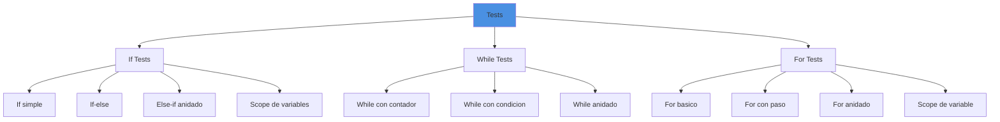

## Referencias

- [Syntax](10-SYNTAX.md) - Sintaxis completa del lenguaje
- [Functions and Scope](12-FUNCTIONS-SCOPE.md) - Funciones y scope
- [Examples](17-EXAMPLES.md) - Ejemplos de codigo
