# Funciones y Scope

## Introduccion

Este documento describe el sistema de funciones y manejo de scope (ambito) en Boemia Script. Actualmente, el soporte de funciones esta en desarrollo temprano.

## Declaracion de Funciones

### Sintaxis

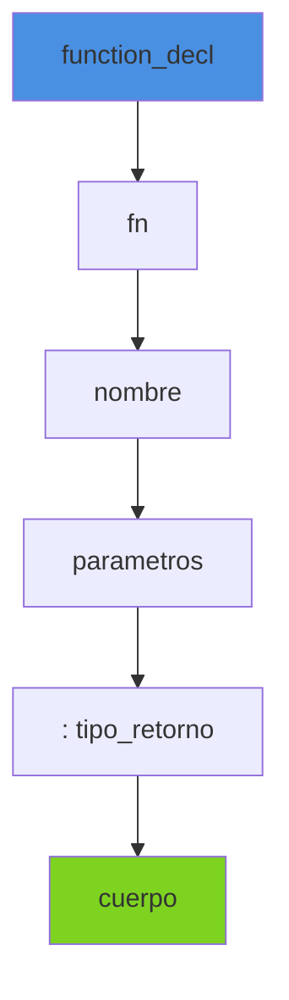

**Gramatica**:
```
function_decl := 'fn' IDENTIFIER '(' params ')' ':' TYPE '{' block '}'
params := (IDENTIFIER ':' TYPE (',' IDENTIFIER ':' TYPE)*)?
```

**Sintaxis basica**:
```boemia
fn nombre(param1: tipo1, param2: tipo2): tipo_retorno {
    // cuerpo de la funcion
    return valor;
}
```

### Ejemplos

**Funcion sin parametros**:
```boemia
fn saludar(): void {
    print("Hola Mundo");
}
```

**Funcion con parametros**:
```boemia
fn suma(a: int, b: int): int {
    return a + b;
}
```

**Funcion con multiples parametros**:
```boemia
fn calcularPromedio(a: int, b: int, c: int): float {
    make total: int = a + b + c;
    make promedio: float = total / 3;
    return promedio;
}
```

## Parametros

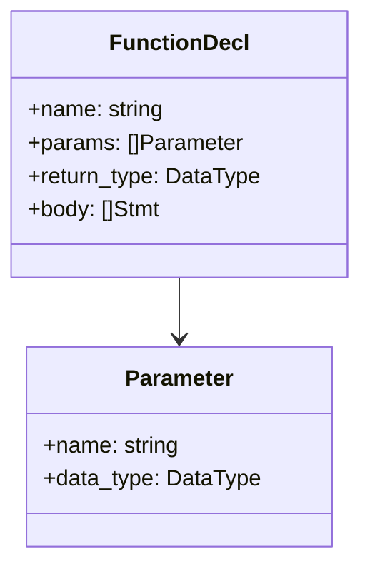

### Parsing de Parametros

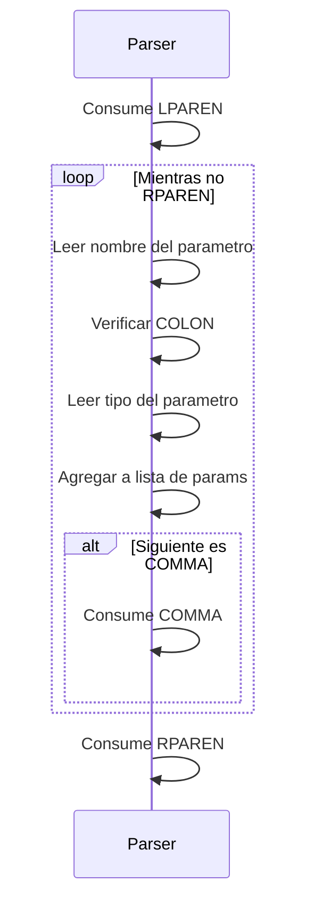

**Codigo del parser**:
```zig
while (self.current_token.type != .RPAREN) {
    if (self.current_token.type != .IDENTIFIER) {
        return ParseError.UnexpectedToken;
    }
    const param_name = self.current_token.lexeme;

    try self.expectToken(.COLON);

    const param_type = DataType.fromString(self.current_token.lexeme)
        orelse return ParseError.InvalidType;
    self.nextToken();

    try params.append(self.allocator, .{
        .name = param_name,
        .data_type = param_type
    });

    if (self.current_token.type == .COMMA) {
        self.nextToken();
    }
}
```

## Return Statement

### Sintaxis

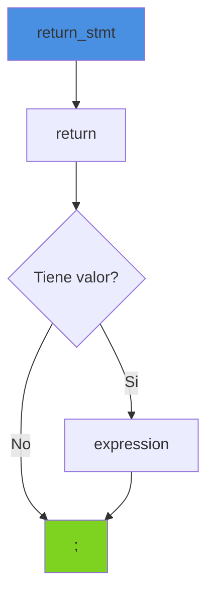

**Gramatica**:
```
return_stmt := 'return' expression? ';'
```

### Ejemplos

**Return con valor**:
```boemia
fn obtenerNumero(): int {
    return 42;
}
```

**Return con expresion**:
```boemia
fn multiplicar(a: int, b: int): int {
    return a * b;
}
```

**Return sin valor (void)**:
```boemia
fn mostrarMensaje(): void {
    print("Mensaje");
    return;
}
```

## Llamadas a Funcion

### Sintaxis

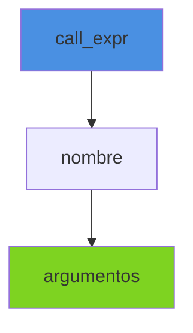

**Gramatica**:
```
call_expr := IDENTIFIER '(' (expression (',' expression)*)? ')'
```

### Ejemplos

**Sin argumentos**:
```boemia
saludar();
```

**Con argumentos**:
```boemia
make resultado: int = suma(5, 3);
print(resultado);  // 8
```

**Llamada anidada**:
```boemia
make total: int = suma(suma(1, 2), suma(3, 4));
// total = suma(3, 7) = 10
```

### Parsing de Llamadas

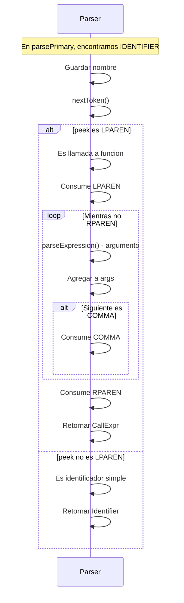

## Scope (Ambito)

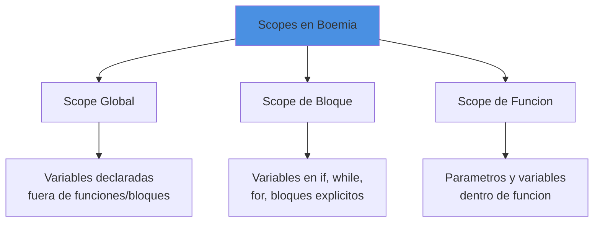

### Reglas de Scope

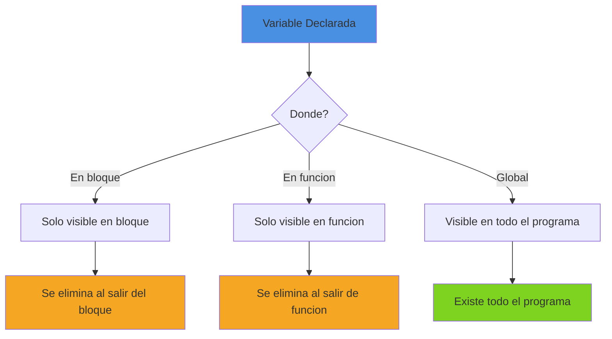

### Ejemplo de Scopes

```boemia
// Scope global
make global: int = 100;

fn funcion(parametro: int): int {
    // Scope de funcion
    // parametro visible aqui
    // global visible aqui
    make local: int = 20;

    if parametro > 0 {
        // Scope de bloque
        // parametro, local, global visibles
        make bloqueVar: int = 30;
        print(bloqueVar);  // OK
    }
    // bloqueVar NO visible aqui
    // print(bloqueVar);  // Error

    return local + parametro;
}

// parametro NO visible aqui
// local NO visible aqui
```

### Implementacion de Scope en Analyzer

```zig
.function_decl => |func| {
    // Agregar parametros al scope
    for (func.params) |param| {
        try self.symbol_table.put(param.name, Symbol{
            .data_type = param.data_type,
            .is_const = false,
        });
    }

    // Analizar cuerpo de funcion
    for (func.body) |*s| {
        try self.analyzeStmt(s);
    }

    // Nota: actualmente no limpiamos parametros
    // Mejora futura: stack de scopes
},
```

## Limitacion Actual: Sin Tabla de Funciones

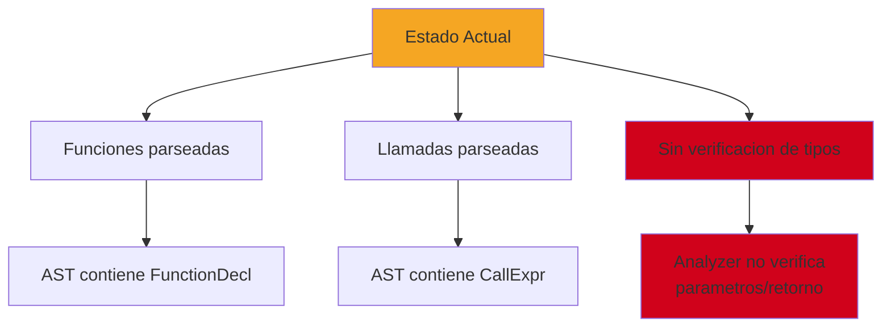

**Problema**:
```boemia
fn suma(a: int, b: int): int {
    return a + b;
}

// Esto NO da error, pero deberia
make resultado: int = suma("texto", true);
```

**Razon**: El analyzer actualmente retorna `VOID` para todas las llamadas:
```zig
.call => |call| {
    _ = call;
    // TODO: Verificacion completa de tipos
    break :blk .VOID;
},
```

## Mejora Futura: Tabla de Funciones

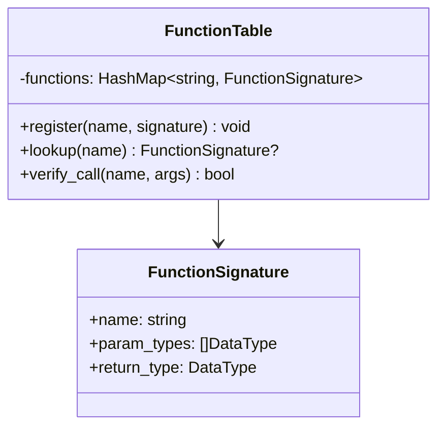

**Implementacion propuesta**:
```zig
pub const FunctionTable = struct {
    functions: std.StringHashMap(FunctionSignature),

    pub fn register(self: *FunctionTable, func: *FunctionDecl) !void {
        var param_types: std.ArrayList(DataType) = .empty;
        for (func.params) |param| {
            try param_types.append(param.data_type);
        }

        try self.functions.put(func.name, FunctionSignature{
            .param_types = try param_types.toOwnedSlice(),
            .return_type = func.return_type,
        });
    }

    pub fn verifyCall(
        self: *FunctionTable,
        name: []const u8,
        arg_types: []DataType
    ) !DataType {
        const sig = self.functions.get(name)
            orelse return error.UndefinedFunction;

        if (sig.param_types.len != arg_types.len) {
            return error.WrongNumberOfArguments;
        }

        for (sig.param_types, arg_types) |expected, actual| {
            if (expected != actual) {
                return error.ArgumentTypeMismatch;
            }
        }

        return sig.return_type;
    }
};
```

## Recursion

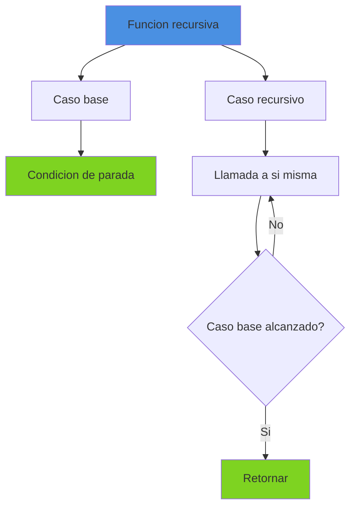

### Ejemplo: Factorial

```boemia
fn factorial(n: int): int {
    if n <= 1 {
        return 1;  // Caso base
    }
    return n * factorial(n - 1);  // Caso recursivo
}

make resultado: int = factorial(5);
print(resultado);  // 120
```

### Ejemplo: Fibonacci

```boemia
fn fibonacci(n: int): int {
    if n <= 1 {
        return n;  // Casos base: fib(0)=0, fib(1)=1
    }
    return fibonacci(n - 1) + fibonacci(n - 2);  // Recursivo
}

make fib10: int = fibonacci(10);
print(fib10);  // 55
```

## Funciones de Orden Superior (Futuro)

```boemia
// Futuro: funciones como parametros
fn aplicar(f: fn(int): int, x: int): int {
    return f(x);
}

fn doblar(x: int): int {
    return x * 2;
}

make resultado: int = aplicar(doblar, 5);  // 10
```

## Closures (Futuro)

```boemia
// Futuro: closures
fn crearContador(): fn(): int {
    make count: int = 0;
    return fn(): int {
        count = count + 1;
        return count;
    };
}

make contador = crearContador();
print(contador());  // 1
print(contador());  // 2
print(contador());  // 3
```

## Sobrecarga de Funciones (Futuro)

```boemia
// Futuro: sobrecarga
fn suma(a: int, b: int): int {
    return a + b;
}

fn suma(a: float, b: float): float {
    return a + b;
}

make x: int = suma(5, 3);        // Llama version int
make y: float = suma(5.0, 3.0);  // Llama version float
```

## Funciones Incorporadas

### print()

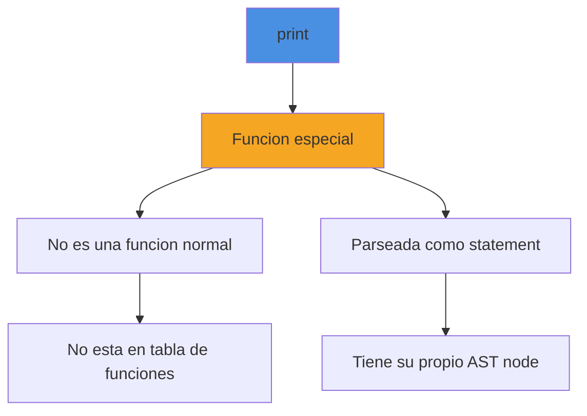

**Caracteristicas**:
- No es una funcion definida por el usuario
- Es un statement especial del lenguaje
- Solo acepta una expresion
- No retorna valor

**Sintaxis**:
```boemia
print(expresion);
```

### Futuras Funciones Incorporadas

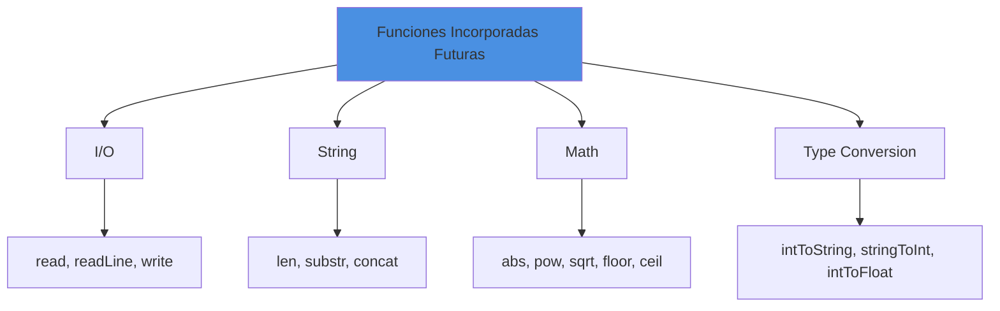

## Mejores Practicas

### 1. Nombres Descriptivos

```boemia
// Bueno
fn calcularAreaCirculo(radio: float): float {
    return 3.14159 * radio * radio;
}

// Malo
fn f(r: float): float {
    return 3.14159 * r * r;
}
```

### 2. Una Responsabilidad por Funcion

```boemia
// Bueno: funciones separadas
fn leerDatos(): int {
    // ...
}

fn procesarDatos(datos: int): int {
    // ...
}

fn mostrarResultado(resultado: int): void {
    // ...
}

// Malo: todo en una funcion
fn hacerTodo(): void {
    // leer, procesar, mostrar todo mezclado
}
```

### 3. Evitar Efectos Secundarios

```boemia
// Bueno: funcion pura
fn suma(a: int, b: int): int {
    return a + b;  // Solo depende de parametros
}

// Cuestionable: modifica estado global
make contador: int = 0;

fn incrementarContador(): int {
    contador = contador + 1;  // Efecto secundario
    return contador;
}
```

## Estado de Implementacion

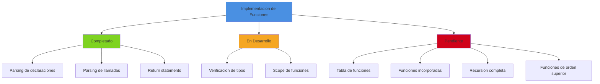

## Referencias

- [Type System](09-TYPE-SYSTEM.md) - Sistema de tipos
- [Control Structures](11-CONTROL-STRUCTURES.md) - Estructuras de control
- [AST Structure](13-AST-STRUCTURE.md) - Estructura del AST
