# Estructura del AST (Arbol de Sintaxis Abstracta)

## Introduccion

El AST (Abstract Syntax Tree) es la representacion interna del programa que usa el compilador. Es una estructura de arbol que representa la jerarquia sintactica del codigo fuente.

## Que es un AST?

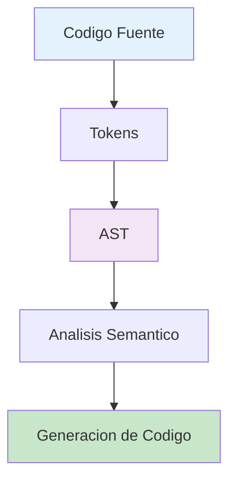

El AST es una representacion estructurada del codigo que:
- Elimina detalles irrelevantes (espacios, comentarios)
- Organiza el codigo en una jerarquia
- Facilita el analisis y la transformacion

## Jerarquia del AST

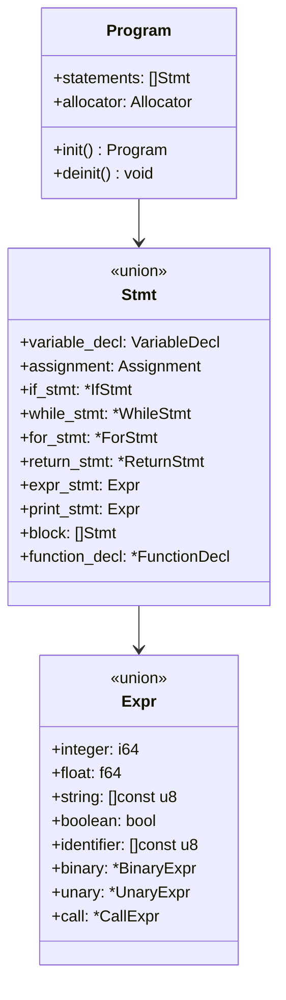

## Program

La raiz del AST. Contiene todos los statements del programa.

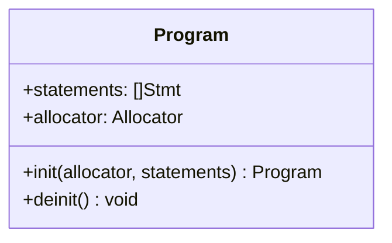

**Definicion en Zig**:
```zig
pub const Program = struct {
    statements: []Stmt,
    allocator: std.mem.Allocator,

    pub fn init(allocator: std.mem.Allocator, statements: []Stmt) Program {
        return Program{
            .statements = statements,
            .allocator = allocator,
        };
    }

    pub fn deinit(self: *Program) void {
        for (self.statements) |*stmt| {
            stmt.deinit(self.allocator);
        }
        self.allocator.free(self.statements);
    }
};
```

**Ejemplo de Program**:
```boemia
make x: int = 5;
print(x);
```

**AST**:
```
Program {
    statements: [
        Stmt.variable_decl { name: "x", type: INT, value: 5 },
        Stmt.print_stmt { expr: Identifier("x") }
    ]
}
```

## Statements (Stmt)

Union tagged que representa todos los tipos de statements posibles.

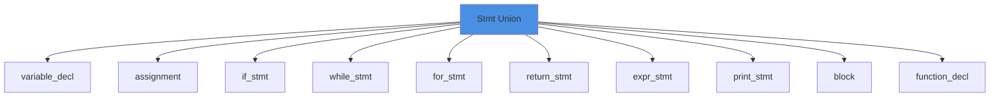

### Variable Declaration

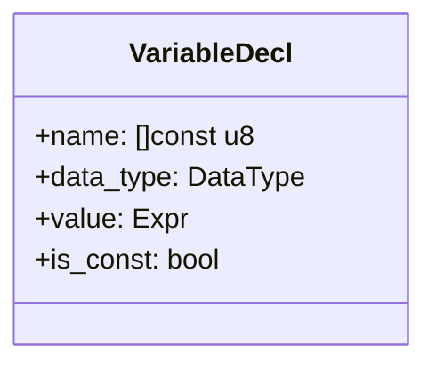

**Ejemplo**:
```boemia
make x: int = 42;
seal PI: float = 3.14;
```

**AST**:
```
Stmt.variable_decl {
    name: "x",
    data_type: INT,
    value: Expr.integer(42),
    is_const: false
}

Stmt.variable_decl {
    name: "PI",
    data_type: FLOAT,
    value: Expr.float(3.14),
    is_const: true
}
```

### Assignment

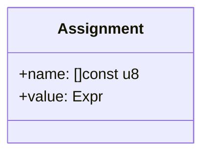

**Ejemplo**:
```boemia
x = x + 1;
```

**AST**:
```
Stmt.assignment {
    name: "x",
    value: Expr.binary {
        left: Expr.identifier("x"),
        op: ADD,
        right: Expr.integer(1)
    }
}
```

### If Statement

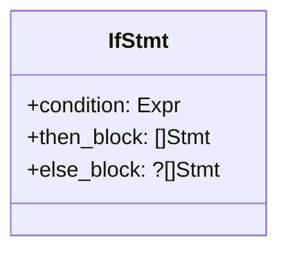

**Ejemplo**:
```boemia
if x > 5 {
    print(x);
} else {
    print(0);
}
```

**AST**:
```
Stmt.if_stmt {
    condition: Expr.binary {
        left: Expr.identifier("x"),
        op: GT,
        right: Expr.integer(5)
    },
    then_block: [
        Stmt.print_stmt { Expr.identifier("x") }
    ],
    else_block: [
        Stmt.print_stmt { Expr.integer(0) }
    ]
}
```

### While Statement

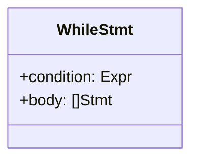

**Ejemplo**:
```boemia
while i < 10 {
    i = i + 1;
}
```

**AST**:
```
Stmt.while_stmt {
    condition: Expr.binary {
        left: Expr.identifier("i"),
        op: LT,
        right: Expr.integer(10)
    },
    body: [
        Stmt.assignment {
            name: "i",
            value: Expr.binary {
                left: Expr.identifier("i"),
                op: ADD,
                right: Expr.integer(1)
            }
        }
    ]
}
```

### For Statement

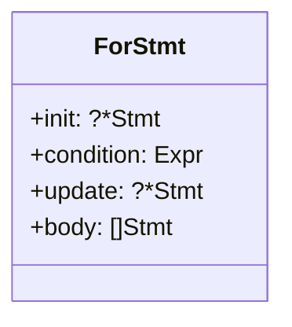

**Ejemplo**:
```boemia
for i: int = 0; i < 10; i = i + 1 {
    print(i);
}
```

**AST**:
```
Stmt.for_stmt {
    init: Stmt.variable_decl {
        name: "i",
        data_type: INT,
        value: Expr.integer(0),
        is_const: false
    },
    condition: Expr.binary {
        left: Expr.identifier("i"),
        op: LT,
        right: Expr.integer(10)
    },
    update: Stmt.assignment {
        name: "i",
        value: Expr.binary {
            left: Expr.identifier("i"),
            op: ADD,
            right: Expr.integer(1)
        }
    },
    body: [
        Stmt.print_stmt { Expr.identifier("i") }
    ]
}
```

### Function Declaration

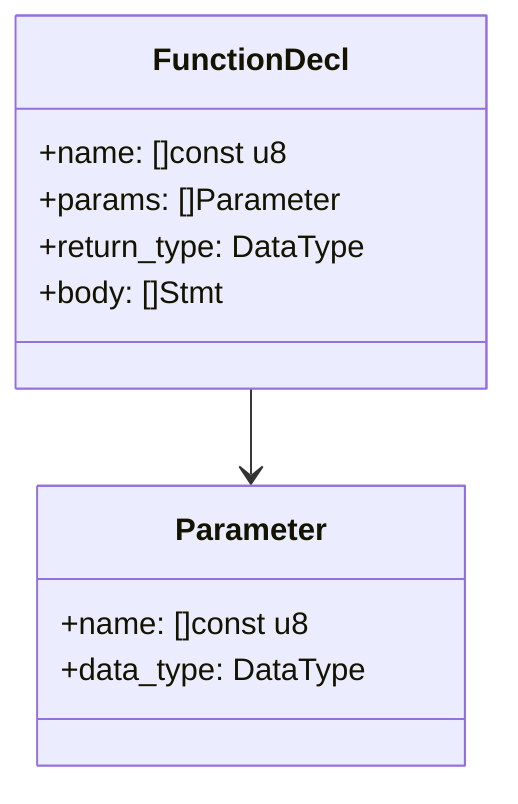

**Ejemplo**:
```boemia
fn suma(a: int, b: int): int {
    return a + b;
}
```

**AST**:
```
Stmt.function_decl {
    name: "suma",
    params: [
        Parameter { name: "a", data_type: INT },
        Parameter { name: "b", data_type: INT }
    ],
    return_type: INT,
    body: [
        Stmt.return_stmt {
            value: Expr.binary {
                left: Expr.identifier("a"),
                op: ADD,
                right: Expr.identifier("b")
            }
        }
    ]
}
```

## Expressions (Expr)

Union tagged que representa todos los tipos de expresiones.

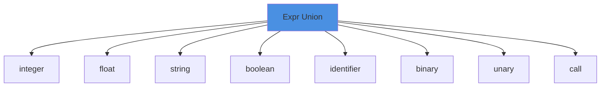

### Literales

**Integers**:
```zig
pub const Expr = union(enum) {
    integer: i64,
    // ...
};
```

**Ejemplo**: `42` → `Expr.integer(42)`

**Floats**:
```zig
pub const Expr = union(enum) {
    float: f64,
    // ...
};
```

**Ejemplo**: `3.14` → `Expr.float(3.14)`

**Strings**:
```zig
pub const Expr = union(enum) {
    string: []const u8,
    // ...
};
```

**Ejemplo**: `"Hola"` → `Expr.string("Hola")`

**Booleans**:
```zig
pub const Expr = union(enum) {
    boolean: bool,
    // ...
};
```

**Ejemplo**: `true` → `Expr.boolean(true)`

### Identifiers

```zig
pub const Expr = union(enum) {
    identifier: []const u8,
    // ...
};
```

**Ejemplo**: `x` → `Expr.identifier("x")`

### Binary Expressions

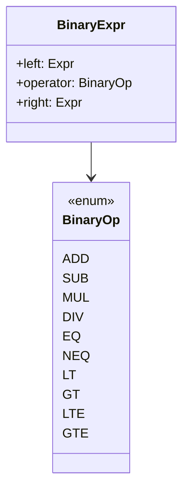

**Ejemplo**: `2 + 3 * 4`

**AST**:
```
Expr.binary {
    left: Expr.integer(2),
    op: ADD,
    right: Expr.binary {
        left: Expr.integer(3),
        op: MUL,
        right: Expr.integer(4)
    }
}
```

**Visualizacion como arbol**:
```
       +
      / \
     2   *
        / \
       3   4
```

### Unary Expressions

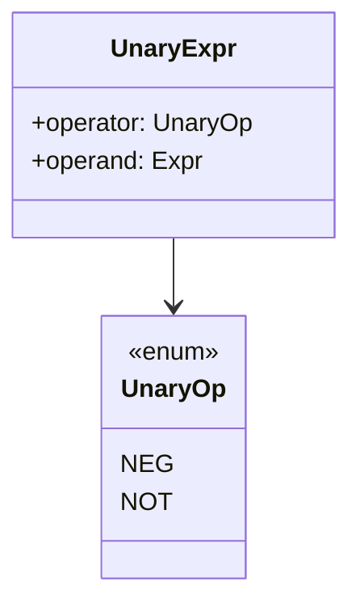

**Ejemplo**: `-x`

**AST**:
```
Expr.unary {
    operator: NEG,
    operand: Expr.identifier("x")
}
```

### Call Expressions

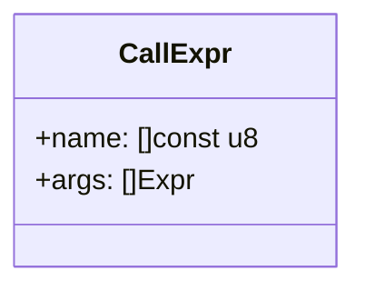

**Ejemplo**: `suma(5, 3)`

**AST**:
```
Expr.call {
    name: "suma",
    args: [
        Expr.integer(5),
        Expr.integer(3)
    ]
}
```

## Tipos de Datos

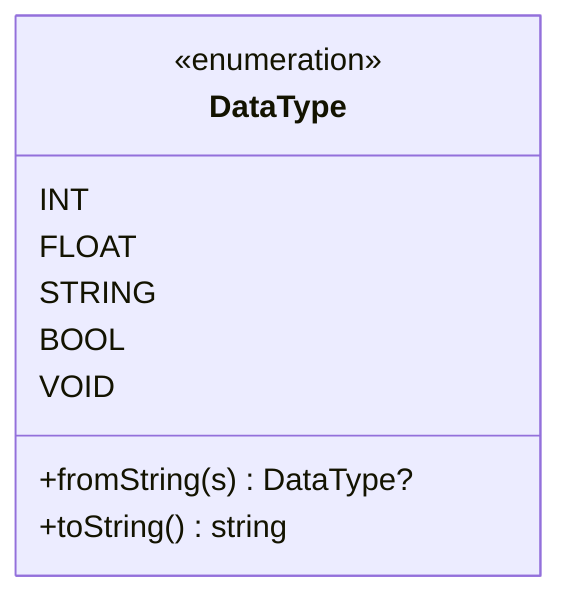

**Definicion**:
```zig
pub const DataType = enum {
    INT,
    FLOAT,
    STRING,
    BOOL,
    VOID,

    pub fn fromString(s: []const u8) ?DataType {
        if (std.mem.eql(u8, s, "int")) return .INT;
        if (std.mem.eql(u8, s, "float")) return .FLOAT;
        if (std.mem.eql(u8, s, "string")) return .STRING;
        if (std.mem.eql(u8, s, "bool")) return .BOOL;
        return null;
    }

    pub fn toString(self: DataType) []const u8 {
        return switch (self) {
            .INT => "int",
            .FLOAT => "float",
            .STRING => "string",
            .BOOL => "bool",
            .VOID => "void",
        };
    }
};
```

## Ejemplo Completo de AST

### Codigo Fuente

```boemia
make x: int = 10;
make y: int = 20;

if x < y {
    make suma: int = x + y;
    print(suma);
}
```

### AST Completo

```
Program {
    statements: [
        Stmt.variable_decl {
            name: "x",
            data_type: INT,
            value: Expr.integer(10),
            is_const: false
        },
        Stmt.variable_decl {
            name: "y",
            data_type: INT,
            value: Expr.integer(20),
            is_const: false
        },
        Stmt.if_stmt {
            condition: Expr.binary {
                left: Expr.identifier("x"),
                operator: LT,
                right: Expr.identifier("y")
            },
            then_block: [
                Stmt.variable_decl {
                    name: "suma",
                    data_type: INT,
                    value: Expr.binary {
                        left: Expr.identifier("x"),
                        operator: ADD,
                        right: Expr.identifier("y")
                    },
                    is_const: false
                },
                Stmt.print_stmt {
                    expr: Expr.identifier("suma")
                }
            ],
            else_block: null
        }
    ]
}
```

### Visualizacion como Arbol

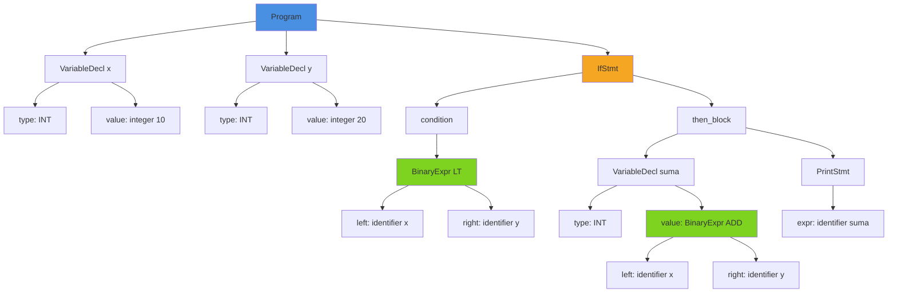

## Gestion de Memoria

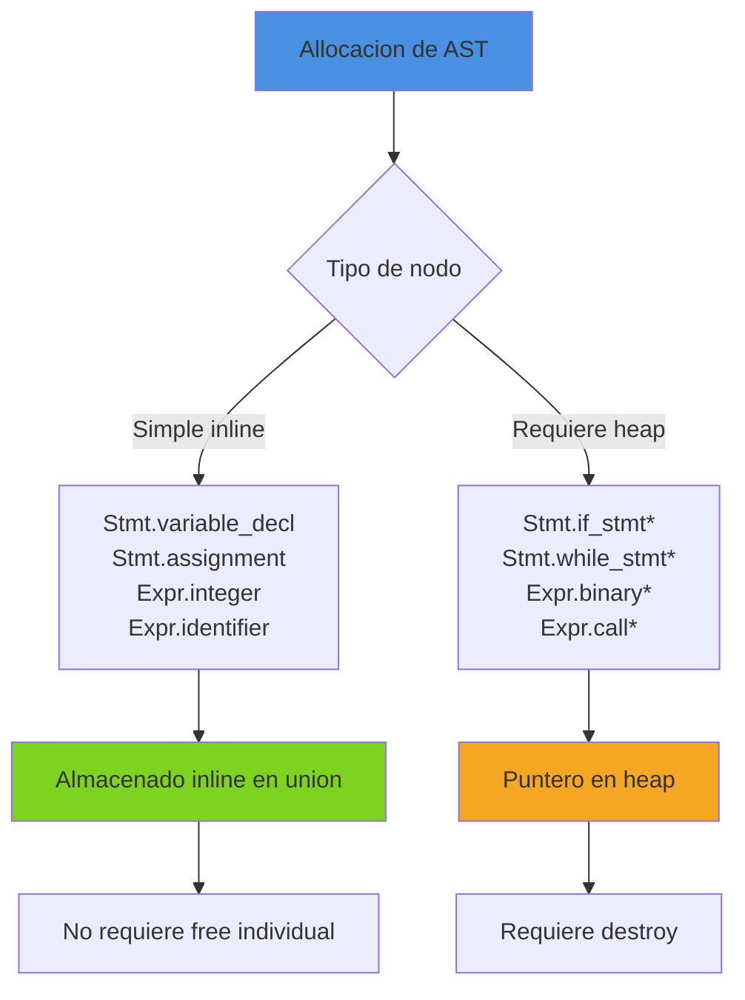

**Por que algunos usan punteros?**

Nodos que contienen otros nodos usan punteros para evitar:
1. Ciclos infinitos en el tipo (union auto-referencial)
2. Tamano excesivo del union

**Ejemplo**:
```zig
// BinaryExpr usa puntero porque contiene otros Expr
pub const BinaryExpr = struct {
    left: Expr,    // Contiene otro Expr
    operator: BinaryOp,
    right: Expr,   // Contiene otro Expr
};

// En Expr union:
pub const Expr = union(enum) {
    binary: *BinaryExpr,  // Puntero para evitar ciclo
    // ...
};
```

### Liberacion de Memoria

```zig
pub fn deinit(self: *Expr, allocator: std.mem.Allocator) void {
    switch (self.*) {
        .binary => |bin| {
            bin.left.deinit(allocator);   // Recursivo
            bin.right.deinit(allocator);  // Recursivo
            allocator.destroy(bin);       // Liberar puntero
        },
        .unary => |un| {
            un.operand.deinit(allocator);
            allocator.destroy(un);
        },
        .call => |call| {
            for (call.args) |*arg| {
                arg.deinit(allocator);
            }
            allocator.free(call.args);
            allocator.destroy(call);
        },
        else => {},  // Literales e identificadores no requieren liberacion
    }
}
```

## Traversal del AST

### Visitor Pattern

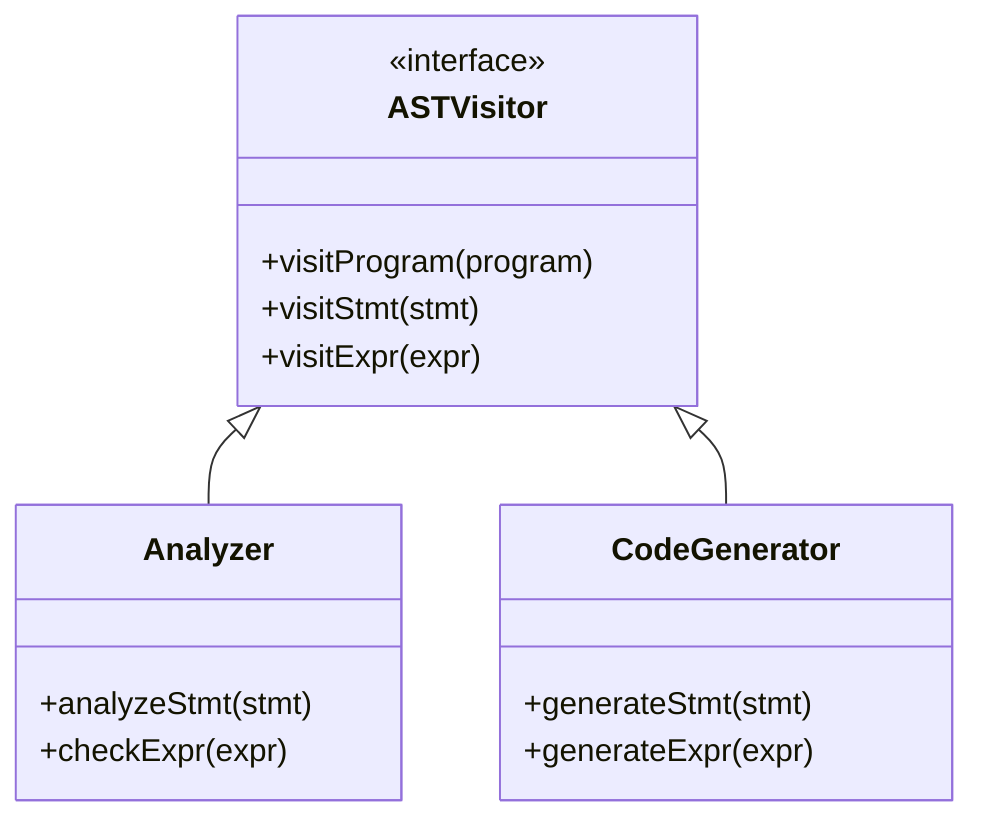

**Recorrido por Analyzer**:
```zig
pub fn analyze(self: *Analyzer, program: *Program) !void {
    for (program.statements) |*stmt| {
        try self.analyzeStmt(stmt);
    }
}

fn analyzeStmt(self: *Analyzer, stmt: *Stmt) !void {
    switch (stmt.*) {
        .variable_decl => |*decl| {
            const expr_type = try self.checkExpr(&decl.value);
            // ...
        },
        .if_stmt => |if_stmt| {
            _ = try self.checkExpr(&if_stmt.condition);
            for (if_stmt.then_block) |*s| {
                try self.analyzeStmt(s);  // Recursivo
            }
            // ...
        },
        // ...
    }
}
```

## Transformaciones del AST (Futuro)

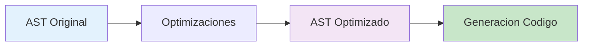

**Posibles optimizaciones**:
- Constant folding: `2 + 3` → `5`
- Dead code elimination: eliminar codigo inalcanzable
- Common subexpression elimination

## Comparacion con Otros Compiladores

| Compilador | AST | Caracteristica |
|------------|-----|----------------|
| Boemia | Tagged unions | Simple, type-safe |
| GCC | Tree nodes con tipos | Muy complejo, flexible |
| LLVM | SSA IR | Optimizacion avanzada |
| Rust | HIR + MIR | Multiple IRs |
| Python | AST con clases | Orientado a objetos |

## Referencias

- [Parser](05-PARSER.md) - Construccion del AST
- [Analyzer](06-ANALYZER.md) - Analisis del AST
- [Code Generator](07-CODEGEN.md) - Traversal del AST
