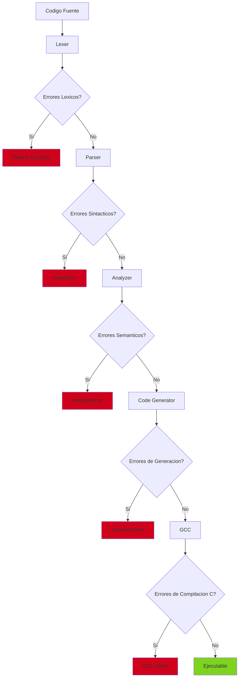
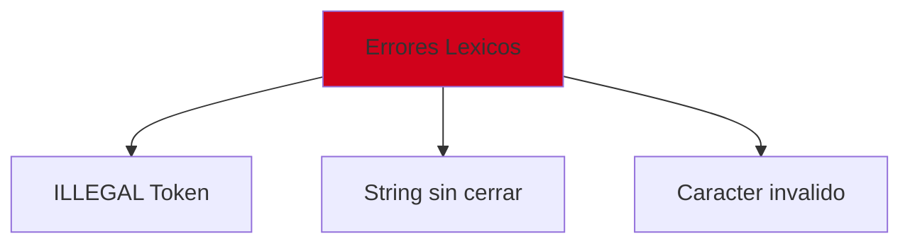
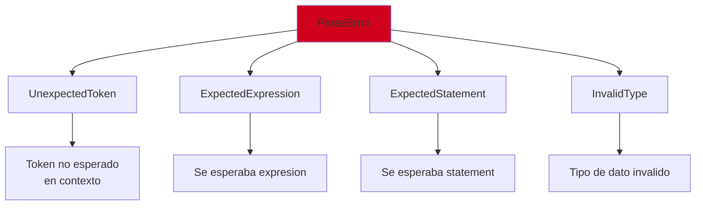
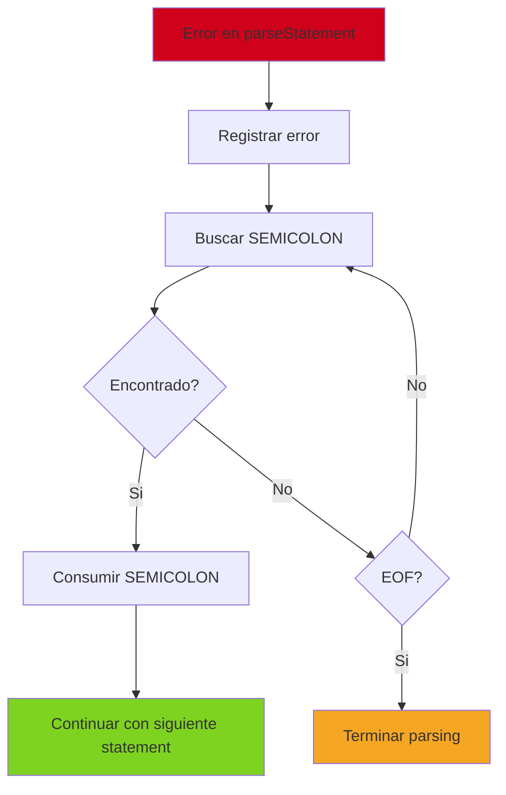
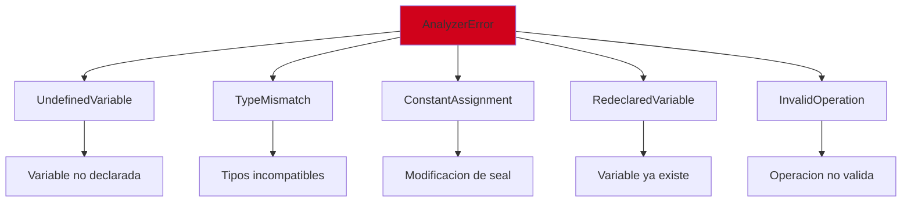
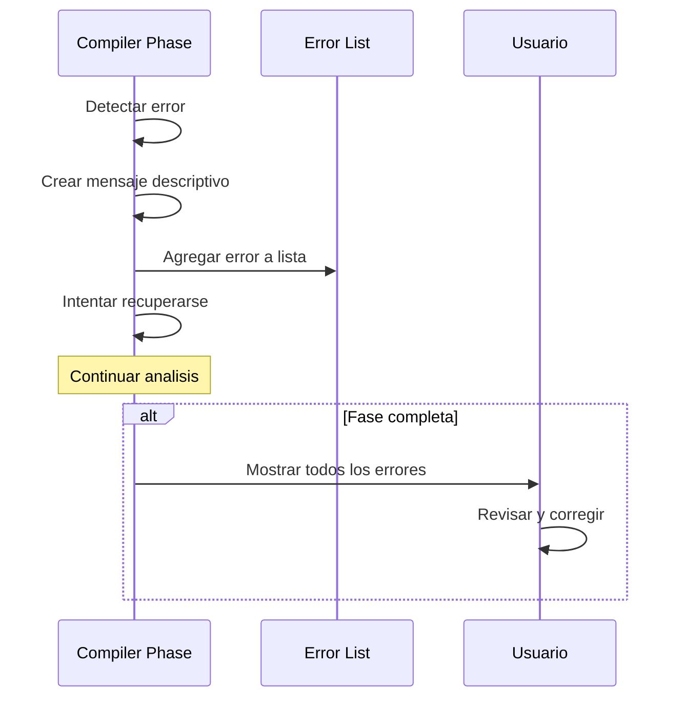
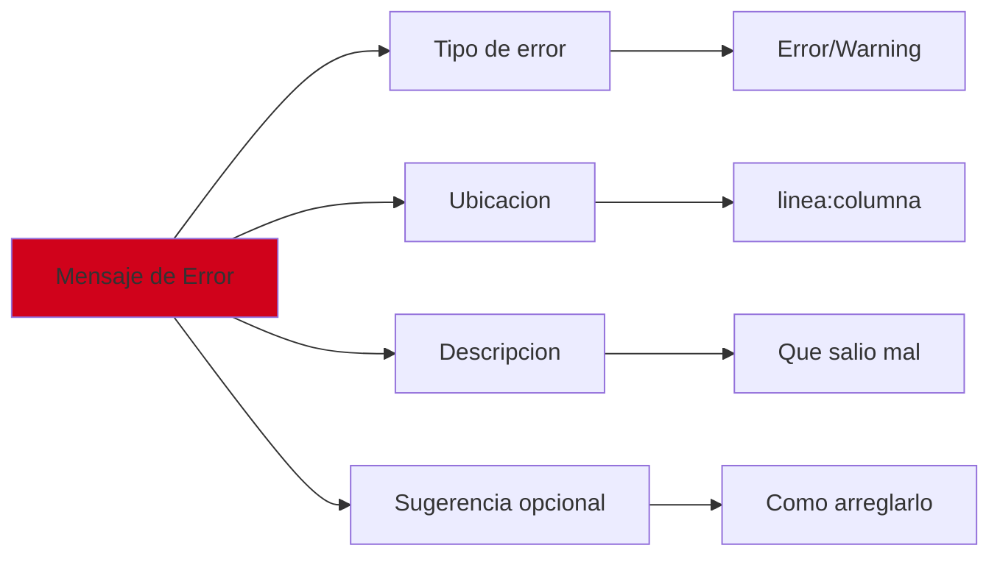
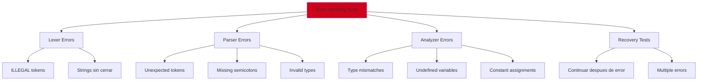

# Manejo de Errores

## Introduccion

El manejo de errores en el compilador de Boemia Script se realiza en multiples fases, cada una detectando diferentes tipos de problemas. Este documento describe como se detectan, reportan y manejan los errores.

## Fases de Deteccion de Errores



## Errores Lexicos

### Tipos de Errores



### Token ILLEGAL

El lexer genera un token ILLEGAL cuando encuentra un caracter inesperado.

**Ejemplo**:
```boemia
make x: int = 5@;
```

**Token generado**:
```
Token(ILLEGAL, "@", 1, 17)
```

**Codigo del lexer**:
```zig
fn nextToken(self: *Lexer) Token {
    // ...
    return switch (self.ch) {
        // casos conocidos ...
        else => Token.init(.ILLEGAL, &[_]u8{self.ch}, self.line, self.column),
    };
}
```

### String sin Cerrar

**Ejemplo**:
```boemia
make texto: string = "Hola mundo;
```

**Deteccion**:
```zig
fn readString(self: *Lexer) Token {
    self.readChar(); // consume primera comilla
    const start = self.position;

    while (self.ch != '"' and self.ch != 0) {
        if (self.ch == '\n') {
            self.line += 1;
            self.column = 0;
        }
        self.readChar();
    }

    if (self.ch == 0) {
        // String sin cerrar - EOF alcanzado
        return Token.init(.ILLEGAL, self.source[start..self.position],
                         self.line, self.column);
    }
    // ...
}
```

### Recuperacion de Errores Lexicos

El lexer NO detiene la tokenizacion ante errores:
- Genera token ILLEGAL
- Continua con el siguiente token
- El parser decide como manejar ILLEGAL tokens

## Errores Sintacticos (Parser)

### Tipos de ParseError

```zig
pub const ParseError = error{
    UnexpectedToken,
    ExpectedExpression,
    ExpectedStatement,
    InvalidType,
    OutOfMemory,
};
```



### UnexpectedToken

**Ejemplo**:
```boemia
make x: int = ;
```

**Error detectado**:
```
Expected expression, got SEMICOLON at 1:15
```

**Codigo**:
```zig
fn expectToken(self: *Parser, token_type: TokenType) !void {
    if (self.peek_token.type != token_type) {
        const err = try std.fmt.allocPrint(
            self.allocator,
            "Expected {s}, got {s} at {}:{}",
            .{
                @tagName(token_type),
                @tagName(self.peek_token.type),
                self.peek_token.line,
                self.peek_token.column
            },
        );
        try self.errors.append(self.allocator, err);
        return ParseError.UnexpectedToken;
    }
    self.nextToken();
}
```

### InvalidType

**Ejemplo**:
```boemia
make x: numero = 5;
```

**Error**:
```
Invalid type 'numero' at 1:9
```

**Deteccion**:
```zig
const data_type = DataType.fromString(self.peek_token.lexeme)
    orelse return ParseError.InvalidType;
```

### Recuperacion de Errores Sintacticos



**Codigo**:
```zig
pub fn parseProgram(self: *Parser) !Program {
    var statements: std.ArrayList(Stmt) = .empty;
    errdefer statements.deinit(self.allocator);

    while (self.current_token.type != .EOF) {
        const stmt = self.parseStatement() catch |err| {
            // Error recovery: skip hasta siguiente semicolon
            while (self.current_token.type != .SEMICOLON and
                   self.current_token.type != .EOF) {
                self.nextToken();
            }
            if (self.current_token.type == .SEMICOLON) {
                self.nextToken();
            }
            return err;
        };
        try statements.append(self.allocator, stmt);
    }

    return Program.init(self.allocator, try statements.toOwnedSlice(self.allocator));
}
```

## Errores Semanticos (Analyzer)

### Tipos de AnalyzerError

```zig
pub const AnalyzerError = error{
    UndefinedVariable,
    TypeMismatch,
    ConstantAssignment,
    RedeclaredVariable,
    OutOfMemory,
    InvalidOperation,
};
```



### UndefinedVariable

**Ejemplo**:
```boemia
print(variable_no_declarada);
```

**Error**:
```
Undefined variable 'variable_no_declarada'
```

**Deteccion**:
```zig
.identifier => |name| blk: {
    const symbol = self.symbol_table.get(name) orelse {
        const err = try std.fmt.allocPrint(
            self.allocator,
            "Undefined variable '{s}'",
            .{name},
        );
        try self.errors.append(self.allocator, err);
        return AnalyzerError.UndefinedVariable;
    };
    break :blk symbol.data_type;
},
```

### TypeMismatch

**Ejemplo**:
```boemia
make x: int = "texto";
```

**Error**:
```
Type mismatch: cannot assign string to int
```

**Deteccion**:
```zig
const expr_type = try self.checkExpr(&decl.value);

if (expr_type != decl.data_type) {
    const err = try std.fmt.allocPrint(
        self.allocator,
        "Type mismatch: cannot assign {s} to {s}",
        .{ expr_type.toString(), decl.data_type.toString() },
    );
    try self.errors.append(self.allocator, err);
    return AnalyzerError.TypeMismatch;
}
```

### ConstantAssignment

**Ejemplo**:
```boemia
seal PI: float = 3.14;
PI = 3.15;
```

**Error**:
```
Cannot assign to constant 'PI'
```

**Deteccion**:
```zig
if (symbol.is_const) {
    const err = try std.fmt.allocPrint(
        self.allocator,
        "Cannot assign to constant '{s}'",
        .{assign.name},
    );
    try self.errors.append(self.allocator, err);
    return AnalyzerError.ConstantAssignment;
}
```

### RedeclaredVariable

**Ejemplo**:
```boemia
make x: int = 5;
make x: int = 10;
```

**Error**:
```
Variable 'x' is already declared
```

**Deteccion**:
```zig
if (self.symbol_table.get(decl.name)) |_| {
    const err = try std.fmt.allocPrint(
        self.allocator,
        "Variable '{s}' is already declared",
        .{decl.name},
    );
    try self.errors.append(self.allocator, err);
    return AnalyzerError.RedeclaredVariable;
}
```

### InvalidOperation

**Ejemplo**:
```boemia
make texto: string = "Hola";
make numero: int = texto * 2;
```

**Error**:
```
Invalid operation: string MUL int
```

**Deteccion**:
```zig
switch (bin.operator) {
    .ADD, .SUB, .MUL, .DIV => {
        // Verificar tipos compatibles
        if (/* tipos incompatibles */) {
            const err = try std.fmt.allocPrint(
                self.allocator,
                "Invalid operation: {s} {s} {s}",
                .{
                    left_type.toString(),
                    @tagName(bin.operator),
                    right_type.toString()
                },
            );
            try self.errors.append(self.allocator, err);
            return AnalyzerError.InvalidOperation;
        }
    },
}
```

## Errores de Generacion de Codigo

### Tipos de CodeGenError

```zig
pub const CodeGenError = error{
    OutOfMemory,
    WriteError,
    UnsupportedOperation,
    InvalidExpression,
};
```

Estos errores son raros porque el AST ya fue validado por el Analyzer.

## Errores de GCC

### Captura de stderr de GCC

```zig
const result = try std.process.Child.run(.{
    .allocator = allocator,
    .argv = &[_][]const u8{
        "gcc",
        "-o", exec_output_path,
        c_file_path,
        "-std=c11",
        "-Wall",
        "-Wextra",
    },
});
defer allocator.free(result.stdout);
defer allocator.free(result.stderr);

if (result.term.Exited != 0) {
    std.debug.print("GCC compilation failed:\n{s}\n", .{result.stderr});
    return error.CompilationFailed;
}
```

### Ejemplo de Error de GCC

**Codigo C generado (bug en codegen)**:
```c
int main(void) {
    long long x = 5;
    printf("%lld\n", (long long)y);  // y no declarado
    return 0;
}
```

**Salida de GCC**:
```
build/output.c:5:34: error: use of undeclared identifier 'y'
    printf("%lld\n", (long long)y);
                                 ^
1 error generated.
```

## Sistema de Reportes de Errores



### Formato de Mensajes de Error



**Ejemplo de mensaje completo**:
```
Error at 5:12: Type mismatch: cannot assign string to int
  make x: int = "texto";
              ^
  Suggestion: Use int value like 42 or convert string to int
```

## Mejoras Futuras

### 1. Mensajes con Codigo Fuente

```boemia
Error at programa.bs:5:12: Type mismatch
  make x: int = "texto";
                ^~~~~~~
  Expected: int
  Found: string
```

### 2. Codigos de Error

```
E001: Undefined variable 'x'
E002: Type mismatch in assignment
E003: Cannot assign to constant
```

### 3. Warnings (Advertencias)

```boemia
make x: int = 5;
// x nunca se usa

Warning at 1:6: Unused variable 'x'
  make x: int = 5;
       ^
```

### 4. Sugerencias de Correccion

```
Error: Undefined variable 'contadr'
Did you mean: 'contador'?
```

### 5. Multiple Error Reporting

Reportar multiples errores en una sola pasada:

```boemia
make x: string = 5;       // Error 1: TypeMismatch
print(y);                 // Error 2: UndefinedVariable
seal PI: int = 3.14;      // Error 3: TypeMismatch
PI = 3;                   // Error 4: ConstantAssignment
```

**Salida**:
```
4 errors found:

1. Error at 1:18: Type mismatch: cannot assign int to string
2. Error at 2:7: Undefined variable 'y'
3. Error at 3:16: Type mismatch: cannot assign float to int
4. Error at 4:1: Cannot assign to constant 'PI'
```

## Testing de Manejo de Errores



## Comparacion con Otros Compiladores

| Caracteristica | Boemia | Rust | GCC | Python |
|----------------|--------|------|-----|--------|
| Mensajes detallados | Basico | Excelente | Bueno | Bueno |
| Sugerencias | No | Si | Limitado | Si |
| Codigos de error | No | Si | Si | No |
| Recuperacion | Basica | Buena | Excelente | Buena |
| Multiple errors | Si | Si | Si | Si |
| Warnings | Basico | Extenso | Extenso | Basico |

## Referencias

- [Lexer](04-LEXER.md) - Errores lexicos
- [Parser](05-PARSER.md) - Errores sintacticos
- [Analyzer](06-ANALYZER.md) - Errores semanticos
- [Testing](19-TESTING.md) - Testing de errores
