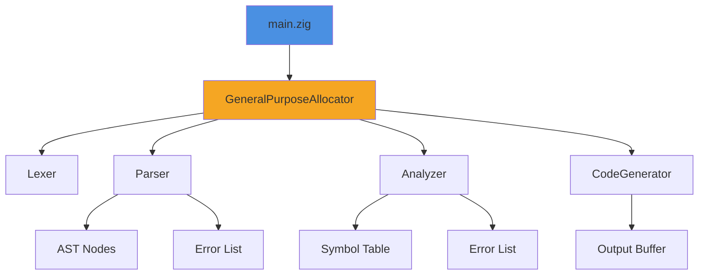
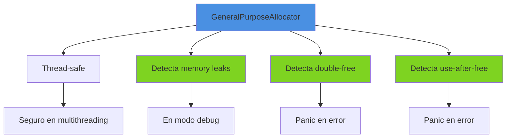
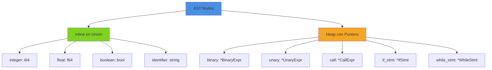
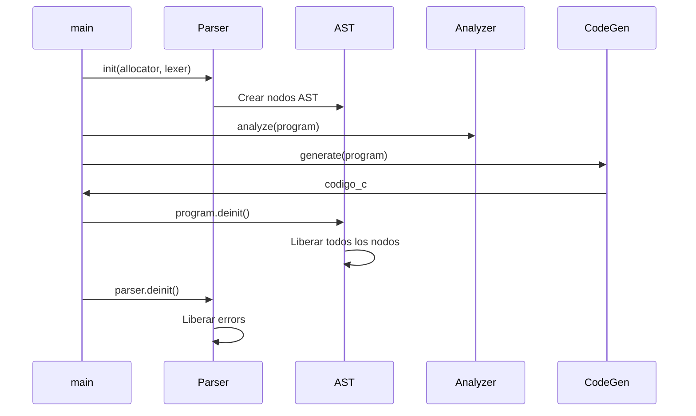
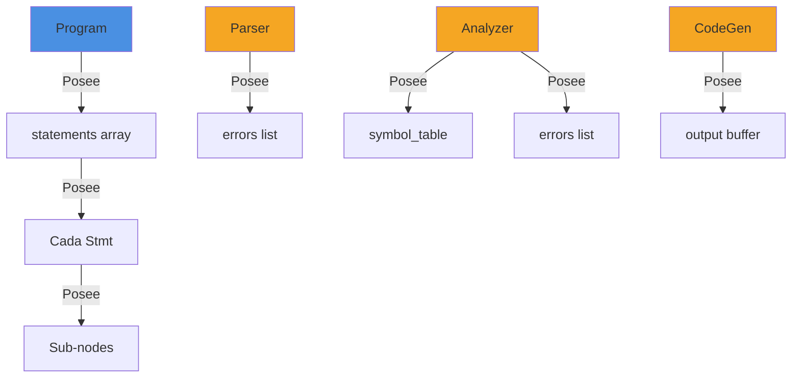
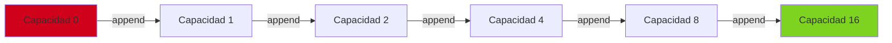
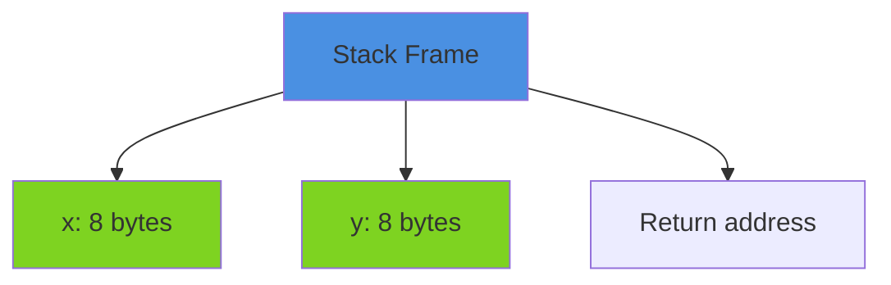
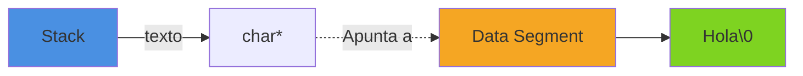
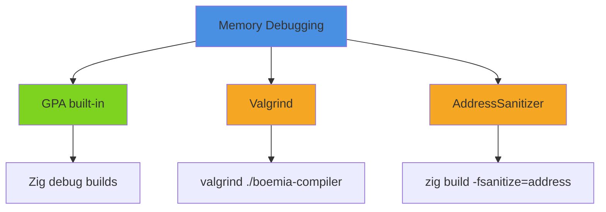

# Gestion de Memoria

## Introduccion

La gestion de memoria en Boemia Script se divide en dos aspectos: la memoria del compilador (escrito en Zig) y la memoria de los programas compilados (generados como C).

## Memoria del Compilador (Zig)

### Sistema de Allocators en Zig



**Creacion del allocator**:
```zig
pub fn main() !void {
    var gpa = std.heap.GeneralPurposeAllocator(.{}){};
    defer _ = gpa.deinit();
    const allocator = gpa.allocator();

    // Usar allocator en todas las fases
}
```

### GeneralPurposeAllocator (GPA)



### RAII Pattern con defer

```zig
pub fn parseProgram(self: *Parser) !Program {
    var statements: std.ArrayList(Stmt) = .empty;
    errdefer statements.deinit(self.allocator);  // Si hay error

    // parsing...

    return Program.init(self.allocator, try statements.toOwnedSlice(self.allocator));
}
```

**Patron defer**:
```zig
const source_code = try std.fs.cwd().readFileAlloc(allocator, filename, 1024 * 1024);
defer allocator.free(source_code);  // Siempre se libera al salir del scope

// Usar source_code
```

## Allocacion de AST

### Nodos Inline vs Heap



### Creacion de Nodos en Heap

```zig
// Crear BinaryExpr en heap
const binary = try self.allocator.create(Expr.BinaryExpr);
binary.* = .{
    .left = left,
    .operator = op,
    .right = right,
};

return Expr{ .binary = binary };
```

### Liberacion de Nodos

```zig
pub fn deinit(self: *Expr, allocator: std.mem.Allocator) void {
    switch (self.*) {
        .binary => |bin| {
            bin.left.deinit(allocator);   // Recursivo
            bin.right.deinit(allocator);  // Recursivo
            allocator.destroy(bin);       // Liberar puntero
        },
        .unary => |un| {
            un.operand.deinit(allocator);
            allocator.destroy(un);
        },
        .call => |call| {
            for (call.args) |*arg| {
                arg.deinit(allocator);
            }
            allocator.free(call.args);  // Array de args
            allocator.destroy(call);
        },
        else => {},  // Literales no requieren liberacion
    }
}
```

## Lifetime de Objetos



### Propiedad de Memoria



## Strings y Slices

### Sin Copias Innecesarias

El lexer NO copia los strings del codigo fuente:

```zig
const name = self.current_token.lexeme;  // Solo referencia
```

```mermaid
graph LR
    A[source: []const u8] --> B[Token.lexeme]
    B -.->|Referencia| A

    C[Token.lexeme] --> D[AST Node]
    D -.->|Referencia| A

    style A fill:#4a90e2
    style B fill:#7ed321
    style D fill:#7ed321
```

**Ventaja**: Eficiente, sin allocaciones extra.

**Limitacion**: El `source` debe vivir mientras el AST existe.

### Owned vs Borrowed

```zig
// Borrowed: solo referencia
pub const Token = struct {
    lexeme: []const u8,  // No posee memoria
};

// Owned: posee memoria
pub const Program = struct {
    statements: []Stmt,  // Posee array
    allocator: Allocator,

    pub fn deinit(self: *Program) void {
        for (self.statements) |*stmt| {
            stmt.deinit(self.allocator);
        }
        self.allocator.free(self.statements);  // Libera array que posee
    }
};
```

## ArrayLists Dinamicos

### Uso en Parser y Analyzer

```zig
// Parser
errors: std.ArrayList([]const u8)

// Operaciones
try self.errors.append(self.allocator, error_msg);

// Liberacion
pub fn deinit(self: *Parser) void {
    self.errors.deinit(self.allocator);
}
```

### Crecimiento Eficiente



**Estrategia**: Duplicar capacidad cuando se llena.

## HashMap para Symbol Table

```zig
pub const Analyzer = struct {
    symbol_table: std.StringHashMap(Symbol),

    pub fn init(allocator: std.mem.Allocator) Analyzer {
        return Analyzer{
            .symbol_table = std.StringHashMap(Symbol).init(allocator),
            // ...
        };
    }

    pub fn deinit(self: *Analyzer) void {
        self.symbol_table.deinit();  // Libera estructura interna
        // ...
    }
};
```

### Complejidad de Memoria

| Estructura | Operacion | Memoria | Tiempo |
|------------|-----------|---------|--------|
| ArrayList | append | Amortigacion | O(1) amortizado |
| ArrayList | deinit | Libera todo | O(1) |
| HashMap | put | Hash + buckets | O(1) promedio |
| HashMap | deinit | Libera todo | O(1) |
| AST Node | create | Heap alloc | O(1) |
| AST Node | deinit | Recursivo | O(n) nodos |

## Memory Leaks Detection

### Con Debug Build

```bash
zig build -Doptimize=Debug
./zig-out/bin/boemia-compiler programa.bs
```

**Si hay leak**:
```
error(gpa): memory address 0x7f8a1c000b20 leaked:
/path/to/file.zig:123:45: 0x... in functionName (boemia-compiler)
    const ptr = try allocator.create(Type);
```

### Sin Leaks en Uso Normal

```zig
pub fn main() !void {
    var gpa = std.heap.GeneralPurposeAllocator(.{}){};
    defer _ = gpa.deinit();  // Verifica leaks al salir
    const allocator = gpa.allocator();

    // Todo el codigo del compilador

    // Al salir, gpa.deinit() verifica que no quede memoria sin liberar
}
```

## Memoria en Programas Compilados (C)

### Tipos Primitivos en Stack

```boemia
make x: int = 5;
make y: float = 3.14;
```

**C generado**:
```c
long long x = 5;      // Stack
double y = 3.14;      // Stack
```



### Strings: Literales en Data Segment

```boemia
make texto: string = "Hola";
```

**C generado**:
```c
char* texto = "Hola";  // Puntero en stack, string en data segment
```



### Sin Heap Allocation Automatica

Actualmente, Boemia Script NO usa heap (malloc/free) en programas generados:
- Todas las variables en stack
- Strings son literales
- No hay estructuras dinamicas

**Mejora futura**: Arrays y estructuras dinamicas requeriran heap.

## Mejoras Futuras

### 1. Arena Allocator para AST

```zig
pub fn parseProgram(self: *Parser) !Program {
    var arena = std.heap.ArenaAllocator.init(self.allocator);
    defer arena.deinit();  // Libera TODO de una vez

    const ast_allocator = arena.allocator();

    // Crear AST con arena_allocator
    // No necesita liberar nodos individuales
}
```

**Ventaja**: Liberacion masiva, mas rapida.

### 2. Pool Allocator para Nodos

```zig
const NodePool = std.heap.MemoryPool(Expr.BinaryExpr);

var pool = NodePool.init(allocator);
defer pool.deinit();

const binary = try pool.create();  // Mas rapido que allocator.create
```

### 3. Reference Counting (Futuro)

Para compartir nodos del AST sin copiar:

```zig
pub const Rc = struct {
    ptr: *T,
    count: *usize,

    pub fn clone(self: Rc) Rc {
        self.count.* += 1;
        return self;
    }

    pub fn drop(self: *Rc) void {
        self.count.* -= 1;
        if (self.count.* == 0) {
            allocator.destroy(self.ptr);
            allocator.destroy(self.count);
        }
    }
};
```

## Debugging de Memoria

### Herramientas



### Uso de Valgrind

```bash
valgrind --leak-check=full --show-leak-kinds=all ./zig-out/bin/boemia-compiler programa.bs
```

**Salida si hay leak**:
```
LEAK SUMMARY:
   definitely lost: 64 bytes in 1 blocks
   indirectly lost: 0 bytes in 0 blocks
```

## Comparacion con Otros Lenguajes

| Aspecto | Boemia (Zig) | Rust | C++ | Java | Go |
|---------|--------------|------|-----|------|-----|
| Gestion | Manual explicita | RAII + Ownership | RAII + Manual | GC | GC |
| Seguridad | Checks en debug | Compile-time | Runtime | Runtime | Runtime |
| Overhead | Cero | Cero | Cero | GC pauses | GC pauses |
| Complejidad | Media | Alta | Alta | Baja | Baja |

## Mejores Practicas

### 1. Usar defer Consistentemente

```zig
// Bueno
const data = try allocator.alloc(u8, size);
defer allocator.free(data);

// Malo (facil olvidar free)
const data = try allocator.alloc(u8, size);
// ... mucho codigo ...
allocator.free(data);  // Facil saltar este path
```

### 2. errdefer para Cleanup en Errores

```zig
pub fn createComplexObject(allocator: Allocator) !*Object {
    const obj = try allocator.create(Object);
    errdefer allocator.destroy(obj);  // Solo si hay error despues

    obj.data = try allocator.alloc(u8, 100);
    errdefer allocator.free(obj.data);

    // Si algo falla aqui, ambos errdefers ejecutan
    try obj.initialize();

    return obj;
}
```

### 3. Minimizar Allocaciones

```zig
// Malo: allocar en loop
for (items) |item| {
    const temp = try allocator.alloc(u8, 10);
    defer allocator.free(temp);
    // proceso
}

// Bueno: reusar buffer
var buffer: [10]u8 = undefined;
for (items) |item| {
    // usar buffer
}
```

## Referencias

- [AST Structure](13-AST-STRUCTURE.md) - Estructura de memoria del AST
- [Parser](05-PARSER.md) - Allocacion durante parsing
- [Testing](19-TESTING.md) - Testing de memory leaks
