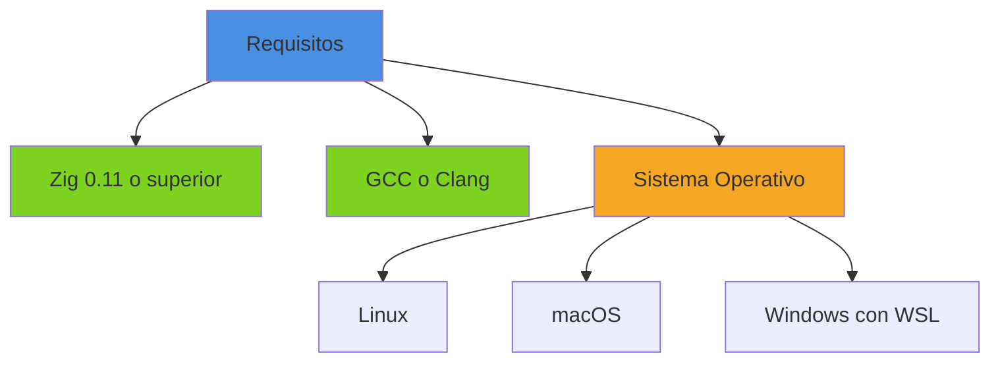
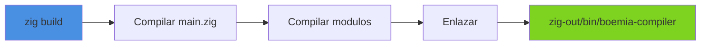
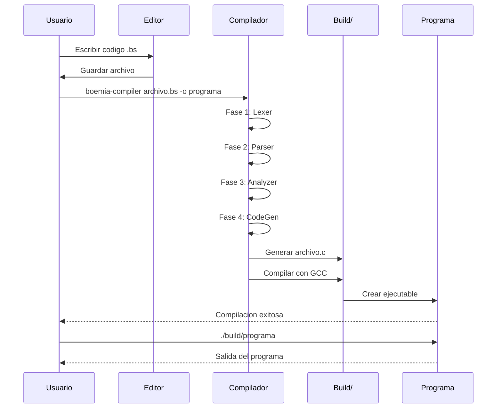
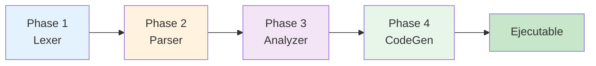
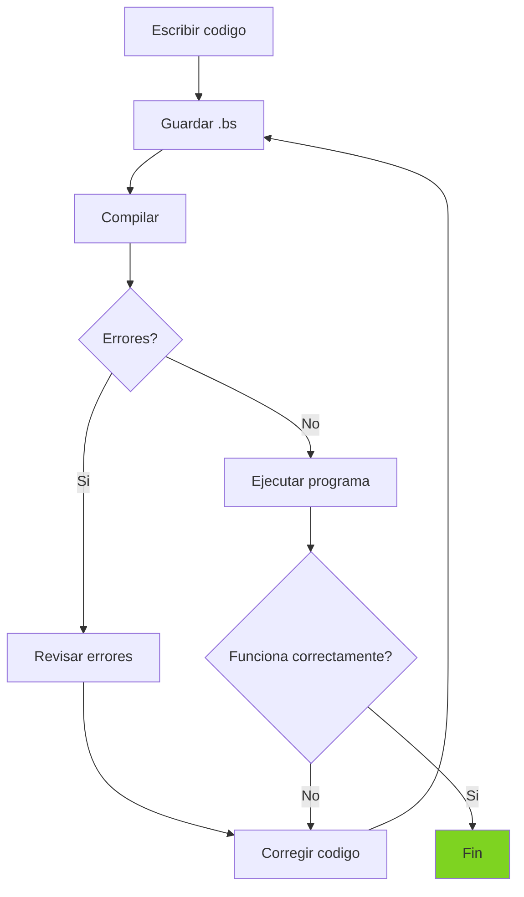

# Guia de Uso de Boemia Script

## Introduccion

Esta guia proporciona instrucciones completas para instalar, configurar y usar el compilador de Boemia Script.

## Requisitos del Sistema

### Software Necesario



#### Zig Compiler

**Version Minima**: 0.11

**Instalacion**:

Linux:
```bash
# Descargar Zig
wget https://ziglang.org/download/0.11.0/zig-linux-x86_64-0.11.0.tar.xz
tar -xf zig-linux-x86_64-0.11.0.tar.xz
sudo mv zig-linux-x86_64-0.11.0 /opt/zig
echo 'export PATH=$PATH:/opt/zig' >> ~/.bashrc
source ~/.bashrc
```

macOS:
```bash
brew install zig
```

**Verificacion**:
```bash
zig version
# Debe mostrar: 0.11.0 o superior
```

#### GCC o Clang

**Instalacion**:

Linux (Debian/Ubuntu):
```bash
sudo apt update
sudo apt install build-essential
```

Linux (Fedora):
```bash
sudo dnf install gcc
```

macOS:
```bash
xcode-select --install
```

**Verificacion**:
```bash
gcc --version
# o
clang --version
```

## Instalacion del Compilador

### Paso 1: Clonar el Repositorio

```bash
git clone https://github.com/tu-usuario/boemia-script
cd boemia-script
```

### Paso 2: Compilar el Compilador

```bash
zig build
```

Este comando:
1. Compila todos los archivos fuente en `src/`
2. Genera el ejecutable `boemia-compiler`
3. Lo coloca en `zig-out/bin/`



### Paso 3: Verificar Instalacion

```bash
./zig-out/bin/boemia-compiler
```

Deberia mostrar:
```
Boemia Script Compiler

Usage:
  boemia-compiler <input.bs> [-o output]

Options:
  -o <output>    Specify output executable name (default: output)

Examples:
  boemia-compiler hello.bs
  boemia-compiler hello.bs -o hello
  boemia-compiler examples/factorial.bs -o factorial
```

### Paso 4: (Opcional) Agregar al PATH

Para usar el compilador desde cualquier ubicacion:

```bash
# Agregar al .bashrc o .zshrc
echo 'export PATH=$PATH:/ruta/completa/a/boemia-script/zig-out/bin' >> ~/.bashrc
source ~/.bashrc

# Ahora puedes usar:
boemia-compiler archivo.bs
```

## Uso Basico

### Compilar un Programa

```bash
boemia-compiler <archivo.bs> -o <nombre_salida>
```

**Parametros**:
- `<archivo.bs>`: Archivo fuente de Boemia Script
- `-o <nombre_salida>`: (Opcional) Nombre del ejecutable de salida

### Ejemplo Completo

**1. Crear archivo `hola.bs`**:

```boemia
let mensaje: string = "Hola, Boemia Script!";
print(mensaje);

let x: int = 42;
print(x);
```

**2. Compilar**:

```bash
./zig-out/bin/boemia-compiler hola.bs -o hola
```

**3. Ejecutar**:

```bash
./build/hola
```

**Salida**:
```
Hola, Boemia Script!
42
```

## Flujo de Trabajo Completo



## Output del Compilador

Durante la compilacion, el compilador muestra informacion detallada:

```
Boemia Script Compiler
━━━━━━━━━━━━━━━━━━━━━━━━━━━━━━━━━━━━━━━━
Input:  hola.bs
Output: hola
━━━━━━━━━━━━━━━━━━━━━━━━━━━━━━━━━━━━━━━━

Phase 1: Lexical Analysis (Tokenization)
Phase 2: Syntax Analysis (Building AST)
   ✓ Successfully parsed 4 statements
Phase 3: Semantic Analysis (Type Checking)
   ✓ Type checking passed
Phase 4: Code Generation (C Code)
Successfully compiled to: build/hola

Compilation successful!
━━━━━━━━━━━━━━━━━━━━━━━━━━━━━━━━━━━━━━━━
Run your program with: ./build/hola
━━━━━━━━━━━━━━━━━━━━━━━━━━━━━━━━━━━━━━━━
```

### Fases del Compilador



## Manejo de Errores

### Errores Lexicos

**Ejemplo**:
```boemia
let x: int = 42!;
```

**Output**:
```
Phase 1: Lexical Analysis (Tokenization)
Token ILLEGAL at line 1, column 17: '!'
```

### Errores Sintacticos

**Ejemplo**:
```boemia
make x int = 42;
```

**Output**:
```
Phase 2: Syntax Analysis (Building AST)
Parsing Error:
  • Expected COLON, got TYPE_INT at 1:8
```

### Errores Semanticos

**Ejemplo**:
```boemia
let x: int = "hola";
```

**Output**:
```
Phase 3: Semantic Analysis (Type Checking)
Semantic Analysis Error:
  • Type mismatch: cannot assign string to int
```

### Errores de Compilacion C

**Ejemplo** (codigo generado invalido):
```
Phase 4: Code Generation (C Code)
Code Generation Error: ...
```

## Estructura de Directorios

```
boemia-script/
├── src/                    # Codigo fuente del compilador
├── examples/               # Programas de ejemplo
├── tests/                  # Suite de tests
├── build/                  # Ejecutables compilados
├── zig-out/
│   └── bin/
│       └── boemia-compiler # Compilador
├── build.zig              # Script de build
└── README.md
```

## Ejemplos Incluidos

El proyecto incluye varios ejemplos en `examples/`:

### hello.bs - Programa Completo

```boemia
let mensaje: string = "Hola, Boemia Script!";
print(mensaje);

let counter: int = 0;
while counter < 5 {
    print(counter);
    counter = counter + 1;
}

for i: int = 1; i <= 10; i = i + 1 {
    print(i);
}
```

**Compilar y Ejecutar**:
```bash
./zig-out/bin/boemia-compiler examples/hello.bs -o hello
./build/hello
```

### types.bs - Tipos de Datos

```boemia
let numero: int = 42;
print(numero);

let pi: float = 3.14159;
print(pi);

let mensaje: string = "Boemia Script funciona!";
print(mensaje);

let activo: bool = true;
print(activo);
```

### conditionals.bs - Condicionales

```boemia
let x: int = 15;

if x > 10 {
    print("x es mayor que 10");
}

let score: int = 75;
if score >= 90 {
    print("A");
} else if score >= 80 {
    print("B");
} else if score >= 70 {
    print("C");
} else {
    print("F");
}
```

### loops.bs - Bucles

```bash
./zig-out/bin/boemia-compiler examples/loops.bs -o loops
./build/loops
```

## Comandos Utiles

### Compilar con Nombre por Defecto

```bash
./zig-out/bin/boemia-compiler programa.bs
# Genera: build/output
```

### Recompilar el Compilador

```bash
zig build
```

### Limpiar Build

```bash
rm -rf zig-out/ build/
```

### Ejecutar Tests

```bash
zig build test
```

### Compilar Ejemplo Especifico

```bash
zig build example
```

## Resolucion de Problemas

### Error: "zig: command not found"

**Solucion**: Zig no esta instalado o no esta en el PATH.

```bash
# Verificar instalacion
which zig

# Si no esta, instalarlo segun instrucciones arriba
```

### Error: "gcc: command not found"

**Solucion**: GCC no esta instalado.

```bash
# Linux
sudo apt install build-essential

# macOS
xcode-select --install
```

### Error: "Permission denied" al ejecutar

**Solucion**: Dar permisos de ejecucion.

```bash
chmod +x ./build/programa
```

### Error: Archivo .bs no encontrado

**Solucion**: Verificar ruta del archivo.

```bash
# Usar ruta relativa o absoluta
./zig-out/bin/boemia-compiler ./mi_programa.bs
```

### El compilador se cierra sin mensaje

**Solucion**: Probable error de segmentacion. Reportar bug con el archivo .bs que causa el problema.

## Mejores Practicas

### Organizacion de Proyectos

```
mi_proyecto/
├── src/
│   ├── main.bs
│   └── utils.bs
├── build/
└── README.md
```

### Nomenclatura de Archivos

- Usar extension `.bs` para archivos de Boemia Script
- Nombres descriptivos: `calculadora.bs`, `fibonacci.bs`
- Sin espacios: usar `mi_programa.bs` no `mi programa.bs`

### Workflow Recomendado

1. Escribir codigo en editor de texto
2. Guardar con extension `.bs`
3. Compilar con `boemia-compiler`
4. Revisar mensajes de error
5. Corregir y recompilar
6. Ejecutar programa



## Desarrollo con Docker

El proyecto incluye soporte para Docker:

### Construccion de Imagen

```bash
docker-compose build
```

### Ejecutar Compilador

```bash
docker-compose run compiler examples/hello.bs -o hello
```

Ver [DOCKER.md](../DOCKER.md) para mas detalles.

## Actualizaciones

Para actualizar a la ultima version:

```bash
git pull origin main
zig build
```

## Soporte y Ayuda

- **Documentacion**: Ver carpeta `Documentation/`
- **Ejemplos**: Ver carpeta `examples/`
- **Issues**: Reportar en GitHub Issues
- **Contribuciones**: Ver [CONTRIBUTING.md](24-CONTRIBUTING.md)

## Proximos Pasos

Una vez familiarizado con el uso basico:

1. Revisar [Sintaxis del Lenguaje](10-SYNTAX.md)
2. Estudiar [Ejemplos Practicos](17-EXAMPLES.md)
3. Explorar [Sistema de Tipos](09-TYPE-SYSTEM.md)
4. Entender [Arquitectura del Compilador](02-ARCHITECTURE.md)
