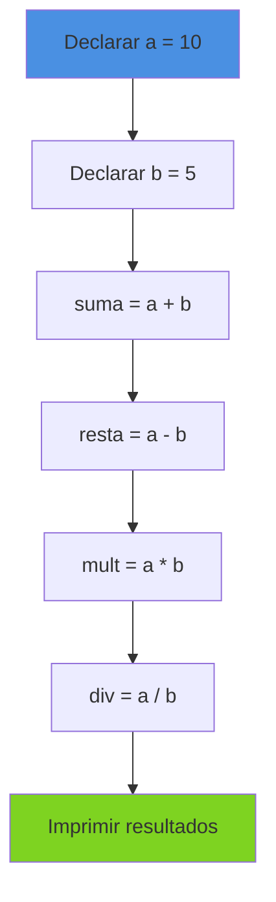
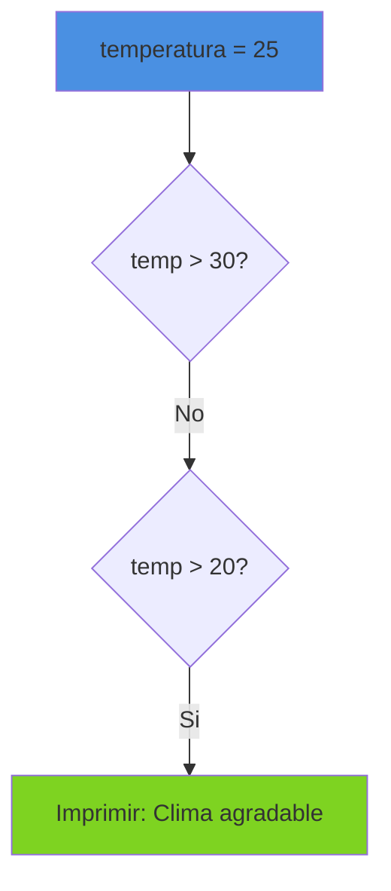
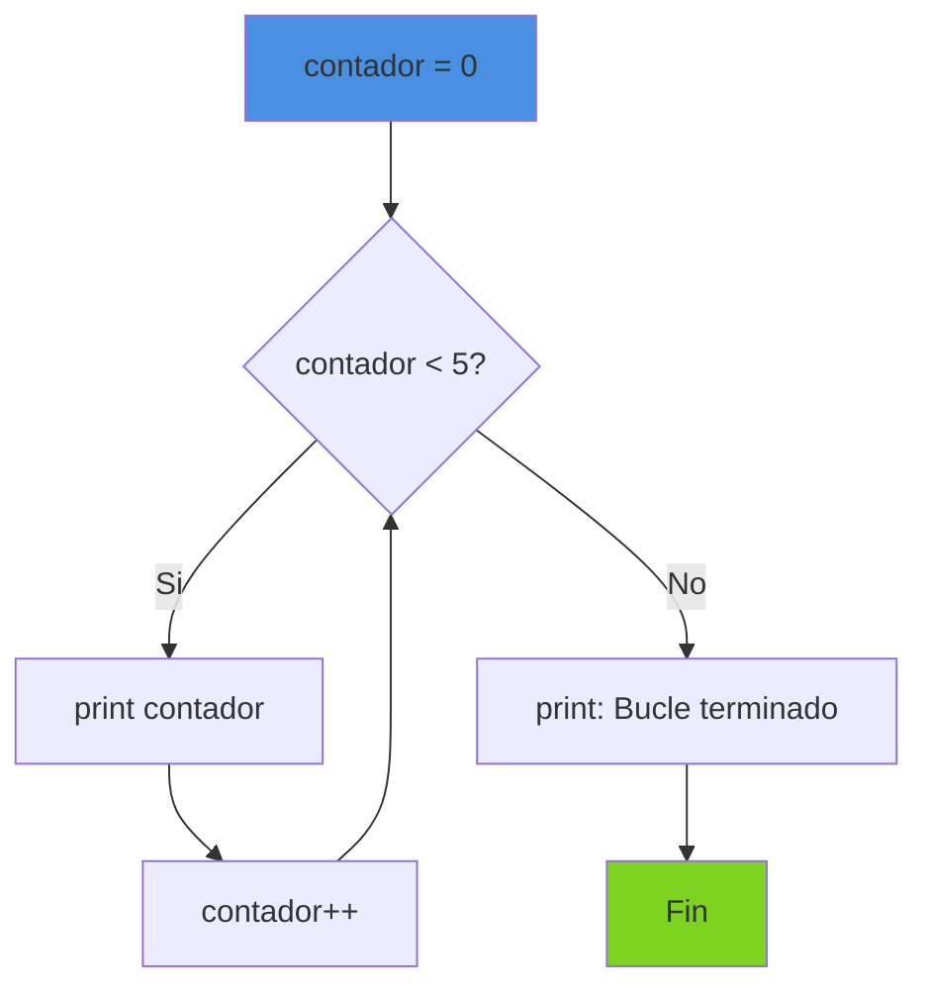
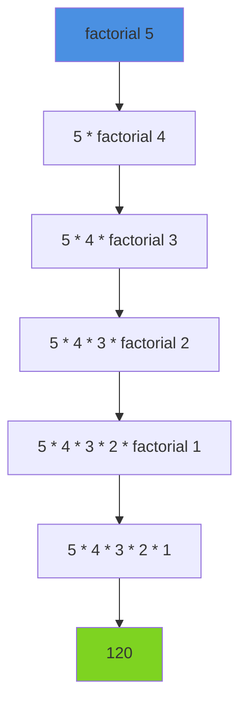
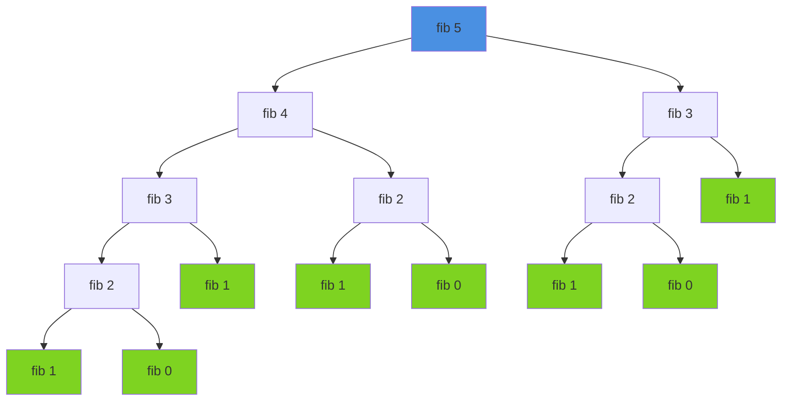
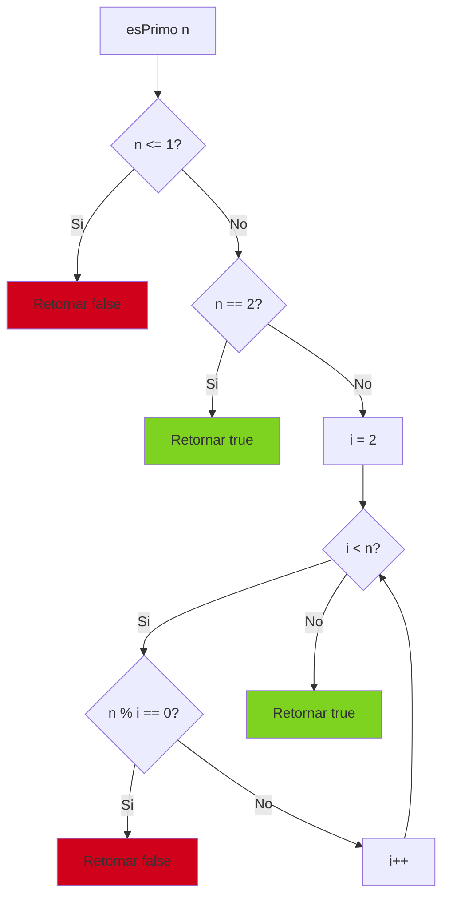
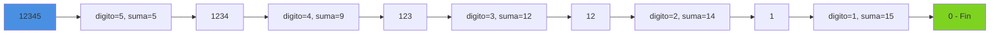

# Ejemplos Practicos de Boemia Script

## Introduccion

Este documento presenta ejemplos completos y comentados de programas escritos en Boemia Script, desde los mas basicos hasta aplicaciones mas complejas.

## Nivel Principiante

### Ejemplo 1: Hola Mundo

```boemia
// Programa mas simple en Boemia Script
let mensaje: string = "Hola Mundo";
print(mensaje);
```

**Output**:
```
Hola Mundo
```

**Explicacion**:
- Declara una variable mutable `mensaje` de tipo `string`
- Asigna el valor "Hola Mundo"
- Imprime el contenido de la variable

### Ejemplo 2: Operaciones Aritmeticas Basicas

```boemia
let a: int = 10;
let b: int = 5;

let suma: int = a + b;
let resta: int = a - b;
let multiplicacion: int = a * b;
let division: int = a / b;

print(suma);            // 15
print(resta);           // 5
print(multiplicacion);  // 50
print(division);        // 2
```

**Diagrama de Flujo**:



### Ejemplo 3: Uso de Constantes

```boemia
// Constantes matematicas
const PI: float = 3.14159;
const E: float = 2.71828;

let radio: float = 5.0;
let area: float = PI * radio * radio;

print(area);  // 78.53975
```

**Importante**: Intentar modificar `PI` o `E` resultaria en error de compilacion.

### Ejemplo 4: Comparaciones

```boemia
let edad: int = 25;

let esMayor: bool = edad >= 18;
let esMenor: bool = edad < 18;
let esIgual: bool = edad == 25;
let esDiferente: bool = edad != 30;

print(esMayor);      // true
print(esMenor);      // false
print(esIgual);      // true
print(esDiferente);  // true
```

## Nivel Intermedio

### Ejemplo 5: Condicionales Simples

```boemia
let temperatura: int = 25;

if temperatura > 30 {
    print("Hace mucho calor");
} else if temperatura > 20 {
    print("Clima agradable");
} else if temperatura > 10 {
    print("Hace frio");
} else {
    print("Hace mucho frio");
}
```

**Output**: `Clima agradable`



### Ejemplo 6: Validacion con Condicionales Anidados

```boemia
let edad: int = 20;
let tieneLicencia: bool = true;
let tieneSeguro: bool = true;

if edad >= 18 {
    if tieneLicencia == true {
        if tieneSeguro == true {
            print("Puede conducir legalmente");
        } else {
            print("Necesita seguro de auto");
        }
    } else {
        print("Necesita obtener licencia");
    }
} else {
    print("Muy joven para conducir");
}
```

**Output**: `Puede conducir legalmente`

### Ejemplo 7: Bucle while - Contador

```boemia
let contador: int = 0;

while contador < 5 {
    print(contador);
    contador = contador + 1;
}

print("Bucle terminado");
```

**Output**:
```
0
1
2
3
4
Bucle terminado
```

**Flujo de Ejecucion**:



### Ejemplo 8: Bucle for - Tabla de Multiplicar

```boemia
const NUMERO: int = 7;

for i: int = 1; i <= 10; i = i + 1 {
    let resultado: int = NUMERO * i;
    print(resultado);
}
```

**Output**: Tabla del 7
```
7
14
21
28
35
42
49
56
63
70
```

### Ejemplo 9: Numeros Pares e Impares

```boemia
for i: int = 1; i <= 20; i = i + 1 {
    let resto: int = i % 2;

    if resto == 0 {
        print("Par");
    } else {
        print("Impar");
    }
}
```

## Nivel Avanzado

### Ejemplo 10: Factorial Recursivo

```boemia
fn factorial(n: int): int {
    if n <= 1 {
        return 1;
    }
    return n * factorial(n - 1);
}

let numero: int = 5;
let resultado: int = factorial(numero);
print(resultado);  // 120
```

**Arbol de Recursion**:



**Trazado de Llamadas**:

| Llamada | n | Retorna |
|---------|---|---------|
| factorial(5) | 5 | 5 * factorial(4) = 120 |
| factorial(4) | 4 | 4 * factorial(3) = 24 |
| factorial(3) | 3 | 3 * factorial(2) = 6 |
| factorial(2) | 2 | 2 * factorial(1) = 2 |
| factorial(1) | 1 | 1 (caso base) |

### Ejemplo 11: Fibonacci Recursivo

```boemia
fn fibonacci(n: int): int {
    if n <= 1 {
        return n;
    }
    return fibonacci(n - 1) + fibonacci(n - 2);
}

for i: int = 0; i < 10; i = i + 1 {
    let fib: int = fibonacci(i);
    print(fib);
}
```

**Output**: Secuencia de Fibonacci
```
0
1
1
2
3
5
8
13
21
34
```

**Arbol de Recursion para fibonacci(5)**:



### Ejemplo 12: Suma de Funcion

```boemia
fn suma(a: int, b: int): int {
    return a + b;
}

fn resta(a: int, b: int): int {
    return a - b;
}

fn multiplica(a: int, b: int): int {
    return a * b;
}

let x: int = 10;
let y: int = 5;

let s: int = suma(x, y);
let r: int = resta(x, y);
let m: int = multiplica(x, y);

print(s);  // 15
print(r);  // 5
print(m);  // 50
```

### Ejemplo 13: Numero Primo

```boemia
fn esPrimo(n: int): bool {
    if n <= 1 {
        return false;
    }

    if n == 2 {
        return true;
    }

    for i: int = 2; i < n; i = i + 1 {
        let resto: int = n % i;
        if resto == 0 {
            return false;
        }
    }

    return true;
}

for num: int = 1; num <= 20; num = num + 1 {
    let primo: bool = esPrimo(num);

    if primo == true {
        print(num);
    }
}
```

**Output**: Numeros primos del 1 al 20
```
2
3
5
7
11
13
17
19
```

**Algoritmo**:



### Ejemplo 14: MCD (Maximo Comun Divisor) - Algoritmo de Euclides

```boemia
fn mcd(a: int, b: int): int {
    while b != 0 {
        let temp: int = b;
        b = a % b;
        a = temp;
    }
    return a;
}

let resultado: int = mcd(48, 18);
print(resultado);  // 6
```

**Trazado**:

| Iteracion | a | b | temp | a % b |
|-----------|---|---|------|-------|
| 1 | 48 | 18 | 18 | 12 |
| 2 | 18 | 12 | 12 | 6 |
| 3 | 12 | 6 | 6 | 0 |
| 4 | 6 | 0 | - | - |

### Ejemplo 15: Potencia

```boemia
fn potencia(base: int, exponente: int): int {
    if exponente == 0 {
        return 1;
    }

    let resultado: int = 1;

    for i: int = 0; i < exponente; i = i + 1 {
        resultado = resultado * base;
    }

    return resultado;
}

let pot1: int = potencia(2, 3);   // 8
let pot2: int = potencia(5, 2);   // 25
let pot3: int = potencia(10, 0);  // 1

print(pot1);
print(pot2);
print(pot3);
```

### Ejemplo 16: Suma de Digitos

```boemia
fn sumaDigitos(n: int): int {
    let suma: int = 0;

    while n > 0 {
        let digito: int = n % 10;
        suma = suma + digito;
        n = n / 10;
    }

    return suma;
}

let numero: int = 12345;
let resultado: int = sumaDigitos(numero);
print(resultado);  // 15 (1+2+3+4+5)
```

**Proceso**:



### Ejemplo 17: Invertir Numero

```boemia
fn invertir(n: int): int {
    let resultado: int = 0;

    while n > 0 {
        let digito: int = n % 10;
        resultado = resultado * 10 + digito;
        n = n / 10;
    }

    return resultado;
}

let numero: int = 12345;
let invertido: int = invertir(numero);
print(invertido);  // 54321
```

### Ejemplo 18: Programa Completo - Calculadora

```boemia
fn sumar(a: int, b: int): int {
    return a + b;
}

fn restar(a: int, b: int): int {
    return a - b;
}

fn multiplicar(a: int, b: int): int {
    return a * b;
}

fn dividir(a: int, b: int): int {
    if b == 0 {
        print("Error: Division por cero");
        return 0;
    }
    return a / b;
}

let a: int = 20;
let b: int = 5;

print("Suma:");
print(sumar(a, b));

print("Resta:");
print(restar(a, b));

print("Multiplicacion:");
print(multiplicar(a, b));

print("Division:");
print(dividir(a, b));
```

**Output**:
```
Suma:
25
Resta:
15
Multiplicacion:
100
Division:
4
```

## Patrones Comunes

### Patron 1: Acumulador

```boemia
let suma: int = 0;

for i: int = 1; i <= 100; i = i + 1 {
    suma = suma + i;
}

print(suma);  // 5050
```

### Patron 2: Bandera (Flag)

```boemia
let encontrado: bool = false;
let objetivo: int = 7;

for i: int = 1; i <= 10; i = i + 1 {
    if i == objetivo {
        encontrado = true;
    }
}

if encontrado == true {
    print("Numero encontrado");
} else {
    print("Numero no encontrado");
}
```

### Patron 3: Contador

```boemia
let contador: int = 0;

for i: int = 1; i <= 20; i = i + 1 {
    let resto: int = i % 2;
    if resto == 0 {
        contador = contador + 1;
    }
}

print("Numeros pares:");
print(contador);  // 10
```

## Compilacion y Ejecucion

Para todos estos ejemplos:

```bash
# Guardar en archivo
echo "codigo" > ejemplo.bs

# Compilar
./zig-out/bin/boemia-compiler ejemplo.bs -o ejemplo

# Ejecutar
./build/ejemplo
```

## Proximos Pasos

- Estudiar [Sintaxis del Lenguaje](10-SYNTAX.md) para detalles completos
- Revisar [Sistema de Tipos](09-TYPE-SYSTEM.md) para verificacion de tipos
- Consultar [Guia de Uso](16-USER-GUIDE.md) para compilacion
