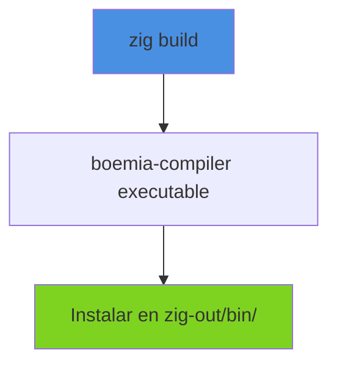
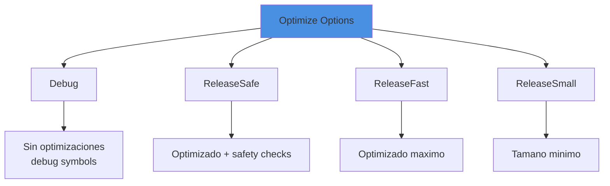
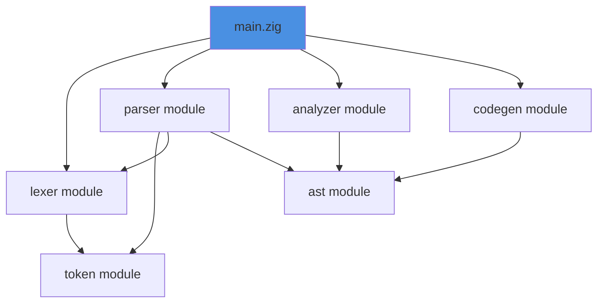
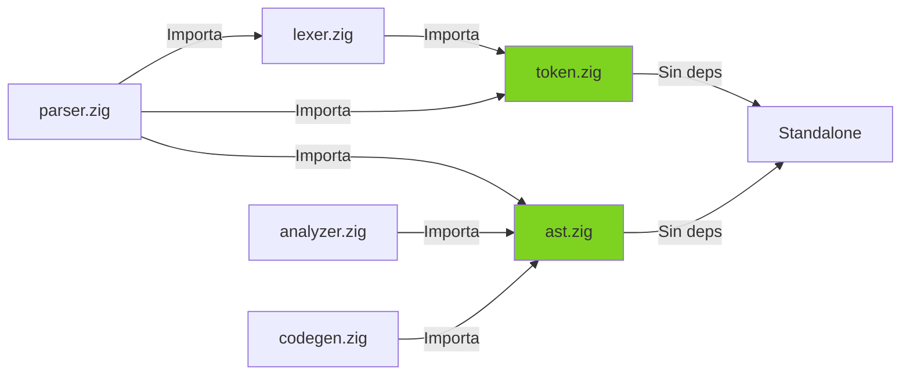
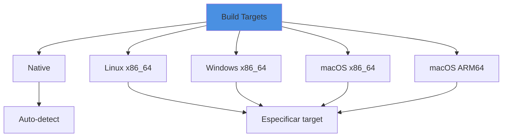
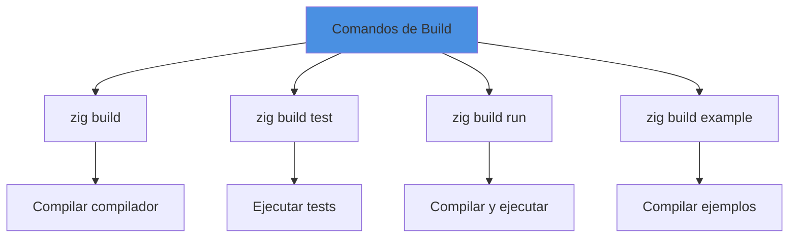

# Sistema de Build

## Introduccion

El sistema de build de Boemia Script usa Zig Build System, que proporciona una forma declarativa y type-safe de compilar el compilador y ejecutar tests.

## Archivo build.zig

### Estructura

```zig
const std = @import("std");

pub fn build(b: *std.Build) void {
    const target = b.standardTargetOptions(.{});
    const optimize = b.standardOptimizeOption(.{});

    // 1. Compilar el ejecutable principal
    // 2. Configurar modulos
    // 3. Configurar tests
    // 4. Configurar steps personalizados
}
```

## Compilacion del Ejecutable Principal



**Codigo**:
```zig
const exe = b.addExecutable(.{
    .name = "boemia-compiler",
    .root_module = b.createModule(.{
        .root_source_file = b.path("src/main.zig"),
        .target = target,
        .optimize = optimize,
    }),
});

b.installArtifact(exe);
```

### Opciones de Optimizacion



**Uso**:
```bash
zig build                          # Debug (default)
zig build -Doptimize=ReleaseFast   # Release rapido
zig build -Doptimize=ReleaseSmall  # Release pequeno
```

## Sistema de Modulos



### Configuracion de Modulos

```zig
// Token module
const token_module = b.createModule(.{
    .root_source_file = b.path("src/token.zig"),
    .target = target,
    .optimize = optimize,
});

// AST module
const ast_module = b.createModule(.{
    .root_source_file = b.path("src/ast.zig"),
    .target = target,
    .optimize = optimize,
});

// Lexer module con dependencia
const lexer_module = b.createModule(.{
    .root_source_file = b.path("src/lexer.zig"),
    .target = target,
    .optimize = optimize,
});
lexer_module.addImport("token.zig", token_module);
```

### Grafo de Dependencias



## Sistema de Tests

### Configuracion

```zig
const test_module = b.createModule(.{
    .root_source_file = b.path("tests/test_runner.zig"),
    .target = target,
    .optimize = optimize,
});
test_module.addImport("token.zig", token_module);
test_module.addImport("lexer.zig", lexer_module);
test_module.addImport("parser.zig", parser_module);
test_module.addImport("ast.zig", ast_module);
test_module.addImport("analyzer.zig", analyzer_module);
test_module.addImport("codegen.zig", codegen_module);

const unit_tests = b.addTest(.{
    .root_module = test_module,
});

const run_unit_tests = b.addRunArtifact(unit_tests);

const test_step = b.step("test", "Run unit tests");
test_step.dependOn(&run_unit_tests.step);
```

### Ejecutar Tests

```bash
zig build test
```

**Salida**:
```
All 15 tests passed.
```

## Steps Personalizados

### Run Step

Permite ejecutar el compilador directamente con `zig build run`:

```zig
const run_cmd = b.addRunArtifact(exe);
run_cmd.step.dependOn(b.getInstallStep());

if (b.args) |args| {
    run_cmd.addArgs(args);
}

const run_step = b.step("run", "Run the Boemia Script compiler");
run_step.dependOn(&run_cmd.step);
```

**Uso**:
```bash
zig build run -- examples/hello.bs -o hello
```

### Example Step

Compila y ejecuta ejemplos:

```zig
const example_step = b.step("example", "Compile and run example programs");

const compile_example = b.addSystemCommand(&[_][]const u8{
    "./zig-out/bin/boemia-compiler",
    "examples/hello.bs",
    "-o",
    "hello",
});
compile_example.step.dependOn(b.getInstallStep());
example_step.dependOn(&compile_example.step);
```

**Uso**:
```bash
zig build example
```

## Targets Cross-platform



**Compilacion cruzada**:
```bash
# Para Linux desde cualquier OS
zig build -Dtarget=x86_64-linux

# Para Windows desde cualquier OS
zig build -Dtarget=x86_64-windows

# Para macOS ARM desde cualquier OS
zig build -Dtarget=aarch64-macos
```

## Estructura de Directorios Build

```
boemia-script/
├── build.zig          # Sistema de build
├── build/             # Codigo C generado y ejecutables
│   ├── *.c
│   └── *
├── zig-cache/         # Cache de Zig
├── zig-out/           # Output de Zig build
│   ├── bin/
│   │   └── boemia-compiler
│   └── lib/
├── src/               # Codigo fuente
├── tests/             # Tests
└── examples/          # Ejemplos
```

## Comandos Comunes



| Comando | Descripcion | Ejemplo |
|---------|-------------|---------|
| `zig build` | Compilar el compilador | `zig build` |
| `zig build test` | Ejecutar tests | `zig build test` |
| `zig build run -- <args>` | Compilar y ejecutar | `zig build run -- prog.bs -o prog` |
| `zig build -Doptimize=<mode>` | Compilar con optimizacion | `zig build -Doptimize=ReleaseFast` |
| `zig build -Dtarget=<triple>` | Cross-compilacion | `zig build -Dtarget=x86_64-linux` |
| `zig build example` | Compilar ejemplos | `zig build example` |

## CI/CD Integration

### GitHub Actions

```yaml
name: Build and Test

on: [push, pull_request]

jobs:
  build:
    runs-on: ubuntu-latest
    steps:
      - uses: actions/checkout@v2

      - name: Setup Zig
        uses: goto-bus-stop/setup-zig@v2
        with:
          version: 0.11.0

      - name: Build
        run: zig build

      - name: Run Tests
        run: zig build test

      - name: Build Examples
        run: zig build example
```

### GitLab CI

```yaml
stages:
  - build
  - test

build:
  stage: build
  image: ziglang/zig:0.11.0
  script:
    - zig build
  artifacts:
    paths:
      - zig-out/

test:
  stage: test
  image: ziglang/zig:0.11.0
  script:
    - zig build test
```

## Limpieza

```bash
# Limpiar todo
rm -rf zig-cache/ zig-out/ build/

# Reconstruir desde cero
zig build
```

## Dependencias Externas

Actualmente, Boemia Script NO tiene dependencias externas de Zig. Solo depende de:
- Zig standard library
- GCC/Clang (en runtime para compilar C)

**Mejora futura**: Si se agregaran dependencias:

```zig
const dep = b.dependency("nombre_dep", .{
    .target = target,
    .optimize = optimize,
});

exe.root_module.addImport("dep", dep.module("dep"));
```

## Build Modes Comparison

| Modo | Tamano | Velocidad | Debug | Uso |
|------|--------|-----------|-------|-----|
| Debug | Grande | Lento | Si | Desarrollo |
| ReleaseSafe | Medio | Rapido | Limitado | Testing |
| ReleaseFast | Medio | Muy rapido | No | Produccion performance |
| ReleaseSmall | Pequeno | Rapido | No | Produccion tamano |

## Mejoras Futuras

### 1. Install Step Mejorado

```zig
const install_step = b.step("install", "Install to system");
install_step.dependOn(&b.addInstallArtifact(exe, .{
    .dest_dir = .{
        .override = .{ .custom = "/usr/local/bin" },
    },
}).step);
```

### 2. Package Manager

```zig
const pkg = b.addPackage(.{
    .name = "boemia",
    .source = .{ .path = "src/root.zig" },
});
```

### 3. Documentation Generation

```zig
const docs = b.addTest(.{
    .root_source_file = .{ .path = "src/main.zig" },
    .target = target,
});
docs.emit_docs = .emit;

const docs_step = b.step("docs", "Generate documentation");
docs_step.dependOn(&docs.step);
```

## Referencias

- [Testing](19-TESTING.md) - Sistema de testing
- [GCC Integration](08-GCC-INTEGRATION.md) - Integracion con GCC
