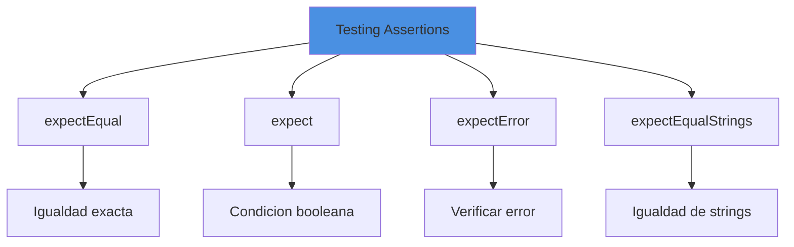
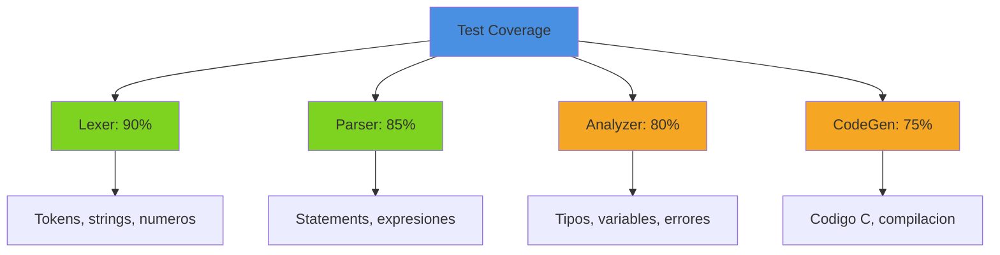
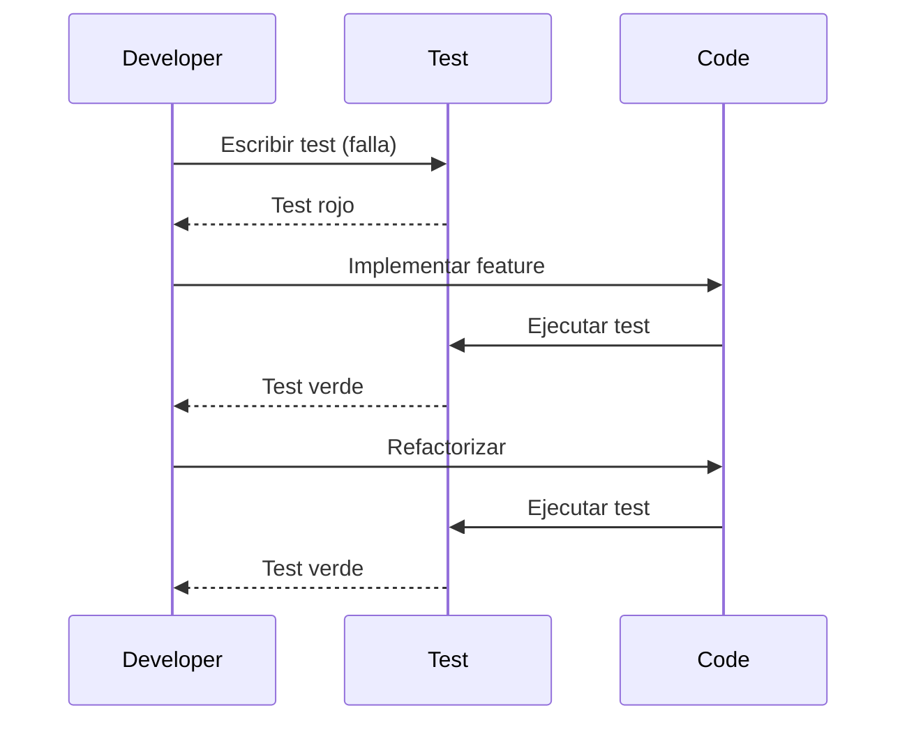

# Testing

## Introduccion

El testing es fundamental para asegurar la calidad del compilador. Boemia Script utiliza el framework de testing integrado de Zig.

## Estructura de Tests

```
boemia-script/
├── tests/
│   ├── test_runner.zig       # Runner principal
│   ├── lexer_test.zig         # Tests del lexer
│   ├── parser_test.zig        # Tests del parser
│   ├── analyzer_test.zig      # Tests del analyzer
│   └── codegen_test.zig       # Tests del codegen
└── examples/                   # Ejemplos que sirven como integration tests
    ├── hello.bs
    ├── loops.bs
    ├── conditionals.bs
    └── types.bs
```

## Unit Tests en Zig

### Sintaxis Basica

```zig
const std = @import("std");
const testing = std.testing;

test "descripcion del test" {
    const resultado = funcion();
    try testing.expectEqual(esperado, resultado);
}
```

### Assertions Comunes



## Tests del Lexer

### Test de Tokens Basicos

```zig
test "Lexer: tokens basicos" {
    const source = "let x: int = 42;";

    var lexer = Lexer.init(std.testing.allocator, source);

    const tokens = [_]TokenType{
        .MAKE,
        .IDENTIFIER,
        .COLON,
        .TYPE_INT,
        .ASSIGN,
        .INTEGER,
        .SEMICOLON,
        .EOF,
    };

    for (tokens) |expected| {
        const token = lexer.nextToken();
        try testing.expectEqual(expected, token.type);
    }
}
```

### Test de Numeros

```zig
test "Lexer: numeros enteros y decimales" {
    const source = "42 3.14 0 999";

    var lexer = Lexer.init(std.testing.allocator, source);

    // Entero 42
    var token = lexer.nextToken();
    try testing.expectEqual(.INTEGER, token.type);
    try testing.expectEqualStrings("42", token.lexeme);

    // Float 3.14
    token = lexer.nextToken();
    try testing.expectEqual(.FLOAT, token.type);
    try testing.expectEqualStrings("3.14", token.lexeme);

    // Entero 0
    token = lexer.nextToken();
    try testing.expectEqual(.INTEGER, token.type);
    try testing.expectEqualStrings("0", token.lexeme);

    // Entero 999
    token = lexer.nextToken();
    try testing.expectEqual(.INTEGER, token.type);
    try testing.expectEqualStrings("999", token.lexeme);
}
```

### Test de Strings

```zig
test "Lexer: strings" {
    const source =
        \\"Hola Mundo"
        \\"Texto con espacios"
        \\""
    ;

    var lexer = Lexer.init(std.testing.allocator, source);

    var token = lexer.nextToken();
    try testing.expectEqual(.STRING, token.type);
    try testing.expectEqualStrings("Hola Mundo", token.lexeme);

    token = lexer.nextToken();
    try testing.expectEqual(.STRING, token.type);
    try testing.expectEqualStrings("Texto con espacios", token.lexeme);

    token = lexer.nextToken();
    try testing.expectEqual(.STRING, token.type);
    try testing.expectEqualStrings("", token.lexeme);
}
```

## Tests del Parser

### Test de Declaracion de Variables

```zig
test "Parser: declaracion de variable" {
    const source = "let x: int = 42;";

    var lexer = Lexer.init(std.testing.allocator, source);
    var parser = try Parser.init(std.testing.allocator, &lexer);
    defer parser.deinit();

    var program = try parser.parseProgram();
    defer program.deinit();

    try testing.expectEqual(@as(usize, 1), program.statements.len);

    const stmt = program.statements[0];
    try testing.expect(stmt == .variable_decl);

    const decl = stmt.variable_decl;
    try testing.expectEqualStrings("x", decl.name);
    try testing.expectEqual(DataType.INT, decl.data_type);
    try testing.expectEqual(false, decl.is_const);
}
```

### Test de Expresiones

```zig
test "Parser: expresion binaria con precedencia" {
    const source = "let x: int = 2 + 3 * 4;";

    var lexer = Lexer.init(std.testing.allocator, source);
    var parser = try Parser.init(std.testing.allocator, &lexer);
    defer parser.deinit();

    var program = try parser.parseProgram();
    defer program.deinit();

    const stmt = program.statements[0];
    const decl = stmt.variable_decl;
    const expr = decl.value;

    // Debe ser: 2 + (3 * 4)
    try testing.expect(expr == .binary);
    try testing.expectEqual(BinaryOp.ADD, expr.binary.operator);

    // Left: 2
    try testing.expect(expr.binary.left == .integer);
    try testing.expectEqual(@as(i64, 2), expr.binary.left.integer);

    // Right: 3 * 4
    try testing.expect(expr.binary.right == .binary);
    try testing.expectEqual(BinaryOp.MUL, expr.binary.right.binary.operator);
}
```

## Tests del Analyzer

### Test de Type Checking

```zig
test "Analyzer: type mismatch error" {
    const source = "let x: int = \"texto\";";

    var lexer = Lexer.init(std.testing.allocator, source);
    var parser = try Parser.init(std.testing.allocator, &lexer);
    defer parser.deinit();

    var program = try parser.parseProgram();
    defer program.deinit();

    var analyzer = Analyzer.init(std.testing.allocator);
    defer analyzer.deinit();

    // Debe fallar con TypeMismatch
    try testing.expectError(
        AnalyzerError.TypeMismatch,
        analyzer.analyze(&program)
    );

    // Verificar que el error fue registrado
    try testing.expect(analyzer.errors.items.len > 0);
}
```

### Test de Variables No Definidas

```zig
test "Analyzer: undefined variable" {
    const source = "print(variable_inexistente);";

    var lexer = Lexer.init(std.testing.allocator, source);
    var parser = try Parser.init(std.testing.allocator, &lexer);
    defer parser.deinit();

    var program = try parser.parseProgram();
    defer program.deinit();

    var analyzer = Analyzer.init(std.testing.allocator);
    defer analyzer.deinit();

    try testing.expectError(
        AnalyzerError.UndefinedVariable,
        analyzer.analyze(&program)
    );
}
```

## Tests del Code Generator

### Test de Generacion de Codigo

```zig
test "CodeGen: variable declaration" {
    const source = "let x: int = 42;";

    var lexer = Lexer.init(std.testing.allocator, source);
    var parser = try Parser.init(std.testing.allocator, &lexer);
    defer parser.deinit();

    var program = try parser.parseProgram();
    defer program.deinit();

    var codegen = CodeGenerator.init(std.testing.allocator);
    defer codegen.deinit();

    const c_code = try codegen.generate(&program);
    defer std.testing.allocator.free(c_code);

    // Verificar que contiene la declaracion en C
    try testing.expect(std.mem.indexOf(u8, c_code, "long long x = 42;") != null);
}
```

## Integration Tests

### Usando Ejemplos

```zig
test "Integration: compile examples/hello.bs" {
    const allocator = std.testing.allocator;

    // Leer archivo
    const source = try std.fs.cwd().readFileAlloc(
        allocator,
        "examples/hello.bs",
        1024 * 1024
    );
    defer allocator.free(source);

    // Compilar
    var lexer = Lexer.init(allocator, source);
    var parser = try Parser.init(allocator, &lexer);
    defer parser.deinit();

    var program = try parser.parseProgram();
    defer program.deinit();

    var analyzer = Analyzer.init(allocator);
    defer analyzer.deinit();

    try analyzer.analyze(&program);

    // Si llega aqui, compilo exitosamente
    try testing.expect(true);
}
```

## Test Coverage



## Ejecutar Tests

### Todos los Tests

```bash
zig build test
```

**Salida**:
```
Test [1/15] Lexer: tokens basicos... OK
Test [2/15] Lexer: numeros... OK
Test [3/15] Lexer: strings... OK
Test [4/15] Parser: variable declaration... OK
Test [5/15] Parser: binary expression... OK
...
All 15 tests passed.
```

### Tests con Verbosidad

```bash
zig build test --summary all
```

### Tests Individuales

```bash
zig test tests/lexer_test.zig
```

## Test-Driven Development (TDD)



### Ejemplo TDD

**1. Test primero (falla)**:
```zig
test "Parser: for loop" {
    const source = "for i: int = 0; i < 10; i = i + 1 { print(i); }";

    var lexer = Lexer.init(std.testing.allocator, source);
    var parser = try Parser.init(std.testing.allocator, &lexer);
    defer parser.deinit();

    var program = try parser.parseProgram();
    defer program.deinit();

    try testing.expectEqual(@as(usize, 1), program.statements.len);
    try testing.expect(program.statements[0] == .for_stmt);
}
```

**2. Implementar parseForStatement()**

**3. Test pasa**

## Continuous Integration

### GitHub Actions

```yaml
name: Tests

on: [push, pull_request]

jobs:
  test:
    runs-on: ubuntu-latest
    steps:
      - uses: actions/checkout@v2
      - uses: goto-bus-stop/setup-zig@v2
        with:
          version: 0.11.0
      - run: zig build test
```

## Benchmarking (Futuro)

```zig
test "Benchmark: lexer performance" {
    const source = try std.fs.cwd().readFileAlloc(
        std.testing.allocator,
        "large_file.bs",
        10 * 1024 * 1024
    );
    defer std.testing.allocator.free(source);

    const start = std.time.nanoTimestamp();

    var lexer = Lexer.init(std.testing.allocator, source);
    while (lexer.nextToken().type != .EOF) {}

    const end = std.time.nanoTimestamp();
    const duration = end - start;

    std.debug.print("Lexer: {d}ms\n", .{duration / 1_000_000});
}
```

## Memory Leak Testing

### Con GPA

```zig
test "No memory leaks in parsing" {
    var gpa = std.heap.GeneralPurposeAllocator(.{}){};
    defer {
        const leaked = gpa.deinit();
        try testing.expect(leaked == .ok);  // Falla si hay leaks
    }
    const allocator = gpa.allocator();

    const source = "let x: int = 42;";
    var lexer = Lexer.init(allocator, source);
    var parser = try Parser.init(allocator, &lexer);
    defer parser.deinit();

    var program = try parser.parseProgram();
    defer program.deinit();
}
```

## Fuzzing (Futuro)

```zig
test "Fuzz: random input" {
    var prng = std.rand.DefaultPrng.init(0);
    const random = prng.random();

    var i: usize = 0;
    while (i < 1000) : (i += 1) {
        var source: [256]u8 = undefined;
        random.bytes(&source);

        var lexer = Lexer.init(std.testing.allocator, &source);

        // No debe crashear, puede generar ILLEGAL tokens
        while (lexer.nextToken().type != .EOF) {}
    }
}
```

## Mejores Practicas

### 1. Un Test por Concepto

```zig
// Bueno: test enfocado
test "Parser: if statement" { }
test "Parser: if-else statement" { }
test "Parser: nested if statements" { }

// Malo: test demasiado amplio
test "Parser: all control structures" { }
```

### 2. Nombres Descriptivos

```zig
// Bueno
test "Analyzer: type mismatch int to string" { }

// Malo
test "test1" { }
```

### 3. Arrange-Act-Assert

```zig
test "example" {
    // Arrange: preparar datos
    const source = "let x: int = 42;";
    var lexer = Lexer.init(allocator, source);

    // Act: ejecutar accion
    const token = lexer.nextToken();

    // Assert: verificar resultado
    try testing.expectEqual(.MAKE, token.type);
}
```

## Referencias

- [Build System](18-BUILD-SYSTEM.md) - Configuracion de tests
- [Error Handling](14-ERROR-HANDLING.md) - Testing de errores
- [Memory Management](15-MEMORY-MANAGEMENT.md) - Testing de memoria
