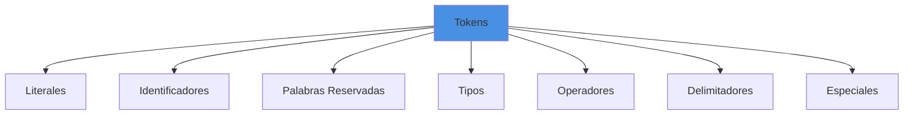

# Referencia Completa de Tokens

## Introduccion

Este documento es una referencia completa de todos los tokens reconocidos por el lexer de Boemia Script.

## Categorias de Tokens



## Literales

### INTEGER

**Descripcion**: Numeros enteros

**Patron**: `[0-9]+`

**Ejemplos**:
```boemia
0
42
1000
999999
```

**Representacion**: `i64` (64-bit signed integer)

### FLOAT

**Descripcion**: Numeros de punto flotante

**Patron**: `[0-9]+\.[0-9]+`

**Ejemplos**:
```boemia
3.14
0.5
999.001
1.0
```

**Representacion**: `f64` (64-bit floating point)

### STRING

**Descripcion**: Cadenas de texto entre comillas dobles

**Patron**: `"[^"]*"`

**Ejemplos**:
```boemia
"Hola Mundo"
"Texto con espacios"
""
"123"
```

**Caracteres soportados**: ASCII imprimible, espacios, newlines dentro del string

**Limitaciones actuales**:
- Sin secuencias de escape (`\n`, `\t`, etc.)
- Sin comillas escapadas dentro del string

### TRUE

**Descripcion**: Literal booleano verdadero

**Lexeme**: `true`

**Tipo**: `bool`

### FALSE

**Descripcion**: Literal booleano falso

**Lexeme**: `false`

**Tipo**: `bool`

## Identificadores

### IDENTIFIER

**Descripcion**: Nombres de variables y funciones

**Patron**: `[a-zA-Z_][a-zA-Z0-9_]*`

**Reglas**:
- Debe comenzar con letra o underscore
- Puede contener letras, digitos y underscores
- Case-sensitive
- No puede ser palabra reservada

**Ejemplos validos**:
```boemia
x
contador
mi_variable
_temp
variable123
CamelCase
snake_case
```

**Ejemplos invalidos**:
```boemia
123variable  // No puede empezar con digito
mi-variable  // - no permitido
my variable  // Espacios no permitidos
make         // Palabra reservada
```

## Palabras Reservadas

### MAKE

**Lexeme**: `make`

**Uso**: Declaracion de variable mutable

**Ejemplo**:
```boemia
make x: int = 5;
```

### SEAL

**Lexeme**: `seal`

**Uso**: Declaracion de constante inmutable

**Ejemplo**:
```boemia
seal PI: float = 3.14159;
```

### FN

**Lexeme**: `fn`

**Uso**: Declaracion de funcion

**Ejemplo**:
```boemia
fn suma(a: int, b: int): int {
    return a + b;
}
```

### RETURN

**Lexeme**: `return`

**Uso**: Retornar valor de funcion

**Ejemplo**:
```boemia
return x + y;
return;
```

### IF

**Lexeme**: `if`

**Uso**: Condicional

**Ejemplo**:
```boemia
if x > 5 {
    print(x);
}
```

### ELSE

**Lexeme**: `else`

**Uso**: Alternativa en condicional

**Ejemplo**:
```boemia
if x > 5 {
    print("mayor");
} else {
    print("menor");
}
```

### WHILE

**Lexeme**: `while`

**Uso**: Bucle condicional

**Ejemplo**:
```boemia
while i < 10 {
    print(i);
    i = i + 1;
}
```

### FOR

**Lexeme**: `for`

**Uso**: Bucle con contador

**Ejemplo**:
```boemia
for i: int = 0; i < 10; i = i + 1 {
    print(i);
}
```

### PRINT

**Lexeme**: `print`

**Uso**: Funcion de salida incorporada

**Ejemplo**:
```boemia
print(42);
print("Hola");
```

## Tipos de Datos

### TYPE_INT

**Lexeme**: `int`

**Uso**: Tipo entero

**Ejemplo**:
```boemia
make x: int = 42;
```

**Mapeo a C**: `long long` (64 bits)

### TYPE_FLOAT

**Lexeme**: `float`

**Uso**: Tipo punto flotante

**Ejemplo**:
```boemia
make pi: float = 3.14159;
```

**Mapeo a C**: `double` (64 bits)

### TYPE_STRING

**Lexeme**: `string`

**Uso**: Tipo cadena de texto

**Ejemplo**:
```boemia
make nombre: string = "Juan";
```

**Mapeo a C**: `char*`

### TYPE_BOOL

**Lexeme**: `bool`

**Uso**: Tipo booleano

**Ejemplo**:
```boemia
make activo: bool = true;
```

**Mapeo a C**: `bool` (C11 stdbool.h)

## Operadores

### Operadores Aritmeticos

| Token | Lexeme | Nombre | Ejemplo |
|-------|--------|--------|---------|
| PLUS | `+` | Suma/Concatenacion | `a + b` |
| MINUS | `-` | Resta/Negacion | `a - b`, `-x` |
| STAR | `*` | Multiplicacion | `a * b` |
| SLASH | `/` | Division | `a / b` |

### Operador de Asignacion

| Token | Lexeme | Nombre | Ejemplo |
|-------|--------|--------|---------|
| ASSIGN | `=` | Asignacion | `x = 5` |

### Operadores de Comparacion

| Token | Lexeme | Nombre | Ejemplo |
|-------|--------|--------|---------|
| EQ | `==` | Igualdad | `a == b` |
| NEQ | `!=` | Desigualdad | `a != b` |
| LT | `<` | Menor que | `a < b` |
| GT | `>` | Mayor que | `a > b` |
| LTE | `<=` | Menor o igual | `a <= b` |
| GTE | `>=` | Mayor o igual | `a >= b` |

**Nota**: Los operadores de dos caracteres (`==`, `!=`, `<=`, `>=`) se reconocen usando `peekChar()`.

## Delimitadores

| Token | Lexeme | Nombre | Uso |
|-------|--------|--------|-----|
| LPAREN | `(` | Parentesis izquierdo | Expresiones, parametros, llamadas |
| RPAREN | `)` | Parentesis derecho | Cerrar parentesis |
| LBRACE | `{` | Llave izquierda | Bloques |
| RBRACE | `}` | Llave derecha | Cerrar bloques |
| SEMICOLON | `;` | Punto y coma | Terminar statements |
| COLON | `:` | Dos puntos | Declaraciones de tipo |
| COMMA | `,` | Coma | Separar parametros/argumentos |

**Ejemplos**:
```boemia
fn suma(a: int, b: int): int {
    return a + b;
}

make lista: int = (1 + 2) * 3;
```

## Tokens Especiales

### EOF

**Descripcion**: End Of File, marca el fin del archivo

**Generacion**: Cuando `position >= source.len`

**Uso interno**: Detiene el parsing

### ILLEGAL

**Descripcion**: Token no reconocido o invalido

**Casos**:
- Caracter no valido: `@`, `#`, `$`
- String sin cerrar
- Operador incompleto: `!` sin `=`

**Ejemplos**:
```boemia
make x @ 5;           // @ genera ILLEGAL
make s = "sin cerrar  // ILLEGAL por string sin cerrar
```

## Comentarios

### Comentarios de Linea

**Patron**: `//.*`

**Comportamiento**: Ignorados por el lexer, no generan tokens

**Ejemplo**:
```boemia
// Esto es un comentario
make x: int = 5;  // Comentario al final de linea
```

**Implementacion**: `skipComment()` lee hasta `\n` o EOF

### Comentarios de Bloque (No soportado)

Actualmente NO soportado:
```boemia
/* Esto no funciona */
```

## Espacios en Blanco

**Caracteres**: espacio, tab (`\t`), newline (`\n`), carriage return (`\r`)

**Comportamiento**: Ignorados, no generan tokens

**Tracking**: Mantiene conteo de linea y columna para errores

**Implementacion**: `skipWhitespace()`

## Tabla Completa de Tokens

| Categoria | Token | Lexeme | Descripcion |
|-----------|-------|--------|-------------|
| **Literales** ||||
|| INTEGER | `[0-9]+` | Numero entero |
|| FLOAT | `[0-9]+\.[0-9]+` | Numero decimal |
|| STRING | `"..."` | Cadena de texto |
|| TRUE | `true` | Booleano verdadero |
|| FALSE | `false` | Booleano falso |
| **Identificadores** ||||
|| IDENTIFIER | `[a-zA-Z_][a-zA-Z0-9_]*` | Nombre de variable/funcion |
| **Palabras Reservadas** ||||
|| MAKE | `make` | Declarar variable mutable |
|| SEAL | `seal` | Declarar constante |
|| FN | `fn` | Declarar funcion |
|| RETURN | `return` | Retornar de funcion |
|| IF | `if` | Condicional |
|| ELSE | `else` | Alternativa condicional |
|| WHILE | `while` | Bucle while |
|| FOR | `for` | Bucle for |
|| PRINT | `print` | Imprimir a consola |
| **Tipos** ||||
|| TYPE_INT | `int` | Tipo entero |
|| TYPE_FLOAT | `float` | Tipo decimal |
|| TYPE_STRING | `string` | Tipo cadena |
|| TYPE_BOOL | `bool` | Tipo booleano |
| **Operadores** ||||
|| PLUS | `+` | Suma |
|| MINUS | `-` | Resta |
|| STAR | `*` | Multiplicacion |
|| SLASH | `/` | Division |
|| ASSIGN | `=` | Asignacion |
|| EQ | `==` | Igualdad |
|| NEQ | `!=` | Desigualdad |
|| LT | `<` | Menor que |
|| GT | `>` | Mayor que |
|| LTE | `<=` | Menor o igual |
|| GTE | `>=` | Mayor o igual |
| **Delimitadores** ||||
|| LPAREN | `(` | Parentesis izquierdo |
|| RPAREN | `)` | Parentesis derecho |
|| LBRACE | `{` | Llave izquierda |
|| RBRACE | `}` | Llave derecha |
|| SEMICOLON | `;` | Punto y coma |
|| COLON | `:` | Dos puntos |
|| COMMA | `,` | Coma |
| **Especiales** ||||
|| EOF | - | Fin de archivo |
|| ILLEGAL | - | Token invalido |

## Implementacion en Codigo

```zig
pub const TokenType = enum {
    // Literales
    INTEGER,
    FLOAT,
    STRING,
    TRUE,
    FALSE,

    // Identificadores
    IDENTIFIER,

    // Palabras reservadas
    MAKE,
    SEAL,
    FN,
    RETURN,
    IF,
    ELSE,
    WHILE,
    FOR,
    PRINT,

    // Tipos
    TYPE_INT,
    TYPE_FLOAT,
    TYPE_STRING,
    TYPE_BOOL,

    // Operadores
    PLUS,
    MINUS,
    STAR,
    SLASH,
    ASSIGN,
    EQ,
    NEQ,
    LT,
    GT,
    LTE,
    GTE,

    // Delimitadores
    LPAREN,
    RPAREN,
    LBRACE,
    RBRACE,
    SEMICOLON,
    COLON,
    COMMA,

    // Especiales
    EOF,
    ILLEGAL,
};
```

## Referencias

- [Lexer](04-LEXER.md) - Implementacion del lexer
- [Operators Reference](21-OPERATORS-REFERENCE.md) - Detalles de operadores
- [Keywords Reference](22-KEYWORDS-REFERENCE.md) - Detalles de palabras reservadas
