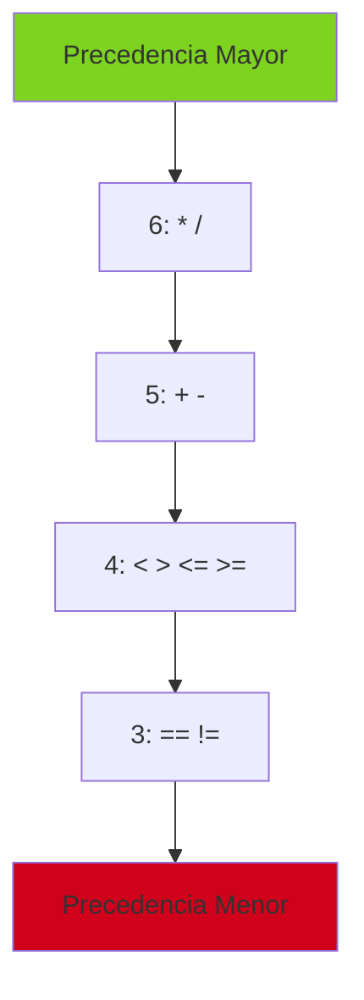

# Referencia de Operadores

## Introduccion

Este documento describe todos los operadores soportados por Boemia Script, su precedencia, asociatividad y uso.

## Tabla de Operadores

| Precedencia | Operador | Tipo | Asociatividad | Descripcion |
|-------------|----------|------|---------------|-------------|
| 6 | `*`, `/` | Binario | Izquierda | Multiplicacion, Division |
| 5 | `+`, `-` | Binario | Izquierda | Suma, Resta |
| 4 | `<`, `>`, `<=`, `>=` | Binario | Izquierda | Comparacion |
| 3 | `==`, `!=` | Binario | Izquierda | Igualdad |
| 1 | `-` | Unario | Derecha | Negacion |

## Operadores Aritmeticos

### Suma (+)

**Precedencia**: 5

**Tipos soportados**:
- `int + int -> int`
- `float + float -> float`
- `int + float -> float` (promocion)
- `string + string -> string` (concatenacion)

**Ejemplos**:
```boemia
let a: int = 5 + 3;           // 8
let b: float = 2.5 + 1.5;     // 4.0
let c: float = 5 + 2.5;       // 7.5 (promocion)
let d: string = "Hola" + " Mundo";  // "Hola Mundo"
```

**Codigo C generado**:
```c
long long a = (5 + 3);
double b = (2.5 + 1.5);
double c = (5 + 2.5);
char* d = // concatenacion de strings (futuro)
```

### Resta (-)

**Precedencia**: 5

**Tipos soportados**:
- `int - int -> int`
- `float - float -> float`
- `int - float -> float` (promocion)

**Ejemplos**:
```boemia
let a: int = 10 - 3;      // 7
let b: float = 5.5 - 2.5; // 3.0
let c: float = 10 - 2.5;  // 7.5
```

### Multiplicacion (*)

**Precedencia**: 6 (mayor que suma/resta)

**Tipos soportados**:
- `int * int -> int`
- `float * float -> float`
- `int * float -> float` (promocion)

**Ejemplos**:
```boemia
let a: int = 5 * 3;        // 15
let b: float = 2.5 * 2.0;  // 5.0
let c: float = 5 * 2.5;    // 12.5
```

**Precedencia en accion**:
```boemia
let x: int = 2 + 3 * 4;  // 14 (no 20)
// Equivalente a: 2 + (3 * 4)
```

### Division (/)

**Precedencia**: 6

**Tipos soportados**:
- `int / int -> int` (division entera)
- `float / float -> float`
- `int / float -> float` (promocion)

**Ejemplos**:
```boemia
let a: int = 10 / 3;        // 3 (division entera)
let b: float = 10.0 / 3.0;  // 3.333...
let c: float = 10 / 3.0;    // 3.333... (promocion)
```

**Nota**: Division por cero no se verifica en compilacion.

## Operadores de Comparacion

### Menor que (<)

**Precedencia**: 4

**Tipos soportados**:
- `int < int -> bool`
- `float < float -> bool`
- `string < string -> bool` (orden lexicografico)

**Ejemplos**:
```boemia
let a: bool = 5 < 10;           // true
let b: bool = 3.14 < 2.71;      // false
let c: bool = "Ana" < "Zoe";    // true
```

### Mayor que (>)

**Precedencia**: 4

**Tipos soportados**: Igual que `<`

**Ejemplos**:
```boemia
let a: bool = 10 > 5;   // true
let b: bool = 5 > 10;   // false
```

### Menor o igual (<=)

**Precedencia**: 4

**Tipos soportados**: Igual que `<`

**Ejemplos**:
```boemia
let a: bool = 5 <= 5;   // true
let b: bool = 5 <= 10;  // true
let c: bool = 10 <= 5;  // false
```

### Mayor o igual (>=)

**Precedencia**: 4

**Tipos soportados**: Igual que `<`

**Ejemplos**:
```boemia
let a: bool = 5 >= 5;   // true
let b: bool = 10 >= 5;  // true
let c: bool = 5 >= 10;  // false
```

## Operadores de Igualdad

### Igualdad (==)

**Precedencia**: 3 (menor que comparacion)

**Tipos soportados**:
- `int == int -> bool`
- `float == float -> bool`
- `string == string -> bool`
- `bool == bool -> bool`

**Regla**: Ambos operandos deben ser del mismo tipo.

**Ejemplos**:
```boemia
let a: bool = 5 == 5;           // true
let b: bool = 3.14 == 3.14;     // true
let c: bool = "hola" == "hola"; // true
let d: bool = true == true;     // true
```

**Error**:
```boemia
let x: bool = 5 == 5.0;  // Error: tipos diferentes
```

### Desigualdad (!=)

**Precedencia**: 3

**Tipos soportados**: Igual que `==`

**Ejemplos**:
```boemia
let a: bool = 5 != 10;  // true
let b: bool = 5 != 5;   // false
```

## Operador de Asignacion

### Asignacion (=)

**Precedencia**: N/A (no es expresion, es statement)

**Sintaxis**: `variable = expresion;`

**Tipos**: Debe haber compatibilidad de tipos

**Ejemplos**:
```boemia
let x: int = 5;
x = 10;          // OK
x = x + 1;       // OK

const PI: float = 3.14;
PI = 3.15;       // Error: PI es constante
```

## Operadores Unarios

### Negacion Aritmetica (-)

**Precedencia**: 1 (mas alta que binarios)

**Tipos soportados**:
- `-int -> int`
- `-float -> float`

**Ejemplos**:
```boemia
let a: int = -5;        // -5
let b: int = -(3 + 2);  // -5
let c: float = -3.14;   // -3.14
```

**Codigo C**:
```c
long long a = (-5);
long long b = (-(3 + 2));
double c = (-3.14);
```

### Negacion Logica (!) - No implementado

**Estado**: Parseado pero no implementado completamente

**Uso futuro**:
```boemia
let a: bool = !true;   // false
let b: bool = !(x > 5); // negacion de condicion
```

## Precedencia Detallada



### Ejemplos de Precedencia

**Expresion 1**:
```boemia
2 + 3 * 4
```
**Interpretacion**: `2 + (3 * 4)` = `2 + 12` = `14`

**Expresion 2**:
```boemia
10 - 5 - 2
```
**Interpretacion**: `(10 - 5) - 2` = `5 - 2` = `3` (asociatividad izquierda)

**Expresion 3**:
```boemia
5 < 10 == true
```
**Interpretacion**: `(5 < 10) == true` = `true == true` = `true`

**Expresion 4**:
```boemia
-3 * 4
```
**Interpretacion**: `(-3) * 4` = `-12` (unario tiene mayor precedencia)

## Asociatividad

### Izquierda (Operadores Binarios)

Todos los operadores binarios son asociativos por la izquierda:

```boemia
a + b + c  ->  (a + b) + c
a - b - c  ->  (a - b) - c
a * b * c  ->  (a * b) * c
a / b / c  ->  (a / b) / c
```

### Derecha (Operadores Unarios)

Los operadores unarios son asociativos por la derecha:

```boemia
--x  ->  -(-(x))
```

## Uso de Parentesis

Los parentesis `()` tienen la precedencia mas alta y pueden usarse para cambiar el orden de evaluacion:

```boemia
let a: int = 2 + 3 * 4;      // 14
let b: int = (2 + 3) * 4;    // 20

let c: int = 10 - 5 - 2;     // 3
let d: int = 10 - (5 - 2);   // 7
```

## Operadores No Soportados

```mermaid
graph TB
    A[No Soportados] --> B[Logicos: && ||]
    A --> C[Bitwise: & | ^ ~ << >>]
    A --> D[Asignacion compuesta: += -= *= /=]
    A --> E[Incremento/Decremento: ++ --]
    A --> F[Ternario: ? :]
    A --> G[Modulo: %]

    style A fill:#d0021b
```

### Workarounds Actuales

**Operadores logicos**:
```boemia
// Futuro: if (a && b)
// Actual: if anidados
if a {
    if b {
        // ...
    }
}
```

**Asignacion compuesta**:
```boemia
// Futuro: x += 5;
// Actual:
x = x + 5;
```

**Incremento**:
```boemia
// Futuro: x++;
// Actual:
x = x + 1;
```

**Modulo**:
```boemia
// Futuro: x % 2
// Actual: No disponible
```

## Tabla de Compatibilidad de Tipos

### Operadores Aritmeticos

| Operador | int, int | float, float | int, float | string, string |
|----------|----------|--------------|------------|----------------|
| + | int | float | float | string (concat) |
| - | int | float | float | N/A |
| * | int | float | float | N/A |
| / | int | float | float | N/A |

### Operadores de Comparacion

| Operador | int, int | float, float | string, string | bool, bool |
|----------|----------|--------------|----------------|------------|
| < | bool | bool | bool | N/A |
| > | bool | bool | bool | N/A |
| <= | bool | bool | bool | N/A |
| >= | bool | bool | bool | N/A |
| == | bool | bool | bool | bool |
| != | bool | bool | bool | bool |

### Operadores Unarios

| Operador | int | float | bool | string |
|----------|-----|-------|------|--------|
| - | int | float | N/A | N/A |
| ! | N/A | N/A | bool | N/A |

## Implementacion en el Parser

```zig
fn getPrecedence(self: *Parser, op: BinaryOp) u8 {
    return switch (op) {
        .MUL, .DIV => 6,
        .ADD, .SUB => 5,
        .LT, .GT, .LTE, .GTE => 4,
        .EQ, .NEQ => 3,
    };
}

fn getInfixOp(self: *Parser) ?BinaryOp {
    return switch (self.current_token.type) {
        .PLUS => .ADD,
        .MINUS => .SUB,
        .STAR => .MUL,
        .SLASH => .DIV,
        .EQ => .EQ,
        .NEQ => .NEQ,
        .LT => .LT,
        .GT => .GT,
        .LTE => .LTE,
        .GTE => .GTE,
        else => null,
    };
}
```

## Referencias

- [Type System](09-TYPE-SYSTEM.md) - Reglas de tipos
- [Token Reference](20-TOKEN-REFERENCE.md) - Tokens de operadores
- [Parser](05-PARSER.md) - Parsing de expresiones
