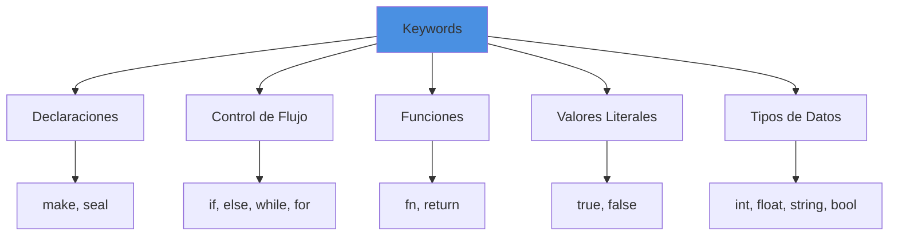
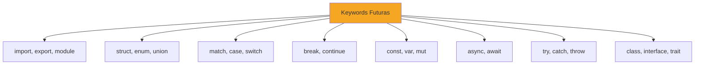

# Referencia de Palabras Reservadas

## Introduccion

Las palabras reservadas (keywords) son identificadores especiales con significado predefinido en Boemia Script. No pueden usarse como nombres de variables o funciones.

## Lista Completa de Keywords



## Declaraciones

### make

**Categoria**: Declaracion de variable

**Proposito**: Declarar variable mutable

**Sintaxis**:
```boemia
make nombre: tipo = valor;
```

**Ejemplos**:
```boemia
make x: int = 5;
make nombre: string = "Juan";
make activo: bool = true;
```

**Caracteristicas**:
- Variable puede reasignarse
- Tipo debe especificarse explicitamente
- Valor inicial obligatorio

**Diferencia con seal**:
```boemia
make x: int = 5;
x = 10;  // OK: make permite reasignacion

seal PI: float = 3.14;
PI = 3.15;  // Error: seal no permite reasignacion
```

### seal

**Categoria**: Declaracion de constante

**Proposito**: Declarar constante inmutable

**Sintaxis**:
```boemia
seal NOMBRE: tipo = valor;
```

**Ejemplos**:
```boemia
seal PI: float = 3.14159;
seal MAX_SIZE: int = 1000;
seal NOMBRE_APP: string = "Boemia";
```

**Caracteristicas**:
- Valor no puede cambiar despues de asignacion
- Tipo debe especificarse explicitamente
- Valor inicial obligatorio
- Convencion: nombres en MAYUSCULAS

**Verificacion**: El Analyzer verifica que no se reasignen constantes.

## Control de Flujo

### if

**Categoria**: Condicional

**Proposito**: Ejecutar codigo condicionalmente

**Sintaxis**:
```boemia
if condicion {
    // codigo si verdadero
}
```

**Con else**:
```boemia
if condicion {
    // codigo si verdadero
} else {
    // codigo si falso
}
```

**Ejemplos**:
```boemia
if x > 5 {
    print(x);
}

if edad >= 18 {
    print("Mayor de edad");
} else {
    print("Menor de edad");
}
```

**Condicion**: Debe ser expresion de tipo `bool`.

### else

**Categoria**: Alternativa condicional

**Proposito**: Codigo alternativo en `if`

**Sintaxis**:
```boemia
if condicion {
    // codigo si verdadero
} else {
    // codigo si falso
}
```

**Else-if**:
```boemia
if condicion1 {
    // ...
} else if condicion2 {
    // ...
} else {
    // ...
}
```

**Nota**: `else` siempre debe seguir a un bloque `if`.

### while

**Categoria**: Bucle condicional

**Proposito**: Repetir mientras condicion sea verdadera

**Sintaxis**:
```boemia
while condicion {
    // codigo a repetir
}
```

**Ejemplos**:
```boemia
make i: int = 0;
while i < 10 {
    print(i);
    i = i + 1;
}

while true {
    // bucle infinito (sin break aun)
}
```

**Condicion**: Debe ser expresion de tipo `bool`.

### for

**Categoria**: Bucle con contador

**Proposito**: Iterar con inicializacion, condicion y actualizacion

**Sintaxis**:
```boemia
for init; condicion; actualizacion {
    // codigo a repetir
}
```

**Caracteristica especial**: Permite declaracion de variable sin `make`:
```boemia
for i: int = 0; i < 10; i = i + 1 {
    print(i);
}
```

**Ejemplos**:
```boemia
// Contador clasico
for i: int = 0; i < 10; i = i + 1 {
    print(i);
}

// Con paso diferente
for i: int = 0; i < 100; i = i + 10 {
    print(i);
}

// Descendente
for i: int = 10; i > 0; i = i - 1 {
    print(i);
}
```

**Scope**: La variable declarada en `init` solo existe dentro del bucle.

## Funciones

### fn

**Categoria**: Declaracion de funcion

**Proposito**: Definir funcion

**Sintaxis**:
```boemia
fn nombre(param1: tipo1, param2: tipo2): tipo_retorno {
    // cuerpo
    return valor;
}
```

**Ejemplos**:
```boemia
fn suma(a: int, b: int): int {
    return a + b;
}

fn saludar(nombre: string): void {
    print(nombre);
}

fn obtenerPI(): float {
    return 3.14159;
}
```

**Caracteristicas**:
- Parametros con tipos explcitos
- Tipo de retorno obligatorio
- Puede ser `void` si no retorna valor

### return

**Categoria**: Retorno de funcion

**Proposito**: Retornar valor de funcion

**Sintaxis**:
```boemia
return expresion;
return;  // para void
```

**Ejemplos**:
```boemia
fn multiplicar(a: int, b: int): int {
    return a * b;
}

fn mostrar(): void {
    print("Mensaje");
    return;  // opcional para void
}
```

**Reglas**:
- Funciones con tipo de retorno no-void deben retornar valor
- Funciones void pueden usar `return;` sin valor

## Funcion Incorporada

### print

**Categoria**: Funcion de salida

**Proposito**: Imprimir valor a consola

**Sintaxis**:
```boemia
print(expresion);
```

**Ejemplos**:
```boemia
print(42);
print(3.14);
print("Hola Mundo");
print(true);
print(x);
```

**Caracteristicas**:
- Acepta una expresion
- Determina tipo automaticamente
- Genera `printf` en C con formato correcto

**Nota**: `print` es una keyword especial, no una funcion normal.

## Literales Booleanos

### true

**Categoria**: Literal booleano

**Valor**: Verdadero

**Tipo**: `bool`

**Ejemplos**:
```boemia
make activo: bool = true;

if true {
    // siempre ejecuta
}

make resultado: bool = (5 > 3);  // true
```

**Mapeo a C**: `true` (C11 stdbool.h)

### false

**Categoria**: Literal booleano

**Valor**: Falso

**Tipo**: `bool`

**Ejemplos**:
```boemia
make inactivo: bool = false;

if false {
    // nunca ejecuta
}

make resultado: bool = (5 < 3);  // false
```

**Mapeo a C**: `false` (C11 stdbool.h)

## Tipos de Datos

### int

**Categoria**: Tipo de dato

**Descripcion**: Entero con signo de 64 bits

**Rango**: -9,223,372,036,854,775,808 a 9,223,372,036,854,775,807

**Ejemplos**:
```boemia
make x: int = 42;
make y: int = -100;
make z: int = 0;
```

**Mapeo a C**: `long long`

### float

**Categoria**: Tipo de dato

**Descripcion**: Punto flotante de 64 bits (IEEE 754)

**Precision**: Aproximadamente 15-17 digitos decimales

**Ejemplos**:
```boemia
make pi: float = 3.14159;
make e: float = 2.71828;
make x: float = -0.5;
```

**Mapeo a C**: `double`

### string

**Categoria**: Tipo de dato

**Descripcion**: Cadena de texto

**Ejemplos**:
```boemia
make nombre: string = "Juan";
make saludo: string = "Hola Mundo";
make vacio: string = "";
```

**Mapeo a C**: `char*`

**Nota**: Actualmente solo literales, sin manipulacion dinamica.

### bool

**Categoria**: Tipo de dato

**Descripcion**: Valor booleano (true/false)

**Valores**: `true`, `false`

**Ejemplos**:
```boemia
make activo: bool = true;
make valido: bool = false;
make resultado: bool = (x > 5);
```

**Mapeo a C**: `bool` (C11 stdbool.h)

## Mapa de Keywords

```zig
pub const keywords = std.StaticStringMap(TokenType).initComptime(.{
    // Declaraciones
    .{ "make", .MAKE },
    .{ "seal", .SEAL },
    .{ "fn", .FN },
    .{ "return", .RETURN },

    // Control de flujo
    .{ "if", .IF },
    .{ "else", .ELSE },
    .{ "while", .WHILE },
    .{ "for", .FOR },

    // Funcion incorporada
    .{ "print", .PRINT },

    // Literales booleanos
    .{ "true", .TRUE },
    .{ "false", .FALSE },

    // Tipos de datos
    .{ "int", .TYPE_INT },
    .{ "float", .TYPE_FLOAT },
    .{ "string", .TYPE_STRING },
    .{ "bool", .TYPE_BOOL },
});
```

## Keywords Reservadas para el Futuro

Estas palabras podrian ser keywords en versiones futuras:



**Recomendacion**: No usar estos nombres como identificadores para evitar conflictos futuros.

## Errores Comunes

### Usar keyword como identificador

```boemia
make make: int = 5;  // Error: 'make' es keyword
make int: int = 10;  // Error: 'int' es keyword
```

### Case sensitivity

```boemia
make Make: int = 5;   // OK: Make != make
make INT: int = 10;   // OK: INT != int
```

**Nota**: Las keywords son case-sensitive.

### Espacios en keywords

```boemia
ma ke x: int = 5;     // Error: 'ma' y 'ke' no son keywords
```

## Tabla Resumen

| Keyword | Categoria | Uso | Ejemplo |
|---------|-----------|-----|---------|
| `make` | Declaracion | Variable mutable | `make x: int = 5;` |
| `seal` | Declaracion | Constante | `seal PI: float = 3.14;` |
| `fn` | Funcion | Declarar funcion | `fn suma(...) {...}` |
| `return` | Funcion | Retornar valor | `return x + y;` |
| `if` | Control | Condicional | `if x > 5 {...}` |
| `else` | Control | Alternativa | `if ... else {...}` |
| `while` | Control | Bucle condicional | `while i < 10 {...}` |
| `for` | Control | Bucle contador | `for i: int = 0; ...; ... {...}` |
| `print` | I/O | Imprimir | `print(x);` |
| `true` | Literal | Booleano verdadero | `make b: bool = true;` |
| `false` | Literal | Booleano falso | `make b: bool = false;` |
| `int` | Tipo | Entero | `make x: int = 5;` |
| `float` | Tipo | Decimal | `make x: float = 3.14;` |
| `string` | Tipo | Cadena | `make s: string = "hi";` |
| `bool` | Tipo | Booleano | `make b: bool = true;` |

## Referencias

- [Syntax](10-SYNTAX.md) - Sintaxis del lenguaje
- [Token Reference](20-TOKEN-REFERENCE.md) - Todos los tokens
- [Control Structures](11-CONTROL-STRUCTURES.md) - Estructuras de control
- [Functions and Scope](12-FUNCTIONS-SCOPE.md) - Funciones
