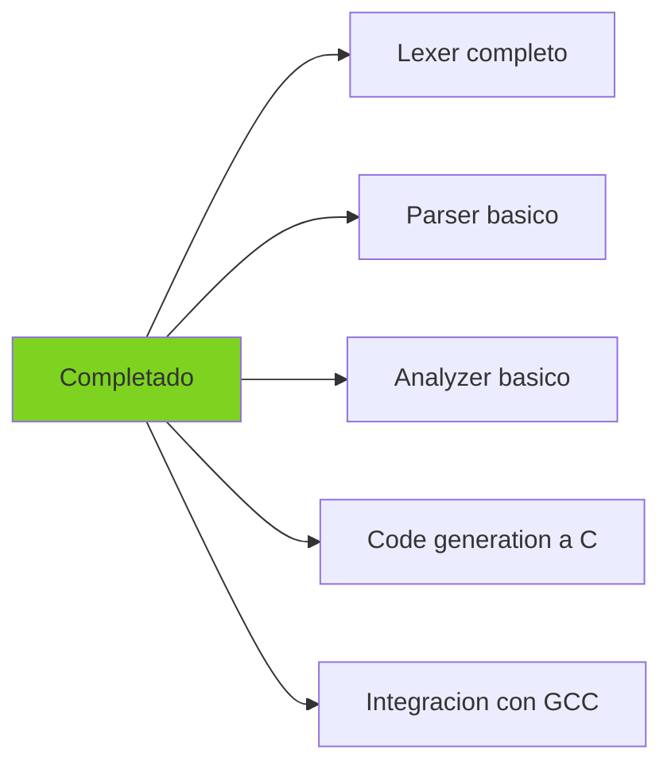
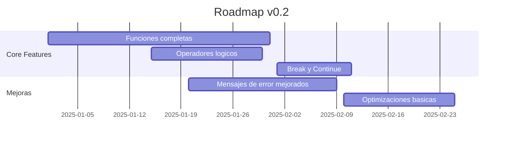
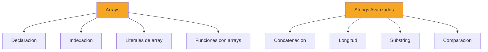
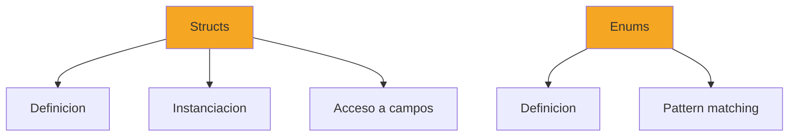
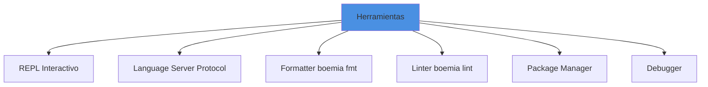
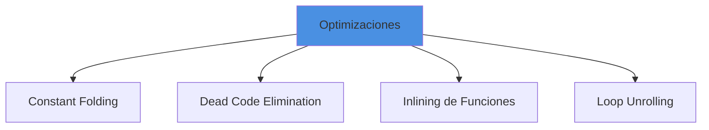
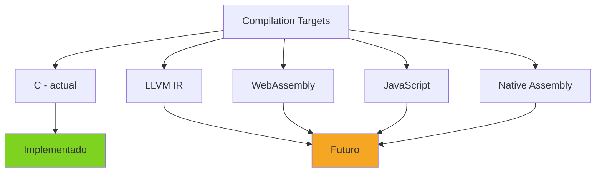

# Roadmap del Proyecto

## Vision General

Boemia Script es un proyecto educativo de compilador que busca proporcionar una base solida para aprender sobre desarrollo de compiladores. Este roadmap outline las mejoras y caracteristicas planeadas para el futuro.

## Estado Actual (v0.1)



**Caracteristicas implementadas**:
- Tokenizacion completa
- Parsing de statements y expresiones
- Verificacion basica de tipos
- Generacion de codigo C
- Compilacion con GCC
- Variables (make/seal)
- Estructuras de control (if/else, while, for)
- Operadores aritmeticos y comparacion
- Tipos primitivos (int, float, string, bool)
- Print incorporado

## Roadmap a Corto Plazo (v0.2)

### Objetivos para los proximos 3 meses



#### 1. Sistema de Funciones Completo

**Prioridad**: Alta

**Estado**: Parcial

**Tareas**:
- [ ] Implementar tabla de funciones
- [ ] Verificacion de tipos en llamadas
- [ ] Verificacion de numero de argumentos
- [ ] Verificacion de return paths
- [ ] Scope adecuado de funciones

**Ejemplo objetivo**:
```boemia
fn factorial(n: int): int {
    if n <= 1 {
        return 1;
    }
    return n * factorial(n - 1);
}

let resultado: int = factorial(5);  // Verificado en compile-time
```

#### 2. Operadores Logicos

**Prioridad**: Alta

**Estado**: No implementado

**Tareas**:
- [ ] Agregar tokens AND (`&&`), OR (`||`)
- [ ] Parser de operadores logicos
- [ ] Verificacion de tipos bool
- [ ] Generacion de codigo C

**Ejemplo objetivo**:
```boemia
if x > 5 && y < 10 {
    print("Ambas condiciones verdaderas");
}

if activo || admin {
    print("Tiene acceso");
}
```

#### 3. Break y Continue

**Prioridad**: Media

**Estado**: No implementado

**Tareas**:
- [ ] Agregar tokens BREAK, CONTINUE
- [ ] Parser de statements
- [ ] Verificar que estan dentro de loops
- [ ] Generacion de codigo C

**Ejemplo objetivo**:
```boemia
for i: int = 0; i < 100; i = i + 1 {
    if i == 50 {
        break;  // Salir del loop
    }
    if i % 2 == 0 {
        continue;  // Saltar iteracion
    }
    print(i);
}
```

#### 4. Mensajes de Error Mejorados

**Prioridad**: Media

**Estado**: Basico

**Tareas**:
- [ ] Incluir snippet de codigo fuente
- [ ] Indicadores visuales (^~~)
- [ ] Sugerencias de correccion
- [ ] Codigos de error numericos

**Ejemplo objetivo**:
```
Error E003 at programa.bs:5:12: Type mismatch
  let x: int = "texto";
                ^~~~~~~~
  Expected: int
  Found: string
  Suggestion: Use int value like 42 or convert string to int
```

## Roadmap a Medio Plazo (v0.3 - v0.5)

### v0.3: Arrays y Estructuras de Datos

**Timeline**: 6 meses



**Caracteristicas**:
```boemia
// Arrays
make numeros: []int = [1, 2, 3, 4, 5];
let primero: int = numeros[0];
numeros[1] = 10;

fn sumar(arr: []int): int {
    let total: int = 0;
    for i: int = 0; i < len(arr); i = i + 1 {
        total = total + arr[i];
    }
    return total;
}

// Strings avanzados
let s: string = "Hola";
let longitud: int = len(s);
let sub: string = substr(s, 0, 2);  // "Ho"
```

### v0.4: Structs y Tipos Compuestos

**Timeline**: 9 meses



**Caracteristicas**:
```boemia
// Structs
struct Persona {
    nombre: string,
    edad: int,
    activo: bool
}

make juan: Persona = Persona{
    nombre: "Juan",
    edad: 30,
    activo: true
};

print(juan.nombre);
juan.edad = 31;

// Enums
enum Color {
    Rojo,
    Verde,
    Azul
}

make favorito: Color = Color.Azul;
```

### v0.5: Generics y Inferencia de Tipos

**Timeline**: 12 meses

```boemia
// Funciones genericas
fn identity<T>(x: T): T {
    return x;
}

let a: int = identity(42);
let b: string = identity("hola");

// Inferencia de tipos
make x = 5;          // infiere int
make y = 3.14;       // infiere float
make z = "texto";    // infiere string
```

## Roadmap a Largo Plazo (v1.0+)

### v1.0: Lenguaje Estable

**Objetivos**:
- API estable del lenguaje
- Documentacion completa
- Test suite comprehensivo
- Ejemplos y tutoriales
- Benchmarks de performance

### Caracteristicas Avanzadas (v1.x)

#### 1. Modulos e Imports

```boemia
// math.bs
export fn suma(a: int, b: int): int {
    return a + b;
}

// main.bs
import math;

let resultado: int = math.suma(5, 3);
```

#### 2. Traits e Interfaces

```boemia
trait Printable {
    fn toString(): string;
}

struct Punto implements Printable {
    x: int,
    y: int,

    fn toString(): string {
        return "(" + intToString(x) + ", " + intToString(y) + ")";
    }
}
```

#### 3. Pattern Matching

```boemia
match valor {
    0 => print("Cero"),
    1..10 => print("Entre 1 y 10"),
    _ => print("Otro valor")
}
```

#### 4. Null Safety

```boemia
let nombre: string? = null;  // Tipo opcional

if nombre != null {
    print(nombre);
}

// O con pattern matching
match nombre {
    some(n) => print(n),
    none => print("Sin nombre")
}
```

#### 5. Async/Await

```boemia
async fn fetchData(url: string): string {
    // ...
}

fn main() {
    let data: string = await fetchData("https://...");
}
```

## Mejoras de Infraestructura

### Herramientas



#### REPL (Read-Eval-Print Loop)

```bash
$ boemia repl
boemia> let x: int = 5;
boemia> print(x + 3);
8
boemia> fn suma(a: int, b: int): int { return a + b; }
boemia> suma(10, 20)
30
```

#### LSP (Language Server Protocol)

Integracion con editores:
- VS Code
- Vim/Neovim
- Emacs
- Sublime Text

Caracteristicas:
- Autocompletado
- Go to definition
- Hover information
- Error highlighting
- Refactoring

#### Formatter

```bash
boemia fmt programa.bs
```

#### Package Manager

```bash
boemia init        # Crear nuevo proyecto
boemia add math    # Agregar dependencia
boemia build       # Compilar proyecto
boemia run         # Ejecutar
boemia test        # Ejecutar tests
```

### Optimizaciones



**Constant Folding**:
```boemia
let x: int = 2 + 3 * 4;  // Optimizado a: let x: int = 14;
```

**Dead Code Elimination**:
```boemia
if false {
    print("Nunca ejecuta");  // Eliminado
}
```

### Targets Adicionales



## Contribuciones

El proyecto esta abierto a contribuciones. Ver [CONTRIBUTING.md](24-CONTRIBUTING.md) para detalles.

### Areas que Necesitan Ayuda

- Implementacion de funciones completas
- Mensajes de error mejorados
- Testing adicional
- Documentacion y ejemplos
- Optimizaciones
- Herramientas (formatter, linter)

## Criterios de Version

### Versionado Semantico

Boemia Script usa versionado semantico: `MAJOR.MINOR.PATCH`

- **MAJOR**: Cambios incompatibles en API/sintaxis
- **MINOR**: Nuevas caracteristicas compatibles
- **PATCH**: Bug fixes

### Estabilidad

- **v0.x**: Experimental, API puede cambiar
- **v1.0**: Primera version estable
- **v1.x**: Mejoras compatibles con v1.0
- **v2.0**: Cambios significativos

## Referencias

- [Architecture](02-ARCHITECTURE.md) - Arquitectura actual
- [Contributing](24-CONTRIBUTING.md) - Guia de contribucion
- [Testing](19-TESTING.md) - Sistema de testing
