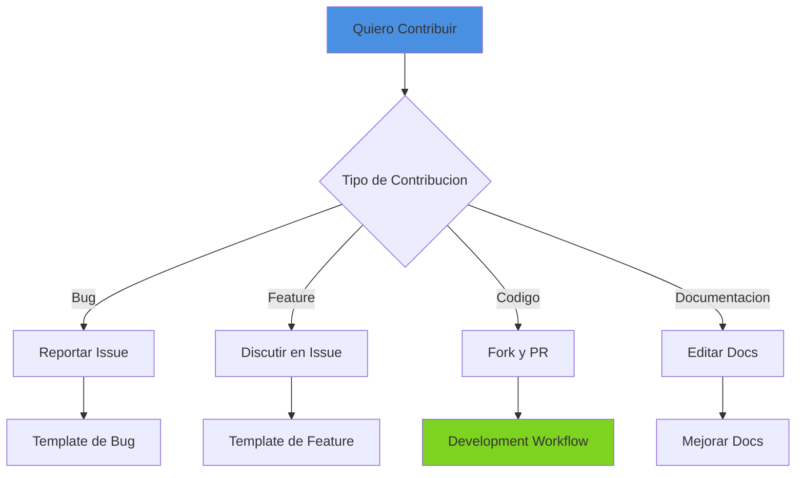
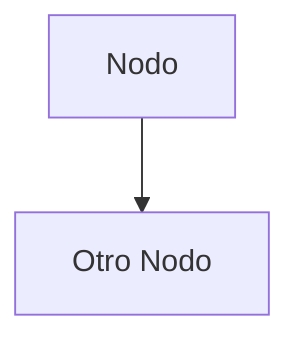
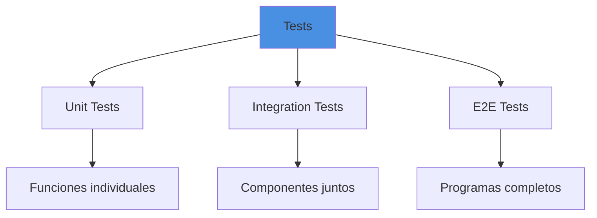
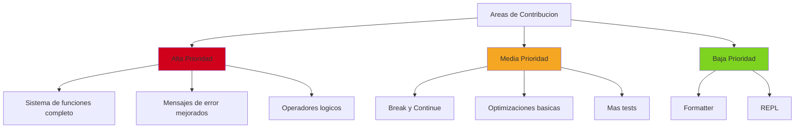

# Guia de Contribucion

## Bienvenido

Gracias por tu interes en contribuir a Boemia Script. Este documento proporciona pautas para contribuir al proyecto.

## Codigo de Conducta

### Nuestros Valores

- Respeto y profesionalismo en todas las interacciones
- Fomentar un ambiente de aprendizaje
- Valorar todas las contribuciones
- Mantener discusiones tecnicas constructivas

### Comportamiento Esperado

- Ser amable y paciente
- Respetar diferentes puntos de vista
- Aceptar critica constructiva
- Enfocarse en lo mejor para el proyecto

## Como Contribuir



### Reportar Bugs

#### Template de Bug Report

```markdown
## Descripcion del Bug
Descripcion clara y concisa del bug.

## Pasos para Reproducir
1. Compilar programa '...'
2. Ejecutar con '...'
3. Ver error '...'

## Comportamiento Esperado
Que deberia pasar.

## Comportamiento Actual
Que paso realmente.

## Codigo de Ejemplo
```boemia
let x: int = 5;
// codigo que causa el bug
```

## Entorno
- OS: [e.g. Linux, macOS, Windows]
- Version de Zig: [e.g. 0.11.0]
- Version de Boemia: [e.g. 0.1.0]

## Informacion Adicional
Cualquier detalle adicional.
```

### Proponer Features

#### Template de Feature Request

```markdown
## Problema que Resuelve
Descripcion del problema o limitacion actual.

## Solucion Propuesta
Como deberia funcionar la feature.

## Ejemplo de Uso
```boemia
// Como se usaria la feature
let x: int? = null;
```

## Alternativas Consideradas
Otras formas de resolver el problema.

## Impacto
- Backward compatibility
- Complejidad adicional
- Beneficios
```

## Development Workflow

### 1. Configurar Entorno de Desarrollo

```bash
# Clonar repositorio
git clone https://github.com/usuario/boemia-script.git
cd boemia-script

# Compilar
zig build

# Ejecutar tests
zig build test

# Ejecutar ejemplos
zig build example
```

### 2. Crear Branch

```bash
git checkout -b feature/nombre-descriptivo
# o
git checkout -b bugfix/descripcion-bug
```

**Convencion de nombres**:
- `feature/` - Nuevas caracteristicas
- `bugfix/` - Correcciones de bugs
- `docs/` - Cambios en documentacion
- `refactor/` - Refactorizaciones
- `test/` - Agregar o mejorar tests

### 3. Hacer Cambios

#### Estructura de Commit

```bash
git commit -m "tipo: descripcion breve

Descripcion mas detallada si es necesario.

Fixes #123"
```

**Tipos de commit**:
- `feat`: Nueva feature
- `fix`: Correcion de bug
- `docs`: Cambios en documentacion
- `style`: Formateo, no cambia logica
- `refactor`: Refactorizacion
- `test`: Agregar/modificar tests
- `chore`: Tareas de mantenimiento

**Ejemplos**:
```bash
git commit -m "feat: add logical operators && and ||"
git commit -m "fix: memory leak in parser"
git commit -m "docs: update parser documentation"
git commit -m "test: add tests for type checking"
```

### 4. Testing

Todos los cambios deben incluir tests:

```zig
test "descripcion del test" {
    // Arrange
    const source = "let x: int = 42;";

    // Act
    var lexer = Lexer.init(allocator, source);
    const token = lexer.nextToken();

    // Assert
    try testing.expectEqual(.MAKE, token.type);
}
```

**Ejecutar tests**:
```bash
zig build test
```

**Coverage minimo**: 80% para nuevo codigo

### 5. Crear Pull Request

#### Template de PR

```markdown
## Descripcion
Breve descripcion de los cambios.

## Tipo de Cambio
- [ ] Bug fix
- [ ] Nueva feature
- [ ] Breaking change
- [ ] Documentacion

## Como se Testeo
Descripcion de tests agregados/modificados.

## Checklist
- [ ] Tests pasan (`zig build test`)
- [ ] Codigo sigue style guide
- [ ] Documentacion actualizada
- [ ] CHANGELOG actualizado (si aplica)
- [ ] No hay warnings de compilacion
```

### 6. Code Review

El proceso de review:
1. Revisor asignado automaticamente
2. Feedback y sugerencias
3. Hacer cambios requeridos
4. Re-review
5. Aprobacion
6. Merge

## Style Guide

### Zig Code Style

#### Nombres

```zig
// Constantes: SCREAMING_SNAKE_CASE
const MAX_SIZE: usize = 1000;

// Funciones y variables: snake_case
fn parse_program() void {}
var current_token: Token = undefined;

// Tipos: PascalCase
pub const TokenType = enum { ... };
pub const Parser = struct { ... };
```

#### Indentacion

- 4 espacios (no tabs)
- Llaves en la misma linea para funciones
- Llaves en nueva linea para structs/enums

```zig
pub fn nextToken(self: *Lexer) Token {
    // codigo
}

pub const Token = struct {
    type: TokenType,
    lexeme: []const u8,
};
```

#### Comentarios

```zig
// Comentarios de linea para explicaciones breves
// Multiples lineas si es necesario

/// Documentacion de funcion con ///
/// Describe que hace la funcion
pub fn parseExpression(self: *Parser) !Expr {
    // ...
}
```

### Boemia Script Code Style

```boemia
// Nombres de variables: snake_case
let mi_variable: int = 5;

// Constantes: SCREAMING_SNAKE_CASE
const MAX_VALUE: int = 100;

// Funciones: camelCase o snake_case
fn calcularSuma(a: int, b: int): int {
    return a + b;
}

// Indentacion: 4 espacios
if condicion {
    print("verdadero");
} else {
    print("falso");
}
```

## Documentacion

### Actualizar Documentacion

Toda nueva feature debe documentarse:

1. Actualizar archivo relevante en `Documentation/`
2. Agregar ejemplos
3. Actualizar diagramas Mermaid si es necesario
4. Actualizar README si es feature principal

### Formato de Documentacion

```markdown
# Titulo Principal

## Seccion

Texto explicativo.

### Subseccion

**Ejemplo**:
```boemia
let x: int = 5;
```

**Diagramas Mermaid**:


## Testing Guidelines

### Tipos de Tests



### Escribir Buenos Tests

```zig
test "nombre descriptivo del test" {
    // Arrange: preparar datos
    const source = "...";

    // Act: ejecutar accion
    const result = funcion(source);

    // Assert: verificar resultado
    try testing.expectEqual(esperado, result);
}
```

**Principios**:
- Un test por concepto
- Nombres descriptivos
- Tests independientes
- Evitar logica compleja en tests

### Coverage

```bash
# Generar coverage report (cuando este disponible)
zig build test --coverage
```

## Areas de Contribucion

### Prioridades Actuales



### Good First Issues

Issues etiquetados como `good-first-issue`:
- Bugs pequenos
- Features simples
- Mejoras en documentacion
- Agregar tests

## Proceso de Release

### Version Number

Seguimos versionado semantico: `MAJOR.MINOR.PATCH`

### Changelog

Mantener `CHANGELOG.md` actualizado:

```markdown
## [Unreleased]

### Added
- Nueva feature X

### Changed
- Cambio en comportamiento Y

### Fixed
- Bug Z corregido

## [0.2.0] - 2025-02-01

### Added
- Operadores logicos && y ||
```

## Comunicacion

### Canales

- **GitHub Issues**: Bugs y features
- **GitHub Discussions**: Preguntas y discusiones
- **Pull Requests**: Code reviews

### Respuesta

Intentamos responder:
- Issues: 48 horas
- PRs: 72 horas
- Discusiones: 1 semana

## Agradecimientos

Todos los contribuidores seran listados en:
- README.md (Contributors section)
- Commits en Git history

## Licencia

Al contribuir, aceptas que tus contribuciones seran licenciadas bajo la misma licencia del proyecto.

## Preguntas Frecuentes

### ¿Como puedo empezar?

1. Lee la documentacion en `Documentation/`
2. Busca issues etiquetados como `good-first-issue`
3. Configura tu entorno de desarrollo
4. Haz un pequeno cambio y crea un PR

### ¿Que nivel de Zig necesito saber?

- Basico: Suficiente para contribuir
- La mayoria del codigo es legible
- Pregunta si algo no esta claro

### ¿Puedo proponer cambios grandes?

Si, pero primero:
1. Crea un issue para discutir
2. Espera feedback del equipo
3. Procede con implementacion

### ¿Como reporto vulnerabilidades de seguridad?

Para vulnerabilidades de seguridad, NO crear issue publico.
Contactar directamente a los maintainers.

## Referencias

- [Architecture](02-ARCHITECTURE.md) - Entender el diseno
- [Roadmap](23-ROADMAP.md) - Plan futuro
- [Testing](19-TESTING.md) - Guia de testing
