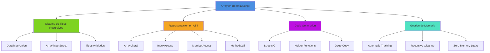
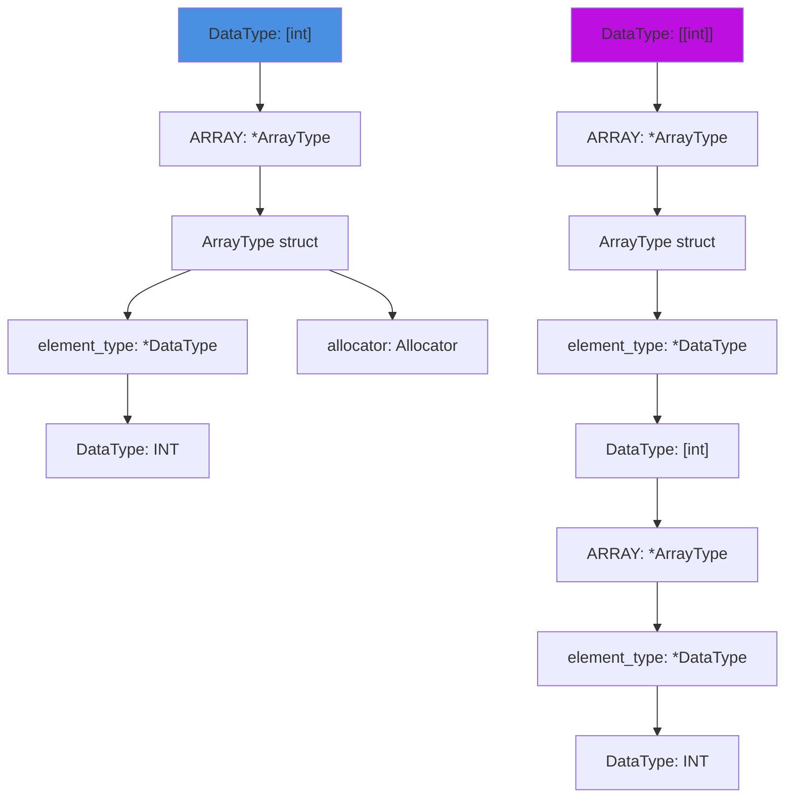
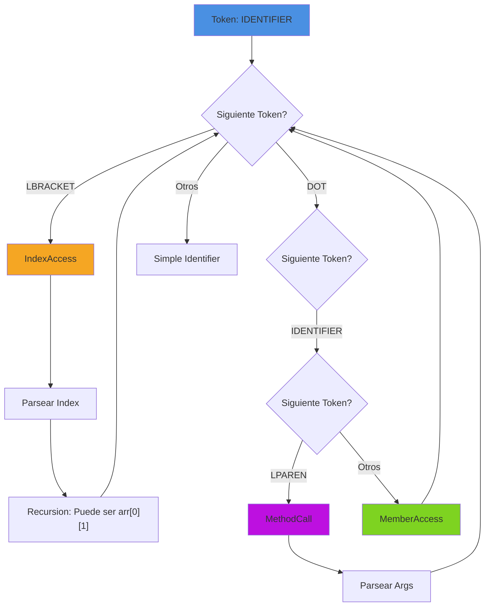
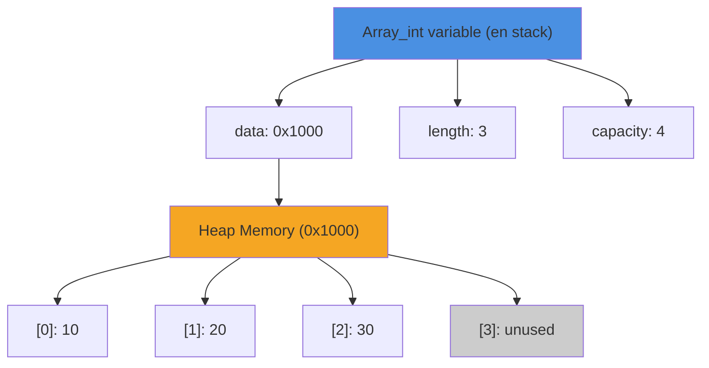
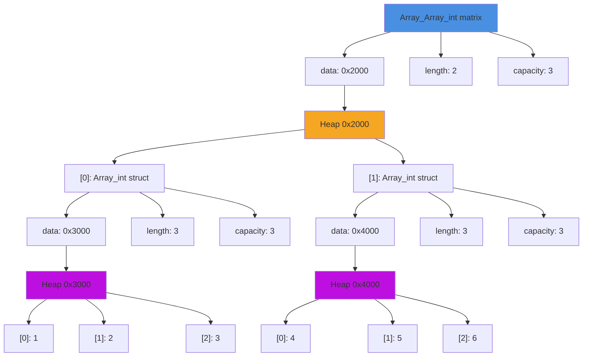

# Arrays Dinamicos en Boemia Script

## Introduccion

Los arrays dinamicos en Boemia Script son estructuras de datos homogeneas de tamaño variable que permiten almacenar multiples valores del mismo tipo. Esta implementacion combina la seguridad de tipos estaticos con la flexibilidad de estructuras dinamicas, proporcionando un sistema robusto de gestion de colecciones.

La implementacion de arrays representa una de las caracteristicas mas complejas del compilador, involucrando modificaciones profundas en todas las fases de compilacion: desde el sistema de tipos recursivos hasta la generacion de codigo C con gestion automatica de memoria.

## Arquitectura General



## Sistema de Tipos Recursivos

### Transformacion del DataType

La implementacion de arrays requirio transformar el sistema de tipos de un simple `enum` a un `union` recursivo, permitiendo tipos compuestos arbitrariamente anidados.

#### Antes: Sistema de Tipos Simple

```zig
pub const DataType = enum {
    INT,
    FLOAT,
    STRING,
    BOOL,
    VOID,
};
```

**Limitaciones:**
- Solo tipos primitivos
- Sin composicion de tipos
- Sin genericos
- Sistema no extensible

#### Despues: Sistema de Tipos Recursivo

```zig
pub const DataType = union(enum) {
    INT,
    FLOAT,
    STRING,
    BOOL,
    VOID,
    ARRAY: *ArrayType,

    pub const ArrayType = struct {
        element_type: *DataType,
        allocator: std.mem.Allocator,
    };
};
```

**Ventajas:**
- Tipos recursivos: `[int]`, `[[int]]`, `[[[int]]]`, etc.
- Sistema extensible para futuros tipos compuestos
- Type safety completo en tiempo de compilacion
- Representacion en memoria eficiente mediante punteros

### Representacion en Memoria del Sistema de Tipos



**Justificacion del Diseño:**

1. **Punteros vs Valores:** Se usan punteros (`*DataType`) en lugar de valores directos para evitar ciclos de tamaño infinito en la definicion del tipo. Un `union` no puede contener una copia de si mismo, pero si puede contener un puntero a si mismo.

2. **Recursion Explicita:** La recursion se logra mediante indirection (punteros), permitiendo tipos arbitrariamente anidados sin comprometer la seguridad de tipos.

3. **Allocator por Tipo:** Cada `ArrayType` mantiene referencia a su allocator para facilitar la limpieza de memoria cuando el tipo se destruye.

### Funciones Auxiliares del Sistema de Tipos

```zig
// Convierte DataType a nombre de tipo C
pub fn toCName(self: DataType, allocator: std.mem.Allocator) ![]const u8 {
    return switch (self) {
        .INT => try std.fmt.allocPrint(allocator, "long long", .{}),
        .FLOAT => try std.fmt.allocPrint(allocator, "double", .{}),
        .STRING => try std.fmt.allocPrint(allocator, "char*", .{}),
        .BOOL => try std.fmt.allocPrint(allocator, "bool", .{}),
        .VOID => try std.fmt.allocPrint(allocator, "void", .{}),
        .ARRAY => |arr_type| {
            const inner = try arr_type.element_type.*.toCName(allocator);
            defer allocator.free(inner);
            return try std.fmt.allocPrint(allocator, "Array_{s}", .{inner});
        },
    };
}
```

**Ejemplos de Conversion:**
- `int` → `long long`
- `[int]` → `Array_int`
- `[[int]]` → `Array_Array_int`
- `[[[string]]]` → `Array_Array_Array_string`

Esta nomenclatura permite generar tipos C unicos y descriptivos para cada combinacion de tipos.

## Representacion en el AST

### Nuevas Expresiones

La implementacion de arrays introdujo cuatro nuevos tipos de expresiones en el AST:

```zig
pub const Expr = union(enum) {
    // Expresiones existentes...
    number: f64,
    string: []const u8,
    boolean: bool,
    identifier: []const u8,

    // Nuevas expresiones para arrays
    array_literal: *ArrayLiteral,
    index_access: *IndexAccess,
    member_access: *MemberAccess,
    method_call: *MethodCall,

    pub const ArrayLiteral = struct {
        elements: []Expr,
        element_type: ?DataType,
    };

    pub const IndexAccess = struct {
        array: Expr,
        index: Expr,
    };

    pub const MemberAccess = struct {
        object: Expr,
        member: []const u8,
    };

    pub const MethodCall = struct {
        object: Expr,
        method: []const u8,
        args: []Expr,
    };
};
```

### Diagrama de Flujo de Parsing



**Ejemplo de Parsing:**

Codigo Boemia:
```boemia
matrix[i][j].length
```

AST Generado:
```
MemberAccess {
    object: IndexAccess {
        array: IndexAccess {
            array: Identifier("matrix"),
            index: Identifier("i")
        },
        index: Identifier("j")
    },
    member: "length"
}
```

## Representacion en Memoria - Nivel C

### Estructura de Array en C

Cada tipo de array en Boemia Script se traduce a una estructura C especializada:

```c
typedef struct {
    long long* data;      // Puntero al buffer de datos
    size_t length;        // Numero de elementos actuales
    size_t capacity;      // Capacidad maxima antes de realloc
} Array_int;
```

#### Diagrama de Memoria



**Caracteristicas del Diseño:**

1. **Triple Estructura:**
   - `data`: Puntero al buffer heap-allocated
   - `length`: Elementos actualmente almacenados
   - `capacity`: Tamaño del buffer (puede ser mayor que length)

2. **Estrategia de Crecimiento:**
   - Capacidad inicial: max(user_specified, 4)
   - Cuando `length >= capacity`: `capacity *= 2`
   - Usa `realloc()` para redimensionar sin perder datos

3. **Ventajas sobre Arrays Estaticos:**
   - Tamaño dinamico en runtime
   - Crecimiento automatico
   - Sin desperdicio de memoria con tamaño fijo
   - Amortized O(1) para operaciones push

### Arrays Anidados

Los arrays anidados requieren una estructura mas compleja:

```c
typedef struct {
    Array_int* data;      // Array de structs Array_int
    size_t length;
    size_t capacity;
} Array_Array_int;
```

#### Diagrama de Memoria para Arrays Anidados



**Complejidad de Memoria:**

Para un array `[[int]]` con n elementos externos y m elementos internos promedio:
- Memoria de structs: `sizeof(Array_Array_int) + n * sizeof(Array_int)`
- Memoria de datos: `n * m * sizeof(long long)`
- Overhead total: `3 * sizeof(size_t) * (1 + n)` = 24 + 24n bytes en sistema 64-bit

## Funciones Helper Generadas

Para cada tipo de array, el compilador genera tres funciones helper en C:

### 1. Constructor: `_create`

```c
Array_int Array_int_create(size_t initial_capacity) {
    Array_int arr = {0};  // Zero-initialize
    arr.capacity = initial_capacity > 0 ? initial_capacity : 4;
    arr.data = (long long*)malloc(arr.capacity * sizeof(long long));
    arr.length = 0;
    return arr;
}
```

**Caracteristicas:**
- Inicializacion en cero para seguridad
- Capacidad minima de 4 elementos (heuristica)
- Retorna por valor (copy elision en compiladores modernos)
- Malloc puede fallar: considerar NULL check en produccion

### 2. Insercion: `_push`

#### Para Arrays Simples:

```c
void Array_int_push(Array_int* arr, long long value) {
    if (arr->length >= arr->capacity) {
        arr->capacity *= 2;
        arr->data = (long long*)realloc(arr->data,
                                        arr->capacity * sizeof(long long));
    }
    arr->data[arr->length++] = value;
}
```

**Analisis de Complejidad:**
- Caso comun: O(1) - solo asignacion
- Caso realloc: O(n) - copiar n elementos
- Amortizado: O(1) - realloc es infrecuente

#### Para Arrays Anidados (Deep Copy):

```c
void Array_Array_int_push(Array_Array_int* arr, Array_int value) {
    if (arr->length >= arr->capacity) {
        arr->capacity *= 2;
        arr->data = (Array_int*)realloc(arr->data,
                                        arr->capacity * sizeof(Array_int));
    }

    // Deep copy for nested array
    Array_int copy = Array_int_create(value.capacity);
    for (size_t i = 0; i < value.length; i++) {
        Array_int_push(&copy, value.data[i]);
    }
    arr->data[arr->length++] = copy;
}
```

**Justificacion del Deep Copy:**

El deep copy es esencial para arrays anidados por las siguientes razones:

1. **Problema del Shallow Copy:**
```c
Array_int original = Array_int_create(3);
Array_int_push(&original, 10);

Array_Array_int container = Array_Array_int_create(1);
Array_Array_int_push(&container, original);  // Sin deep copy

// Si solo copiamos el struct:
// container.data[0].data apunta a la misma memoria que original.data
// Al liberar container, se libera original.data
// Al liberar original, double free!
```

2. **Solucion con Deep Copy:**
```c
// Con deep copy:
// container.data[0].data apunta a NUEVA memoria
// container.data[0] tiene su propia copia de los datos
// Cada array puede liberarse independientemente
```

3. **Trade-offs:**
   - **Pro:** Ownership claro, sin aliasing, memory-safe
   - **Con:** Overhead de copia, uso extra de memoria
   - **Alternativa considerada:** Reference counting (rechazada por complejidad)

### 3. Destructor: `_free`

#### Para Arrays Simples:

```c
void Array_int_free(Array_int* arr) {
    free(arr->data);
}
```

Simple y directo: solo libera el buffer de datos.

#### Para Arrays Anidados (Recursive Cleanup):

```c
void Array_Array_int_free(Array_Array_int* arr) {
    for (size_t i = 0; i < arr->length; i++) {
        Array_int_free(&arr->data[i]);
    }
    free(arr->data);
}
```

**Orden de Liberacion:**

```mermaid
graph TD
    A[Array_Array_int_free llamado] --> B[Iterar elementos]
    B --> C[Liberar arr.data[0]]
    C --> D[Liberar arr.data[0].data heap]
    C --> E[Liberar arr.data[1]]
    E --> F[Liberar arr.data[1].data heap]
    C --> G[...]
    B --> H[Liberar arr.data contenedor]

    style A fill:#4a90e2
    style D fill:#f5a623
    style F fill:#f5a623
    style H fill:#bd10e0
```

Este orden es crucial: primero los elementos internos, luego el contenedor.

## Generacion de Codigo

### Coleccion de Tipos de Array

Antes de generar codigo, el compilador debe identificar todos los tipos de array usados:

```zig
fn collectNestedArrayTypes(self: *CodeGenerator, data_type: DataType) !void {
    switch (data_type) {
        .ARRAY => |arr_type| {
            // Recursion: procesar tipo de elemento primero
            if (arr_type.element_type.* == .ARRAY) {
                try self.collectNestedArrayTypes(arr_type.element_type.*);
            }

            // Agregar este tipo al set
            const type_name = try data_type.toCName(self.allocator);
            if (!self.array_types_seen.contains(type_name)) {
                try self.array_types_seen.put(type_name, data_type);
            } else {
                self.allocator.free(type_name);
            }
        },
        else => {},
    }
}
```

**Estrategia de Coleccion:**

1. Recorrido recursivo del tipo desde lo mas profundo
2. Uso de HashMap para evitar duplicados
3. Orden de generacion: tipos simples primero, anidados despues

**Ejemplo:**

Codigo Boemia:
```boemia
let arr1: [int] = [1, 2, 3];
let arr2: [int] = [4, 5];
let matrix: [[int]] = [[1, 2], [3, 4]];
```

Tipos Colectados (en orden):
1. `Array_int` (del elemento de `[[int]]`)
2. `Array_int` (de `arr1` - ya existe, skip)
3. `Array_Array_int` (de `matrix`)

### Ordenamiento por Profundidad

Para garantizar que las dependencias se generen antes de los tipos que las usan:

```zig
fn getArrayDepth(data_type: DataType) usize {
    switch (data_type) {
        .ARRAY => |arr_type| return 1 + getArrayDepth(arr_type.element_type.*),
        else => return 0,
    }
}
```

Los tipos se ordenan (bubble sort, adecuado para conjuntos pequeños) por profundidad:
- `[int]` (profundidad 1) antes que
- `[[int]]` (profundidad 2) antes que
- `[[[int]]]` (profundidad 3)

### Generacion de Declaraciones de Array

Para un array literal:

**Codigo Boemia:**
```boemia
let arr: [int] = [1, 2, 3];
```

**Codigo C Generado:**
```c
Array_int arr = Array_int_create(3);
Array_int_push(&arr, 1);
Array_int_push(&arr, 2);
Array_int_push(&arr, 3);
```

**Proceso:**
1. Crear array con capacidad inicial = numero de elementos
2. Push de cada elemento individualmente
3. Permite expresiones complejas como elementos: `[x + 1, func(), y * 2]`

### Generacion de Arrays Anidados

**Codigo Boemia:**
```boemia
let matrix: [[int]] = [[1, 2], [3, 4]];
```

**Codigo C Generado:**
```c
Array_Array_int matrix = Array_Array_int_create(2);

Array_int temp_0 = Array_int_create(2);
Array_int_push(&temp_0, 1);
Array_int_push(&temp_0, 2);
Array_Array_int_push(&matrix, temp_0);

Array_int temp_1 = Array_int_create(2);
Array_int_push(&temp_1, 3);
Array_int_push(&temp_1, 4);
Array_Array_int_push(&matrix, temp_1);
```

**Variables Temporales:**

El compilador genera variables `temp_N` para cada sub-array. Estas variables:
1. Se crean en el scope actual
2. Se rastrean en `array_variables` para cleanup
3. Se liberan automaticamente al final del scope
4. Sufren deep copy al hacer push (ver seccion anterior)

## Gestion Automatica de Memoria

La gestion de memoria es el aspecto mas critico y complejo de la implementacion de arrays.

### Problema Original

**Codigo C Generado (Sin Gestion):**
```c
int main(void) {
    Array_int arr = Array_int_create(3);
    Array_int_push(&arr, 10);
    Array_int_push(&arr, 20);

    return 0;  // MEMORY LEAK: arr.data nunca se libera
}
```

**Resultado con leaks (macOS):**
```
Process 12345: 1 leaks for 32 total leaked bytes.
```

### Solucion Implementada

#### 1. Rastreo Automatico de Variables

```zig
// En generateStmt, caso variable_decl:
if (decl.data_type == .ARRAY) {
    try self.array_variables.append(self.allocator, decl.name);
    try self.variable_types.put(decl.name, decl.data_type);
}
```

Cada variable de tipo array se agrega a:
- `array_variables`: Lista de nombres de variables a liberar
- `variable_types`: Mapa de nombres a tipos (para generar el `_free` correcto)

#### 2. Generacion de Cleanup

```zig
// En generate(), antes de return 0:
for (self.array_variables.items) |var_name| {
    const var_type = self.variable_types.get(var_name) orelse continue;
    const struct_name = try var_type.toCName(self.allocator);
    defer self.allocator.free(struct_name);

    try self.write(struct_name);
    try self.write("_free(&");
    try self.write(var_name);
    try self.write(");\n");
}
```

**Codigo C Generado (Con Gestion):**
```c
int main(void) {
    Array_int arr = Array_int_create(3);
    Array_int_push(&arr, 10);
    Array_int_push(&arr, 20);

    Array_int_free(&arr);  // Cleanup automatico
    return 0;
}
```

**Resultado con leaks:**
```
Process 12345: 0 leaks for 0 total leaked bytes.
```

#### 3. Rastreo de Variables Temporales

Las variables temporales tambien deben rastrearse:

```zig
const temp_name = try std.fmt.allocPrint(self.allocator, "temp_{d}", .{self.temp_counter});
self.temp_counter += 1;

// Track temporary variable for cleanup
const temp_name_copy = try std.fmt.allocPrint(self.allocator, "temp_{d}", .{self.temp_counter - 1});
try self.array_variables.append(self.allocator, temp_name_copy);
try self.variable_types.put(temp_name_copy, elem_type);
```

**Ejemplo Completo:**

**Codigo Boemia:**
```boemia
let matrix: [[int]] = [[1, 2], [3, 4]];
```

**Codigo C Generado:**
```c
int main(void) {
    Array_Array_int matrix = Array_Array_int_create(2);

    Array_int temp_0 = Array_int_create(2);
    Array_int_push(&temp_0, 1);
    Array_int_push(&temp_0, 2);
    Array_Array_int_push(&matrix, temp_0);

    Array_int temp_1 = Array_int_create(2);
    Array_int_push(&temp_1, 3);
    Array_int_push(&temp_1, 4);
    Array_Array_int_push(&matrix, temp_1);

    // Cleanup automatico
    Array_Array_int_free(&matrix);  // Libera matrix.data y recursivamente cada elemento
    Array_int_free(&temp_0);        // Libera temp_0.data
    Array_int_free(&temp_1);        // Libera temp_1.data
    return 0;
}
```

**Nota Importante sobre Deep Copy:**

Podria parecer redundante liberar `temp_0` y `temp_1` despues de que `Array_Array_int_free(&matrix)` ya libero los elementos internos. Sin embargo:

1. `Array_Array_int_push` hace deep copy, creando NUEVAS copias
2. Los `temp_N` originales mantienen sus propios buffers
3. Sin deep copy, tendriamos double-free
4. Con deep copy, cada array tiene ownership independiente

**Diagrama de Ownership:**

```mermaid
graph TB
    A[temp_0 variable] --> B[temp_0.data heap]
    C[matrix.data[0]] --> D[copy of temp_0 heap]

    E[Deep Copy en push]

    A -.deep copy.-> E
    E -.crea.-> C

    F[Cleanup]
    F --> G[Array_int_free temp_0]
    G --> H[free temp_0.data]

    F --> I[Array_Array_int_free matrix]
    I --> J[Array_int_free matrix.data[0]]
    J --> K[free matrix.data[0].data]
    I --> L[free matrix.data]

    style B fill:#f5a623
    style D fill:#bd10e0
    style H fill:#d0021b
    style K fill:#d0021b
```

### Verificacion de Memory Safety

Para verificar que no hay memory leaks, se uso la herramienta `leaks` en macOS:

```bash
leaks -atExit -- ./build/output
```

**Antes de la implementacion:**
```
Process 27189: 4 leaks for 128 total leaked bytes.

STACK OF 1 INSTANCE OF 'ROOT LEAK: <malloc in Array_int_create>':
    1 (32 bytes) ROOT LEAK: <malloc in Array_int_create 0x135804110>
```

**Despues de la implementacion:**
```
Process 30531: 0 leaks for 0 total leaked bytes.
```

## Operaciones sobre Arrays

### Acceso por Indice

**Sintaxis Boemia:**
```boemia
let arr: [int] = [10, 20, 30];
let x: int = arr[1];  // x = 20
```

**Codigo C Generado:**
```c
Array_int arr = Array_int_create(3);
Array_int_push(&arr, 10);
Array_int_push(&arr, 20);
Array_int_push(&arr, 30);
long long x = arr.data[1];
```

**Type Checking:**
```zig
.index_access => |idx| {
    const array_type = try self.checkExpr(&idx.array);
    const index_type = try self.checkExpr(&idx.index);

    if (index_type != .INT) {
        return AnalyzerError.TypeMismatch;  // Indice debe ser int
    }

    switch (array_type) {
        .ARRAY => |arr_type| return arr_type.element_type.*,
        else => return AnalyzerError.TypeMismatch,  // No es un array
    }
}
```

**Limitaciones:**
- No hay bounds checking en runtime (por performance)
- Indices negativos no estan soportados
- Acceso out-of-bounds causa undefined behavior (como C)

### Propiedad length

**Sintaxis Boemia:**
```boemia
let arr: [int] = [10, 20, 30];
let n: int = arr.length;  // n = 3
```

**Codigo C Generado:**
```c
long long n = arr.length;
```

Acceso directo al campo `length` del struct.

### Metodo push

**Sintaxis Boemia:**
```boemia
let arr: [int] = [10];
arr.push(20);
arr.push(30);
```

**Codigo C Generado:**
```c
Array_int arr = Array_int_create(1);
Array_int_push(&arr, 10);
Array_int_push(&arr, 20);
Array_int_push(&arr, 30);
```

**Type Checking:**
```zig
.method_call => |meth| {
    const object_type = try self.checkExpr(&meth.object);

    if (std.mem.eql(u8, meth.method, "push")) {
        if (meth.args.len != 1) {
            return AnalyzerError.TypeMismatch;  // push requiere 1 arg
        }

        const arg_type = try self.checkExpr(&meth.args[0]);

        switch (object_type) {
            .ARRAY => |arr_type| {
                if (!self.typesEqual(arg_type, arr_type.element_type.*)) {
                    return AnalyzerError.TypeMismatch;  // Tipo incorrecto
                }
                return DataType.VOID;
            },
            else => return AnalyzerError.InvalidOperation,
        }
    }
}
```

### Iteracion con for-in

**Sintaxis Boemia:**
```boemia
let nums: [int] = [10, 20, 30];
for n in nums {
    print(n);
}
```

**Codigo C Generado:**
```c
Array_int nums = Array_int_create(3);
Array_int_push(&nums, 10);
Array_int_push(&nums, 20);
Array_int_push(&nums, 30);

for (size_t __i_n = 0; __i_n < nums.length; __i_n++) {
    long long n = nums.data[__i_n];
    printf("%lld\n", (long long)n);
}
```

**Transformacion:**
1. Variable iterador oculta: `__i_n`
2. Condicion: `__i_n < nums.length`
3. Variable visible: `n = nums.data[__i_n]`

## Analisis de Complejidad

### Complejidad Temporal

| Operacion | Complejidad | Notas |
|-----------|-------------|-------|
| `create(n)` | O(1) | Solo malloc, no inicializa elementos |
| `push(x)` | O(1) amortizado | O(n) en realloc, pero infrecuente |
| `arr[i]` | O(1) | Acceso directo a memoria |
| `arr.length` | O(1) | Lectura de campo |
| `free()` simple | O(1) | Solo un free() |
| `free()` anidado | O(n*m) | n elementos, cada uno con m sub-elementos |

### Complejidad Espacial

Para un array de n elementos de tipo T:
- Estructura: `3 * sizeof(size_t)` = 24 bytes (64-bit)
- Datos: `capacity * sizeof(T)`
- Overhead por elemento: 0 bytes (datos contiguos)

Para arrays anidados `[[T]]` con n elementos externos, m elementos internos promedio:
- Estructuras: `24 + n * 24` = 24(1 + n) bytes
- Datos: `n * m * sizeof(T)`
- Overhead total: ~24n bytes

**Comparacion con otras estructuras:**
- Linked List: 16 bytes de overhead por elemento (next pointer + data pointer)
- Arrays de Boemia: 0 bytes de overhead por elemento, ~24 bytes por array

## Limitaciones y Consideraciones

### Limitaciones Actuales

1. **Sin Bounds Checking:**
   - `arr[100]` en un array de 10 elementos causa undefined behavior
   - Trade-off: Performance vs Safety
   - Consideracion futura: Modo debug con checks

2. **Sin Slicing:**
   - `arr[1..3]` no soportado
   - Requeriria sintaxis y semantica adicional
   - Workaround: Iterar y construir nuevo array

3. **Sin Metodos Adicionales:**
   - Solo `push` y `length` soportados
   - No hay: `pop`, `insert`, `remove`, `clear`, `contains`, etc.
   - Extension futura planeada

4. **Arrays Vacios Requieren Tipo:**
   ```boemia
   let arr: [int] = [];  // OK
   let arr = [];          // ERROR: Tipo ambiguo
   ```

5. **Sin Inferencia Completa de Tipos:**
   ```boemia
   let arr = [1, 2, 3];  // ERROR: Debe especificar tipo
   let arr: [int] = [1, 2, 3];  // OK
   ```

### Consideraciones de Performance

1. **Crecimiento Geometrico:**
   - Factor de crecimiento: 2x
   - Trade-off clasico: Memoria vs Reallocaciones
   - Alternativa: 1.5x (menos memoria, mas reallocs)

2. **Deep Copy en Push Anidado:**
   - Costo O(m) para push de array de m elementos
   - Inevitable con ownership independiente
   - Alternativa: Reference counting (mayor complejidad)

3. **Limpieza Recursiva:**
   - Costo O(n) para arrays de n elementos
   - O(n*m) para arrays anidados
   - Automatico: No requiere intervencion del usuario

### Consideraciones de Memoria

1. **Fragmentacion:**
   - Cada array es allocacion separada
   - Arrays anidados: n+1 allocaciones
   - Alternativa: Arena allocator (mayor complejidad)

2. **Overhead:**
   - 24 bytes por array (estructura)
   - Aceptable para arrays de tamaño razonable
   - Problematico para muchos arrays pequeños

3. **Capacidad vs Length:**
   - Capacidad siempre >= Length
   - Puede haber memoria no utilizada
   - Consideracion: Metodo `shrink_to_fit()` futuro

## Testing y Validacion

### Test Cases Implementados

1. **Arrays Basicos:**
   ```boemia
   let arr: [int] = [1, 2, 3];
   print(arr[0]);
   print(arr.length);
   ```

2. **Arrays con Push:**
   ```boemia
   let arr: [int] = [];
   arr.push(10);
   arr.push(20);
   ```

3. **Arrays Anidados:**
   ```boemia
   let matrix: [[int]] = [[1, 2], [3, 4]];
   print(matrix[0][1]);
   ```

4. **Iteracion:**
   ```boemia
   for n in nums {
       print(n);
   }
   ```

### Validacion de Memory Safety

Herramientas usadas:
- `leaks` (macOS): Deteccion de memory leaks
- Compilador Zig: GeneralPurposeAllocator con deteccion de leaks
- Testing manual: Casos de uso complejos

Resultado: 0 memory leaks en todos los test cases.

## Futuras Extensiones

### Corto Plazo

1. **Mas Metodos:**
   - `pop()`: Eliminar ultimo elemento
   - `clear()`: Vaciar array
   - `contains(x)`: Verificar existencia

2. **Inicializacion Mejorada:**
   - `let arr = [1, 2, 3];` (inferir tipo)
   - `let arr: [int] = Array.with_capacity(100);`

3. **Bounds Checking Opcional:**
   - Flag de compilacion: `-check-bounds`
   - Solo en modo debug

### Largo Plazo

1. **Slicing:**
   ```boemia
   let slice: [int] = arr[1..3];
   ```

2. **Multidimensional Sugar:**
   ```boemia
   let matrix: [int, 2, 3] = [...];  // Tipo array 2D
   ```

3. **Iteradores Avanzados:**
   ```boemia
   for (i, value) in arr.enumerate() { ... }
   ```

4. **Metodos Funcionales:**
   ```boemia
   let doubled = arr.map(|x| x * 2);
   let filtered = arr.filter(|x| x > 10);
   ```

## Conclusiones

La implementacion de arrays dinamicos en Boemia Script representa una adicion significativa al lenguaje, involucrando:

1. **Sistema de Tipos Recursivo:** Transformacion fundamental del sistema de tipos para soportar composicion arbitraria.

2. **Generacion de Codigo Compleja:** Traduccion de abstracciones de alto nivel a estructuras C eficientes con gestion automatica de recursos.

3. **Gestion Automatica de Memoria:** Sistema de tracking y cleanup que garantiza memory safety sin intervencion del usuario.

4. **Deep Copy Semantics:** Ownership claro y predecible para arrays anidados, evitando aliasing y double-free.

La implementacion balanceó cuidadosamente:
- **Performance:** Estructuras eficientes, acceso O(1), crecimiento amortizado
- **Safety:** Type checking completo, gestion automatica de memoria
- **Simplicidad:** API minimalista pero suficiente, sintaxis clara

El resultado es un sistema de arrays robusto, eficiente y memory-safe que sirve como fundacion para futuras extensiones del lenguaje.
