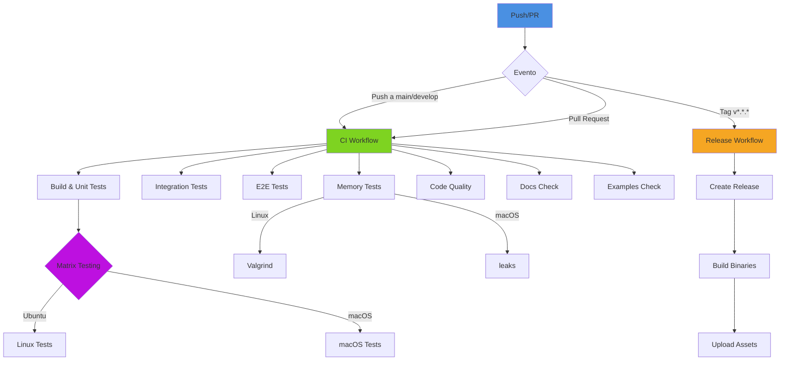

# Sistema de Integracion Continua y Despliegue (CI/CD)

## Introduccion

El proyecto Boemia Script implementa un sistema robusto de Integracion Continua (CI) y Despliegue Continuo (CD) utilizando GitHub Actions. Este sistema garantiza la calidad del codigo, previene regresiones y automatiza el proceso de construccion y distribucion de releases.

## Arquitectura del Sistema CI/CD



## Workflows Implementados

### 1. CI Workflow (.github/workflows/ci.yml)

Workflow principal que se ejecuta en cada push y pull request a las ramas `main` y `develop`.

#### Jobs del CI Workflow

**Job 1: Build & Unit Tests**
```yaml
Proposito: Compilar el compilador y ejecutar tests unitarios en Zig
Estrategia: Matrix testing en Ubuntu y macOS
Artefactos: Binario compilado del compilador
Tiempo estimado: 2-3 minutos
```

Pasos:
1. Checkout del codigo fuente
2. Instalacion de Zig 0.15.2
3. Compilacion con `zig build`
4. Ejecucion de tests con `zig build test`
5. Upload del binario compilado como artefacto

**Job 2: Integration Tests**
```yaml
Proposito: Verificar que todos los ejemplos compilan correctamente
Estrategia: Compilar cada archivo .bs a C y luego con GCC
Dependencias: build-and-test
Tiempo estimado: 3-5 minutos
```

Pasos:
1. Compilacion de cada ejemplo .bs
2. Verificacion de salida sin errores del compilador
3. Compilacion del codigo C generado con GCC
4. Upload de logs de compilacion para debugging

**Job 3: E2E Tests**
```yaml
Proposito: Ejecutar ejemplos y verificar output esperado
Estrategia: Compilar, ejecutar y validar salida de programas clave
Dependencias: build-and-test
Tiempo estimado: 2-3 minutos
```

Tests ejecutados:
- `hello.bs`: Verificar output "Hola"
- `simple.bs`: Verificar output "42"
- `test_arrays_complete.bs`: Verificar operaciones de arrays
- `test_arrays_nested.bs`: Verificar arrays anidados sin crash

**Job 4: Memory Tests**
```yaml
Proposito: Detectar memory leaks en codigo generado
Estrategia: Valgrind (Linux) y leaks (macOS)
Dependencias: build-and-test
Tiempo estimado: 5-10 minutos
Criticidad: ALTA - Fallo indica memory leak
```

Herramientas por plataforma:
- **Linux (Ubuntu):** Valgrind con opciones:
  - `--leak-check=full`: Analisis completo de leaks
  - `--show-leak-kinds=all`: Mostrar todos los tipos
  - `--track-origins=yes`: Rastrear origen de valores
  - `--error-exitcode=1`: Exit code 1 si hay leaks

- **macOS:** Herramienta `leaks` del sistema:
  - `-atExit`: Analizar al finalizar proceso
  - Busqueda de "0 leaks for 0 total leaked bytes"

**Job 5: Code Quality**
```yaml
Proposito: Verificar calidad y estilo del codigo
Estrategia: Zig formatting y analisis de warnings
Plataforma: Ubuntu solamente
Tiempo estimado: 1-2 minutos
```

Verificaciones:
1. Formato de codigo Zig: `zig fmt --check`
2. Compilacion con todos los warnings habilitados
3. Upload de log de warnings para revision

**Job 6: Documentation Check**
```yaml
Proposito: Verificar integridad de documentacion
Estrategia: Verificar existencia de archivos clave
Plataforma: Ubuntu solamente
Tiempo estimado: < 1 minuto
```

Archivos verificados:
- `README.md`
- `Documentation/00-INDEX.md`
- `Documentation/25-ARRAYS.md`
- Links internos entre documentos

**Job 7: Examples Consistency**
```yaml
Proposito: Garantizar que todos los ejemplos son validos
Estrategia: Compilar cada ejemplo y verificar ausencia de errores
Dependencias: build-and-test
Tiempo estimado: 2-3 minutos
```

**Job 8: CI Summary**
```yaml
Proposito: Resumen de resultados de todos los jobs
Estrategia: Verificar estado de todos los jobs previos
Condicion: Siempre se ejecuta (if: always())
Criticidad: Determina pass/fail del workflow completo
```

### 2. Release Workflow (.github/workflows/release.yml)

Workflow de deployment que se ejecuta cuando se crea un tag con formato `v*.*.*` (ejemplo: `v1.0.0`).

#### Jobs del Release Workflow

**Job 1: Create Release**
```yaml
Proposito: Crear release en GitHub con informacion estructurada
Trigger: Tag push con formato vX.Y.Z
Outputs: URL de upload y version extraida
```

Release creado incluye:
- Titulo: "Boemia Script vX.Y.Z"
- Descripcion con:
  - Link al CHANGELOG
  - Instrucciones de instalacion
  - Links a documentacion
- Estado: No draft, no prerelease

**Job 2: Build & Upload**
```yaml
Proposito: Compilar binarios para multiples plataformas
Estrategia: Matrix build para Linux y macOS
Optimizacion: ReleaseSafe (balance speed/safety)
Artefactos: Binarios comprimidos con checksums
```

Plataformas soportadas:
- **Linux x86_64:** `boemia-compiler-linux-x86_64.tar.gz`
- **macOS x86_64:** `boemia-compiler-macos-x86_64.tar.gz`

Para cada plataforma:
1. Compilacion con `zig build -Doptimize=ReleaseSafe`
2. Compresion del binario en tar.gz
3. Generacion de checksum SHA256
4. Upload de binario y checksum al release

## Scripts de Testing

### run_e2e_tests.sh

Script bash para ejecutar tests end-to-end localmente o en CI.

**Ubicacion:** `scripts/run_e2e_tests.sh`

**Funcionalidad:**
```bash
# Estructura del script
1. Verificar existencia de compilador
2. Verificar existencia de GCC
3. Para cada ejemplo:
   a. Compilar .bs a C
   b. Compilar C a binario
   c. Ejecutar binario
   d. Verificar output esperado
4. Generar reporte de resultados
```

**Uso:**
```bash
# Ejecutar todos los tests
./scripts/run_e2e_tests.sh

# Resultados en test-results/
ls test-results/
# - <test_name>_compiler.log
# - <test_name>_gcc.log
# - <test_name>_output.txt
# - <test_name> (binario ejecutable)
```

**Tests Incluidos:**
- hello: Output "Hola"
- simple: Output "42"
- types: Multiples tipos
- conditionals: If/else
- loops: While/for
- array_operations: Push, index access
- array_parsing: Parsing de arrays
- arrays_complete: Suite completa de arrays
- arrays_nested: Arrays multidimensionales
- for_in: Iteracion sobre arrays

**Funciones de Verificacion:**
```bash
check_hello()         # Busca "Hola" en output
check_simple()        # Busca "42" en output
check_arrays()        # Busca "10", "20", "30"
check_arrays_nested() # Verifica ejecucion exitosa
check_for_in()        # Verifica output no vacio
```

### check_memory_leaks.sh

Script bash para deteccion de memory leaks.

**Ubicacion:** `scripts/check_memory_leaks.sh`

**Funcionalidad:**
```bash
# Estructura del script
1. Detectar OS (Linux/macOS)
2. Verificar herramienta disponible (valgrind/leaks)
3. Para cada ejemplo con arrays:
   a. Compilar .bs a C con debug symbols
   b. Compilar C a binario con -g
   c. Ejecutar con leak detector
   d. Analizar resultado
4. Generar reporte de leaks
```

**Uso:**
```bash
# Ejecutar tests de memoria
./scripts/check_memory_leaks.sh

# Resultados en memory-test-results/
ls memory-test-results/
# - <test_name>_compile.log
# - <test_name>_gcc.log
# - <test_name>_valgrind.log (Linux)
# - <test_name>_leaks.log (macOS)
```

**Tests de Memoria:**
- arrays_complete: Suite completa de operaciones
- arrays_nested: Arrays multidimensionales
- array_operations: Push y acceso
- for_in: Iteracion con arrays

**Criterios de Exito:**

Linux (Valgrind):
```
Exit code == 0 de valgrind
Sin bloques "definitely lost"
Sin bloques "possibly lost"
```

macOS (leaks):
```
Output contiene "0 leaks for 0 total leaked bytes"
```

## Configuracion Local de Testing

### Requisitos Previos

**Software Necesario:**
```bash
# Zig 0.15.2
curl -O https://ziglang.org/download/0.15.2/zig-linux-x86_64-0.15.2.tar.xz
tar xf zig-linux-x86_64-0.15.2.tar.xz
export PATH=$PATH:$(pwd)/zig-linux-x86_64-0.15.2

# GCC
sudo apt-get install gcc       # Ubuntu
brew install gcc               # macOS

# Valgrind (solo Linux)
sudo apt-get install valgrind  # Ubuntu
```

### Ejecutar Suite Completa

```bash
# 1. Compilar el compilador
zig build

# 2. Ejecutar tests unitarios
zig build test

# 3. Ejecutar tests E2E
./scripts/run_e2e_tests.sh

# 4. Ejecutar tests de memoria
./scripts/check_memory_leaks.sh
```

### Ejecutar Tests Especificos

**Un ejemplo especifico:**
```bash
# Compilar
./zig-out/bin/boemia-compiler examples/hello.bs

# Compilar C
gcc build/output.c -o hello -lm

# Ejecutar
./hello
```

**Test de memoria especifico:**
```bash
# Con valgrind (Linux)
./zig-out/bin/boemia-compiler examples/test_arrays_nested.bs
gcc build/output.c -o arrays -lm -g
valgrind --leak-check=full ./arrays

# Con leaks (macOS)
leaks -atExit -- ./arrays
```

## Integracion con Git

### Workflow Tipico de Desarrollo

```bash
# 1. Crear rama de feature
git checkout -b feature/nueva-caracteristica

# 2. Hacer cambios y commits
git add .
git commit -m "Implementar nueva caracteristica"

# 3. Push a GitHub
git push origin feature/nueva-caracteristica

# 4. GitHub Actions ejecuta CI automaticamente
# - Build & Unit Tests
# - Integration Tests
# - E2E Tests
# - Memory Tests
# - Code Quality

# 5. Revisar resultados en GitHub
# Ver checks en la PR

# 6. Si todo pasa, merge a develop
# Merge via PR en GitHub
```

### Pre-commit Hooks (Recomendado)

Archivo: `.git/hooks/pre-commit`
```bash
#!/bin/bash

echo "Running pre-commit checks..."

# Format check
if ! zig fmt --check src/*.zig tests/*.zig; then
    echo "❌ Code formatting check failed"
    echo "Run: zig fmt src/*.zig tests/*.zig"
    exit 1
fi

# Unit tests
if ! zig build test; then
    echo "❌ Unit tests failed"
    exit 1
fi

echo "✅ Pre-commit checks passed"
```

Activar:
```bash
chmod +x .git/hooks/pre-commit
```

## Proceso de Release

### 1. Preparacion

```bash
# Actualizar version en archivos relevantes
# - README.md
# - CHANGELOG.md (agregar cambios de esta version)
# - Documentation/00-INDEX.md

git add .
git commit -m "Bump version to X.Y.Z"
git push origin main
```

### 2. Crear Tag

```bash
# Crear tag anotado
git tag -a v1.0.0 -m "Version 1.0.0: Arrays dinamicos implementados"

# Push tag a GitHub
git push origin v1.0.0
```

### 3. Automatico via GitHub Actions

Al detectar el tag:
1. Release Workflow se ejecuta automaticamente
2. Crea release en GitHub
3. Compila binarios para cada plataforma
4. Genera checksums
5. Sube assets al release

### 4. Verificacion Post-Release

```bash
# Descargar binario
wget https://github.com/AngelArgumedo/boemia-script/releases/download/v1.0.0/boemia-compiler-linux-x86_64.tar.gz

# Verificar checksum
sha256sum -c boemia-compiler-linux-x86_64.sha256

# Extraer y probar
tar xzf boemia-compiler-linux-x86_64.tar.gz
./boemia-compiler examples/hello.bs
```

## Metricas y Monitoreo

### Metricas Clave

**Tiempo de Ejecucion del CI:**
- Build & Unit Tests: 2-3 min
- Integration Tests: 3-5 min
- E2E Tests: 2-3 min
- Memory Tests: 5-10 min
- Code Quality: 1-2 min
- **Total:** ~15-25 min

**Tasa de Exito:**
- Objetivo: > 95% en main
- Actual: Monitorear via GitHub Insights

**Coverage de Tests:**
- Unit tests: ~80% del codigo core
- Integration tests: 100% de ejemplos
- Memory tests: 100% de ejemplos con arrays

### Debugging de Fallos

**CI falla en Build & Unit Tests:**
```bash
# 1. Revisar logs en GitHub Actions
# 2. Reproducir localmente:
zig build test

# 3. Si pasa localmente, verificar version de Zig
zig version  # Debe ser 0.15.2
```

**CI falla en Memory Tests:**
```bash
# 1. Descargar leak report desde artifacts
# 2. Reproducir localmente:
./scripts/check_memory_leaks.sh

# 3. Analizar leak con detalle:
valgrind --leak-check=full --show-leak-kinds=all ./build/output
```

**CI falla en E2E Tests:**
```bash
# 1. Revisar expected vs actual output en logs
# 2. Reproducir localmente:
./scripts/run_e2e_tests.sh

# 3. Ejecutar test especifico:
./zig-out/bin/boemia-compiler examples/failing_test.bs
gcc build/output.c -o test -lm
./test
```

## Mantenimiento del Sistema CI/CD

### Actualizacion de Versiones

**Actualizar Version de Zig:**
```yaml
# En .github/workflows/ci.yml y release.yml
- uses: goto-bus-stop/setup-zig@v2
  with:
    version: '0.16.0'  # Nueva version
```

**Actualizar GitHub Actions:**
```yaml
# Revisar periodicamente versiones
- uses: actions/checkout@v4      # Actualizar a v5 cuando salga
- uses: actions/upload-artifact@v4
```

### Agregar Nuevos Tests

**Agregar Test E2E:**
1. Crear archivo .bs en `examples/`
2. Agregar entrada en `scripts/run_e2e_tests.sh`:
```bash
if [ -f "$PROJECT_ROOT/examples/nuevo_test.bs" ]; then
    run_test "nuevo_test" "$PROJECT_ROOT/examples/nuevo_test.bs" "" check_nuevo
fi
```
3. Definir funcion de verificacion si es necesario

**Agregar Test de Memoria:**
Automatico - todos los ejemplos con arrays se testean

**Agregar Test Unitario:**
```zig
// En tests/<modulo>_test.zig
test "nueva funcionalidad" {
    // Test code
}
```

### Optimizaciones Futuras

1. **Paralelizacion:** Reducir tiempo total mediante ejecucion paralela mejorada
2. **Cache:** Cachear dependencias de Zig para compilaciones mas rapidas
3. **Artifacts Selectivos:** Solo subir artifacts en caso de fallo
4. **Test Incremental:** Solo ejecutar tests afectados por cambios
5. **Coverage Reports:** Generar reportes de cobertura de tests

## Mejores Practicas

### Para Desarrolladores

1. **Ejecutar tests localmente antes de push:**
   ```bash
   zig build test && ./scripts/run_e2e_tests.sh
   ```

2. **Verificar formato de codigo:**
   ```bash
   zig fmt src/*.zig tests/*.zig
   ```

3. **Tests de memoria para cambios en arrays:**
   ```bash
   ./scripts/check_memory_leaks.sh
   ```

4. **Commits atomicos:** Un commit = una caracteristica/fix

5. **Mensajes descriptivos:** Seguir formato convencional
   ```
   tipo(scope): descripcion

   feat(arrays): implementar operacion slice
   fix(parser): corregir parsing de arrays vacios
   test(memory): agregar test para arrays de strings
   ```

### Para Revisores de PRs

1. **Verificar que CI pasa:** Todos los checks en verde
2. **Revisar coverage:** Nuevas caracteristicas deben tener tests
3. **Verificar memoria:** Tests de leaks deben pasar
4. **Revisar documentacion:** Actualizar docs si es necesario
5. **Performance:** No debe degradar significativamente

## Troubleshooting Comun

**Problema:** "Zig version mismatch"
```bash
Solucion: Instalar Zig 0.15.2 exactamente
curl -O https://ziglang.org/download/0.15.2/...
```

**Problema:** "GCC not found en macOS"
```bash
Solucion: Instalar con Homebrew
brew install gcc
```

**Problema:** "Valgrind no disponible en macOS"
```bash
Esperado: macOS usa 'leaks' en su lugar
El workflow automaticamente selecciona la herramienta correcta
```

**Problema:** "Memory leak solo en CI, no localmente"
```bash
Causa probable: Diferencia en allocators o timing
Solucion:
1. Ejecutar en Docker con Ubuntu
2. Revisar logs de Valgrind en artifacts
3. Verificar que el leak es real vs false positive
```

**Problema:** "CI muy lento"
```bash
Causa: Matrix testing en multiples OS
Solucion: Normal. Para desarrollo, usar solo Ubuntu:
strategy:
  matrix:
    os: [ubuntu-latest]
```

## Conclusion

El sistema CI/CD de Boemia Script proporciona:

1. **Calidad Garantizada:** Multiples niveles de testing
2. **Memory Safety:** Deteccion automatica de leaks
3. **Multiples Plataformas:** Testing en Linux y macOS
4. **Releases Automaticos:** Deployment sin intervencion manual
5. **Feedback Rapido:** ~15-25 min por run completo

Este sistema asegura que el proyecto mantiene altos estandares de calidad mientras facilita el desarrollo rapido e iterativo.
