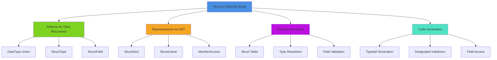
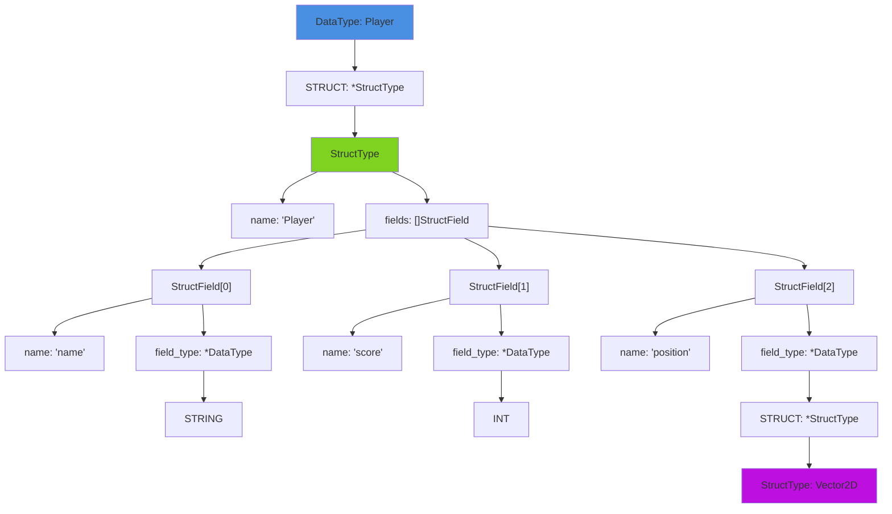
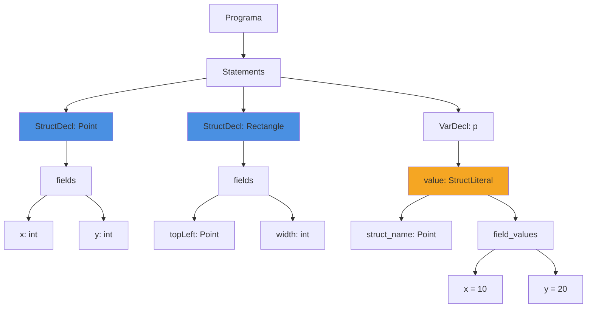
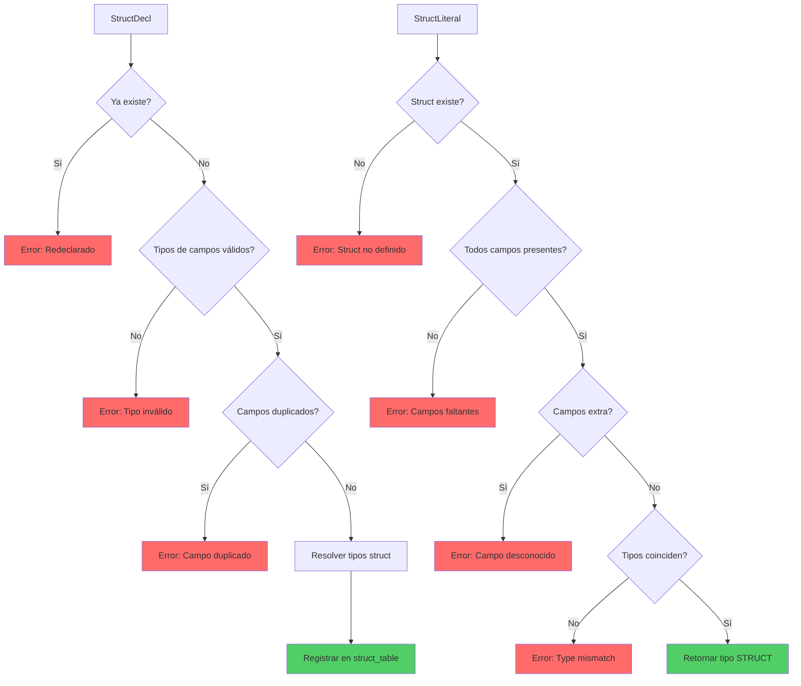
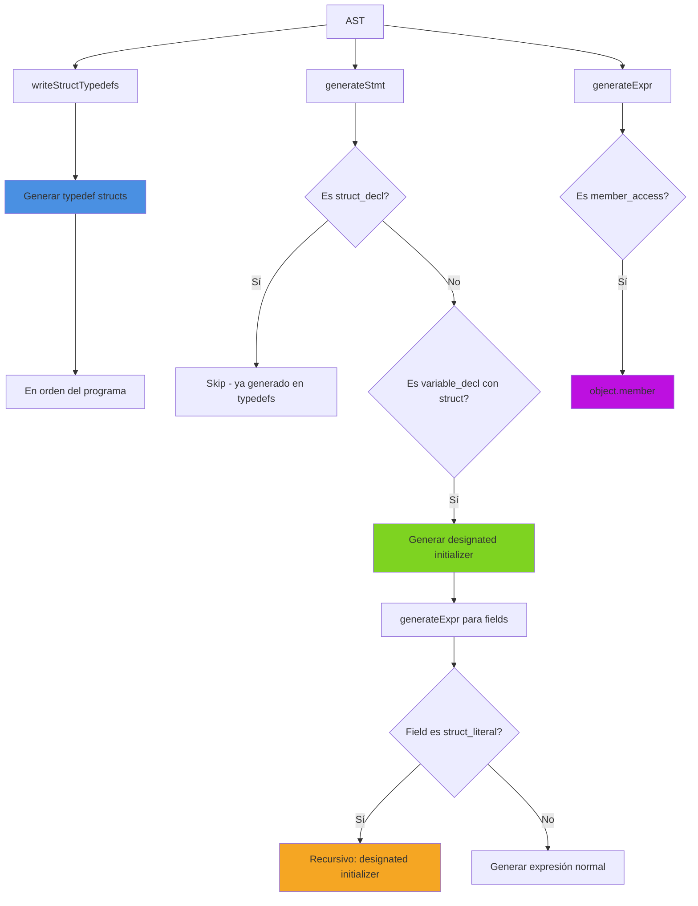

# Structs en Boemia Script

## Introduccion

Los structs en Boemia Script son tipos de datos compuestos definidos por el usuario que permiten agrupar múltiples valores de diferentes tipos bajo un solo nombre. Esta implementación proporciona un sistema robusto de tipos estructurados con validación estática completa, manteniendo la simplicidad de sintaxis y la eficiencia en la generación de código C.

La implementación de structs representa una característica fundamental del compilador, involucrando modificaciones cuidadosas en todas las fases de compilación: desde el sistema de tipos recursivos hasta la generación de código C con typedef structs y designated initializers.

## Arquitectura General



## Sistema de Tipos Recursivos

### Extension del DataType

La implementación de structs extendió el sistema de tipos recursivo existente (introducido con arrays) para soportar tipos estructurados con campos heterogéneos.

#### Sistema de Tipos con Structs

```zig
pub const DataType = union(enum) {
    INT,
    FLOAT,
    STRING,
    BOOL,
    VOID,
    ARRAY: *ArrayType,
    STRUCT: *StructType,

    pub const StructType = struct {
        name: []const u8,
        fields: []StructField,
        allocator: std.mem.Allocator,
    };

    pub const StructField = struct {
        name: []const u8,
        field_type: *DataType,
    };
};
```

**Características clave:**

- **Recursividad:** Structs pueden contener otros structs como campos
- **Heterogeneidad:** Cada campo puede tener un tipo diferente
- **Validación estática:** Tipos verificados en análisis semántico
- **Nomenclatura:** Cada struct tiene nombre único en el programa

### Representacion en Memoria del Sistema de Tipos



**Justificación del Diseño:**

1. **Punteros en field_type:** Necesarios para permitir structs recursivos (structs que contienen structs). Sin punteros, el tamaño del tipo sería infinito.

2. **Slice de Fields:** Se usa `[]StructField` en lugar de ArrayList para eficiencia en tiempo de ejecución. Los fields son inmutables después de la declaración.

3. **Allocator por Struct:** Cada StructType mantiene referencia a su allocator para facilitar la limpieza de memoria.

4. **Separación name/fields:** El nombre permite identificación única, los fields permiten validación de tipos.

### Funciones Auxiliares del Sistema de Tipos

```zig
// src/ast.zig - Conversión a string para debugging
pub fn toString(self: DataType, allocator: std.mem.Allocator) ![]const u8 {
    return switch (self) {
        .INT => try allocator.dupe(u8, "int"),
        .FLOAT => try allocator.dupe(u8, "float"),
        .STRING => try allocator.dupe(u8, "string"),
        .BOOL => try allocator.dupe(u8, "bool"),
        .VOID => try allocator.dupe(u8, "void"),
        .ARRAY => |arr_type| {
            const inner = try arr_type.element_type.*.toString(allocator);
            defer allocator.free(inner);
            return try std.fmt.allocPrint(allocator, "[{s}]", .{inner});
        },
        .STRUCT => |struct_type| {
            return try allocator.dupe(u8, struct_type.name);
        },
    };
}

// src/ast.zig - Conversión a nombre C
pub fn toCName(self: DataType, allocator: std.mem.Allocator) ![]const u8 {
    return switch (self) {
        .INT => try allocator.dupe(u8, "long long"),
        .FLOAT => try allocator.dupe(u8, "double"),
        .STRING => try allocator.dupe(u8, "char*"),
        .BOOL => try allocator.dupe(u8, "bool"),
        .VOID => try allocator.dupe(u8, "void"),
        .ARRAY => |arr_type| {
            const inner = try arr_type.element_type.*.toCName(allocator);
            defer allocator.free(inner);
            return try std.fmt.allocPrint(allocator, "Array_{s}", .{inner});
        },
        .STRUCT => |struct_type| {
            return try allocator.dupe(u8, struct_type.name);
        },
    };
}
```

**Ejemplos de Conversión:**

| Tipo Boemia Script | toString() | toCName() |
|-------------------|------------|-----------|
| `Point` | `"Point"` | `"Point"` |
| `[Point]` | `"[Point]"` | `"Array_Point"` |
| `[[Player]]` | `"[[Player]]"` | `"Array_Array_Player"` |

## Representacion en el AST

### Nuevos Nodos del AST

#### 1. StructDecl (Statement)

Representa la declaración de un struct.

```zig
// src/ast.zig
pub const Stmt = union(enum) {
    // ... otros statements
    struct_decl: *StructDecl,

    pub const StructDecl = struct {
        name: []const u8,
        fields: []DataType.StructField,
    };
};
```

**Ejemplo Boemia Script:**
```
struct Point {
    x: int,
    y: int
}
```

**Representación AST:**
```zig
StructDecl {
    .name = "Point",
    .fields = [
        StructField { .name = "x", .field_type = *DataType.INT },
        StructField { .name = "y", .field_type = *DataType.INT }
    ]
}
```

#### 2. StructLiteral (Expression)

Representa la inicialización de un struct.

```zig
// src/ast.zig
pub const Expr = union(enum) {
    // ... otras expresiones
    struct_literal: *StructLiteral,

    pub const StructLiteral = struct {
        struct_name: []const u8,
        field_values: []FieldValue,
    };

    pub const FieldValue = struct {
        field_name: []const u8,
        value: Expr,
    };
};
```

**Ejemplo Boemia Script:**
```
Point { x: 10, y: 20 }
```

**Representación AST:**
```zig
StructLiteral {
    .struct_name = "Point",
    .field_values = [
        FieldValue { .field_name = "x", .value = Expr{ .integer = 10 } },
        FieldValue { .field_name = "y", .value = Expr{ .integer = 20 } }
    ]
}
```

#### 3. MemberAccess (Expression - Extensión)

Ya existía para arrays (`.length`), extendido para structs.

```zig
// src/ast.zig
pub const Expr = union(enum) {
    // ... otras expresiones
    member_access: *MemberAccess,

    pub const MemberAccess = struct {
        object: Expr,
        member: []const u8,
    };
};
```

**Ejemplos Boemia Script:**
```
p.x              // acceso simple
rect.topLeft.x   // acceso anidado
```

### Diagrama de Flujo AST



## Parser Implementation

### 1. Reconocimiento de Tipos Struct

El parser debe reconocer nombres de struct como tipos válidos.

```zig
// src/parser.zig - parseDataType()
fn parseDataType(self: *Parser) !DataType {
    // Manejar arrays: [tipo]
    if (self.peek_token.type == .LBRACKET) {
        self.nextToken(); // consume '['
        const elem_type_value = try self.parseDataType();
        try self.expectToken(.RBRACKET);
        self.nextToken();

        const elem_type_ptr = try self.allocator.create(DataType);
        elem_type_ptr.* = elem_type_value;

        const array_type = try self.allocator.create(DataType.ArrayType);
        array_type.* = .{
            .element_type = elem_type_ptr,
            .allocator = self.allocator,
        };

        return DataType{ .ARRAY = array_type };
    }

    // Verificar tipos simples primero
    if (try DataType.fromString(self.allocator, self.peek_token.lexeme)) |data_type| {
        self.nextToken();
        return data_type;
    }

    // Verificar si es un tipo struct (IDENTIFIER)
    if (self.peek_token.type == .IDENTIFIER) {
        const struct_type_ptr = try self.allocator.create(DataType.StructType);
        struct_type_ptr.* = .{
            .name = self.peek_token.lexeme,
            .fields = &[_]DataType.StructField{}, // Vacío, resuelto por analyzer
            .allocator = self.allocator,
        };
        self.nextToken();
        return DataType{ .STRUCT = struct_type_ptr };
    }

    return ParseError.InvalidType;
}
```

**Flujo de decisión:**

1. ¿Es `[`? → Tipo array
2. ¿Es palabra clave de tipo? → Tipo primitivo
3. ¿Es identificador? → Tipo struct (stub)
4. Si no → Error

**Importante:** El parser crea un "stub" de StructType con fields vacíos. El analyzer lo resuelve a la definición completa.

### 2. Parsing de Declaración de Struct

```zig
// src/parser.zig - parseStructDecl()
fn parseStructDecl(self: *Parser) ParseError!Stmt {
    self.nextToken(); // consume 'struct'

    if (self.current_token.type != .IDENTIFIER) {
        return ParseError.UnexpectedToken;
    }
    const name = self.current_token.lexeme;

    try self.expectToken(.LBRACE);
    self.nextToken(); // move to first field or RBRACE

    var fields: std.ArrayList(DataType.StructField) = .empty;
    defer fields.deinit(self.allocator);

    while (self.current_token.type != .RBRACE) {
        if (self.current_token.type != .IDENTIFIER) {
            return ParseError.UnexpectedToken;
        }
        const field_name = self.current_token.lexeme;

        try self.expectToken(.COLON);

        const field_type_value = try self.parseDataType();
        self.nextToken();

        const field_type_ptr = try self.allocator.create(DataType);
        field_type_ptr.* = field_type_value;

        try fields.append(self.allocator, .{
            .name = field_name,
            .field_type = field_type_ptr,
        });

        if (self.current_token.type == .COMMA) {
            self.nextToken();
        }
    }

    self.nextToken(); // consume RBRACE

    const struct_decl = try self.allocator.create(Stmt.StructDecl);
    struct_decl.* = .{
        .name = name,
        .fields = try fields.toOwnedSlice(self.allocator),
    };

    return Stmt{ .struct_decl = struct_decl };
}
```

**Gramática:**
```
struct_decl ::= 'struct' IDENTIFIER '{' field_list '}'
field_list  ::= field (',' field)*
field       ::= IDENTIFIER ':' data_type
```

**Ejemplo de parsing:**

```
struct Rectangle {
    topLeft: Point,
    width: int,
    height: int
}
```

1. Consume `struct`
2. Lee nombre: `"Rectangle"`
3. Consume `{`
4. Loop de fields:
   - Lee `topLeft : Point`
   - Lee `width : int`
   - Lee `height : int`
5. Consume `}`
6. Crea StructDecl con 3 fields

### 3. Parsing de Struct Literal

```zig
// src/parser.zig - parseStructLiteral()
fn parseStructLiteral(self: *Parser, struct_name: []const u8) ParseError!Expr {
    self.nextToken(); // consume '{'

    var field_values: std.ArrayList(Expr.FieldValue) = .empty;
    defer field_values.deinit(self.allocator);

    while (self.current_token.type != .RBRACE) {
        if (self.current_token.type != .IDENTIFIER) {
            return ParseError.UnexpectedToken;
        }
        const field_name = self.current_token.lexeme;

        try self.expectToken(.COLON);
        self.nextToken();

        const value = try self.parseExpression(0);

        try field_values.append(self.allocator, .{
            .field_name = field_name,
            .value = value,
        });

        if (self.current_token.type == .COMMA) {
            self.nextToken();
        }
    }

    self.nextToken(); // consume '}'

    const struct_lit = try self.allocator.create(Expr.StructLiteral);
    struct_lit.* = .{
        .struct_name = struct_name,
        .field_values = try field_values.toOwnedSlice(self.allocator),
    };

    return Expr{ .struct_literal = struct_lit };
}
```

**Gramática:**
```
struct_literal ::= IDENTIFIER '{' field_value_list '}'
field_value_list ::= field_value (',' field_value)*
field_value ::= IDENTIFIER ':' expression
```

**Ejemplo de parsing:**

```
Rectangle {
    topLeft: Point { x: 0, y: 0 },
    width: 100,
    height: 50
}
```

1. Lee `Rectangle`
2. Consume `{`
3. Loop de field_values:
   - `topLeft : Point { x: 0, y: 0 }` (recursivo!)
   - `width : 100`
   - `height : 50`
4. Consume `}`
5. Crea StructLiteral con 3 field_values

**Nota:** Los struct literals pueden estar anidados. La recursión ocurre en `parseExpression()` que puede devolver otro StructLiteral.

## Analisis Semantico

### Struct Table

El analyzer mantiene una tabla de structs declarados.

```zig
// src/analyzer.zig
pub const Analyzer = struct {
    allocator: std.mem.Allocator,
    symbol_table: std.StringHashMap(Symbol),
    function_table: std.StringHashMap(FunctionSignature),
    struct_table: std.StringHashMap(DataType.StructType),
    errors: std.ArrayList([]const u8),

    pub fn init(allocator: std.mem.Allocator) Analyzer {
        return Analyzer{
            .allocator = allocator,
            .symbol_table = std.StringHashMap(Symbol).init(allocator),
            .function_table = std.StringHashMap(FunctionSignature).init(allocator),
            .struct_table = std.StringHashMap(DataType.StructType).init(allocator),
            .errors = .empty,
        };
    }
};
```

**Contenido de struct_table:**

| Clave (nombre) | Valor (StructType) |
|----------------|-------------------|
| `"Point"` | `{ name: "Point", fields: [x:int, y:int] }` |
| `"Rectangle"` | `{ name: "Rectangle", fields: [topLeft:Point, width:int, height:int] }` |
| `"Player"` | `{ name: "Player", fields: [name:string, score:int, position:Vector2D] }` |

### Resolución de Tipos

Problema: El parser crea StructType stubs con fields vacíos. El analyzer debe resolverlos.

```zig
// src/analyzer.zig - resolveStructType()
fn resolveStructType(self: *Analyzer, data_type: DataType) !DataType {
    switch (data_type) {
        .STRUCT => |struct_type| {
            // Buscar definición completa en struct_table
            if (self.struct_table.get(struct_type.name)) |full_struct| {
                const resolved_ptr = try self.allocator.create(DataType.StructType);
                resolved_ptr.* = full_struct;
                return DataType{ .STRUCT = resolved_ptr };
            } else {
                return data_type; // No encontrado, devolver stub
            }
        },
        else => return data_type,
    }
}
```

**Cuándo se usa:**

1. Al registrar struct en struct_table (resolver tipos de campos)
2. Al guardar variable en symbol_table (resolver tipo de variable)

### Validación de StructDecl

```zig
// src/analyzer.zig - analyzeStmt()
.struct_decl => |struct_decl| {
    // 1. Verificar que el struct no esté duplicado
    if (self.struct_table.get(struct_decl.name)) |_| {
        const err = try std.fmt.allocPrint(
            self.allocator,
            "Struct '{s}' is already declared",
            .{struct_decl.name},
        );
        try self.errors.append(self.allocator, err);
        return AnalyzerError.RedeclaredVariable;
    }

    // 2. Validar que todos los tipos de campos existan
    for (struct_decl.fields) |field| {
        switch (field.field_type.*) {
            .STRUCT => |field_struct| {
                if (self.struct_table.get(field_struct.name) == null) {
                    const err = try std.fmt.allocPrint(
                        self.allocator,
                        "Undefined struct type '{s}' in field '{s}'",
                        .{ field_struct.name, field.name },
                    );
                    try self.errors.append(self.allocator, err);
                    return AnalyzerError.TypeMismatch;
                }
            },
            else => {},
        }
    }

    // 3. Verificar que no haya campos duplicados
    for (struct_decl.fields, 0..) |field, i| {
        for (struct_decl.fields[i + 1 ..]) |other_field| {
            if (std.mem.eql(u8, field.name, other_field.name)) {
                const err = try std.fmt.allocPrint(
                    self.allocator,
                    "Duplicate field '{s}' in struct '{s}'",
                    .{ field.name, struct_decl.name },
                );
                try self.errors.append(self.allocator, err);
                return AnalyzerError.RedeclaredVariable;
            }
        }
    }

    // 4. Resolver tipos struct en campos antes de registrar
    for (struct_decl.fields) |field| {
        const resolved_type = try self.resolveStructType(field.field_type.*);
        field.field_type.* = resolved_type;
    }

    // 5. Registrar struct en struct_table
    try self.struct_table.put(struct_decl.name, DataType.StructType{
        .name = struct_decl.name,
        .fields = struct_decl.fields,
        .allocator = self.allocator,
    });
}
```

**Validaciones realizadas:**

1. ✓ Struct no duplicado
2. ✓ Tipos de campos existen (structs declarados previamente)
3. ✓ Campos no duplicados
4. ✓ Resolución de tipos struct en campos
5. ✓ Registro en struct_table

**Ejemplo de error detectado:**

```
struct Player {
    name: string,
    score: int,
    position: Vector2D  // ERROR si Vector2D no fue declarado antes
}
```

Error: `"Undefined struct type 'Vector2D' in field 'position'"`

### Validación de StructLiteral

```zig
// src/analyzer.zig - checkExpr()
.struct_literal => |struct_lit| blk: {
    // 1. Verificar que el struct exista
    const struct_type = self.struct_table.get(struct_lit.struct_name) orelse {
        const err = try std.fmt.allocPrint(
            self.allocator,
            "Undefined struct type '{s}'",
            .{struct_lit.struct_name},
        );
        try self.errors.append(self.allocator, err);
        return AnalyzerError.UndefinedVariable;
    };

    // 2. Verificar que todos los campos requeridos estén presentes
    for (struct_type.fields) |field| {
        var found = false;
        for (struct_lit.field_values) |field_val| {
            if (std.mem.eql(u8, field.name, field_val.field_name)) {
                found = true;
                break;
            }
        }
        if (!found) {
            const err = try std.fmt.allocPrint(
                self.allocator,
                "Missing field '{s}' in struct literal '{s}'",
                .{ field.name, struct_lit.struct_name },
            );
            try self.errors.append(self.allocator, err);
            return AnalyzerError.TypeMismatch;
        }
    }

    // 3. Verificar que no haya campos extra
    for (struct_lit.field_values) |field_val| {
        var found = false;
        for (struct_type.fields) |field| {
            if (std.mem.eql(u8, field.name, field_val.field_name)) {
                found = true;
                break;
            }
        }
        if (!found) {
            const err = try std.fmt.allocPrint(
                self.allocator,
                "Unknown field '{s}' in struct '{s}'",
                .{ field_val.field_name, struct_lit.struct_name },
            );
            try self.errors.append(self.allocator, err);
            return AnalyzerError.TypeMismatch;
        }
    }

    // 4. Verificar que los tipos de valores coincidan
    for (struct_lit.field_values) |field_val| {
        const value_type = try self.checkExpr(&field_val.value);

        var expected_type: ?DataType = null;
        for (struct_type.fields) |field| {
            if (std.mem.eql(u8, field.name, field_val.field_name)) {
                expected_type = field.field_type.*;
                break;
            }
        }

        if (expected_type) |exp_type| {
            if (!self.typesEqual(value_type, exp_type)) {
                const value_type_str = try value_type.toString(self.allocator);
                const exp_type_str = try exp_type.toString(self.allocator);
                const err = try std.fmt.allocPrint(
                    self.allocator,
                    "Type mismatch for field '{s}': expected {s}, got {s}",
                    .{ field_val.field_name, exp_type_str, value_type_str },
                );
                try self.errors.append(self.allocator, err);
                return AnalyzerError.TypeMismatch;
            }
        }
    }

    // 5. Retornar tipo struct
    const struct_type_ptr = try self.allocator.create(DataType.StructType);
    struct_type_ptr.* = struct_type;
    break :blk DataType{ .STRUCT = struct_type_ptr };
}
```

**Validaciones realizadas:**

1. ✓ Struct existe en struct_table
2. ✓ Todos los campos requeridos presentes
3. ✓ No hay campos extra
4. ✓ Tipos de valores coinciden con tipos de campos
5. ✓ Retorna tipo correcto

**Ejemplos de errores detectados:**

```
Point { x: 10 }  // ERROR: Missing field 'y'
```

```
Point { x: 10, y: 20, z: 30 }  // ERROR: Unknown field 'z'
```

```
Point { x: "hello", y: 20 }  // ERROR: Type mismatch for field 'x': expected int, got string
```

### Validación de MemberAccess

```zig
// src/analyzer.zig - checkExpr()
.member_access => |mem| blk: {
    const object_type = try self.checkExpr(&mem.object);

    switch (object_type) {
        .ARRAY => {
            // Manejo de .length para arrays
            if (std.mem.eql(u8, mem.member, "length")) {
                break :blk DataType.INT;
            } else {
                const err = try std.fmt.allocPrint(
                    self.allocator,
                    "Unknown array property '{s}' (only 'length' is supported)",
                    .{mem.member},
                );
                try self.errors.append(self.allocator, err);
                return AnalyzerError.InvalidOperation;
            }
        },
        .STRUCT => |struct_type| {
            // Buscar el campo en el struct
            for (struct_type.fields) |field| {
                if (std.mem.eql(u8, field.name, mem.member)) {
                    break :blk field.field_type.*;
                }
            }
            // Campo no encontrado
            const err = try std.fmt.allocPrint(
                self.allocator,
                "Struct '{s}' does not have field '{s}'",
                .{ struct_type.name, mem.member },
            );
            try self.errors.append(self.allocator, err);
            return AnalyzerError.InvalidOperation;
        },
        else => {
            const obj_type_str = try object_type.toString(self.allocator);
            const err = try std.fmt.allocPrint(
                self.allocator,
                "Type {s} does not have property '{s}'",
                .{ obj_type_str, mem.member },
            );
            try self.errors.append(self.allocator, err);
            return AnalyzerError.InvalidOperation;
        },
    }
}
```

**Validaciones realizadas:**

1. ✓ Objeto tiene tipo compatible (ARRAY o STRUCT)
2. ✓ Miembro existe en el tipo
3. ✓ Retorna tipo correcto del campo

**Ejemplos:**

```
p.x  // object_type=Point, retorna INT
rect.topLeft  // object_type=Rectangle, retorna Point (STRUCT)
rect.topLeft.x  // anidado: primero retorna Point, luego retorna INT
```

### Diagrama de Flujo de Validación



## Generación de Código

### 1. Typedef Struct Generation

Los structs en Boemia Script se traducen a typedef structs en C.

```zig
// src/codegen.zig - writeStructTypedefs()
fn writeStructTypedefs(self: *CodeGenerator, program: *Program) !void {
    // Generar typedef para cada struct en el orden del programa
    for (program.statements) |*stmt| {
        if (stmt.* == .struct_decl) {
            const struct_decl = stmt.struct_decl;

            // Registrar en struct_types_seen
            const struct_type = DataType.StructType{
                .name = struct_decl.name,
                .fields = struct_decl.fields,
                .allocator = self.allocator,
            };
            try self.struct_types_seen.put(struct_decl.name, struct_type);

            // Generar typedef inmediatamente
            try self.write("typedef struct {\n");
            self.indent_level += 1;

            // Generar cada campo
            for (struct_decl.fields) |field| {
                try self.writeIndent();
                const field_type_c = try self.mapTypeToC(field.field_type.*);
                try self.write(field_type_c);
                try self.write(" ");
                try self.write(field.name);
                try self.write(";\n");
            }

            self.indent_level -= 1;
            try self.write("} ");
            try self.write(struct_decl.name);
            try self.write(";\n\n");
        }
    }
}
```

**Ejemplo de transformación:**

```
// Boemia Script
struct Point {
    x: int,
    y: int
}

struct Rectangle {
    topLeft: Point,
    width: int,
    height: int
}
```

```c
// C generado
typedef struct {
    long long x;
    long long y;
} Point;

typedef struct {
    Point topLeft;
    long long width;
    long long height;
} Rectangle;
```

**Punto crítico:** El orden importa. Point debe definirse ANTES de Rectangle porque Rectangle usa Point. La solución es generar en el orden del programa.

### 2. Designated Initializers

Los struct literals se traducen a designated initializers de C99.

```zig
// src/codegen.zig - generateStmt() para variable_decl
if (decl.data_type == .STRUCT and decl.value == .struct_literal) {
    const struct_lit = decl.value.struct_literal;

    if (decl.is_const) {
        try self.write("const ");
    }
    const type_c = try self.mapTypeToC(decl.data_type);
    defer self.allocator.free(type_c);
    try self.write(type_c);
    try self.write(" ");
    try self.write(decl.name);
    try self.write(" = ");

    // Generate designated initializer: { .x = 10, .y = 20 }
    try self.write("{");
    for (struct_lit.field_values, 0..) |field_val, i| {
        if (i > 0) try self.write(", ");
        try self.write(".");
        try self.write(field_val.field_name);
        try self.write(" = ");
        try self.generateExpr(&field_val.value);
    }
    try self.write("};\n");

    return;
}
```

**Ejemplo de transformación:**

```
// Boemia Script
let p: Point = Point { x: 10, y: 20 };
```

```c
// C generado
Point p = {.x = 10, .y = 20};
```

### 3. Struct Literals en Expresiones

Los struct literals pueden aparecer anidados en otros literals.

```zig
// src/codegen.zig - generateExpr()
.struct_literal => |struct_lit| {
    // Generate designated initializer: { .field1 = val1, .field2 = val2 }
    try self.write("{");
    for (struct_lit.field_values, 0..) |field_val, i| {
        if (i > 0) try self.write(", ");
        try self.write(".");
        try self.write(field_val.field_name);
        try self.write(" = ");
        try self.generateExpr(&field_val.value);  // RECURSIVO
    }
    try self.write("}");
},
```

**Ejemplo de transformación (anidado):**

```
// Boemia Script
let rect: Rectangle = Rectangle {
    topLeft: Point { x: 0, y: 0 },
    width: 100,
    height: 50
};
```

```c
// C generado
Rectangle rect = {.topLeft = {.x = 0, .y = 0}, .width = 100, .height = 50};
```

**Nota:** La llamada recursiva a `generateExpr()` maneja el anidamiento.

### 4. Member Access

```zig
// src/codegen.zig - generateExpr()
.member_access => |mem| {
    // Arrays: .length
    // Structs: .field
    try self.generateExpr(&mem.object);
    try self.write(".");
    try self.write(mem.member);
},
```

**Ejemplo de transformación:**

```
// Boemia Script
let x: int = p.x;
let top_x: int = rect.topLeft.x;
```

```c
// C generado
long long x = p.x;
long long top_x = rect.topLeft.x;
```

**Nota:** El acceso anidado funciona porque `generateExpr(&mem.object)` genera primero `rect.topLeft`, luego se concatena `.x`.

### 5. Type Mapping

```zig
// src/codegen.zig - mapTypeToC()
fn mapTypeToC(self: *CodeGenerator, data_type: DataType) CodeGenError![]const u8 {
    return switch (data_type) {
        .INT => try self.allocator.dupe(u8, "long long"),
        .FLOAT => try self.allocator.dupe(u8, "double"),
        .STRING => try self.allocator.dupe(u8, "char*"),
        .BOOL => try self.allocator.dupe(u8, "bool"),
        .VOID => try self.allocator.dupe(u8, "void"),
        .ARRAY => |arr_type| {
            const inner = try self.mapTypeToC(arr_type.element_type.*);
            defer self.allocator.free(inner);
            return try std.fmt.allocPrint(self.allocator, "Array_{s}*", .{inner});
        },
        .STRUCT => |struct_type| {
            return try self.allocator.dupe(u8, struct_type.name);
        },
    };
}
```

**Mapeo de tipos:**

| Boemia Script | C |
|---------------|---|
| `int` | `long long` |
| `float` | `double` |
| `string` | `char*` |
| `bool` | `bool` |
| `Point` | `Point` |
| `[int]` | `Array_long long*` |
| `[Point]` | `Array_Point*` |

### Diagrama de Generación Completo



## Ejemplos Completos

### Ejemplo 1: Structs Básicos

**Código Boemia Script:**
```
struct Point {
    x: int,
    y: int
}

let p1: Point = Point { x: 10, y: 20 };
let p2: Point = Point { x: 5, y: 15 };

let x_val: int = p1.x;
let y_val: int = p1.y;

print(x_val);
print(y_val);
print(p2.x);
print(p2.y);
```

**Código C Generado:**
```c
// Generated by Boemia Script Compiler
#include <stdio.h>
#include <stdlib.h>
#include <string.h>
#include <stdbool.h>

typedef struct {
    long long x;
    long long y;
} Point;


int main(void) {
    Point p1 = {.x = 10, .y = 20};
    Point p2 = {.x = 5, .y = 15};
    long long x_val = p1.x;
    long long y_val = p1.y;
    printf("%lld\n", (long long)x_val);
    printf("%lld\n", (long long)y_val);
    printf("%lld\n", (long long)p2.x);
    printf("%lld\n", (long long)p2.y);
    return 0;
}
```

**Output:**
```
10
20
5
15
```

### Ejemplo 2: Structs Anidados

**Código Boemia Script:**
```
struct Point {
    x: int,
    y: int
}

struct Rectangle {
    topLeft: Point,
    width: int,
    height: int
}

let origin: Point = Point { x: 0, y: 0 };

let rect: Rectangle = Rectangle {
    topLeft: origin,
    width: 100,
    height: 50
};

let top_x: int = rect.topLeft.x;
let top_y: int = rect.topLeft.y;

print(top_x);
print(top_y);
print(rect.width);
print(rect.height);

let rect2: Rectangle = Rectangle {
    topLeft: Point { x: 10, y: 20 },
    width: 200,
    height: 150
};

print(rect2.topLeft.x);
print(rect2.topLeft.y);
```

**Código C Generado:**
```c
// Generated by Boemia Script Compiler
#include <stdio.h>
#include <stdlib.h>
#include <string.h>
#include <stdbool.h>

typedef struct {
    long long x;
    long long y;
} Point;

typedef struct {
    Point topLeft;
    long long width;
    long long height;
} Rectangle;


int main(void) {
    Point origin = {.x = 0, .y = 0};
    Rectangle rect = {.topLeft = origin, .width = 100, .height = 50};
    long long top_x = rect.topLeft.x;
    long long top_y = rect.topLeft.y;
    printf("%lld\n", (long long)top_x);
    printf("%lld\n", (long long)top_y);
    printf("%lld\n", (long long)rect.width);
    printf("%lld\n", (long long)rect.height);
    Rectangle rect2 = {.topLeft = {.x = 10, .y = 20}, .width = 200, .height = 150};
    printf("%lld\n", (long long)rect2.topLeft.x);
    printf("%lld\n", (long long)rect2.topLeft.y);
    return 0;
}
```

**Output:**
```
0
0
100
50
10
20
```

### Ejemplo 3: Structs con Múltiples Tipos

**Código Boemia Script:**
```
struct Vector2D {
    x: float,
    y: float
}

struct Player {
    score: int,
    position: Vector2D
}

struct Game {
    maxPlayers: int,
    isActive: bool
}

let game: Game = Game {
    maxPlayers: 4,
    isActive: true
};

let player: Player = Player {
    score: 100,
    position: Vector2D { x: 10.5, y: 20.3 }
};

print(game.maxPlayers);
print(player.score);
print(player.position.x);
print(player.position.y);
```

**Código C Generado:**
```c
// Generated by Boemia Script Compiler
#include <stdio.h>
#include <stdlib.h>
#include <string.h>
#include <stdbool.h>

typedef struct {
    double x;
    double y;
} Vector2D;

typedef struct {
    long long score;
    Vector2D position;
} Player;

typedef struct {
    long long maxPlayers;
    bool isActive;
} Game;


int main(void) {
    Game game = {.maxPlayers = 4, .isActive = true};
    Player player = {.score = 100, .position = {.x = 10.5, .y = 20.3}};
    printf("%lld\n", (long long)game.maxPlayers);
    printf("%lld\n", (long long)player.score);
    printf("%f\n", (double)player.position.x);
    printf("%f\n", (double)player.position.y);
    return 0;
}
```

**Output:**
```
4
100
10.500000
20.300000
```

## Bugs Encontrados y Solucionados

Durante la implementación y testing se encontraron 3 bugs críticos:

### Bug 1: Struct Fields Vacíos en Tipos Anidados

**Síntoma:**
```
Error: Struct 'Point' does not have field 'x'
```

**Causa:**
Cuando el parser lee `topLeft: Point` en Rectangle, crea un StructType stub con `fields = []`. Este stub se guarda en el StructField de Rectangle. Al validar `Point { x: 0, y: 0 }`, Point tiene fields vacíos.

**Solución (analyzer.zig:418-422):**
```zig
// Resolve struct field types before registering
for (struct_decl.fields) |field| {
    const resolved_type = try self.resolveStructType(field.field_type.*);
    field.field_type.* = resolved_type;
}
```

### Bug 2: Orden Incorrecto de Typedef Structs

**Síntoma:**
```c
typedef struct {
    Point topLeft;  // ERROR: unknown type name 'Point'
    ...
} Rectangle;

typedef struct {
    long long x;
    long long y;
} Point;
```

**Causa:**
HashMap iterator no garantiza orden. Rectangle se generaba antes que Point.

**Solución (codegen.zig:373-407):**
Cambiar de iterar HashMap a iterar program.statements en orden:
```zig
fn writeStructTypedefs(self: *CodeGenerator, program: *Program) !void {
    // Generar typedef para cada struct en el orden del programa
    for (program.statements) |*stmt| {
        if (stmt.* == .struct_decl) {
            // Generar inmediatamente
            ...
        }
    }
}
```

### Bug 3: Struct Literals Anidados No Generaban Código

**Síntoma:**
```c
Rectangle rect2 = {.topLeft = /* struct literal - should be handled */, ...};
```

**Causa:**
generateExpr para struct_literal solo tenía un comentario stub.

**Solución (codegen.zig:901-912):**
```zig
.struct_literal => |struct_lit| {
    try self.write("{");
    for (struct_lit.field_values, 0..) |field_val, i| {
        if (i > 0) try self.write(", ");
        try self.write(".");
        try self.write(field_val.field_name);
        try self.write(" = ");
        try self.generateExpr(&field_val.value);  // Recursivo
    }
    try self.write("}");
},
```

## Limitaciones Actuales

1. **No hay métodos:** Los structs solo contienen datos, no funciones
2. **No hay herencia:** No se puede extender un struct de otro
3. **No hay visibilidad:** Todos los campos son públicos
4. **Orden de declaración:** Structs deben declararse antes de usarse
5. **Sin inicialización por defecto:** Todos los campos deben especificarse en literal
6. **Sin constructores:** No hay sintaxis especial para inicialización

## Trabajo Futuro

1. **Métodos en Structs:** Permitir funciones asociadas
2. **Constructores:** Sintaxis simplificada para inicialización
3. **Valores por defecto:** Campos opcionales con valores default
4. **Pattern matching:** Desestructuración de structs
5. **Forward declarations:** Permitir referencias circulares
6. **Punteros a structs:** Para estructuras recursivas (árboles, listas)

## Conclusión

La implementación de structs en Boemia Script proporciona un sistema de tipos compuestos robusto y eficiente. La integración con el sistema de tipos recursivo existente permite combinar structs con arrays (`[Point]`, `[[Player]]`) y anidar structs dentro de structs de forma arbitraria.

El sistema mantiene type safety completo en tiempo de compilación, detectando errores de tipos, campos faltantes, campos duplicados y referencias a structs no definidos. La generación de código produce C idiomático con typedef structs y designated initializers, aprovechando características modernas de C99.

Esta implementación sienta las bases para futuras extensiones como métodos, herencia, y pattern matching, consolidando a Boemia Script como un lenguaje con capacidades de programación estructurada completas.
