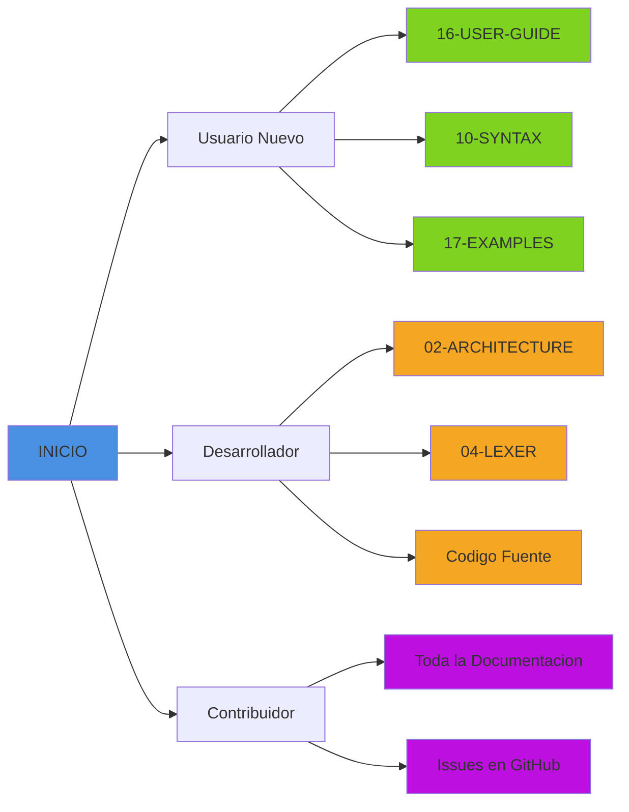

# Documentacion Tecnica de Boemia Script

## Bienvenido

Esta carpeta contiene la documentacion tecnica completa del compilador de Boemia Script. La documentacion esta organizada de forma modular para facilitar su navegacion y comprension.

## Inicio Rapido

Para comenzar a explorar la documentacion, sigue este orden recomendado:

1. Comienza con [00-INDEX.md](00-INDEX.md) - Indice general de toda la documentacion
2. Lee [01-OVERVIEW.md](01-OVERVIEW.md) - Vision general del proyecto
3. Continua segun tu interes:
   - **Usuario**: [16-USER-GUIDE.md](16-USER-GUIDE.md)
   - **Desarrollador**: [02-ARCHITECTURE.md](02-ARCHITECTURE.md)
   - **Aprendiz**: [10-SYNTAX.md](10-SYNTAX.md) y [17-EXAMPLES.md](17-EXAMPLES.md)

## Estructura de la Documentacion

### Documentos Principales Incluidos

#### Introduccion
- **00-INDEX.md** - Indice completo y mapa de navegacion
- **01-OVERVIEW.md** - Vision general del proyecto y motivacion
- **02-ARCHITECTURE.md** - Arquitectura completa del compilador

#### Componentes Tecnicos
- **04-LEXER.md** - Analisis lexico detallado con diagramas
- **10-SYNTAX.md** - Sintaxis completa del lenguaje

#### Guias Practicas
- **16-USER-GUIDE.md** - Guia de instalacion y uso
- **17-EXAMPLES.md** - Ejemplos practicos comentados

## Formato de la Documentacion

Toda la documentacion esta escrita en Markdown con las siguientes caracteristicas:

- Diagramas interactivos usando Mermaid
- Ejemplos de codigo con syntax highlighting
- Tablas comparativas
- Notas y advertencias destacadas
- Referencias cruzadas entre documentos

## Visualizacion de Diagramas Mermaid

Los diagramas Mermaid se pueden visualizar de varias formas:

### Opcion 1: GitHub (Recomendado)
GitHub renderiza automaticamente los diagramas Mermaid. Simplemente navega los archivos en el repositorio.

### Opcion 2: Visual Studio Code
Instala la extension "Markdown Preview Mermaid Support":
```bash
code --install-extension bierner.markdown-mermaid
```

### Opcion 3: Editor Online
Visita https://mermaid.live/ y pega el codigo de los diagramas.

### Opcion 4: Plugins para Navegadores
- Chrome/Edge: "Markdown Viewer"
- Firefox: "Markdown Viewer Webext"

## Documentos Disponibles

| Archivo | Descripcion | Nivel |
|---------|-------------|-------|
| 00-INDEX.md | Indice general completo | Todos |
| 01-OVERVIEW.md | Vision general del proyecto | Principiante |
| 02-ARCHITECTURE.md | Arquitectura del compilador | Intermedio |
| 04-LEXER.md | Analisis lexico | Avanzado |
| 10-SYNTAX.md | Sintaxis del lenguaje | Principiante |
| 16-USER-GUIDE.md | Guia de uso | Principiante |
| 17-EXAMPLES.md | Ejemplos practicos | Todos |

## Como Usar Esta Documentacion

### Para Usuarios Nuevos

Si nunca has usado Boemia Script:

1. Lee [01-OVERVIEW.md](01-OVERVIEW.md) para entender que es Boemia Script
2. Sigue [16-USER-GUIDE.md](16-USER-GUIDE.md) para instalarlo
3. Aprende la sintaxis con [10-SYNTAX.md](10-SYNTAX.md)
4. Practica con [17-EXAMPLES.md](17-EXAMPLES.md)

### Para Desarrolladores

Si quieres entender el compilador:

1. Empieza con [02-ARCHITECTURE.md](02-ARCHITECTURE.md)
2. Profundiza en [04-LEXER.md](04-LEXER.md)
3. Estudia el codigo fuente en `src/`

### Para Contribuidores

Si deseas contribuir al proyecto:

1. Lee toda la documentacion tecnica
2. Revisa el codigo fuente
3. Consulta las guias de contribucion (cuando esten disponibles)

## Navegacion Rapida



## Convenciones

### Formato de Codigo

Los bloques de codigo usan syntax highlighting:

**Boemia Script**:
```boemia
let x: int = 42;
print(x);
```

**C**:
```c
long long x = 42;
printf("%lld\n", x);
```

**Zig**:
```zig
pub fn main() void {
    // codigo
}
```

**Bash**:
```bash
./zig-out/bin/boemia-compiler programa.bs
```

### Notas Especiales

Los documentos usan estas anotaciones:

- **NOTA**: Informacion adicional
- **IMPORTANTE**: Informacion critica
- **ADVERTENCIA**: Posibles problemas
- **TIP**: Mejores practicas

## Actualizaciones

Esta documentacion se actualiza regularmente junto con el proyecto. La version actual corresponde a:

- Version del Proyecto: 1.0
- Fecha de Actualizacion: 2025-12-10
- Estado del Compilador: Funcional

## Contribuciones a la Documentacion

Las contribuciones para mejorar la documentacion son bienvenidas:

- Correcciones de errores
- Clarificaciones
- Ejemplos adicionales
- Traducciones
- Mejoras en diagramas

## Soporte

Si encuentras errores en la documentacion o tienes preguntas:

1. Revisa el [00-INDEX.md](00-INDEX.md) completo
2. Busca en los documentos relacionados
3. Consulta los ejemplos en [17-EXAMPLES.md](17-EXAMPLES.md)
4. Reporta issues en GitHub

## Recursos Externos Recomendados

Para complementar esta documentacion:

- [Crafting Interpreters](https://craftinginterpreters.com/)
- [Zig Documentation](https://ziglang.org/documentation/master/)
- [GCC Manual](https://gcc.gnu.org/onlinedocs/)
- [Mermaid Documentation](https://mermaid.js.org/)

## Licencia

Esta documentacion esta bajo la misma licencia MIT que el proyecto Boemia Script.

## Contacto y Comunidad

- Repositorio: https://github.com/tu-usuario/boemia-script
- Issues: https://github.com/tu-usuario/boemia-script/issues
- Documentacion Online: (por determinar)

## Agradecimientos

Esta documentacion fue creada para facilitar el aprendizaje sobre compiladores y el uso de Boemia Script. Agradecemos a todos los contribuidores y usuarios del proyecto.

## Roadmap de Documentacion

Documentos planeados para futuras versiones:

- 03-COMPILATION-PIPELINE.md - Pipeline completo de compilacion
- 05-PARSER.md - Analisis sintactico detallado
- 06-ANALYZER.md - Analisis semantico
- 07-CODEGEN.md - Generacion de codigo
- 08-GCC-INTEGRATION.md - Integracion con GCC
- 09-TYPE-SYSTEM.md - Sistema de tipos
- 11-CONTROL-STRUCTURES.md - Estructuras de control
- 12-FUNCTIONS-SCOPE.md - Funciones y scope
- 13-AST-STRUCTURE.md - Estructura del AST
- 14-ERROR-HANDLING.md - Manejo de errores
- 15-MEMORY-MANAGEMENT.md - Gestion de memoria
- 18-BUILD-SYSTEM.md - Sistema de build
- 19-TESTING.md - Sistema de testing
- 20-TOKEN-REFERENCE.md - Referencia de tokens
- 21-OPERATORS-REFERENCE.md - Referencia de operadores
- 22-KEYWORDS-REFERENCE.md - Palabras reservadas
- 23-ROADMAP.md - Roadmap del proyecto
- 24-CONTRIBUTING.md - Guia de contribucion

Estos documentos se crearan segun la demanda y evolucion del proyecto.

---
