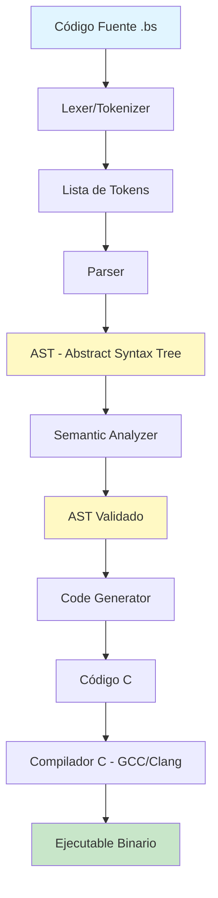
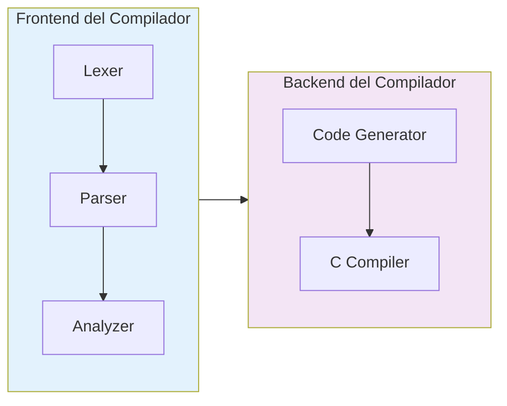
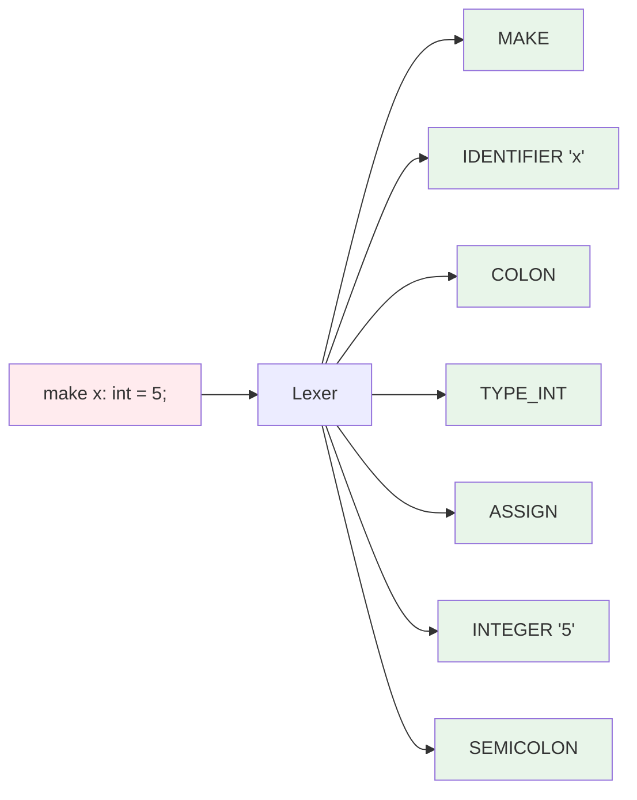
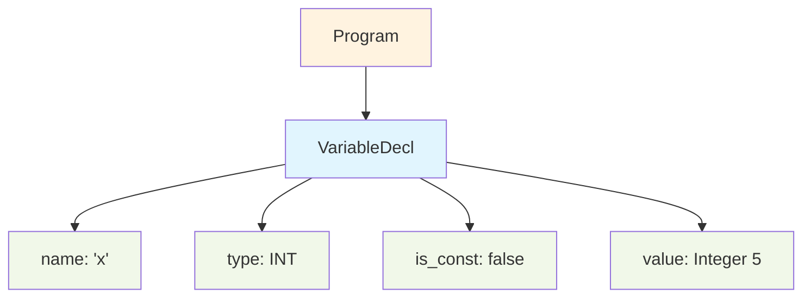
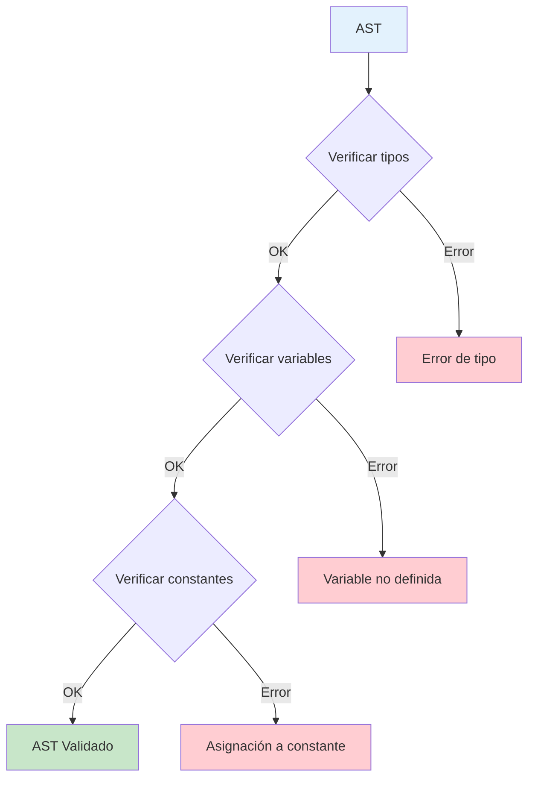
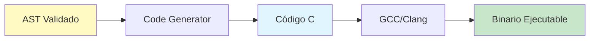
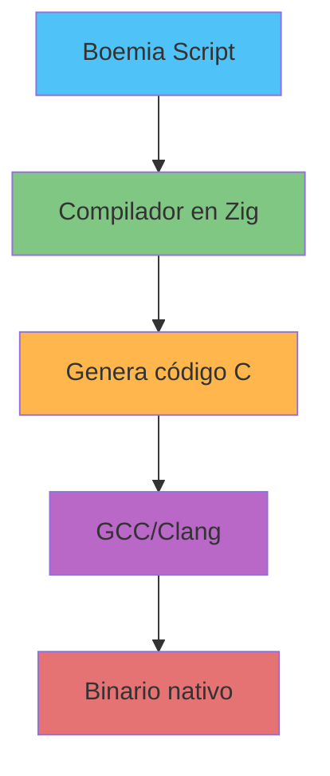

# Boemia Script

Un lenguaje de programación compilado, con tipos estáticos, diseñado para aprender cómo funcionan los compiladores e intérpretes desde cero.

## Estado del Proyecto: FUNCIONAL

El compilador de Boemia Script está completo y operativo. Puedes escribir programas .bs, compilarlos a ejecutables nativos y ejecutarlos.

## ¿Por qué Boemia Script?

Boemia Script nace como un proyecto educativo con el objetivo de **desmitificar el funcionamiento interno de los lenguajes de programación**. Al construir un compilador completo desde cero, podemos entender:

- Cómo el código fuente se transforma en instrucciones ejecutables
- Cómo funcionan los sistemas de tipos estáticos
- Cómo se implementan las estructuras de control (if, while, for)
- Cómo se gestionan variables y scope
- Cómo se genera código máquina a partir de un AST

Este proyecto es una **herramienta de aprendizaje** para entender los fundamentos de la compilación, análisis léxico, análisis sintáctico, análisis semántico y generación de código.

## Objetivos

### Objetivo Principal
Crear un compilador funcional que compile Boemia Script a código nativo, permitiendo ejecutar programas con características modernas de tipado estático.

### Objetivos Específicos
1. **Implementar análisis léxico (Lexer)**: Tokenizar código fuente
2. **Implementar análisis sintáctico (Parser)**: Construir un AST válido
3. **Implementar análisis semántico**: Verificación de tipos y scope
4. **Implementar generación de código**: Compilar a código ejecutable
5. **Aprender los fundamentos**: Entender cada fase del proceso de compilación

## Inicio Rápido

### Prerrequisitos

#### Para uso local:
- Zig 0.15.2 o superior
- GCC o Clang (para compilar el código C generado)

#### Para uso con contenedores (alternativa):
- Docker o Podman (no requiere instalar Zig ni GCC localmente)

### Instalación

```bash
# Clonar el repositorio
git clone https://github.com/tu-usuario/boemia-script
cd boemia-script

# Compilar el compilador
zig build

# El ejecutable estará en zig-out/bin/boemia-compiler
```

### Uso

#### Opción 1: Local

```bash
# Compilar un programa Boemia Script
./zig-out/bin/boemia-compiler examples/hello.bs -o hello

# Ejecutar el programa compilado (se guarda en build/)
./build/hello
```

#### Opción 2: Con Docker

```bash
# Construir la imagen
make docker-build

# Compilar un programa
make docker-compile

# O manualmente
docker run --rm \
  -v $(pwd)/examples:/workspace/examples:ro \
  -v $(pwd)/build:/workspace/build \
  boemia-script:latest \
  examples/hello.bs -o hello

# Ejecutar el programa
./build/hello
```

#### Opción 3: Con Podman

```bash
# Construir la imagen
make podman-build

# Compilar un programa
make podman-compile

# O manualmente
podman run --rm \
  -v $(pwd)/examples:/workspace/examples:ro \
  -v $(pwd)/build:/workspace/build \
  boemia-script:latest \
  examples/hello.bs -o hello

# Ejecutar el programa
./build/hello
```

> **Nota**: Los programas compilados se guardan automáticamente en la carpeta `build/`.
> Para más detalles sobre Docker/Podman, consulta [DOCKER.md](DOCKER.md).

### Tu Primer Programa

Crea un archivo `hello.bs`:

```boemia
make mensaje: string = "Hola, Boemia Script!";
print(mensaje);

make x: int = 42;
print(x);
```

Compílalo y ejecútalo:

```bash
./zig-out/bin/boemia-compiler hello.bs -o hello
./build/hello
```

## Características Implementadas

### Compilador Completo
- **Análisis Léxico**: Tokenización completa del código fuente
- **Análisis Sintáctico**: Parser con construcción de AST
- **Análisis Semántico**: Verificación de tipos y scope
- **Generación de Código**: Transpilación a C + compilación nativa
-  **CLI Funcional**: Interfaz de línea de comandos con mensajes claros

### Características del Lenguaje
- **Variables mutables** (`make`)
- **Constantes inmutables** (`seal`)
- **Tipos estáticos**: `int`, `float`, `string`, `bool`
- **Operadores aritméticos**: `+`, `-`, `*`, `/`
- **Operadores de comparación**: `==`, `!=`, `<`, `>`, `<=`, `>=`
- **Condicionales**: `if`, `else if`, `else`
- **Bucles**: `while`, `for`
- **Funciones**: Declaración y llamadas con recursión
- **Print**: Salida por consola con detección automática de tipos
- **Comentarios**: Comentarios de línea con `//`
- **Scope estilo TypeScript**

### Futura Implementación (v2.0)
- (pendiente) Arrays y colecciones
- (pendiente) Structs/Clases
- (pendiente) Manejo de errores (try/catch)
- (pendiente) Módulos e imports
- (pendiente) Inferencia de tipos
- (pendiente) Genéricos
- (pendiente) Garbage Collection

## Sintaxis de Boemia Script

### Declaración de Variables

```boemia
// Variable mutable
make x: int = 10;
make nombre: string = "Boemia";
make activo: bool = true;

// Constante inmutable
seal PI: float = 3.14159;
seal MAX_USERS: int = 100;
```

### Operaciones Aritméticas

```boemia
make suma: int = 5 + 3;
make resta: int = 10 - 4;
make multiplicacion: int = 6 * 7;
make division: int = 20 / 4;
```

### Condicionales

```boemia
if x > 10 {
    print("Mayor que 10");
} else if x == 10 {
    print("Igual a 10");
} else {
    print("Menor que 10");
}
```

### Bucles

```boemia
// While loop
make counter: int = 0;
while counter < 5 {
    print(counter);
    counter = counter + 1;
}

// For loop
for i: int = 0; i < 10; i = i + 1 {
    print(i);
}
```

### Funciones

```boemia
fn suma(a: int, b: int): int {
    return a + b;
}

fn saludar(nombre: string): void {
    print("Hola " + nombre);
}

make resultado: int = suma(5, 3);
saludar("Mundo");
```

## Arquitectura del Compilador



## Pipeline de Compilación



## Fases del Compilador

### 1. Análisis Léxico (Lexer)

Convierte el código fuente en una secuencia de tokens.



### 2. Análisis Sintáctico (Parser)

Construye un árbol de sintaxis abstracta (AST).



### 3. Análisis Semántico (Analyzer)

Verifica tipos, scope de variables y reglas semánticas.



### 4. Generación de Código

Traduce el AST a código C y compila.



## Estructura del Proyecto

```
boemia-script/
├── src/
│   ├── main.zig           # Entry point del compilador - CLI completa
│   ├── token.zig          # Definiciones de tokens - Completamente documentado
│   ├── lexer.zig          # Análisis léxico - Completamente documentado
│   ├── ast.zig            # Estructuras del AST - Completo
│   ├── parser.zig         # Análisis sintáctico - Completo con fixes
│   ├── analyzer.zig       # Análisis semántico - Completo con fixes
│   └── codegen.zig        # Generación de código C - Completo
├── examples/
│   ├── hello.bs           # Ejemplo completo con funciones y bucles
│   └── simple.bs          # Ejemplo básico
├── tests/                 # Tests unitarios (pendiente)
├── build.zig             # Build system configurado
├── LICENSE               # MIT License
└── README.md             # Documentación completa
```

## Stack Tecnológico



### ¿Por qué Zig?

- **Control de bajo nivel**: Perfecto para compiladores
- **Manejo explícito de memoria**: Entender allocators
- **Sin runtime**: Binarios eficientes
- **Interoperabilidad con C**: Fácil integración
- **Seguridad**: Sistema de tipos robusto

## Output del Compilador

Cuando compilas un programa, verás un output detallado de cada fase:

```
Boemia Script Compiler
━━━━━━━━━━━━━━━━━━━━━━━━━━━━━━━━━━━━━━━━
Input:  examples/hello.bs
Output: hello
━━━━━━━━━━━━━━━━━━━━━━━━━━━━━━━━━━━━━━━━

Phase 1: Lexical Analysis (Tokenization)
Phase 2: Syntax Analysis (Building AST)
   ✓ Successfully parsed 5 statements
Phase 3: Semantic Analysis (Type Checking)
   ✓ Type checking passed
Phase 4: Code Generation (C Code)
Successfully compiled to: build/hello

Compilation successful!
━━━━━━━━━━━━━━━━━━━━━━━━━━━━━━━━━━━━━━━━
Run your program with: ./build/hello
━━━━━━━━━━━━━━━━━━━━━━━━━━━━━━━━━━━━━━━━
```

## Estado de Implementación

### Fase 1: Compilador Base - COMPLETADA
- [x] Lexer - Análisis léxico completo
- [x] Parser - Construcción de AST
- [x] Analyzer - Verificación de tipos y semántica
- [x] Code Generator - Generación de código C
- [x] CLI - Interfaz de línea de comandos

### Fase 2: Características del Lenguaje - COMPLETADA
- [x] Variables y constantes (make/seal)
- [x] Tipos básicos (int, float, string, bool)
- [x] Operadores aritméticos y de comparación
- [x] Estructuras de control (if/else if/else)
- [x] Bucles (while, for)
- [x] Funciones con recursión
- [x] Print con detección automática de tipos
- [x] Comentarios de línea

### Fase 3: Testing y Ejemplos - EN PROGRESO
- [x] Ejemplos básicos (hello.bs, simple.bs)
- [x] Test suite completo
- [ ] Más programas de ejemplo
- [ ] Benchmarks de rendimiento

### Fase 4: Optimizaciones - FUTURO
- [ ] Mejores mensajes de error con sugerencias
- [ ] Optimización de código C generado
- [ ] Warnings más detallados
- [ ] Soporte para múltiples backends

### Fase 5: Características Avanzadas - FUTURO
- [ ] Arrays y colecciones
- [ ] Structs/tipos personalizados
- [ ] Módulos e imports
- [ ] Inferencia de tipos
- [ ] Manejo de errores (try/catch)

## Ejemplo Completo

```boemia
// hello.bs - Programa de ejemplo

make mensaje: string = "Hola, Boemia Script!";
print(mensaje);

fn factorial(n: int): int {
    if n <= 1 {
        return 1;
    }
    return n * factorial(n - 1);
}

make result: int = factorial(5);
print(result);  // Output: 120

for i: int = 1; i <= 10; i = i + 1 {
    if i == 5 {
        print("Mitad!");
    }
    print(i);
}
```

## Comandos Disponibles (Makefile)

El proyecto incluye un Makefile con comandos útiles:

```bash
# Ver todos los comandos disponibles
make help

# Construcción y pruebas locales
make build          # Compilar el compilador con Zig
make test           # Ejecutar suite de tests
make clean          # Limpiar archivos compilados

# Docker
make docker-build   # Construir imagen Docker
make docker-run     # Ejecutar en modo interactivo
make docker-compile # Compilar ejemplo hello.bs

# Podman
make podman-build   # Construir imagen Podman
make podman-run     # Ejecutar en modo interactivo
make podman-compile # Compilar ejemplo hello.bs

# Docker Compose
make compose-up     # Iniciar servicio
make compose-down   # Detener servicio
make compose-logs   # Ver logs
```

## Detalles Técnicos

### Generación de Código C

Boemia Script usa un enfoque de transpilación a C por varias razones educativas:

1. **Simplicidad**: Más fácil de entender que generar código máquina directo
2. **Portabilidad**: El código C se compila en cualquier plataforma
3. **Optimización**: Aprovechamos las optimizaciones de GCC/Clang
4. **Debugging**: El código C generado es legible y debuggeable

Ejemplo de traducción:

**Boemia Script:**
```boemia
make x: int = 42;
print(x);

if x > 40 {
    print("Grande!");
}
```

**C Generado:**
```c
// Generated by Boemia Script Compiler
#include <stdio.h>
#include <stdlib.h>
#include <string.h>
#include <stdbool.h>

int main(void) {
    long long x = 42;
    printf("%lld\n", (long long)x);
    if ((x > 40)) {
        printf("%s\n", "Grande!");
    }
    return 0;
}
```

### Características del Compilador

- **Paso único**: El compilador procesa el archivo en un solo paso
- **Manejo de errores**: Reporta errores con número de línea y columna
- **Type safety**: El análisis semántico previene errores de tipos en runtime
- **Gestión de memoria**: Uso explícito de allocators en Zig
- **Sin dependencias**: El compilador no requiere librerías externas (excepto GCC)

### Limitaciones Actuales

- **Funciones**: Las funciones se ignoran en el código generado (limitación temporal)
- **String concatenation**: Solo con el operador `+`
- **Print automático**: Usa heurísticas para detectar el tipo a imprimir
- **Scope global**: Todas las variables en main() por ahora

### Optimizaciones Futuras

- Constant folding (evaluar constantes en compile-time)
- Dead code elimination
- Inline de funciones pequeñas
- Generación directa a LLVM IR

## Contribuir

Este es un proyecto educativo. Las contribuciones son bienvenidas para:
- Mejorar mensajes de error
- Agregar tests
- Optimizar el código generado
- Documentación

## Licencia

MIT License - Siéntete libre de aprender y experimentar.

## Recursos de Aprendizaje

- [Crafting Interpreters](https://craftinginterpreters.com/)
- [Writing An Interpreter In Go](https://interpreterbook.com/)
- [Engineering a Compiler](https://www.elsevier.com/books/engineering-a-compiler/cooper/978-0-12-088478-0)
- [Zig Language Reference](https://ziglang.org/documentation/master/)

---

**Hecho con propósitos educativos para entender cómo funcionan los compiladores desde cero.**
