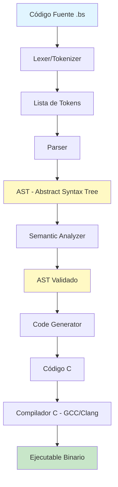
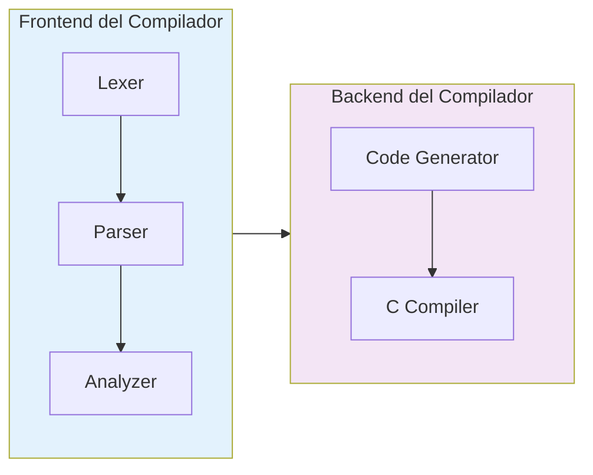
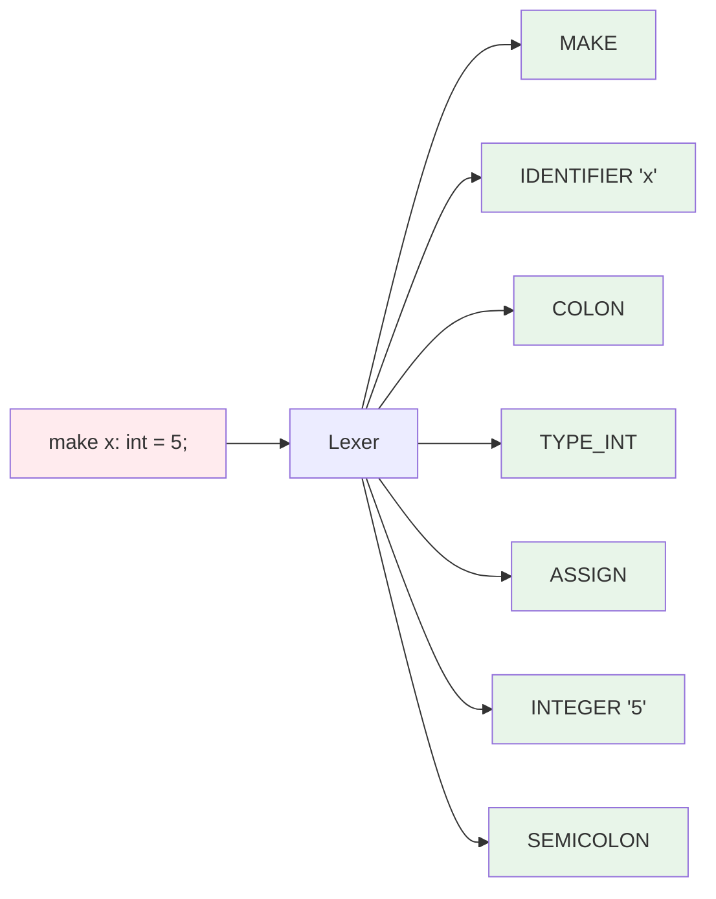
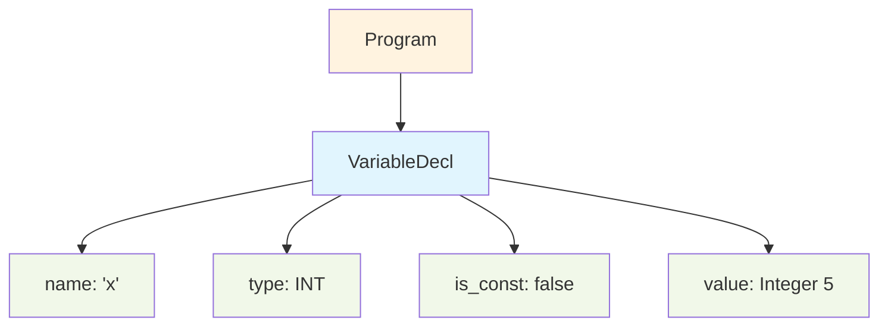
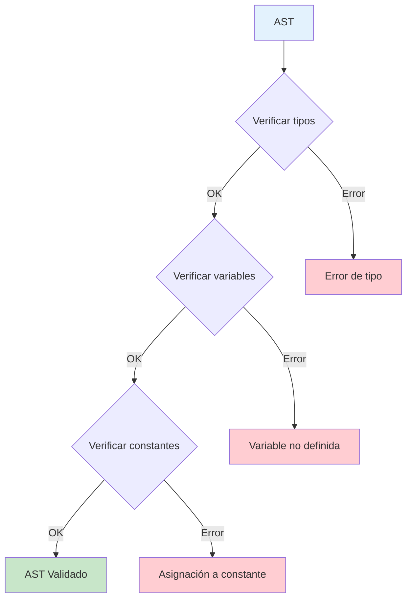
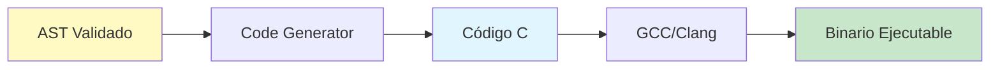
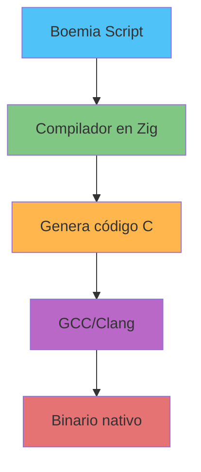

# Boemia Script

Un lenguaje de programación compilado, con tipos estáticos, diseñado para aprender cómo funcionan los compiladores e intérpretes desde cero.

## ¿Por qué Boemia Script?

Boemia Script nace como un proyecto educativo con el objetivo de **desmitificar el funcionamiento interno de los lenguajes de programación**. Al construir un compilador completo desde cero, podemos entender:

- Cómo el código fuente se transforma en instrucciones ejecutables
- Cómo funcionan los sistemas de tipos estáticos
- Cómo se implementan las estructuras de control (if, while, for)
- Cómo se gestionan variables y scope
- Cómo se genera código máquina a partir de un AST

Este proyecto es una **herramienta de aprendizaje** para entender los fundamentos de la compilación, análisis léxico, análisis sintáctico, análisis semántico y generación de código.

## Objetivos

### Objetivo Principal
Crear un compilador funcional que compile Boemia Script a código nativo, permitiendo ejecutar programas con características modernas de tipado estático.

### Objetivos Específicos
1. **Implementar análisis léxico (Lexer)**: Tokenizar código fuente
2. **Implementar análisis sintáctico (Parser)**: Construir un AST válido
3. **Implementar análisis semántico**: Verificación de tipos y scope
4. **Implementar generación de código**: Compilar a código ejecutable
5. **Aprender los fundamentos**: Entender cada fase del proceso de compilación

## Alcance del Proyecto

### Características Implementadas
- ✅ **Variables mutables** (`make`)
- ✅ **Constantes inmutables** (`seal`)
- ✅ **Tipos estáticos**: `int`, `float`, `string`, `bool`
- ✅ **Operadores aritméticos**: `+`, `-`, `*`, `/`
- ✅ **Operadores de comparación**: `==`, `!=`, `<`, `>`, `<=`, `>=`
- ✅ **Condicionales**: `if`, `else if`, `else`
- ✅ **Bucles**: `while`, `for`
- ✅ **Funciones**: Declaración y llamadas
- ✅ **Print**: Salida por consola
- ✅ **Scope estilo TypeScript**

### Fuera del Alcance (v1.0)
- ❌ Arrays y colecciones
- ❌ Structs/Clases
- ❌ Manejo de errores (try/catch)
- ❌ Módulos e imports
- ❌ Inferencia de tipos
- ❌ Genéricos
- ❌ Garbage Collection

## Sintaxis de Boemia Script

### Declaración de Variables

```boemia
// Variable mutable
make x: int = 10;
make nombre: string = "Boemia";
make activo: bool = true;

// Constante inmutable
seal PI: float = 3.14159;
seal MAX_USERS: int = 100;
```

### Operaciones Aritméticas

```boemia
make suma: int = 5 + 3;
make resta: int = 10 - 4;
make multiplicacion: int = 6 * 7;
make division: int = 20 / 4;
```

### Condicionales

```boemia
if x > 10 {
    print("Mayor que 10");
} else if x == 10 {
    print("Igual a 10");
} else {
    print("Menor que 10");
}
```

### Bucles

```boemia
// While loop
make counter: int = 0;
while counter < 5 {
    print(counter);
    counter = counter + 1;
}

// For loop
for i: int = 0; i < 10; i = i + 1 {
    print(i);
}
```

### Funciones

```boemia
fn suma(a: int, b: int): int {
    return a + b;
}

fn saludar(nombre: string): void {
    print("Hola " + nombre);
}

make resultado: int = suma(5, 3);
saludar("Mundo");
```

## Arquitectura del Compilador



## Pipeline de Compilación



## Fases del Compilador

### 1. Análisis Léxico (Lexer)

Convierte el código fuente en una secuencia de tokens.



### 2. Análisis Sintáctico (Parser)

Construye un árbol de sintaxis abstracta (AST).



### 3. Análisis Semántico (Analyzer)

Verifica tipos, scope de variables y reglas semánticas.



### 4. Generación de Código

Traduce el AST a código C y compila.



## Estructura del Proyecto

```
boemia-script/
├── src/
│   ├── main.zig           # Entry point del compilador
│   ├── token.zig          # Definiciones de tokens
│   ├── lexer.zig          # Análisis léxico
│   ├── ast.zig            # Estructuras del AST
│   ├── parser.zig         # Análisis sintáctico
│   ├── analyzer.zig       # Análisis semántico
│   └── codegen.zig        # Generación de código
├── examples/              # Programas de ejemplo .bs
├── tests/                 # Tests unitarios
├── build.zig             # Build system de Zig
└── README.md             # Este archivo
```

## Stack Tecnológico



### ¿Por qué Zig?

- **Control de bajo nivel**: Perfecto para compiladores
- **Manejo explícito de memoria**: Entender allocators
- **Sin runtime**: Binarios eficientes
- **Interoperabilidad con C**: Fácil integración
- **Seguridad**: Sistema de tipos robusto

## Roadmap

### Fase 1: Frontend (Actual)
- [x] Lexer
- [x] Parser
- [x] Analyzer
- [ ] Code Generator
- [ ] CLI

### Fase 2: Testing
- [ ] Test suite completo
- [ ] Programas de ejemplo
- [ ] Benchmarks

### Fase 3: Optimizaciones (Futuro)
- [ ] Optimización de código generado
- [ ] Mejores mensajes de error
- [ ] Sugerencias de corrección

### Fase 4: Características Avanzadas (Futuro)
- [ ] Arrays
- [ ] Structs
- [ ] Módulos

## Cómo Compilar

```bash
# Compilar el compilador
zig build

# Compilar un programa Boemia Script
./boemia-compiler examples/hello.bs -o hello

# Ejecutar
./hello
```

## Ejemplo Completo

```boemia
// hello.bs - Programa de ejemplo

make mensaje: string = "Hola, Boemia Script!";
print(mensaje);

fn factorial(n: int): int {
    if n <= 1 {
        return 1;
    }
    return n * factorial(n - 1);
}

make result: int = factorial(5);
print(result);  // Output: 120

for i: int = 1; i <= 10; i = i + 1 {
    if i == 5 {
        print("Mitad!");
    }
    print(i);
}
```

## Contribuir

Este es un proyecto educativo. Las contribuciones son bienvenidas para:
- Mejorar mensajes de error
- Agregar tests
- Optimizar el código generado
- Documentación

## Licencia

MIT License - Siéntete libre de aprender y experimentar.

## Recursos de Aprendizaje

- [Crafting Interpreters](https://craftinginterpreters.com/)
- [Writing An Interpreter In Go](https://interpreterbook.com/)
- [Engineering a Compiler](https://www.elsevier.com/books/engineering-a-compiler/cooper/978-0-12-088478-0)
- [Zig Language Reference](https://ziglang.org/documentation/master/)

---

**Hecho con propósitos educativos para entender cómo funcionan los compiladores desde cero.**
