# Boemia Script

Un lenguaje de programación compilado, con tipos estáticos, diseñado para aprender cómo funcionan los compiladores e intérpretes desde cero.

## Estado del Proyecto: FUNCIONAL

El compilador de Boemia Script está completo y operativo. Puedes escribir programas .bs, compilarlos a ejecutables nativos y ejecutarlos.

## ¿Por qué Boemia Script?

Boemia Script nace como un proyecto educativo con el objetivo de **desmitificar el funcionamiento interno de los lenguajes de programación**. Al construir un compilador completo desde cero, podemos entender:

- Cómo el código fuente se transforma en instrucciones ejecutables
- Cómo funcionan los sistemas de tipos estáticos
- Cómo se implementan las estructuras de control (if, while, for)
- Cómo se gestionan variables y scope
- Cómo se genera código máquina a partir de un AST

Este proyecto es una **herramienta de aprendizaje** para entender los fundamentos de la compilación, análisis léxico, análisis sintáctico, análisis semántico y generación de código.

## Objetivos

### Objetivo Principal
Crear un compilador funcional que compile Boemia Script a código nativo, permitiendo ejecutar programas con características modernas de tipado estático.

### Objetivos Específicos
1. **Implementar análisis léxico (Lexer)**: Tokenizar código fuente
2. **Implementar análisis sintáctico (Parser)**: Construir un AST válido
3. **Implementar análisis semántico**: Verificación de tipos y scope
4. **Implementar generación de código**: Compilar a código ejecutable
5. **Aprender los fundamentos**: Entender cada fase del proceso de compilación

## Inicio Rápido

### Prerrequisitos
- Zig 0.11 o superior
- GCC o Clang (para compilar el código C generado)

### Instalación

```bash
# Clonar el repositorio
git clone https://github.com/tu-usuario/boemia-script
cd boemia-script

# Compilar el compilador
zig build

# El ejecutable estará en zig-out/bin/boemia-script
```

### Uso

```bash
# Compilar un programa Boemia Script
./zig-out/bin/boemia-script examples/hello.bs -o hello

# Ejecutar el programa
./hello
```

### Tu Primer Programa

Crea un archivo `hello.bs`:

```boemia
make mensaje: string = "Hola, Boemia Script!";
print(mensaje);

make x: int = 42;
print(x);
```

Compílalo y ejecútalo:

```bash
./zig-out/bin/boemia-script hello.bs -o hello
./hello
```

## Características Implementadas

### Compilador Completo
- **Análisis Léxico**: Tokenización completa del código fuente
- **Análisis Sintáctico**: Parser con construcción de AST
- **Análisis Semántico**: Verificación de tipos y scope
- **Generación de Código**: Transpilación a C + compilación nativa
-  **CLI Funcional**: Interfaz de línea de comandos con mensajes claros

### Características del Lenguaje
- **Variables mutables** (`make`)
- **Constantes inmutables** (`seal`)
- **Tipos estáticos**: `int`, `float`, `string`, `bool`
- **Operadores aritméticos**: `+`, `-`, `*`, `/`
- **Operadores de comparación**: `==`, `!=`, `<`, `>`, `<=`, `>=`
- **Condicionales**: `if`, `else if`, `else`
- **Bucles**: `while`, `for`
- **Funciones**: Declaración y llamadas con recursión
- **Print**: Salida por consola con detección automática de tipos
- **Comentarios**: Comentarios de línea con `//`
- **Scope estilo TypeScript**

### Futura Implementación (v2.0)
- ⏳ Arrays y colecciones
- ⏳ Structs/Clases
- ⏳ Manejo de errores (try/catch)
- ⏳ Módulos e imports
- ⏳ Inferencia de tipos
- ⏳ Genéricos
- ⏳ Garbage Collection

## Sintaxis de Boemia Script

### Declaración de Variables

```boemia
// Variable mutable
make x: int = 10;
make nombre: string = "Boemia";
make activo: bool = true;

// Constante inmutable
seal PI: float = 3.14159;
seal MAX_USERS: int = 100;
```

### Operaciones Aritméticas

```boemia
make suma: int = 5 + 3;
make resta: int = 10 - 4;
make multiplicacion: int = 6 * 7;
make division: int = 20 / 4;
```

### Condicionales

```boemia
if x > 10 {
    print("Mayor que 10");
} else if x == 10 {
    print("Igual a 10");
} else {
    print("Menor que 10");
}
```

### Bucles

```boemia
// While loop
make counter: int = 0;
while counter < 5 {
    print(counter);
    counter = counter + 1;
}

// For loop
for i: int = 0; i < 10; i = i + 1 {
    print(i);
}
```

### Funciones

```boemia
fn suma(a: int, b: int): int {
    return a + b;
}

fn saludar(nombre: string): void {
    print("Hola " + nombre);
}

make resultado: int = suma(5, 3);
saludar("Mundo");
```

## Arquitectura del Compilador

```mermaid
graph TB
    A[Código Fuente .bs] --> B[Lexer/Tokenizer]
    B --> C[Lista de Tokens]
    C --> D[Parser]
    D --> E[AST - Abstract Syntax Tree]
    E --> F[Semantic Analyzer]
    F --> G[AST Validado]
    G --> H[Code Generator]
    H --> I[Código C]
    I --> J[Compilador C - GCC/Clang]
    J --> K[Ejecutable Binario]

    style A fill:#e1f5ff
    style K fill:#c8e6c9
    style E fill:#fff9c4
    style G fill:#fff9c4
```



## Pipeline de Compilación


## Fases del Compilador

### 1. Análisis Léxico (Lexer)

Convierte el código fuente en una secuencia de tokens.


### 2. Análisis Sintáctico (Parser)

Construye un árbol de sintaxis abstracta (AST).


### 3. Análisis Semántico (Analyzer)

Verifica tipos, scope de variables y reglas semánticas.

```mermaid
flowchart TD
    A[AST] --> B{Verificar tipos}
    B -->|OK| C{Verificar variables}
    B -->|Error| E[Error de tipo]
    C -->|OK| D{Verificar constantes}
    C -->|Error| F[Variable no definida]
    D -->|OK| G[AST Validado]
    D -->|Error| H[Asignación a constante]

    style A fill:#e3f2fd
    style G fill:#c8e6c9
    style E fill:#ffcdd2
    style F fill:#ffcdd2
    style H fill:#ffcdd2
```



### 4. Generación de Código

Traduce el AST a código C y compila.

```mermaid
graph LR
    A[AST Validado] --> B[Code Generator]
    B --> C[Código C]
    C --> D[GCC/Clang]
    D --> E[Binario Ejecutable]

    style A fill:#fff9c4
    style C fill:#e1f5fe
    style E fill:#c8e6c9
```



## Estructura del Proyecto

```
boemia-script/
├── src/
│   ├── main.zig           # Entry point del compilador - CLI completa
│   ├── token.zig          # Definiciones de tokens - Completamente documentado
│   ├── lexer.zig          # Análisis léxico - Completamente documentado
│   ├── ast.zig            # Estructuras del AST - Completo
│   ├── parser.zig         # Análisis sintáctico - Completo con fixes
│   ├── analyzer.zig       # Análisis semántico - Completo con fixes
│   └── codegen.zig        # Generación de código C - Completo
├── examples/
│   ├── hello.bs           # Ejemplo completo con funciones y bucles
│   └── simple.bs          # Ejemplo básico
├── tests/                 # Tests unitarios (pendiente)
├── build.zig             # Build system configurado
├── LICENSE               # MIT License
└── README.md             # Documentación completa
```

## Stack Tecnológico

```mermaid
graph TD
    A[Boemia Script] --> B[Compilador en Zig]
    B --> C[Genera código C]
    C --> D[GCC/Clang]
    D --> E[Binario nativo]

    style A fill:#4fc3f7
    style B fill:#81c784
    style C fill:#ffb74d
    style D fill:#ba68c8
    style E fill:#e57373
```



### ¿Por qué Zig?

- **Control de bajo nivel**: Perfecto para compiladores
- **Manejo explícito de memoria**: Entender allocators
- **Sin runtime**: Binarios eficientes
- **Interoperabilidad con C**: Fácil integración
- **Seguridad**: Sistema de tipos robusto

## Output del Compilador

Cuando compilas un programa, verás un output detallado de cada fase:

```
🚀 Boemia Script Compiler
━━━━━━━━━━━━━━━━━━━━━━━━━━━━━━━━━━━━━━━━
📄 Input:  examples/hello.bs
📦 Output: hello
━━━━━━━━━━━━━━━━━━━━━━━━━━━━━━━━━━━━━━━━

🔍 Phase 1: Lexical Analysis (Tokenization)
🌳 Phase 2: Syntax Analysis (Building AST)
   ✓ Successfully parsed 5 statements
🔬 Phase 3: Semantic Analysis (Type Checking)
   ✓ Type checking passed
⚙️  Phase 4: Code Generation (C Code)
Successfully compiled to: hello

✅ Compilation successful!
━━━━━━━━━━━━━━━━━━━━━━━━━━━━━━━━━━━━━━━━
🎉 Run your program with: ./hello
━━━━━━━━━━━━━━━━━━━━━━━━━━━━━━━━━━━━━━━━
```

## Estado de Implementación

### Fase 1: Compilador Base - COMPLETADA
- [x] Lexer - Análisis léxico completo
- [x] Parser - Construcción de AST
- [x] Analyzer - Verificación de tipos y semántica
- [x] Code Generator - Generación de código C
- [x] CLI - Interfaz de línea de comandos

### Fase 2: Características del Lenguaje - COMPLETADA
- [x] Variables y constantes (make/seal)
- [x] Tipos básicos (int, float, string, bool)
- [x] Operadores aritméticos y de comparación
- [x] Estructuras de control (if/else if/else)
- [x] Bucles (while, for)
- [x] Funciones con recursión
- [x] Print con detección automática de tipos
- [x] Comentarios de línea

### Fase 3: Testing y Ejemplos - EN PROGRESO
- [x] Ejemplos básicos (hello.bs, simple.bs)
- [ ] Test suite completo
- [ ] Más programas de ejemplo
- [ ] Benchmarks de rendimiento

### Fase 4: Optimizaciones - FUTURO
- [ ] Mejores mensajes de error con sugerencias
- [ ] Optimización de código C generado
- [ ] Warnings más detallados
- [ ] Soporte para múltiples backends

### Fase 5: Características Avanzadas - FUTURO
- [ ] Arrays y colecciones
- [ ] Structs/tipos personalizados
- [ ] Módulos e imports
- [ ] Inferencia de tipos
- [ ] Manejo de errores (try/catch)

## Ejemplo Completo

```boemia
// hello.bs - Programa de ejemplo

make mensaje: string = "Hola, Boemia Script!";
print(mensaje);

fn factorial(n: int): int {
    if n <= 1 {
        return 1;
    }
    return n * factorial(n - 1);
}

make result: int = factorial(5);
print(result);  // Output: 120

for i: int = 1; i <= 10; i = i + 1 {
    if i == 5 {
        print("Mitad!");
    }
    print(i);
}
```

## Detalles Técnicos

### Generación de Código C

Boemia Script usa un enfoque de transpilación a C por varias razones educativas:

1. **Simplicidad**: Más fácil de entender que generar código máquina directo
2. **Portabilidad**: El código C se compila en cualquier plataforma
3. **Optimización**: Aprovechamos las optimizaciones de GCC/Clang
4. **Debugging**: El código C generado es legible y debuggeable

Ejemplo de traducción:

**Boemia Script:**
```boemia
make x: int = 42;
print(x);

if x > 40 {
    print("Grande!");
}
```

**C Generado:**
```c
// Generated by Boemia Script Compiler
#include <stdio.h>
#include <stdlib.h>
#include <string.h>
#include <stdbool.h>

int main(void) {
    long long x = 42;
    printf("%lld\n", (long long)x);
    if ((x > 40)) {
        printf("%s\n", "Grande!");
    }
    return 0;
}
```

### Características del Compilador

- **Paso único**: El compilador procesa el archivo en un solo paso
- **Manejo de errores**: Reporta errores con número de línea y columna
- **Type safety**: El análisis semántico previene errores de tipos en runtime
- **Gestión de memoria**: Uso explícito de allocators en Zig
- **Sin dependencias**: El compilador no requiere librerías externas (excepto GCC)

### Limitaciones Actuales

- **Funciones**: Las funciones se ignoran en el código generado (limitación temporal)
- **String concatenation**: Solo con el operador `+`
- **Print automático**: Usa heurísticas para detectar el tipo a imprimir
- **Scope global**: Todas las variables en main() por ahora

### Optimizaciones Futuras

- Constant folding (evaluar constantes en compile-time)
- Dead code elimination
- Inline de funciones pequeñas
- Generación directa a LLVM IR

## Contribuir

Este es un proyecto educativo. Las contribuciones son bienvenidas para:
- Mejorar mensajes de error
- Agregar tests
- Optimizar el código generado
- Documentación

## Licencia

MIT License - Siéntete libre de aprender y experimentar.

## Recursos de Aprendizaje

- [Crafting Interpreters](https://craftinginterpreters.com/)
- [Writing An Interpreter In Go](https://interpreterbook.com/)
- [Engineering a Compiler](https://www.elsevier.com/books/engineering-a-compiler/cooper/978-0-12-088478-0)
- [Zig Language Reference](https://ziglang.org/documentation/master/)

---

**Hecho con propósitos educativos para entender cómo funcionan los compiladores desde cero.**
